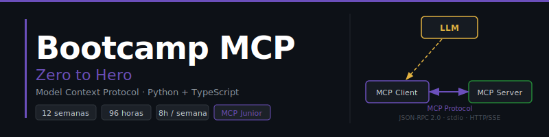

<p align="center">
  
</p>

<p align="center">
  <a href="LICENSE"></a>
  <a href="#"></a>
  <a href="#"></a>
  <a href="#"></a>
  <a href="#"></a>
</p>

<p align="center">
  <a href="README.md"></a>
</p>

---

## 📋 Description

An intensive **12-week (~3-month)** bootcamp focused on mastering the **Model Context Protocol (MCP)** and building modern MCP servers and clients with Python and TypeScript. Designed to take students from zero to **Junior MCP Developer**, with an emphasis on clean code, best practices, and real-world projects ready to integrate with LLMs (Claude, OpenAI).

### 🎯 Learning Objectives

By the end of the bootcamp, students will be able to:

- ✅ Master the MCP protocol: architecture, primitives, and transports
- ✅ Build complete MCP Servers in Python and TypeScript
- ✅ Implement the three primitives: Tools, Resources, and Prompts
- ✅ Develop MCP Clients in Python and JavaScript
- ✅ Integrate MCP servers with LLMs (Claude, OpenAI)
- ✅ Connect MCP Servers to databases and external APIs
- ✅ Write automated tests for MCP servers and clients
- ✅ Deploy MCP applications with Docker and CI/CD
- ✅ Apply clean code, design patterns, and best practices
- ✅ Build complete production-ready projects

### 🚀 Why MCP?

> **Modern MCP from day 1** — No legacy code, only current best practices.

The Model Context Protocol (MCP) is Anthropic's open standard for connecting LLMs to tools, data, and external systems. This bootcamp focuses on MCP with Python 3.13+ and Node.js 22+, teaching the same concepts in two ecosystems. Students learn directly the tools they will use to build agents and LLM integrations in the professional world.

---

## 🗓️ Bootcamp Structure

| Stage | Weeks | Hours | Main Topics |
| :-------------------: | :-----: | :---: | ------------------------------------------------------ |
| **Fundamentals**      |   1–3   |  24h  | MCP protocol, architecture, primitives, JSON-RPC 2.0, transports |
| **MCP Servers**       |   4–7   |  32h  | Python & TypeScript servers, databases, external APIs |
| **MCP Clients + LLMs**|  8–10   |  24h  | Python & JS clients, Claude, OpenAI, agentic loop |
| **Production**        |  11–12  |  16h  | Testing, Docker, CI/CD, final project |

**Total: 12 weeks** | **96 hours** of intensive training

---

## 📚 Weekly Content

Each week includes:

```
bootcamp/week-XX-main_topic/
├── README.md                 # Description and objectives
├── rubrica-evaluacion.md     # Evaluation rubric
├── 0-assets/                 # SVG images and diagrams
├── 1-teoria/                 # Theory material
├── 2-practicas/              # Guided exercises
├── 3-proyecto/               # Weekly project
│   ├── README.md
│   ├── starter/
│   └── solution/             # ⚠️ Instructors only
├── 4-recursos/               # Additional resources
│   ├── ebooks-free/
│   ├── videografia/
│   └── webgrafia/
└── 5-glosario/               # Key terms
```

### 🔑 Key Components

- 📖 **Theory**: MCP protocol concepts with Python and TypeScript examples
- 💻 **Practice**: Guided exercises with code to uncomment (no TODOs)
- 🏗️ **Project**: Weekly integrator with starter code and evaluation criteria
- 📝 **Assessment**: Knowledge, performance, and product evidence
- 🎓 **Resources**: Glossaries, references, and supplementary material

---

## 🗺️ Weekly Roadmap

| Week | Topic | Python | TypeScript |
|:----:|-------|:------:|:----------:|
| 01 | Introduction to the MCP protocol | ✅ | ✅ |
| 02 | JSON-RPC 2.0 and transports | ✅ | ✅ |
| 03 | The three primitives: Tools, Resources, and Prompts | ✅ | ✅ |
| 04 | First MCP Server in Python | ✅ | — |
| 05 | First MCP Server in TypeScript | — | ✅ |
| 06 | Advanced servers: the 3 primitives | ✅ | ✅ |
| 07 | Servers with DB and external APIs | ✅ | ✅ |
| 08 | MCP Client in Python | ✅ | — |
| 09 | MCP Client in TypeScript | — | ✅ |
| 10 | Integration with Claude and OpenAI | ✅ | ✅ |
| 11 | Testing, security, and Docker | ✅ | ✅ |
| 12 | CI/CD and final integrator project | ✅ | ✅ |

---

## 🛠️ Technology Stack

| Technology | Version | Usage |
|------------|---------|-------|
| Python | **3.13+** | Main language (MCP Servers and Clients) |
| Node.js | **22+** | TypeScript runtime |
| TypeScript | **5.x** | Secondary language (MCP Servers and Clients) |
| MCP Python SDK | **1.x** | Official MCP SDK for Python |
| MCP TypeScript SDK | **1.x** | Official MCP SDK for TypeScript |
| Pydantic | **2.x** | Data validation in Python |
| Zod | **3.x** | Schema validation in TypeScript |
| uv | **0.6+** | Python package manager |
| pnpm | **9+** | Node.js package manager |
| pytest | **8.x** | Python testing |
| vitest | **2.x** | TypeScript testing |
| Docker | **27+** | Containerization |
| Docker Compose | **2.x** | Service orchestration |

**Development environment**: Docker + docker compose (❌ Do NOT install Python or Node.js locally)

---

## 🚀 Quick Start

### Prerequisites

- **Docker** and **Docker Compose** installed ([Docker Bootcamp](https://github.com/ergrato-dev/bc-docker))
- **Git** for version control
- **VS Code** (recommended) with included extensions
- Modern browser (Chrome, Firefox, Edge)

### 1. Clone the Repository

```bash
git clone https://github.com/ergrato-dev/bc-mcp.git
cd bc-mcp
```

### 2. Install VS Code Extensions

```bash
# Open in VS Code
code .

# Recommended extensions will appear automatically
# Or run:
# Ctrl+Shift+P → "Extensions: Show Recommended Extensions"
```

### 3. Navigate to the Current Week

```bash
cd bootcamp/week-01-introduccion_mcp
```

### 4. Follow the Instructions

Each week contains a `README.md` with detailed instructions and the Docker commands needed to run the examples.

---

## 📊 Learning Methodology

### Teaching Strategies

- 🎯 **Project-Based Learning (PBL)**: Weekly integrative projects
- 🧩 **Deliberate Practice**: Incremental exercises in two languages
- 🔄 **MCP Challenges**: Real-world problems with LLMs and tools
- 👥 **Peer Code Review**
- 🎮 **Live Coding**

### Time Distribution (8h/week)

- **Theory**: 1.5–2 hours
- **Practice**: 3–3.5 hours
- **Project**: 2–2.5 hours

### Assessment

Each week includes three types of evidence:

1. **Knowledge 🧠** (30%): Quizzes and theoretical assessments on the MCP protocol
2. **Performance 💪** (40%): Practical exercises implementing tools/resources/prompts
3. **Product 📦** (30%): Functional deliverables (operational MCP Server or Client)

**Passing criteria**: Minimum 70% in each evidence type

---

## 📞 Support

- 💬 **Discussions**: [GitHub Discussions](https://github.com/ergrato-dev/bc-mcp/discussions)
- 🐛 **Issues**: [GitHub Issues](https://github.com/ergrato-dev/bc-mcp/issues)

---

## ⚠️ Disclaimer

This repository is an **educational** resource created for learning purposes. By using it, you agree to the following terms:

- **Educational purposes only**: The content, code examples, and projects are designed exclusively for teaching and learning. They do not constitute professional, legal, or security advice.
- **No warranties**: The material is provided **"as is"**, without warranties of any kind, express or implied, including fitness for a particular purpose or absence of errors.
- **Production code**: Code examples are illustrative. Before using them in production environments, you must perform security, performance, and context-specific reviews.
- **Software versions**: Library and tool versions mentioned may become outdated. Always consult the latest official documentation.
- **Limitation of liability**: Authors and contributors are not responsible for data loss, direct or indirect damages, service interruptions, or any other harm arising from use of this material.
- **Student responsibility**: Each student is responsible for their own implementations, development environments, and technical decisions.

---

## 📄 License

This project is licensed under **[CC BY-NC-SA 4.0](https://creativecommons.org/licenses/by-nc-sa/4.0/)** (Creative Commons Attribution-NonCommercial-ShareAlike 4.0 International).

**You may:** share and adapt the material, including creating educational forks.<br>
**You may not:** use this material for commercial purposes.<br>
**You must:** give appropriate credit and distribute adaptations under the same license.

See the [LICENSE](LICENSE) file for the full text.

---

## 🏆 Acknowledgements

- [Anthropic](https://www.anthropic.com/) — For creating the Model Context Protocol and Claude
- [MCP Python SDK](https://github.com/modelcontextprotocol/python-sdk) — Official SDK for Python
- [MCP TypeScript SDK](https://github.com/modelcontextprotocol/typescript-sdk) — Official SDK for TypeScript
- Python and Node.js communities — For resources and examples
- All contributors

---

## 📚 Additional Documentation

- [🤖 Copilot Instructions](.github/copilot-instructions.md)
- [📜 Code of Conduct](CODE_OF_CONDUCT.md)
- [🔒 Security Policy](SECURITY.md)

---

<p align="center">
  <strong>🎓 MCP Bootcamp — Zero to Hero</strong><br>
  <em>From zero to MCP developer in 3 months</em>
</p>

<p align="center">
  <a href="bootcamp/week-01-introduccion_mcp">Start Week 1</a> •
  <a href="docs">View Documentation</a> •
  <a href="https://github.com/ergrato-dev/bc-mcp/issues">Report an Issue</a>
</p>

<p align="center">
  Made with ❤️ for the developer community
</p>
