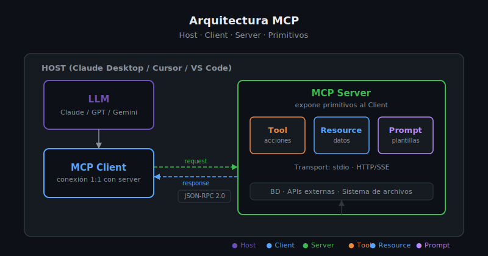

# Arquitectura MCP: Host, Client y Server



## 🎯 Objetivos

- Comprender en detalle los tres componentes de la arquitectura MCP
- Entender el flujo de comunicación desde el LLM hasta el MCP Server
- Conocer el rol de JSON-RPC 2.0 en el protocolo
- Saber cuándo hay un solo server o múltiples servers conectados a un Host

---

## 📋 Contenido

### 1. Visión General de la Arquitectura

La arquitectura MCP separa responsabilidades en tres capas claramente definidas:

```
┌────────────────────────────────────────────────────────────┐
│  HOST  (Claude Desktop / Cursor / VS Code)                 │
│                                                            │
│   ┌─────────┐    ┌───────────┐    ┌───────────────────┐   │
│   │   LLM   │◄──►│MCP Client │◄──►│   MCP Server A    │   │
│   │(Claude) │    └───────────┘    │ (filesystem)      │   │
│   │         │                     └───────────────────┘   │
│   │         │    ┌───────────┐    ┌───────────────────┐   │
│   │         │◄──►│MCP Client │◄──►│   MCP Server B    │   │
│   └─────────┘    └───────────┘    │ (database)        │   │
│                                   └───────────────────┘   │
└────────────────────────────────────────────────────────────┘
```

Un Host puede gestionar múltiples MCP Clients, cada uno conectado a un MCP Server diferente.
Esto permite que el LLM tenga acceso simultáneo a varias fuentes de herramientas y datos.

### 2. El Host

El Host es la aplicación que el usuario final utiliza. Sus responsabilidades son:

- **Gestionar el ciclo de vida** de los MCP Clients (crear, conectar, desconectar)
- **Controlar los permisos**: decidir qué servers puede usar el LLM y con qué límites
- **Integrar el LLM**: pasar el contexto de tools/resources disponibles al modelo
- **Orquestar llamadas**: cuando el LLM decide usar un tool, el Host coordina la ejecución

Ejemplos de Hosts reales:

| Host | Tipo | Nota |
|------|------|------|
| Claude Desktop | App de escritorio | Primer Host oficial |
| Cursor | IDE | Integración para coding |
| VS Code (Copilot) | IDE | Desde 2025 |
| Continue.dev | Plugin IDE | Open source |
| LibreChat | Web app | Self-hosted |

**Importante**: el Host no es el LLM. Claude Desktop es el Host; Claude (el modelo) es el LLM
que corre dentro del Host. Esta distinción es relevante porque el Host puede controlar qué
herramientas el LLM tiene disponibles, independientemente de las capacidades del modelo.

### 3. El MCP Client

El MCP Client es un componente interno del Host. No es una aplicación separada que el
usuario ejecuta — es código que vive dentro del Host.

**Características clave:**
- Mantiene una conexión **1:1** con exactamente un MCP Server
- Gestiona el ciclo de vida de la conexión (handshake, keep-alive, reconexión)
- Traduce las solicitudes del LLM al protocolo JSON-RPC 2.0 que entiende el server
- Expone al LLM las capacidades que el server declara tener

**El handshake de inicialización:**

Cuando un MCP Client se conecta a un MCP Server, ocurre el siguiente protocolo:

```
Client                          Server
  │                               │
  │── initialize ────────────────►│
  │   (versión protocolo, caps)   │
  │                               │
  │◄─ initialize result ──────────│
  │   (versión servidor, caps)    │
  │                               │
  │── initialized ───────────────►│
  │   (notification: listo)       │
  │                               │
  │   [conexión establecida]      │
```

El mensaje `initialize` incluye la versión del protocolo que soporta el Client y las
capacidades que tiene. El Server responde con sus propias capacidades. Después de este
intercambio, la conexión está lista para recibir solicitudes.

### 4. El MCP Server

El MCP Server es el proceso que tú, como desarrollador, construyes. Es el componente
central del bootcamp.

**Responsabilidades del Server:**
- Declarar qué Tools, Resources y Prompts expone
- Ejecutar las solicitudes del Client de forma segura y eficiente
- Retornar resultados en el formato que el protocolo define
- Manejar errores y comunicarlos correctamente al Client

**Estructura interna de un MCP Server:**

```python
from mcp.server.fastmcp import FastMCP

# El server se identifica con un nombre
mcp = FastMCP("mi-servidor")

# Tools: acciones ejecutables
@mcp.tool()
async def search_files(pattern: str) -> list[str]:
    """Busca archivos por patrón glob."""
    ...

# Resources: datos legibles
@mcp.resource("db://schema")
async def get_schema() -> str:
    """Retorna el esquema de la base de datos."""
    ...

# Prompts: plantillas reutilizables
@mcp.prompt()
async def code_review(language: str, code: str) -> str:
    """Plantilla para revisar código."""
    ...
```

```typescript
import { McpServer } from "@modelcontextprotocol/sdk/server/mcp.js";
import { z } from "zod";

const server = new McpServer({ name: "mi-servidor", version: "1.0.0" });

// Tool en TypeScript
server.tool(
  "search_files",
  { pattern: z.string().describe("Glob pattern") },
  async ({ pattern }) => ({
    content: [{ type: "text", text: JSON.stringify(results) }],
  })
);
```

### 5. El Protocolo de Comunicación: JSON-RPC 2.0

MCP usa **JSON-RPC 2.0** como protocolo de mensajería. JSON-RPC es un estándar que define
cómo se estructuran las solicitudes y respuestas entre procesos.

**Estructura de una solicitud:**

```json
{
  "jsonrpc": "2.0",
  "id": 1,
  "method": "tools/call",
  "params": {
    "name": "search_files",
    "arguments": {
      "pattern": "**/*.py"
    }
  }
}
```

**Estructura de una respuesta:**

```json
{
  "jsonrpc": "2.0",
  "id": 1,
  "result": {
    "content": [
      {
        "type": "text",
        "text": "[\"src/server.py\", \"src/tools/search.py\"]"
      }
    ]
  }
}
```

**Estructura de un error:**

```json
{
  "jsonrpc": "2.0",
  "id": 1,
  "error": {
    "code": -32602,
    "message": "Invalid params: pattern is required"
  }
}
```

Los SDKs de MCP manejan toda esta serialización/deserialización automáticamente. Como
desarrollador, trabajas con funciones Python o TypeScript normales; el SDK traduce todo
al protocolo JSON-RPC por ti.

### 6. El Ciclo Completo: Del Usuario al Tool

Veamos qué pasa cuando un usuario le pide a Claude Desktop que busque archivos:

```
Usuario: "¿Cuántos archivos Python hay en mi proyecto?"

1. Claude Desktop (Host) pasa el mensaje al LLM (Claude)
2. Claude detecta que necesita usar el tool search_files
3. Claude genera una solicitud: tools/call → search_files(pattern="**/*.py")
4. El Host toma esta solicitud y la pasa al MCP Client correspondiente
5. El MCP Client serializa la solicitud a JSON-RPC y la envía al MCP Server
6. El MCP Server ejecuta search_files("**/*.py") y retorna la lista de archivos
7. El MCP Client deserializa la respuesta y la pasa al Host
8. El Host pasa el resultado al LLM como contexto adicional
9. Claude genera la respuesta final: "Encontré 23 archivos Python en tu proyecto"
10. Claude Desktop muestra la respuesta al usuario
```

Este ciclo completo sucede en milisegundos y es completamente transparente para el usuario.

### 7. Múltiples Servers Simultáneos

Un Host puede tener múltiples MCP Clients conectados a diferentes servers al mismo tiempo.
Desde la perspectiva del LLM, todos los tools de todos los servers están disponibles
como si fueran un solo conjunto de herramientas:

```
Claude Desktop
  ├── Client A → Server "filesystem" → tools: read_file, list_dir, write_file
  ├── Client B → Server "database"   → tools: query, insert, get_schema
  └── Client C → Server "github"     → tools: list_repos, create_pr, get_issues

LLM ve: read_file, list_dir, write_file, query, insert, get_schema,
        list_repos, create_pr, get_issues  (9 tools de 3 servers distintos)
```

Esto es una de las ventajas más poderosas de MCP: el LLM puede combinar capacidades
de múltiples servers en una sola tarea sin que el usuario tenga que coordinar nada.

---

## 4. Errores Comunes

**Error: Un MCP Client por Host (incorrecto)**
Un Host puede tener múltiples MCP Clients, uno por cada Server conectado. No es una
relación 1:1 entre Host y Client, sino 1:N.

**Error: Confundir el transport con el protocolo**
JSON-RPC 2.0 es el **protocolo** (estructura de mensajes). `stdio` o HTTP/SSE son los
**transports** (cómo se envían esos mensajes). El protocolo es siempre el mismo;
el transport varía según el caso de uso.

**Error: Implementar lógica de negocio en el Host**
La lógica de las herramientas debe estar en el MCP Server, no en el Host. El Host solo
coordina; el Server implementa.

**Error: Olvidar que el Client verifica capabilities**
Si tu server dice que soporta cierta capacidad en el `initialize` pero luego no la
implementa, el Client puede rechazar solicitudes o comportarse de forma inesperada.

---

## 5. Ejercicios de Comprensión

1. Dibuja el flujo completo cuando un usuario en Cursor le pide al LLM que ejecute
   los tests de su proyecto. Identifica cada actor (Host, Client, Server, LLM) y
   el mensaje JSON-RPC que se enviaría.

2. ¿Por qué el MCP Client mantiene una conexión 1:1 con el server en lugar de
   una conexión N:1? ¿Qué ventajas de aislamiento ofrece esto?

3. Si tienes un MCP Server con 5 tools y otro con 3 tools, ¿cuántos tools totales
   ve el LLM? ¿Cómo los diferencia si dos tools tienen el mismo nombre?

4. En el handshake de inicialización, ¿qué información crees que es más importante
   que el Client comunique al Server? ¿Y al revés?

---

## 📚 Recursos Adicionales

- [JSON-RPC 2.0 Specification](https://www.jsonrpc.org/specification)
- [MCP Architecture Overview](https://modelcontextprotocol.io/docs/concepts/architecture)
- [MCP Specification — Protocol Messages](https://spec.modelcontextprotocol.io/)

---

## ✅ Checklist de Verificación

- [ ] Puedo dibujar el diagrama completo de la arquitectura MCP de memoria
- [ ] Entiendo qué hace el Host, qué hace el Client y qué hace el Server
- [ ] Conozco la estructura de un mensaje JSON-RPC 2.0 (request y response)
- [ ] Sé que un Host puede tener múltiples Clients conectados a diferentes Servers
- [ ] Entiendo el handshake de inicialización (initialize → result → initialized)
- [ ] Distingo entre protocolo (JSON-RPC) y transport (stdio, HTTP/SSE)

---

[← 01 — ¿Qué es MCP?](01-que-es-mcp.md) | [03 — Los Tres Primitivos →](03-primitivos.md)
