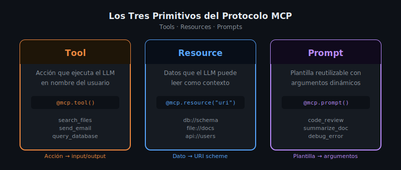

# Los Tres Primitivos: Tools, Resources y Prompts



## 🎯 Objetivos

- Entender en profundidad qué es cada primitivo y cuándo usarlo
- Conocer la estructura de input/output de cada tipo
- Saber implementar un ejemplo básico de cada primitivo en Python y TypeScript
- Aprender a decidir qué primitivo usar para cada caso de uso

---

## 📋 Contenido

### 1. Introducción: Los Bloques de Construcción de MCP

El protocolo MCP define exactamente tres tipos de capacidades que un server puede
exponer a un LLM. Estos son los **primitivos**:

| Primitivo | Pregunta que responde | Analogía |
|-----------|----------------------|----------|
| **Tool** | ¿Qué puede *hacer* el LLM? | Función/endpoint |
| **Resource** | ¿Qué puede *leer* el LLM? | Archivo/documento |
| **Prompt** | ¿Qué *plantillas* puede usar el LLM? | Template de mensaje |

Cada primitivo tiene un propósito distinto y una semántica diferente. Usarlos
correctamente es fundamental para construir MCP Servers bien diseñados.

### 2. Tools — Acciones Ejecutables

#### ¿Qué es un Tool?

Un Tool es una **acción** que el LLM puede ejecutar. Tiene:
- Un **nombre** único que identifica la acción
- Un **schema** que define los inputs requeridos y opcionales
- Una **función** que implementa la lógica
- Un **output** que retorna al LLM

Los Tools son el primitivo más usado. Si necesitas que el LLM *haga algo* —
consultar una BD, llamar a una API, ejecutar un comando — usas un Tool.

#### Estructura de un Tool

```python
from mcp.server.fastmcp import FastMCP
from pydantic import BaseModel

mcp = FastMCP("ejemplo")

# Tool simple: solo parámetros básicos
@mcp.tool()
async def add(a: int, b: int) -> int:
    """Suma dos números enteros."""
    return a + b

# Tool con validación compleja via Pydantic
class SearchParams(BaseModel):
    query: str
    max_results: int = 10
    file_type: str | None = None

@mcp.tool()
async def search_files(params: SearchParams) -> list[str]:
    """
    Busca archivos que coincidan con el query.

    Args:
        params: Parámetros de búsqueda con query, límite y tipo opcional

    Returns:
        Lista de rutas de archivos que coinciden
    """
    # Implementación real aquí
    results = []
    return results
```

```typescript
import { McpServer } from "@modelcontextprotocol/sdk/server/mcp.js";
import { z } from "zod";

const server = new McpServer({ name: "ejemplo", version: "1.0.0" });

// Tool simple
server.tool(
  "add",
  {
    a: z.number().describe("Primer número"),
    b: z.number().describe("Segundo número"),
  },
  async ({ a, b }) => ({
    content: [{ type: "text", text: String(a + b) }],
  })
);

// Tool con parámetros opcionales
server.tool(
  "search_files",
  {
    query: z.string().describe("Texto a buscar"),
    max_results: z.number().optional().default(10),
    file_type: z.string().optional(),
  },
  async ({ query, max_results, file_type }) => ({
    content: [{ type: "text", text: JSON.stringify([]) }],
  })
);
```

#### ¿Cuándo usar un Tool?

- El LLM necesita ejecutar una acción con efectos secundarios (escribir, enviar, crear)
- El LLM necesita consultar datos dinámicos en tiempo real (APIs, BD)
- La operación requiere inputs específicos del LLM para ejecutarse
- El resultado varía según los parámetros que pasa el LLM

### 3. Resources — Datos Legibles

#### ¿Qué es un Resource?

Un Resource es un **dato** que el LLM puede leer como contexto. A diferencia de los
Tools, los Resources son principalmente de **lectura** y se identifican por una **URI**.

Los Resources son ideales para exponer:
- Esquemas de bases de datos
- Documentación o archivos de configuración
- Listas de entidades disponibles (usuarios, productos, etc.)
- Cualquier dato que el LLM necesite conocer para trabajar correctamente

#### Estructura de un Resource

```python
# Resource estático con URI fija
@mcp.resource("db://schema")
async def get_db_schema() -> str:
    """Retorna el esquema completo de la base de datos."""
    return """
    Table: users
      - id: INTEGER PRIMARY KEY
      - name: TEXT NOT NULL
      - email: TEXT UNIQUE

    Table: orders
      - id: INTEGER PRIMARY KEY
      - user_id: INTEGER REFERENCES users(id)
      - total: DECIMAL(10,2)
    """

# Resource dinámico con parámetros en la URI
@mcp.resource("user://{user_id}/profile")
async def get_user_profile(user_id: str) -> str:
    """Retorna el perfil de un usuario específico."""
    # Leer de BD u otro origen de datos
    return f"Perfil del usuario {user_id}"

# Resource con metadata explícita
@mcp.resource(
    uri="file://docs/api-reference",
    name="API Reference",
    description="Documentación completa de la API REST interna",
    mime_type="text/markdown"
)
async def get_api_docs() -> str:
    """Retorna la documentación de la API."""
    with open("docs/api-reference.md") as f:
        return f.read()
```

```typescript
// Resource en TypeScript
server.resource(
  "db-schema",
  "db://schema",
  async (uri) => ({
    contents: [{
      uri: uri.href,
      mimeType: "text/plain",
      text: "CREATE TABLE users (id INTEGER PRIMARY KEY, name TEXT);"
    }]
  })
);
```

#### ¿Cuándo usar un Resource?

- Expones datos estáticos o semi-estáticos que el LLM necesita como contexto
- El LLM debe conocer una estructura (esquema, configuración) antes de actuar
- Los datos no requieren parámetros complejos de entrada (o son parte de la URI)
- Quieres que el LLM pueda "leer" información sin ejecutar una acción

### 4. Prompts — Plantillas Reutilizables

#### ¿Qué es un Prompt?

Un Prompt en MCP es una **plantilla de mensaje** con argumentos dinámicos. No es un
mensaje que el LLM recibe directamente — es una plantilla que el Host puede cargar
para iniciar o guiar una conversación con el LLM de manera consistente.

Los Prompts son útiles para:
- Estandarizar tareas repetitivas (code review, análisis de logs, generación de docs)
- Asegurar que el LLM recibe el contexto adecuado para una tarea específica
- Crear flujos de trabajo reutilizables que cualquier Host puede invocar

#### Estructura de un Prompt

```python
from mcp.types import Message, TextContent

@mcp.prompt()
async def code_review(language: str, code: str) -> list[Message]:
    """
    Plantilla para revisar código en cualquier lenguaje.

    Args:
        language: Lenguaje de programación (python, typescript, etc.)
        code: Código a revisar
    """
    return [
        {
            "role": "user",
            "content": f"""Revisa el siguiente código {language} y proporciona:
1. Bugs potenciales o errores lógicos
2. Problemas de seguridad (OWASP Top 10 cuando aplique)
3. Sugerencias de mejora de rendimiento
4. Violaciones de buenas prácticas

Código:
```{language}
{code}
```"""
        }
    ]

@mcp.prompt()
async def summarize_document(
    document: str,
    max_words: int = 200,
    audience: str = "técnico"
) -> list[Message]:
    """Plantilla para resumir documentos."""
    return [
        {
            "role": "user",
            "content": f"""Resume el siguiente documento en máximo {max_words} palabras
para una audiencia {audience}:

{document}"""
        }
    ]
```

```typescript
server.prompt(
  "code-review",
  {
    language: z.string().describe("Lenguaje de programación"),
    code: z.string().describe("Código a revisar"),
  },
  async ({ language, code }) => ({
    messages: [{
      role: "user",
      content: {
        type: "text",
        text: `Revisa el siguiente código ${language}:\n\`\`\`${language}\n${code}\n\`\`\``
      }
    }]
  })
);
```

#### ¿Cuándo usar un Prompt?

- Tienes tareas repetitivas donde siempre necesitas el mismo contexto inicial
- Quieres estandarizar cómo diferentes equipos o Hosts invocan una tarea al LLM
- La plantilla requiere argumentos dinámicos que varían por uso

### 5. Guía de Decisión: ¿Qué Primitivo Usar?

```
¿El LLM necesita ejecutar una acción o obtener datos?
  │
  ├── Ejecutar una acción (con efectos secundarios o consulta dinámica)
  │     └── → TOOL
  │
  ├── Obtener datos/contexto para trabajar
  │     ├── Los datos se identifican por URI y son relativamente estáticos
  │     │     └── → RESOURCE
  │     └── Los datos requieren lógica compleja o parámetros de ejecución
  │           └── → TOOL (que retorna datos)
  │
  └── Iniciar una tarea con una plantilla estandarizada
        └── → PROMPT
```

**Ejemplo de decisión:**

- `buscar_usuarios_por_email(email)` → **Tool** (consulta dinámica con parámetros)
- `esquema_de_la_BD` → **Resource** (dato estático que el LLM lee como contexto)
- `plantilla_de_onboarding` → **Prompt** (flujo estandarizado para onboarding)

---

## 4. Errores Comunes

**Error: Usar Tools para todo**
Los Resources son más eficientes para datos estáticos o semi-estáticos. Si el LLM
solo necesita leer algo (un esquema, un README), usa Resource. Los Tools tienen
overhead de ejecución y se listan en el contexto del LLM.

**Error: Resources sin URI scheme coherente**
Las URIs de resources deben seguir un scheme consistente. No mezcles `db://` con
`database://` para el mismo tipo de recurso.

**Error: Prompts sin argumentos tipados**
Siempre define los argumentos de un Prompt con sus tipos. Mejora la DX del usuario
del server y permite validación automática.

**Error: Tool que retorna datos no estructurados**
Los Tools siempre retornan `content: [{ type: "text", text: ... }]`. Si retornas
datos complejos, serialízalos a JSON string. El LLM los deserializará del contexto.

---

## 5. Ejercicios de Comprensión

1. Para un sistema de gestión de tareas (tipo Jira), identifica 5 Tools, 3 Resources
   y 2 Prompts que implementarías en el MCP Server.

2. Un compañero quiere implementar `get_all_users()` como un Tool que retorna todos
   los usuarios de la BD. ¿Sería mejor como Resource? ¿Por qué?

3. Escribe (a mano, sin ejecutar) el JSON-RPC que el MCP Client enviaría al Server
   para llamar al tool `search_files` con `pattern="**/*.py"` y `max_results=5`.

4. ¿Por qué un Prompt de MCP no es lo mismo que un mensaje que le envías al LLM?
   ¿Quién "ejecuta" el Prompt y cómo llega al LLM?

---

## 📚 Recursos Adicionales

- [MCP Docs — Tools](https://modelcontextprotocol.io/docs/concepts/tools)
- [MCP Docs — Resources](https://modelcontextprotocol.io/docs/concepts/resources)
- [MCP Docs — Prompts](https://modelcontextprotocol.io/docs/concepts/prompts)
- [FastMCP Python — Ejemplos](https://github.com/modelcontextprotocol/python-sdk/tree/main/examples)

---

## ✅ Checklist de Verificación

- [ ] Puedo definir un Tool con inputs tipados en Python y TypeScript
- [ ] Puedo definir un Resource con URI fija y con URI paramétrica
- [ ] Puedo definir un Prompt con argumentos dinámicos
- [ ] Sé qué primitivo usar para cada tipo de caso de uso
- [ ] Entiendo que los Tools tienen efectos secundarios y los Resources son de lectura
- [ ] Conozco la estructura de retorno de cada primitivo

---

[← 02 — Arquitectura](02-arquitectura.md) | [04 — Transports →](04-transports.md)
