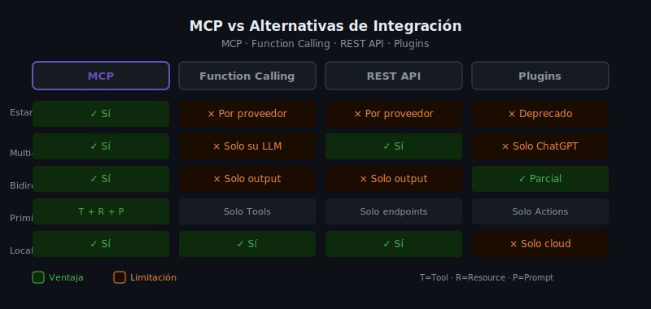

# MCP vs Alternativas: Function Calling, REST y Plugins



## 🎯 Objetivos

- Entender por qué surgió MCP cuando ya existían otras soluciones
- Comparar MCP con Function Calling, REST APIs y Plugins en términos concretos
- Saber argumentar la elección de MCP para un proyecto real
- Identificar los casos donde otras soluciones siguen siendo válidas

---

## 📋 Contenido

### 1. El Contexto: Antes de MCP

Antes de MCP, conectar un LLM con herramientas externas requería implementar una de
estas soluciones, cada una con sus propias limitaciones:

| Solución | Empresa | Problema principal |
|----------|---------|-------------------|
| Function Calling | OpenAI | Solo funciona con GPT |
| Tools API | Anthropic | Solo funciona con Claude |
| Plugins | OpenAI | Deprecado, solo ChatGPT |
| RAG ad-hoc | Varios | No estándar, sin tools |
| REST manual | Cualquiera | Sin protocolo, sin estado |

El desarrollador que quería integrar su herramienta con múltiples LLMs tenía que
implementar la integración por separado para cada uno. MCP resuelve esto.

### 2. Function Calling: El Más Parecido a MCP

Function Calling (OpenAI) y Tools API (Anthropic antes de MCP) son el antecedente
más directo de MCP. El concepto es similar: el LLM puede declarar que quiere
llamar a una función con ciertos argumentos.

#### Cómo funciona Function Calling

```python
import openai

client = openai.OpenAI()

# 1. Defines las funciones disponibles
functions = [
    {
        "name": "search_files",
        "description": "Busca archivos en el sistema",
        "parameters": {
            "type": "object",
            "properties": {
                "pattern": {"type": "string", "description": "Glob pattern"}
            },
            "required": ["pattern"]
        }
    }
]

# 2. El LLM decide si llamar a la función
response = client.chat.completions.create(
    model="gpt-4",
    messages=[{"role": "user", "content": "¿Cuántos archivos .py hay?"}],
    tools=[{"type": "function", "function": f} for f in functions]
)

# 3. Ejecutas la función manualmente
if response.choices[0].message.tool_calls:
    # TÚ ejecutas la función y vuelves a llamar al LLM con el resultado
    ...
```

#### Diferencias Clave con MCP

| Aspecto | Function Calling | MCP |
|---------|-----------------|-----|
| Estandarización | Por proveedor (OpenAI / Anthropic / Google) | Protocolo único universal |
| Portabilidad | Atado al LLM del proveedor | Funciona con cualquier LLM |
| Primitivos | Solo "functions/tools" | Tools + Resources + Prompts |
| Estado de conexión | Sin estado (stateless) | Conexión persistente con handshake |
| Notificaciones server | No | Sí (el server puede notificar al client) |
| Ecosystem | Cerrado | Abierto (1000+ servers disponibles) |
| Transport | HTTP API call | stdio, HTTP/SSE, WebSocket |

**En la práctica:**
Si construyes una integración con Function Calling de OpenAI, esa integración
no funciona con Claude, Gemini o cualquier otro LLM. Con MCP, construyes una sola
vez y cualquier Host compatible puede usarla.

### 3. REST APIs: Flexibles pero sin Estándar

Conectar un LLM a una REST API es posible, pero requiere mucho trabajo manual:

```python
# Sin MCP: el desarrollador hace todo manualmente
import httpx

async def call_my_api(endpoint: str, params: dict) -> dict:
    async with httpx.AsyncClient() as client:
        response = await client.get(f"https://api.example.com/{endpoint}", params=params)
        return response.json()

# Debes manejar manualmente:
# 1. Serialización de la solicitud del LLM
# 2. Validación de parámetros
# 3. Manejo de errores HTTP
# 4. Formato de respuesta para el LLM
# 5. Autenticación
# 6. Reintentos
```

Con MCP, el server encapsula toda esta complejidad:

```python
# Con MCP: el server maneja todo
@mcp.tool()
async def search_products(query: str, max_price: float | None = None) -> list[dict]:
    """
    Busca productos en el catálogo.
    La validación, autenticación y manejo de errores están encapsulados aquí.
    """
    async with httpx.AsyncClient() as client:
        params = {"q": query}
        if max_price:
            params["max_price"] = max_price
        response = await client.get(
            "https://api.example.com/products",
            params=params,
            headers={"Authorization": f"Bearer {API_KEY}"}
        )
        response.raise_for_status()
        return response.json()["results"]
```

**Ventaja de MCP sobre REST directo:**
El LLM no necesita saber nada sobre la API REST subyacente. Solo conoce el Tool con
su schema validado por Pydantic/Zod. La complejidad de la integración está oculta
en el Server.

### 4. Plugins de ChatGPT: Deprecados

Los Plugins de ChatGPT (2023) fueron el primer intento masivo de conectar LLMs con
herramientas externas. Funcionaban mediante un archivo `openai-plugin.json` que
describía la API del plugin.

**Por qué fueron deprecados:**
- Solo funcionaban con ChatGPT (sin portabilidad)
- Requerían infraestructura HTTP pública (sin soporte local/stdio)
- El modelo de permisos era limitado
- OpenAI los reemplazó por GPT Actions (también propietario) y eventualmente
  anunció compatibilidad con MCP

### 5. ¿Cuándo NO Usar MCP?

MCP no es siempre la solución correcta. Hay casos donde otras aproximaciones tienen sentido:

**Usa Function Calling si:**
- Tu proyecto solo usará un LLM específico (nunca cambiarás)
- Necesitas integración rápida sin infraestructura adicional
- El caso de uso es simple y no requiere Resources ni Prompts

**Usa REST API directamente si:**
- El LLM no necesita herramientas, solo generar texto con contexto estático
- Tienes un pipeline de procesamiento donde el LLM es un paso, no un orquestador

**Usa MCP si:**
- El LLM necesita acceso a herramientas, datos dinámicos o plantillas
- El proyecto puede crecer a múltiples Hosts o LLMs
- Quieres reutilizar el server en diferentes contextos
- Valoras la estandarización y el ecosistema abierto

### 6. Ejemplo Real: Migración de Function Calling a MCP

Veamos cómo se vería migrar una integración existente con Function Calling a MCP:

**Antes (Function Calling OpenAI):**

```python
# Definición atada a la API de OpenAI
TOOLS = [
    {
        "type": "function",
        "function": {
            "name": "get_weather",
            "description": "Obtiene el clima actual de una ciudad",
            "parameters": {
                "type": "object",
                "properties": {
                    "city": {"type": "string"},
                    "units": {"type": "string", "enum": ["metric", "imperial"]}
                },
                "required": ["city"]
            }
        }
    }
]

# La lógica de ejecución está en el cliente, no encapsulada
def execute_tool(name: str, args: dict) -> str:
    if name == "get_weather":
        return fetch_weather(args["city"], args.get("units", "metric"))
```

**Después (MCP Server):**

```python
# Definición portable: funciona con Claude, GPT, Gemini y cualquier Host MCP
@mcp.tool()
async def get_weather(city: str, units: str = "metric") -> dict:
    """
    Obtiene el clima actual de una ciudad.

    Args:
        city: Nombre de la ciudad
        units: Sistema de unidades (metric o imperial)

    Returns:
        Diccionario con temperatura, descripción y humedad
    """
    async with httpx.AsyncClient() as client:
        response = await client.get(
            "https://api.weather.example.com/current",
            params={"q": city, "units": units},
            headers={"API-Key": WEATHER_API_KEY}
        )
        return response.json()
```

La lógica es idéntica, pero ahora está encapsulada en un server portable que
cualquier Host compatible puede usar.

---

## 4. Errores Comunes

**Error: Creer que debes elegir entre MCP y Function Calling**
No son mutuamente excluyentes. Un MCP Server puede internamente usar la API de
OpenAI con function calling. MCP es la capa de integración con el Host;
function calling puede ser una implementación interna.

**Error: Migrar a MCP solo por "estar de moda"**
Evalúa el contexto. Si tienes una integración que funciona bien con un solo LLM
y no tienes planes de cambiar, la migración puede no justificarse.

**Error: Implementar REST dentro de un Tool sin manejo de errores**
Un Tool que llama a una API externa debe manejar timeouts, errores HTTP y
retornar mensajes de error útiles al LLM. El LLM no sabe qué hacer con una
excepción no capturada.

```python
# ❌ MAL — sin manejo de errores
@mcp.tool()
async def get_data(id: str) -> dict:
    async with httpx.AsyncClient() as client:
        response = await client.get(f"/api/data/{id}")
        return response.json()  # ¿Y si es 404? ¿O timeout?

# ✅ BIEN — con manejo de errores
@mcp.tool()
async def get_data(id: str) -> dict:
    async with httpx.AsyncClient(timeout=10.0) as client:
        try:
            response = await client.get(f"/api/data/{id}")
            response.raise_for_status()
            return response.json()
        except httpx.HTTPStatusError as e:
            return {"error": f"API error {e.response.status_code}: {e.response.text}"}
        except httpx.TimeoutException:
            return {"error": "La API no respondió en 10 segundos"}
```

---

## 5. Ejercicios de Comprensión

1. Tu empresa tiene 5 integraciones con function calling de OpenAI. ¿Cuál sería el
   beneficio concreto de migrarlas a MCP Servers? ¿Y el costo?

2. Diseña la arquitectura para un chatbot que necesita:
   - Buscar productos en una BD
   - Consultar el clima actual
   - Generar resúmenes de documentos
   ¿Usarías uno o tres MCP Servers? ¿Por qué?

3. Explica por qué los Plugins de ChatGPT fueron deprecados desde una perspectiva
   de diseño de protocolo. ¿Qué habrías hecho diferente?

4. ¿Cuál es la analogía correcta entre MCP y USB-C? ¿En qué puntos la analogía
   se rompe o es inexacta?

---

## 📚 Recursos Adicionales

- [OpenAI Function Calling Docs](https://platform.openai.com/docs/guides/function-calling)
- [MCP Announcement — Anthropic Blog](https://www.anthropic.com/news/model-context-protocol)
- [Comparativa MCP vs otras soluciones](https://modelcontextprotocol.io/introduction)
- [Lista de SDKs compatibles con MCP](https://modelcontextprotocol.io/sdks)

---

## ✅ Checklist de Verificación

- [ ] Entiendo las diferencias concretas entre MCP y Function Calling
- [ ] Sé cuándo elegir MCP y cuándo otra solución es más apropiada
- [ ] Puedo explicar por qué MCP es más portable que Function Calling
- [ ] Conozco el historial de Plugins de ChatGPT y por qué fueron deprecados
- [ ] Sé implementar manejo de errores en Tools que llaman a APIs externas
- [ ] Puedo argumentar la adopción de MCP a un equipo técnico

---

[← 04 — Transports](04-transports.md) | [← Volver al índice](README.md)
