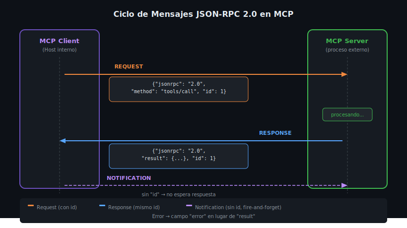

# JSON-RPC 2.0: La Base del Protocolo MCP



## 🎯 Objetivos

- Comprender la especificación JSON-RPC 2.0 y su estructura de mensajes
- Distinguir entre Request, Response, Error y Notification
- Entender el rol del campo `id` en la correlación de mensajes
- Identificar los mensajes JSON-RPC en una sesión MCP real

---

## 📋 Contenido

### 1. ¿Qué es JSON-RPC 2.0?

JSON-RPC 2.0 es un protocolo de llamada a procedimientos remotos (_Remote Procedure Call_)
que usa JSON como formato de serialización. Es **stateless** (sin estado) y está diseñado
para ser simple de implementar en cualquier lenguaje.

MCP usa JSON-RPC 2.0 como capa de transporte de mensajes. Todos los intercambios entre
el MCP Client y el MCP Server — incluyendo llamadas a tools, lectura de resources y
gestión de la sesión — viajan como mensajes JSON-RPC.

La especificación completa está en: https://www.jsonrpc.org/specification

**Tres tipos de mensajes posibles:**

| Tipo | Tiene `id` | Tiene `method` | Espera respuesta |
|------|-----------|----------------|-----------------|
| Request | ✅ Sí | ✅ Sí | ✅ Sí |
| Response | ✅ Sí (mismo del request) | ❌ No | N/A |
| Notification | ❌ No | ✅ Sí | ❌ No |

---

### 2. Estructura de un Request

Un Request es un mensaje que el cliente envía al servidor esperando una respuesta.
Campos obligatorios:

```json
{
  "jsonrpc": "2.0",
  "method": "tools/call",
  "params": {
    "name": "get_weather",
    "arguments": {
      "city": "Madrid"
    }
  },
  "id": 1
}
```

- `"jsonrpc": "2.0"` — **siempre presente**, identifica la versión del protocolo
- `"method"` — nombre del procedimiento a llamar (en MCP: `tools/call`, `resources/read`, etc.)
- `"params"` — argumentos del método (objeto o array, opcional)
- `"id"` — identificador único del request (string, número o null). Permite correlacionar
  la respuesta con la solicitud. **Debe ser único por sesión.**

---

### 3. Estructura de una Response exitosa

El servidor responde con el mismo `id` del request:

```json
{
  "jsonrpc": "2.0",
  "result": {
    "content": [
      {
        "type": "text",
        "text": "Madrid: 22°C, despejado"
      }
    ]
  },
  "id": 1
}
```

- `"result"` — el valor de retorno del método. Su estructura depende del método llamado.
- `"id"` — **mismo valor** que el request. Así el cliente sabe qué respuesta corresponde a qué solicitud.
- Una response exitosa **nunca** tiene `"error"`.

---

### 4. Estructura de una Response de Error

Si algo sale mal, el servidor retorna un objeto `"error"` en lugar de `"result"`:

```json
{
  "jsonrpc": "2.0",
  "error": {
    "code": -32601,
    "message": "Method not found",
    "data": {
      "method": "tools/inexistente"
    }
  },
  "id": 1
}
```

**Códigos de error estándar JSON-RPC:**

| Código | Nombre | Descripción |
|--------|--------|-------------|
| `-32700` | Parse error | El JSON no es válido |
| `-32600` | Invalid Request | El objeto no es un Request válido |
| `-32601` | Method not found | El método no existe |
| `-32602` | Invalid params | Parámetros inválidos |
| `-32603` | Internal error | Error interno del servidor |
| `-32000` a `-32099` | Server error | Errores propios del servidor MCP |

Una response de error **nunca** tiene `"result"`.

---

### 5. Notificaciones (Notifications)

Una Notification es un mensaje que **no espera respuesta**. Se usa para eventos
asíncronos donde el emisor no necesita confirmación:

```json
{
  "jsonrpc": "2.0",
  "method": "notifications/tools/list_changed",
  "params": {}
}
```

La diferencia clave: **no tiene campo `id`**. En MCP se usan para:
- `notifications/tools/list_changed` — el servidor avisa que cambió su lista de tools
- `notifications/resources/updated` — un resource fue actualizado
- `notifications/progress` — progreso de una operación larga

---

### 6. Mensajes por Batch (avanzado)

JSON-RPC 2.0 permite enviar múltiples mensajes en un array:

```json
[
  {"jsonrpc": "2.0", "method": "tools/list", "id": 1},
  {"jsonrpc": "2.0", "method": "resources/list", "id": 2}
]
```

El servidor responde con un array de responses en el mismo orden. MCP no usa
batches frecuentemente, pero es parte del estándar.

---

### 7. El campo `id`: Correlación Asíncrona

El `id` es fundamental en protocolos asíncronos. Permite que múltiples requests
estén "en vuelo" simultáneamente sin confundir respuestas:

```python
# Python — ejemplo conceptual de correlación
import asyncio
import json

pending_requests: dict[int | str, asyncio.Future] = {}

async def send_request(method: str, params: dict) -> dict:
    request_id = generate_unique_id()
    future: asyncio.Future = asyncio.get_event_loop().create_future()
    pending_requests[request_id] = future

    message = {
        "jsonrpc": "2.0",
        "method": method,
        "params": params,
        "id": request_id,
    }
    await write_to_transport(json.dumps(message) + "\n")

    return await future  # espera la respuesta con ese id

async def on_response_received(response: dict) -> None:
    response_id = response["id"]
    if response_id in pending_requests:
        future = pending_requests.pop(response_id)
        if "result" in response:
            future.set_result(response["result"])
        elif "error" in response:
            future.set_exception(Exception(response["error"]["message"]))
```

```typescript
// TypeScript — mismo patrón con Map
const pendingRequests = new Map<number | string, {
  resolve: (value: unknown) => void;
  reject: (reason: Error) => void;
}>();

async function sendRequest(method: string, params: Record<string, unknown>) {
  const id = generateUniqueId();
  const promise = new Promise((resolve, reject) => {
    pendingRequests.set(id, { resolve, reject });
  });

  await writeToTransport(JSON.stringify({
    jsonrpc: "2.0",
    method,
    params,
    id,
  }) + "\n");

  return promise;
}
```

---

### 8. JSON-RPC en el Contexto MCP

En MCP, los métodos JSON-RPC tienen nombres con estructura `categoria/accion`:

```
initialize          → Handshake inicial de la sesión
tools/list          → Listar tools disponibles
tools/call          → Ejecutar un tool
resources/list      → Listar resources disponibles
resources/read      → Leer el contenido de un resource
prompts/list        → Listar prompts disponibles
prompts/get         → Obtener un prompt con argumentos
ping                → Verificar que el server está vivo
```

Ejemplo de flujo completo de una llamada a tool:

```json
// Cliente → Servidor
{
  "jsonrpc": "2.0",
  "method": "tools/call",
  "params": {
    "name": "search_files",
    "arguments": { "pattern": "*.py", "directory": "/src" }
  },
  "id": 42
}

// Servidor → Cliente
{
  "jsonrpc": "2.0",
  "result": {
    "content": [
      { "type": "text", "text": "server.py\nconfig.py\nutils.py" }
    ],
    "isError": false
  },
  "id": 42
}
```

---

## ⚠️ Errores Comunes

**1. Olvidar el campo `"jsonrpc": "2.0"`**
El servidor rechazará el mensaje con código `-32600` (Invalid Request).

**2. Reutilizar el mismo `id` en requests activos**
Si dos requests tienen el mismo `id` en vuelo, la respuesta se asignará al primero
que la reciba, causando bugs de correlación difíciles de depurar.

**3. Confundir `result: null` con error**
Un método puede retornar `{"result": null, "id": 1}` y ser completamente válido.
Un error SIEMPRE tiene el campo `"error"`, nunca `"result"`.

**4. Enviar `id` en notificaciones**
Si una notification tiene `id`, el receptor podría tratarla como un request y esperar
respuesta indefinidamente.

---

## 🧪 Ejercicios de Comprensión

1. ¿Cuál es la diferencia entre una Response con `result: null` y una Response de error?
2. Dado este mensaje: `{"jsonrpc":"2.0","method":"ping"}` — ¿es un Request o una Notification? ¿Por qué?
3. ¿Qué sucede si el cliente envía `id: "abc-123"` en lugar de `id: 1`? ¿Es válido?
4. ¿Por qué un servidor podría retornar código `-32602` en lugar de `-32601`?

---

## 📚 Recursos Adicionales

- [JSON-RPC 2.0 Specification](https://www.jsonrpc.org/specification)
- [MCP Protocol — Messages](https://spec.modelcontextprotocol.io/specification/basic/messages/)

---

## ✅ Checklist de Verificación

- [ ] Sé construir un Request válido con `jsonrpc`, `method`, `params` e `id`
- [ ] Entiendo la diferencia entre `result` y `error` en una Response
- [ ] Sé qué es una Notification y por qué no tiene `id`
- [ ] Conozco los 5 códigos de error estándar (-32700 al -32603)
- [ ] Comprendo cómo el campo `id` permite correlacionar requests y responses asíncronos
- [ ] Identifico los métodos JSON-RPC principales de MCP (`tools/call`, `resources/read`, etc.)

---

[← Índice de teoría](README.md) | [02 →](02-stdio-transport.md)
