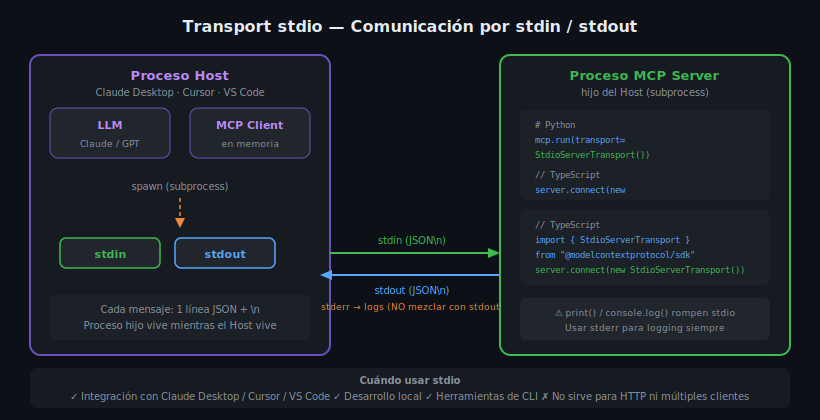

# Transport stdio: Comunicación por stdin/stdout



## 🎯 Objetivos

- Entender cómo funciona la comunicación por stdin/stdout en MCP
- Configurar un MCP Server con StdioServerTransport en Python y TypeScript
- Integrar un server stdio con Claude Desktop y Cursor
- Depurar problemas comunes del transport stdio

---

## 📋 Contenido

### 1. ¿Cómo funciona stdio?

El transport **stdio** usa los canales estándar del sistema operativo:

- **stdin** (`fd=0`) — entrada estándar: el Host escribe mensajes JSON-RPC al servidor
- **stdout** (`fd=1`) — salida estándar: el servidor escribe respuestas JSON-RPC al Host
- **stderr** (`fd=2`) — error estándar: usado para logging (NO para mensajes MCP)

El Host inicia el servidor como un **subproceso** (_subprocess_). Cuando el Host
cierra, el subproceso también termina. Esto garantiza que no queden procesos huérfanos.

**Protocolo de framing**: cada mensaje JSON-RPC ocupa exactamente **una línea**, terminada
con `\n`. El receptor lee línea a línea y parsea cada una como JSON independiente.

```
stdin  →  {"jsonrpc":"2.0","method":"tools/call","params":{...},"id":1}\n
stdout ←  {"jsonrpc":"2.0","result":{...},"id":1}\n
```

---

### 2. MCP Server con stdio en Python

```python
# src/server.py
import asyncio
from mcp.server import Server
from mcp.server.stdio import stdio_server
from mcp.types import Tool, TextContent

# Crear la instancia del servidor
server = Server("mi-servidor-stdio")


@server.list_tools()
async def list_tools() -> list[Tool]:
    """Lista los tools disponibles."""
    return [
        Tool(
            name="echo",
            description="Repite el mensaje recibido",
            inputSchema={
                "type": "object",
                "properties": {
                    "message": {
                        "type": "string",
                        "description": "Mensaje a repetir",
                    }
                },
                "required": ["message"],
            },
        )
    ]


@server.call_tool()
async def call_tool(name: str, arguments: dict) -> list[TextContent]:
    """Ejecuta el tool solicitado."""
    if name == "echo":
        message: str = arguments["message"]
        return [TextContent(type="text", text=f"Echo: {message}")]
    raise ValueError(f"Tool desconocido: {name}")


async def main() -> None:
    # stdio_server maneja la lectura/escritura de stdin/stdout
    async with stdio_server() as (read_stream, write_stream):
        await server.run(
            read_stream,
            write_stream,
            server.create_initialization_options(),
        )


if __name__ == "__main__":
    asyncio.run(main())
```

**Punto clave**: `stdio_server()` es un context manager asíncrono que abre y cierra
los streams de stdin/stdout correctamente. Nunca uses `print()` para output general,
ya que **contamina el canal stdout** y rompe el protocolo.

---

### 3. MCP Server con stdio en TypeScript

```typescript
// src/index.ts
import { Server } from "@modelcontextprotocol/sdk/server/index.js";
import { StdioServerTransport } from "@modelcontextprotocol/sdk/server/stdio.js";
import {
  ListToolsRequestSchema,
  CallToolRequestSchema,
} from "@modelcontextprotocol/sdk/types.js";

const server = new Server(
  { name: "mi-servidor-stdio", version: "1.0.0" },
  { capabilities: { tools: {} } }
);

// Registrar handler para listar tools
server.setRequestHandler(ListToolsRequestSchema, async () => ({
  tools: [
    {
      name: "echo",
      description: "Repite el mensaje recibido",
      inputSchema: {
        type: "object" as const,
        properties: {
          message: { type: "string", description: "Mensaje a repetir" },
        },
        required: ["message"],
      },
    },
  ],
}));

// Registrar handler para ejecutar tools
server.setRequestHandler(CallToolRequestSchema, async (request) => {
  const { name, arguments: args } = request.params;

  if (name === "echo") {
    const message = args?.message as string;
    return {
      content: [{ type: "text" as const, text: `Echo: ${message}` }],
    };
  }

  throw new Error(`Tool desconocido: ${name}`);
});

// Iniciar con StdioServerTransport
async function main(): Promise<void> {
  const transport = new StdioServerTransport();
  await server.connect(transport);
  // IMPORTANTE: usar stderr para logging, nunca console.log()
  process.stderr.write("Servidor stdio iniciado\n");
}

main().catch((error) => {
  process.stderr.write(`Error fatal: ${error}\n`);
  process.exit(1);
});
```

---

### 4. Regla de Oro: stderr para Logging

El canal `stdout` está **reservado exclusivamente** para mensajes JSON-RPC.
Cualquier otro output rompe el protocolo porque el Host interpretará cada línea
como un mensaje JSON.

```python
# ❌ INCORRECTO — rompe stdio
print("Servidor iniciado")
print(f"Procesando tool: {name}")

# ✅ CORRECTO — stderr no interfiere
import sys
sys.stderr.write("Servidor iniciado\n")
sys.stderr.write(f"Procesando tool: {name}\n")

# ✅ También correcto — logging redirige a stderr por defecto si se configura
import logging
logging.basicConfig(
    level=logging.INFO,
    stream=sys.stderr,  # CRÍTICO: apuntar a stderr
    format="%(asctime)s %(levelname)s %(message)s",
)
logger = logging.getLogger(__name__)
logger.info("Servidor iniciado")
```

```typescript
// ❌ INCORRECTO
console.log("Servidor iniciado");

// ✅ CORRECTO
process.stderr.write("Servidor iniciado\n");
console.error("Servidor iniciado"); // console.error va a stderr
```

---

### 5. Integración con Claude Desktop

Claude Desktop gestiona automáticamente el ciclo de vida de los subprocesos.
Configuración en `claude_desktop_config.json`:

```json
{
  "mcpServers": {
    "mi-servidor": {
      "command": "python",
      "args": ["/ruta/absoluta/src/server.py"],
      "env": {
        "PYTHONPATH": "/ruta/absoluta"
      }
    }
  }
}
```

Para un servidor TypeScript compilado:

```json
{
  "mcpServers": {
    "mi-servidor-ts": {
      "command": "node",
      "args": ["/ruta/absoluta/dist/index.js"]
    }
  }
}
```

Con `uv` (recomendado para Python):

```json
{
  "mcpServers": {
    "mi-servidor-uv": {
      "command": "uv",
      "args": ["run", "--project", "/ruta/absoluta", "python", "src/server.py"]
    }
  }
}
```

---

### 6. Integración con Docker (stdio)

Para ejecutar el servidor dentro de un contenedor manteniendo stdio:

```yaml
# docker-compose.yml
services:
  mcp-server:
    build: .
    stdin_open: true   # equivalente a -i (interactive)
    tty: false         # NO usar tty con stdio MCP
    command: ["python", "src/server.py"]
```

```dockerfile
# Dockerfile
FROM python:3.13-slim
ENV PYTHONDONTWRITEBYTECODE=1 \
    PYTHONUNBUFFERED=1 \
    UV_SYSTEM_PYTHON=1
RUN pip install --no-cache-dir uv
WORKDIR /app
COPY pyproject.toml uv.lock* ./
RUN uv sync --frozen --no-dev
COPY . .
CMD ["uv", "run", "python", "src/server.py"]
```

Configuración en Claude Desktop para Docker:

```json
{
  "mcpServers": {
    "mi-servidor-docker": {
      "command": "docker",
      "args": ["run", "--rm", "-i", "nombre-imagen:tag"]
    }
  }
}
```

El flag `-i` es esencial: mantiene stdin abierto para que Docker pueda recibir
los mensajes JSON-RPC del Host.

---

### 7. Ciclo de Vida de una Sesión stdio

```
Host                          MCP Server
 │                                │
 │── spawn subprocess ────────────►│ (proceso hijo inicia)
 │                                │
 │── {"method":"initialize"} ────►│
 │◄── {"result":{"capabilities"}} ─│
 │                                │
 │── {"method":"tools/list"} ────►│
 │◄── {"result":{"tools":[...]}} ──│
 │                                │
 │── {"method":"tools/call"} ────►│
 │◄── {"result":{...}} ────────────│
 │                                │
 │  (Host cierra)                 │
 │── [stdin cerrado] ─────────────►│ (proceso hijo termina)
```

---

## ⚠️ Errores Comunes

**1. `print()` en el handler del tool**
El mensaje se mezcla con el JSON de la respuesta. El Host recibe una línea inválida
y falla con "Parse error" (`-32700`). Siempre usar `sys.stderr.write()`.

**2. Servidor que no termina al cerrarse stdin**
El servidor debe detectar EOF en stdin y cerrar limpiamente. `stdio_server()` y
`StdioServerTransport` lo manejan automáticamente si se usa correctamente.

**3. Ruta relativa en la configuración de Claude Desktop**
`"command": "python"` funciona solo si `python` está en el PATH del sistema.
Para entornos virtuales, usa la ruta absoluta del ejecutable.

**4. Mezclar `tty: true` con stdio en Docker**
Docker con `tty: true` transforma stdout en un stream de terminal, rompiendo
el framing de líneas JSON-RPC. Siempre usar `tty: false`.

---

## 🧪 Ejercicios de Comprensión

1. ¿Qué sucede exactamente si usas `print("debug")` dentro de un tool handler con transport stdio?
2. ¿Por qué el flag `-i` (stdin_open) es obligatorio cuando se usa Docker con stdio?
3. Explica la diferencia de ciclo de vida entre un servidor stdio y un servidor HTTP/SSE.
4. ¿En qué situaciones preferirías stdio sobre HTTP/SSE?

---

## 📚 Recursos Adicionales

- [MCP Python SDK — StdioServerTransport](https://github.com/modelcontextprotocol/python-sdk)
- [MCP TypeScript SDK — StdioServerTransport](https://github.com/modelcontextprotocol/typescript-sdk)
- [Claude Desktop — MCP Configuration](https://modelcontextprotocol.io/docs/tools/claude-desktop)

---

## ✅ Checklist de Verificación

- [ ] Entiendo que stdout es solo para JSON-RPC y stderr para logs
- [ ] Sé configurar `stdio_server()` en Python correctamente
- [ ] Sé configurar `StdioServerTransport` en TypeScript correctamente
- [ ] Puedo agregar un servidor stdio a `claude_desktop_config.json`
- [ ] Sé usar Docker con el flag `-i` para stdin
- [ ] Comprendo el ciclo de vida: spawn → initialize → use → EOF → terminate

---

[← 01](01-json-rpc-2.md) | [Índice](README.md) | [03 →](03-http-sse-transport.md)
