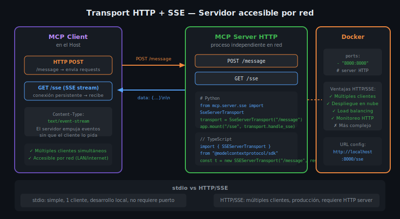

# Transport HTTP + SSE: Servidor Accesible por Red



## 🎯 Objetivos

- Comprender la arquitectura HTTP + SSE en MCP
- Implementar un MCP Server con SSEServerTransport en Python y TypeScript
- Configurar Docker para exponer el servidor por HTTP
- Entender cuándo elegir HTTP/SSE sobre stdio

---

## 📋 Contenido

### 1. ¿Por qué HTTP + SSE?

El transport stdio tiene una limitación: **un cliente a la vez**. Si quieres:
- Servir múltiples Hosts simultáneamente
- Desplegar en un servidor en la nube
- Implementar autenticación HTTP estándar
- Monitorear el servidor con herramientas HTTP convencionales

...necesitas el transport **HTTP + SSE**.

**Server-Sent Events (SSE)** es un estándar del W3C que permite que el servidor
envíe eventos al cliente sobre una conexión HTTP persistente (`text/event-stream`).
A diferencia de WebSockets, SSE es **unidireccional**: solo del servidor al cliente.

Por eso MCP combina:
- `GET /sse` — conexión SSE persistente: el servidor **empuja** responses y notifications
- `POST /message` — endpoint HTTP estándar: el cliente **envía** requests

---

### 2. Formato de eventos SSE

```
Content-Type: text/event-stream
Cache-Control: no-cache
Connection: keep-alive

data: {"jsonrpc":"2.0","result":{"tools":[...]},"id":1}

data: {"jsonrpc":"2.0","method":"notifications/tools/list_changed"}

```

Cada evento SSE tiene el formato `data: <contenido>\n\n`. El doble newline
separa eventos. El cliente mantiene la conexión abierta y procesa cada evento
a medida que llega.

---

### 3. MCP Server con SSE en Python (FastAPI + Starlette)

```python
# src/server.py
import asyncio
from contextlib import asynccontextmanager

import uvicorn
from mcp.server import Server
from mcp.server.sse import SseServerTransport
from mcp.types import Tool, TextContent
from starlette.applications import Starlette
from starlette.requests import Request
from starlette.routing import Mount, Route

# Instancia del servidor MCP
mcp_server = Server("mi-servidor-sse")


@mcp_server.list_tools()
async def list_tools() -> list[Tool]:
    return [
        Tool(
            name="echo",
            description="Repite el mensaje recibido",
            inputSchema={
                "type": "object",
                "properties": {
                    "message": {"type": "string", "description": "Mensaje a repetir"},
                },
                "required": ["message"],
            },
        )
    ]


@mcp_server.call_tool()
async def call_tool(name: str, arguments: dict) -> list[TextContent]:
    if name == "echo":
        return [TextContent(type="text", text=f"Echo: {arguments['message']}")]
    raise ValueError(f"Tool desconocido: {name}")


# Crear el transport SSE
sse_transport = SseServerTransport("/message")


async def handle_sse(request: Request):
    """Endpoint GET /sse — abre la conexión SSE persistente."""
    async with sse_transport.connect_sse(
        request.scope, request.receive, request._send
    ) as (read_stream, write_stream):
        await mcp_server.run(
            read_stream,
            write_stream,
            mcp_server.create_initialization_options(),
        )


# Aplicación Starlette
app = Starlette(
    routes=[
        Route("/sse", endpoint=handle_sse),
        Mount("/message", app=sse_transport.handle_post_message),
    ]
)


if __name__ == "__main__":
    uvicorn.run(app, host="0.0.0.0", port=8000)
```

---

### 4. MCP Server con SSE en TypeScript (Express)

```typescript
// src/index.ts
import express from "express";
import { Server } from "@modelcontextprotocol/sdk/server/index.js";
import { SSEServerTransport } from "@modelcontextprotocol/sdk/server/sse.js";
import {
  ListToolsRequestSchema,
  CallToolRequestSchema,
} from "@modelcontextprotocol/sdk/types.js";

const app = express();
app.use(express.json());

// Almacén de transports activos (una instancia por cliente conectado)
const activeTransports = new Map<string, SSEServerTransport>();

function createMcpServer(): Server {
  const server = new Server(
    { name: "mi-servidor-sse", version: "1.0.0" },
    { capabilities: { tools: {} } }
  );

  server.setRequestHandler(ListToolsRequestSchema, async () => ({
    tools: [
      {
        name: "echo",
        description: "Repite el mensaje recibido",
        inputSchema: {
          type: "object" as const,
          properties: {
            message: { type: "string", description: "Mensaje a repetir" },
          },
          required: ["message"],
        },
      },
    ],
  }));

  server.setRequestHandler(CallToolRequestSchema, async (request) => {
    const { name, arguments: args } = request.params;
    if (name === "echo") {
      return {
        content: [{ type: "text" as const, text: `Echo: ${args?.message}` }],
      };
    }
    throw new Error(`Tool desconocido: ${name}`);
  });

  return server;
}

// GET /sse — cliente abre conexión SSE persistente
app.get("/sse", async (req, res) => {
  const transport = new SSEServerTransport("/message", res);
  const server = createMcpServer();

  activeTransports.set(transport.sessionId, transport);
  res.on("close", () => activeTransports.delete(transport.sessionId));

  await server.connect(transport);
  process.stderr.write(`Cliente conectado: ${transport.sessionId}\n`);
});

// POST /message — cliente envía mensajes JSON-RPC
app.post("/message", async (req, res) => {
  const sessionId = req.query.sessionId as string;
  const transport = activeTransports.get(sessionId);

  if (!transport) {
    res.status(404).json({ error: "Sesión no encontrada" });
    return;
  }

  await transport.handlePostMessage(req, res);
});

app.listen(8000, () => {
  process.stderr.write("Servidor SSE escuchando en http://localhost:8000\n");
});
```

---

### 5. Configuración Docker para HTTP/SSE

```dockerfile
# Dockerfile.python
FROM python:3.13-slim
ENV PYTHONDONTWRITEBYTECODE=1 \
    PYTHONUNBUFFERED=1 \
    UV_SYSTEM_PYTHON=1
RUN pip install --no-cache-dir uv
WORKDIR /app
COPY pyproject.toml uv.lock* ./
RUN uv sync --frozen --no-dev
COPY . .
CMD ["uv", "run", "uvicorn", "src.server:app", "--host", "0.0.0.0", "--port", "8000"]
```

```yaml
# docker-compose.yml
services:
  mcp-server:
    build:
      context: .
      dockerfile: Dockerfile.python
    ports:
      - "8000:8000"
    environment:
      - LOG_LEVEL=info
    healthcheck:
      test: ["CMD", "curl", "-f", "http://localhost:8000/health"]
      interval: 30s
      timeout: 10s
      retries: 3
    restart: unless-stopped
```

---

### 6. Configurar Clientes para Conectar a HTTP/SSE

Para que un MCP Client (Claude Desktop, Cursor) se conecte al servidor HTTP/SSE,
la configuración usa la URL del endpoint SSE:

```json
{
  "mcpServers": {
    "mi-servidor-http": {
      "url": "http://localhost:8000/sse"
    }
  }
}
```

Con MCP Inspector (para desarrollo):
- Seleccionar transport: `SSE`
- URL: `http://localhost:8000/sse`

---

### 7. Tabla Comparativa: stdio vs HTTP/SSE

| Aspecto | stdio | HTTP/SSE |
|---------|-------|----------|
| Número de clientes | 1 (el Host que lanzó el proceso) | Múltiples simultáneos |
| Ciclo de vida | Ligado al proceso padre | Independiente |
| Despliegue | Local / Docker `-i` | Servidor web, nube |
| Autenticación | N/A | Headers HTTP (Bearer, API Key) |
| Debugging | Difícil (capturar stdin/stdout) | Fácil (DevTools, curl, Postman) |
| Latencia | Muy baja (pipes del OS) | Baja (red local) o media (red) |
| Complejidad | Baja | Media (requiere HTTP server) |
| Producción | No recomendado | Recomendado |
| Semanas del bootcamp | 4–9 | 10+ |

---

## ⚠️ Errores Comunes

**1. CORS no configurado**
Si el cliente corre en un origen diferente (ej. extensión de navegador), el servidor
debe tener headers CORS configurados. Con FastAPI: `add_middleware(CORSMiddleware, ...)`.

**2. Timeout del SSE connection**
Los proxies y load balancers suelen cerrar conexiones inactivas tras 60–90 segundos.
Configurar keepalives: enviar un comentario SSE periódico (`": keepalive\n\n"`).

**3. No limpiar transports activos en memoria**
Si el cliente desconecta sin que el servidor lo sepa, el transport queda en el Map
indefinidamente. Siempre limpiar en el handler `res.on("close", ...)`.

**4. Olvidar `--host 0.0.0.0` en Docker**
Un servidor que escucha solo en `127.0.0.1` dentro de Docker es inaccesible desde
el host. Usar `0.0.0.0` para escuchar en todas las interfaces.

---

## 🧪 Ejercicios de Comprensión

1. ¿Por qué SSE es unidireccional y cómo MCP resuelve la comunicación bidireccional con HTTP/SSE?
2. ¿Qué sucede si dos clientes se conectan al mismo tiempo a un servidor SSE? ¿Comparten estado?
3. ¿Por qué `stdin_open: true` no aplica a servidores HTTP/SSE en Docker?
4. Describe cómo agregarías autenticación por API Key a un servidor HTTP/SSE.

---

## 📚 Recursos Adicionales

- [MDN — Server-Sent Events](https://developer.mozilla.org/en-US/docs/Web/API/Server-sent_events)
- [MCP Spec — Transports](https://spec.modelcontextprotocol.io/specification/basic/transports/)
- [FastAPI Docs](https://fastapi.tiangolo.com/)
- [Express Docs](https://expressjs.com/)

---

## ✅ Checklist de Verificación

- [ ] Entiendo la diferencia entre `GET /sse` (recibir) y `POST /message` (enviar)
- [ ] Sé implementar SSEServerTransport en Python con Starlette/FastAPI
- [ ] Sé implementar SSEServerTransport en TypeScript con Express
- [ ] Puedo configurar Docker con `ports:` para exponer el servidor HTTP
- [ ] Comprendo la tabla comparativa stdio vs HTTP/SSE y sé cuándo usar cada uno
- [ ] Sé configurar la URL SSE en Claude Desktop / MCP Inspector

---

[← 02](02-stdio-transport.md) | [Índice](README.md) | [04 →](04-websocket-transport.md)
