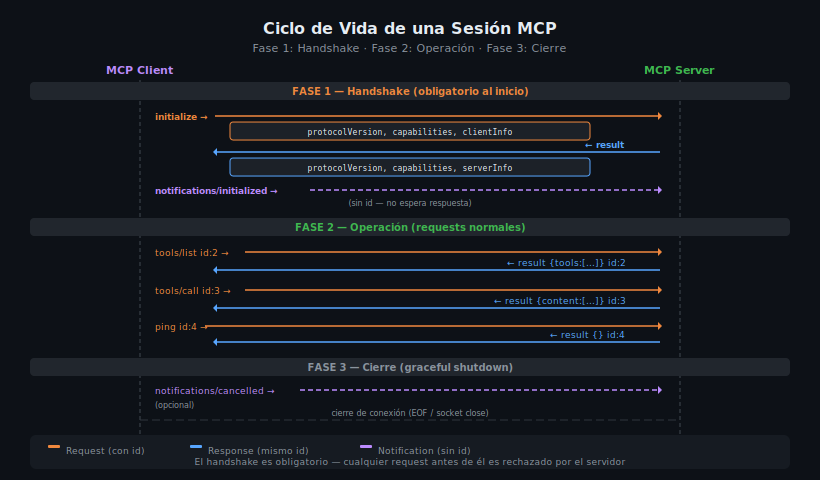

# Tipos de Mensajes MCP: Initialize, Requests y Notifications



## 🎯 Objetivos

- Conocer el ciclo de vida completo de una sesión MCP
- Entender el handshake `initialize` / `initialized`
- Identificar todos los métodos JSON-RPC del protocolo MCP
- Comprender el rol de las notifications en el protocolo
- Leer e interpretar mensajes MCP reales

---

## 📋 Contenido

### 1. El Ciclo de Vida de una Sesión MCP

Una sesión MCP tiene tres fases bien definidas:

```
FASE 1: HANDSHAKE (obligatoria)
 Client → Server: initialize
 Server → Client: initialize (result con capabilities)
 Client → Server: notifications/initialized

FASE 2: USO (iterativa)
 Client → Server: tools/list, tools/call, resources/read, prompts/get...
 Server → Client: results, errors, notifications

FASE 3: CIERRE (implícita)
 Transport se cierra → sesión termina
```

---

### 2. Handshake: `initialize`

El handshake es **obligatorio** antes de cualquier otra operación. El cliente
declara su versión del protocolo y el servidor responde con sus capabilities.

**Request del cliente:**

```json
{
  "jsonrpc": "2.0",
  "method": "initialize",
  "params": {
    "protocolVersion": "2024-11-05",
    "capabilities": {
      "roots": { "listChanged": true },
      "sampling": {}
    },
    "clientInfo": {
      "name": "claude-desktop",
      "version": "1.0.0"
    }
  },
  "id": 1
}
```

**Response del servidor:**

```json
{
  "jsonrpc": "2.0",
  "result": {
    "protocolVersion": "2024-11-05",
    "capabilities": {
      "tools": { "listChanged": true },
      "resources": { "subscribe": true, "listChanged": true },
      "prompts": { "listChanged": true },
      "logging": {}
    },
    "serverInfo": {
      "name": "mi-servidor",
      "version": "1.0.0"
    }
  },
  "id": 1
}
```

**Notification del cliente (confirma que está listo):**

```json
{
  "jsonrpc": "2.0",
  "method": "notifications/initialized"
}
```

Después de `notifications/initialized`, el servidor puede procesar requests.
Si el servidor recibe un request antes de este mensaje, debe retornar error.

---

### 3. Capabilities: Qué Puede Hacer Cada Lado

El campo `capabilities` es un contrato entre cliente y servidor. El servidor
solo debe ofrecer capabilities que realmente implementa:

**Capabilities del servidor:**

| Capability | Descripción |
|-----------|-------------|
| `tools` | Soporta tools/list y tools/call |
| `tools.listChanged` | Notificará cuando cambie la lista de tools |
| `resources` | Soporta resources/list y resources/read |
| `resources.subscribe` | El cliente puede suscribirse a cambios de resources |
| `resources.listChanged` | Notificará cuando cambie la lista de resources |
| `prompts` | Soporta prompts/list y prompts/get |
| `prompts.listChanged` | Notificará cuando cambie la lista de prompts |
| `logging` | Acepta mensajes de log del cliente |

**Capabilities del cliente:**

| Capability | Descripción |
|-----------|-------------|
| `roots` | El cliente puede exponer roots (directorios) al servidor |
| `roots.listChanged` | Notificará cuando cambien los roots |
| `sampling` | El cliente puede hacer sampling (generar texto con LLM) |

---

### 4. Todos los Métodos del Protocolo MCP

**Métodos del servidor (el cliente los llama):**

```python
# Gestión de sesión
"initialize"            # Handshake inicial — OBLIGATORIO
"ping"                  # Verificar que el server está vivo

# Tools
"tools/list"            # Listar tools disponibles
"tools/call"            # Ejecutar un tool

# Resources
"resources/list"        # Listar resources
"resources/read"        # Leer contenido de un resource
"resources/subscribe"   # Suscribirse a cambios de un resource
"resources/unsubscribe" # Cancelar suscripción

# Prompts
"prompts/list"          # Listar prompts
"prompts/get"           # Obtener un prompt con argumentos

# Logging
"logging/setLevel"      # Configurar nivel de logs del servidor
```

**Notifications del servidor → cliente:**

```
notifications/initialized         # Confirma que el handshake completó (del cliente)
notifications/tools/list_changed  # La lista de tools cambió
notifications/resources/list_changed  # La lista de resources cambió
notifications/resources/updated   # El contenido de un resource cambió
notifications/prompts/list_changed  # La lista de prompts cambió
notifications/message             # Mensaje de log del servidor
notifications/progress            # Progreso de una operación larga
notifications/cancelled           # Una request fue cancelada
```

---

### 5. Ejemplo Completo: Sesión stdio con tools/call

Sesión completa tal como aparece en el transport stdio (una línea = un mensaje):

```json
// → Cliente al servidor (request initialize)
{"jsonrpc":"2.0","method":"initialize","params":{"protocolVersion":"2024-11-05","capabilities":{"sampling":{}},"clientInfo":{"name":"claude-desktop","version":"1.0.0"}},"id":1}

// ← Servidor al cliente (response initialize)
{"jsonrpc":"2.0","result":{"protocolVersion":"2024-11-05","capabilities":{"tools":{"listChanged":true}},"serverInfo":{"name":"mi-servidor","version":"1.0.0"}},"id":1}

// → Cliente al servidor (notification initialized)
{"jsonrpc":"2.0","method":"notifications/initialized"}

// → Cliente al servidor (request tools/list)
{"jsonrpc":"2.0","method":"tools/list","params":{},"id":2}

// ← Servidor al cliente (response tools/list)
{"jsonrpc":"2.0","result":{"tools":[{"name":"get_weather","description":"Obtiene el clima actual","inputSchema":{"type":"object","properties":{"city":{"type":"string"}},"required":["city"]}}]},"id":2}

// → Cliente al servidor (request tools/call)
{"jsonrpc":"2.0","method":"tools/call","params":{"name":"get_weather","arguments":{"city":"Madrid"}},"id":3}

// ← Servidor al cliente (response tools/call)
{"jsonrpc":"2.0","result":{"content":[{"type":"text","text":"Madrid: 22°C, soleado"}],"isError":false},"id":3}
```

---

### 6. Implementar el Handshake en Python

El SDK de Python gestiona el handshake automáticamente, pero es útil entender
cómo exponer las capabilities del servidor:

```python
# src/server.py
from mcp.server import Server
from mcp.server.stdio import stdio_server
from mcp.types import (
    ServerCapabilities,
    Tool,
    Resource,
    Prompt,
    TextContent,
    InitializationOptions,
)
import asyncio

server = Server("mi-servidor")

# Los decoradores registran automáticamente las capabilities
@server.list_tools()
async def list_tools() -> list[Tool]:
    return [
        Tool(
            name="get_weather",
            description="Obtiene el clima de una ciudad",
            inputSchema={
                "type": "object",
                "properties": {
                    "city": {"type": "string", "description": "Nombre de la ciudad"},
                },
                "required": ["city"],
            },
        )
    ]


@server.call_tool()
async def call_tool(name: str, arguments: dict) -> list[TextContent]:
    if name == "get_weather":
        city: str = arguments["city"]
        # Simulación — en producción llamarías a una API real
        return [TextContent(type="text", text=f"{city}: 22°C, soleado")]
    raise ValueError(f"Tool desconocido: {name}")


async def main() -> None:
    async with stdio_server() as (read_stream, write_stream):
        # create_initialization_options() construye el objeto capabilities
        # basándose en qué handlers fueron registrados
        init_options: InitializationOptions = server.create_initialization_options()
        await server.run(read_stream, write_stream, init_options)


if __name__ == "__main__":
    asyncio.run(main())
```

---

### 7. Implementar el Handshake en TypeScript

```typescript
// src/index.ts
import { Server } from "@modelcontextprotocol/sdk/server/index.js";
import { StdioServerTransport } from "@modelcontextprotocol/sdk/server/stdio.js";
import {
  ListToolsRequestSchema,
  CallToolRequestSchema,
  InitializeRequestSchema,
} from "@modelcontextprotocol/sdk/types.js";

const server = new Server(
  {
    name: "mi-servidor",
    version: "1.0.0",
  },
  {
    // Capabilities declaradas en el constructor
    capabilities: {
      tools: { listChanged: true },
      resources: {},
      prompts: {},
    },
  }
);

// El SDK maneja el handshake automáticamente.
// Opcional: interceptar el initialize para logging
server.setRequestHandler(InitializeRequestSchema, async (request) => {
  process.stderr.write(
    `Cliente conectado: ${request.params.clientInfo.name} v${request.params.clientInfo.version}\n`
  );
  // Retornar undefined deja que el SDK maneje la respuesta por defecto
  return undefined as never;
});

server.setRequestHandler(ListToolsRequestSchema, async () => ({
  tools: [
    {
      name: "get_weather",
      description: "Obtiene el clima de una ciudad",
      inputSchema: {
        type: "object" as const,
        properties: {
          city: { type: "string", description: "Nombre de la ciudad" },
        },
        required: ["city"],
      },
    },
  ],
}));

server.setRequestHandler(CallToolRequestSchema, async (request) => {
  const { name, arguments: args } = request.params;
  if (name === "get_weather") {
    const city = args?.city as string;
    return {
      content: [{ type: "text" as const, text: `${city}: 22°C, soleado` }],
    };
  }
  throw new Error(`Tool desconocido: ${name}`);
});

async function main(): Promise<void> {
  const transport = new StdioServerTransport();
  await server.connect(transport);
  process.stderr.write("Servidor iniciado (stdio)\n");
}

main();
```

---

### 8. Leer Mensajes MCP en Tiempo Real

Para depurar una sesión MCP con stdio, puedes capturar los mensajes:

```bash
# Capturar stdin/stdout de un servidor MCP con tee
python src/server.py 2>server.log | tee server-stdout.log
```

Con MCP Inspector (la herramienta más cómoda): abre la pestaña "Messages"
para ver cada mensaje JSON-RPC con su timestamp, dirección y contenido formateado.

---

## ⚠️ Errores Comunes

**1. Llamar tools/call antes de que el handshake termine**
El servidor debe rechazar cualquier método (excepto `initialize`) hasta
recibir `notifications/initialized`. El SDK lo maneja automáticamente.

**2. Declarar capabilities no implementadas**
Si el servidor declara `"resources": {}` pero no registra un handler para
`resources/list`, el cliente obtendrá un error `-32601` (Method not found).

**3. Versión de protocolo no soportada**
Si el cliente pide `protocolVersion: "2025-03-26"` y el servidor solo soporta
`"2024-11-05"`, la sesión no debe establecerse. El servidor debe retornar error.

**4. Ignorar el campo `isError` en tool results**
Un tool puede retornar `isError: true` para indicar que la operación falló pero
el server procesó la request correctamente. Es diferente a un error JSON-RPC.

---

## 🧪 Ejercicios de Comprensión

1. ¿Qué sucede si el servidor intenta llamar `tools/call` antes de que el cliente envíe `notifications/initialized`?
2. ¿Cuál es la diferencia entre un error JSON-RPC (`error: {code: -32601}`) y `isError: true` en el resultado de un tool?
3. Si un servidor declara `"tools": {"listChanged": true}`, ¿qué notification debe enviar cuando agrega un nuevo tool en caliente?
4. ¿Por qué `ping` no tiene `params`? ¿Cuál sería su response esperada?

---

## 📚 Recursos Adicionales

- [MCP Spec — Lifecycle](https://spec.modelcontextprotocol.io/specification/basic/lifecycle/)
- [MCP Spec — Server Capabilities](https://spec.modelcontextprotocol.io/specification/server/)
- [MCP Spec — Notifications](https://spec.modelcontextprotocol.io/specification/basic/notifications/)

---

## ✅ Checklist de Verificación

- [ ] Conozco las 3 fases de una sesión MCP: handshake, uso, cierre
- [ ] Sé qué campos van en el `initialize` request y su response
- [ ] Conozco al menos 8 métodos del protocolo MCP
- [ ] Entiendo para qué sirve `notifications/tools/list_changed`
- [ ] Sé la diferencia entre `error` JSON-RPC e `isError: true` en tool result
- [ ] Puedo leer una sesión MCP completa en formato de líneas JSON y entenderla

---

[← 04](04-websocket-transport.md) | [Índice](README.md)
