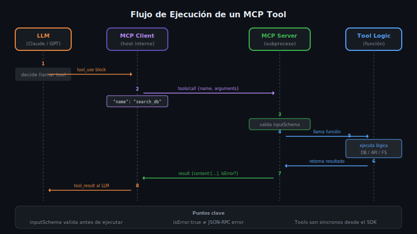

# Tools en MCP: Schema de Inputs, Annotations y Execution Model



## 🎯 Objetivos

- Entender qué es un Tool en MCP y cuándo usarlo
- Conocer el `inputSchema` y cómo valida los argumentos del LLM
- Comprender las `annotations` y su impacto en el comportamiento del cliente
- Implementar un Tool completo en Python y TypeScript con manejo de errores

---

## 📋 Contenido

### 1. ¿Qué es un Tool en MCP?

Un **Tool** es el primitivo que permite al LLM **ejecutar acciones** con side-effects reales:
llamar APIs, consultar bases de datos, crear archivos, enviar emails, correr código.

La diferencia clave con los otros primitivos:
- **Tool** → ejecuta algo, puede cambiar el estado del sistema
- **Resource** → lee datos, no cambia nada
- **Prompt** → genera mensajes para el LLM, no ejecuta nada

Un Tool tiene tres partes obligatorias:

```python
# Python: anatomía de un Tool
{
    "name": "search_products",          # Identificador único, snake_case
    "description": "...",               # Qué hace (el LLM lo lee para decidir)
    "inputSchema": {                    # JSON Schema que valida los argumentos
        "type": "object",
        "properties": { ... },
        "required": [ ... ]
    }
}
```

### 2. El `inputSchema` — JSON Schema

El `inputSchema` es un **JSON Schema** que el servidor MCP usa para validar los
argumentos antes de ejecutar el tool. Si el LLM envía un argumento con tipo incorrecto
o faltante, el servidor puede rechazarlo antes de llegar al código.

#### Ejemplo completo en Python

```python
from mcp.server import Server
from mcp.types import Tool, TextContent, CallToolResult
import mcp.types as types

server = Server("my-tools-server")

@server.list_tools()
async def list_tools() -> list[Tool]:
    return [
        Tool(
            name="search_products",
            description="Busca productos en la base de datos por nombre o categoría",
            inputSchema={
                "type": "object",
                "properties": {
                    "query": {
                        "type": "string",
                        "description": "Texto a buscar en nombre o descripción"
                    },
                    "category": {
                        "type": "string",
                        "enum": ["electronics", "clothing", "food"],
                        "description": "Categoría opcional para filtrar"
                    },
                    "limit": {
                        "type": "integer",
                        "minimum": 1,
                        "maximum": 100,
                        "default": 10
                    }
                },
                "required": ["query"]
            }
        )
    ]

@server.call_tool()
async def call_tool(name: str, arguments: dict) -> list[types.TextContent | types.ImageContent | types.EmbeddedResource]:
    if name == "search_products":
        query = arguments["query"]
        category = arguments.get("category")
        limit = arguments.get("limit", 10)

        # Execute logic — connect to DB, call API, etc.
        results = await search_db(query, category, limit)

        return [TextContent(type="text", text=str(results))]

    raise ValueError(f"Unknown tool: {name}")
```

#### Ejemplo completo en TypeScript

```typescript
import { Server } from "@modelcontextprotocol/sdk/server/index.js";
import { z } from "zod";

const server = new Server({ name: "my-tools-server", version: "1.0.0" });

server.setRequestHandler(ListToolsRequestSchema, async () => ({
    tools: [
        {
            name: "search_products",
            description: "Busca productos en la base de datos",
            inputSchema: {
                type: "object",
                properties: {
                    query: { type: "string", description: "Texto a buscar" },
                    category: {
                        type: "string",
                        enum: ["electronics", "clothing", "food"]
                    },
                    limit: { type: "integer", minimum: 1, maximum: 100, default: 10 }
                },
                required: ["query"]
            }
        }
    ]
}));

server.setRequestHandler(CallToolRequestSchema, async (request) => {
    const { name, arguments: args } = request.params;

    if (name === "search_products") {
        // Validate with Zod for extra safety at runtime
        const schema = z.object({
            query: z.string(),
            category: z.enum(["electronics", "clothing", "food"]).optional(),
            limit: z.number().int().min(1).max(100).default(10)
        });
        const { query, category, limit } = schema.parse(args);

        const results = await searchDb(query, category, limit);
        return { content: [{ type: "text", text: JSON.stringify(results) }] };
    }

    throw new Error(`Unknown tool: ${name}`);
});
```

### 3. Annotations — Metadatos de Comportamiento

Las **annotations** son metadatos opcionales que le indican al cliente MCP
(y al LLM) cómo es el tool en términos de seguridad y comportamiento.
No cambian la lógica, pero sí cómo se muestra o aprueba el tool.

| Annotation | Tipo | Descripción |
|---|---|---|
| `title` | `string` | Nombre legible para el usuario en la UI |
| `readOnlyHint` | `boolean` | `true` = no modifica estado (como Resource) |
| `destructiveHint` | `boolean` | `true` = puede eliminar o dañar datos |
| `idempotentHint` | `boolean` | `true` = llamar N veces = llamar 1 vez |
| `openWorldHint` | `boolean` | `true` = puede interactuar con internet |

```python
from mcp.types import Tool, ToolAnnotations

Tool(
    name="delete_user",
    description="Elimina un usuario permanentemente",
    inputSchema={ "type": "object", "properties": { "user_id": { "type": "string" } }, "required": ["user_id"] },
    annotations=ToolAnnotations(
        title="Eliminar usuario",
        destructiveHint=True,     # ⚠️ Irreversible
        idempotentHint=False,     # Llamar dos veces = error en la segunda
        readOnlyHint=False
    )
)
```

```typescript
{
    name: "delete_user",
    description: "Elimina un usuario permanentemente",
    inputSchema: { type: "object", properties: { user_id: { type: "string" } }, required: ["user_id"] },
    annotations: {
        title: "Eliminar usuario",
        destructiveHint: true,
        idempotentHint: false,
        readOnlyHint: false
    }
}
```

> **Importante**: Las annotations son **hints**, no enforcement. El servidor MCP
> puede ignorarlas. Son para que el cliente MCP pueda mostrar advertencias o
> pedir confirmación al usuario antes de ejecutar el tool.

### 4. El Execution Model — CallToolResult

Cuando el servidor ejecuta un tool, retorna un `CallToolResult` con dos campos clave:

```python
# Retorno exitoso
return [TextContent(type="text", text="Resultado del tool")]

# Retorno con error en la lógica del tool (NO un error JSON-RPC)
return CallToolResult(
    content=[TextContent(type="text", text="Usuario no encontrado")],
    isError=True   # Indica al LLM que el tool falló, pero el servidor sigue funcionando
)
```

#### Diferencia entre `isError` y excepciones

```
isError=True        → El tool se ejecutó pero el resultado fue un error de negocio
                      Ej: usuario no existe, query inválida, cuota excedida
                      El LLM recibe el mensaje y puede retry o reportar al usuario

Excepción/raise    → Error técnico inesperado en el servidor
                      Se convierte en un JSON-RPC error (-32603)
                      El cliente lo interpreta como fallo del servidor
```

### 5. Tipos de contenido en el retorno

Un tool puede retornar múltiples tipos de contenido:

```python
from mcp.types import TextContent, ImageContent, EmbeddedResource

# Texto plano o Markdown
TextContent(type="text", text="# Resultado\n\nResultado de la búsqueda...")

# Imagen (base64)
ImageContent(type="image", data=base64_string, mimeType="image/png")

# Recurso embebido (reference a un resource del mismo server)
EmbeddedResource(type="resource", resource=TextResourceContents(
    uri="db://results/123",
    text="Datos estructurados...",
    mimeType="text/plain"
))
```

---

## 🚨 Errores Comunes

### 1. Usar `raise` cuando debería ser `isError=True`
```python
# ❌ MAL — convierte errores de negocio en errores de servidor
async def call_tool(name: str, args: dict):
    result = await search_db(args["query"])
    if not result:
        raise ValueError("No results found")  # JSON-RPC error

# ✅ BIEN — error de negocio retornado al LLM
async def call_tool(name: str, args: dict):
    result = await search_db(args["query"])
    if not result:
        return CallToolResult(
            content=[TextContent(type="text", text="No se encontraron resultados")],
            isError=True
        )
```

### 2. No validar argumentos opcionales con `.get()`
```python
# ❌ MAL — KeyError si 'category' no viene en args
category = arguments["category"]

# ✅ BIEN — default seguro
category = arguments.get("category", None)
```

### 3. Olvidar el `required` en inputSchema
```json
// ❌ MAL — el LLM puede omitir 'query' y el server crashea
{
  "type": "object",
  "properties": { "query": { "type": "string" } }
}

// ✅ BIEN
{
  "type": "object",
  "properties": { "query": { "type": "string" } },
  "required": ["query"]
}
```

### 4. Usar nombres de tool con espacios o camelCase
```python
# ❌ MAL
Tool(name="Search Products")   # espacios
Tool(name="searchProducts")    # camelCase

# ✅ BIEN
Tool(name="search_products")   # snake_case
```

---

## 📝 Ejercicios de Comprensión

1. ¿Qué `annotation` usarías para un tool que llama a una API externa?
2. ¿Cuándo retornarías `isError=True` en lugar de hacer `raise`?
3. ¿Qué pasa si el `inputSchema` tiene `required: ["query"]` pero el LLM no envía `query`?
4. Diseña el `inputSchema` para un tool `send_email(to, subject, body, cc?)`.

---

## 📚 Recursos Adicionales

- [MCP Specification — Tools](https://spec.modelcontextprotocol.io/specification/server/tools/)
- [JSON Schema Reference](https://json-schema.org/understanding-json-schema/)
- [Python SDK — Server Tools](https://github.com/modelcontextprotocol/python-sdk)

---

## ✅ Checklist de Verificación

- [ ] Mi tool tiene `name`, `description` e `inputSchema`
- [ ] El `inputSchema` declara todos los campos obligatorios en `required`
- [ ] Los argumentos opcionales usan `.get(key, default)` en Python
- [ ] Los errores de negocio retornan `isError=True`, no `raise`
- [ ] Agregué `annotations` relevantes (`destructiveHint`, `readOnlyHint`)
- [ ] El nombre del tool es `snake_case` en inglés

---

## 🔗 Navegación

← [README de teoría](README.md) | Siguiente: [02 — Resources →](02-resources-uri-scheme-tipos-mime-resource.md)
