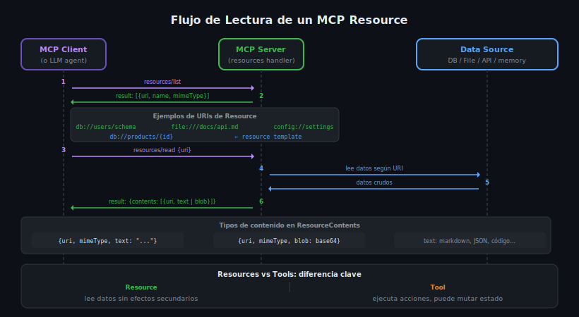

# Resources en MCP: URI Scheme, Tipos MIME y Resource Templates



## 🎯 Objetivos

- Comprender qué es un Resource y en qué se diferencia de un Tool
- Dominar los URI schemes y cómo se usan para identificar recursos
- Entender `TextResourceContents` y `BlobResourceContents`
- Implementar Resource Templates con URI templates (RFC 6570)
- Conocer el mecanismo de subscripción a recursos

---

## 📋 Contenido

### 1. ¿Qué es un Resource en MCP?

Un **Resource** expone datos del servidor que el LLM puede leer como contexto.
A diferencia de un Tool, un Resource **no ejecuta lógica ni produce side-effects**:
solo retorna datos en un formato estructurado.

```
Tool         → El LLM quiere hacer algo    → send_email(), search_db()
Resource     → El LLM necesita leer algo   → schema de BD, documentación, config
Prompt       → El LLM necesita una plantilla de mensaje
```

Un Resource se identifica por una **URI** y expone su contenido como texto o blob.

### 2. URI Schemes — Cómo identificar Resources

Cada Resource tiene una URI única que sigue el formato `scheme://path`. No existe un
estándar obligatorio para el scheme; cada servidor define el suyo.

```
file:///docs/api.md          → Archivo en el sistema de archivos
db://schema/users            → Esquema de la tabla users en la BD
db://products/123            → Fila con id=123 en products
config://app/settings        → Configuración de la aplicación
http://api.example.com/docs  → Documentación de una API externa
memory://session/context     → Contexto en memoria de la sesión actual
```

#### Reglas para diseñar buenos URI schemes

- Usar nombres descriptivos y consistentes
- El scheme debe reflejar la fuente de datos (`db://`, `file://`, `config://`)
- El path debe ser jerárquico y predecible (`db://tabla/id`)
- Evitar URIs que dependan de estado mutable

### 3. Implementación en Python

```python
from mcp.server import Server
from mcp.types import Resource, TextResourceContents, BlobResourceContents, ReadResourceResult
import mcp.types as types

server = Server("my-resources-server")

@server.list_resources()
async def list_resources() -> list[Resource]:
    return [
        Resource(
            uri="db://schema/products",
            name="Esquema de productos",
            description="Definición de columnas y tipos de la tabla products",
            mimeType="application/json"
        ),
        Resource(
            uri="file:///docs/README.md",
            name="Documentación del proyecto",
            description="Guía de uso de la API",
            mimeType="text/markdown"
        ),
        Resource(
            uri="config://app/settings",
            name="Configuración de la aplicación",
            mimeType="application/json"
        )
    ]

@server.read_resource()
async def read_resource(uri: str) -> ReadResourceResult:
    if uri == "db://schema/products":
        schema = {
            "columns": [
                {"name": "id", "type": "INTEGER", "primary_key": True},
                {"name": "name", "type": "TEXT", "not_null": True},
                {"name": "price", "type": "REAL"},
                {"name": "category", "type": "TEXT"}
            ]
        }
        return ReadResourceResult(
            contents=[
                TextResourceContents(
                    uri=uri,
                    text=json.dumps(schema, indent=2),
                    mimeType="application/json"
                )
            ]
        )

    if uri == "file:///docs/README.md":
        content = Path("/docs/README.md").read_text(encoding="utf-8")
        return ReadResourceResult(
            contents=[
                TextResourceContents(uri=uri, text=content, mimeType="text/markdown")
            ]
        )

    raise ValueError(f"Resource not found: {uri}")
```

### 4. Implementación en TypeScript

```typescript
import { Server } from "@modelcontextprotocol/sdk/server/index.js";
import {
    ListResourcesRequestSchema,
    ReadResourceRequestSchema
} from "@modelcontextprotocol/sdk/types.js";
import { readFileSync } from "fs";

const server = new Server({ name: "my-resources-server", version: "1.0.0" });

server.setRequestHandler(ListResourcesRequestSchema, async () => ({
    resources: [
        {
            uri: "db://schema/products",
            name: "Esquema de productos",
            description: "Columnas y tipos de la tabla products",
            mimeType: "application/json"
        },
        {
            uri: "file:///docs/README.md",
            name: "Documentación del proyecto",
            mimeType: "text/markdown"
        }
    ]
}));

server.setRequestHandler(ReadResourceRequestSchema, async (request) => {
    const { uri } = request.params;

    if (uri === "db://schema/products") {
        const schema = { columns: [{ name: "id", type: "INTEGER" }] };
        return {
            contents: [{
                uri,
                text: JSON.stringify(schema, null, 2),
                mimeType: "application/json"
            }]
        };
    }

    if (uri === "file:///docs/README.md") {
        const text = readFileSync("/docs/README.md", "utf-8");
        return { contents: [{ uri, text, mimeType: "text/markdown" }] };
    }

    throw new Error(`Resource not found: ${uri}`);
});
```

### 5. TextResourceContents vs BlobResourceContents

Existen dos tipos de contenido para un Resource:

| Tipo | Campo | Cuándo usar |
|---|---|---|
| `TextResourceContents` | `text: str` | Texto plano, Markdown, JSON, XML, código |
| `BlobResourceContents` | `blob: str` (base64) | Imágenes, PDFs, archivos binarios |

```python
# Text resource — para datos legibles
TextResourceContents(
    uri="db://schema/users",
    text='{"columns": [{"name": "id", "type": "INTEGER"}]}',
    mimeType="application/json"
)

# Blob resource — para binarios (imagen base64)
import base64
BlobResourceContents(
    uri="file:///logo.png",
    blob=base64.b64encode(image_bytes).decode("utf-8"),
    mimeType="image/png"
)
```

### 6. Resource Templates — URIs Dinámicas

Un **Resource Template** permite exponer recursos cuya URI varía según parámetros,
usando la sintaxis de URI templates (RFC 6570): `{variable}`.

```python
from mcp.types import ResourceTemplate

@server.list_resource_templates()
async def list_resource_templates() -> list[ResourceTemplate]:
    return [
        ResourceTemplate(
            uriTemplate="db://products/{product_id}",
            name="Producto por ID",
            description="Retorna los datos de un producto específico",
            mimeType="application/json"
        ),
        ResourceTemplate(
            uriTemplate="file:///docs/{filename}",
            name="Archivo de documentación",
            mimeType="text/markdown"
        )
    ]

@server.read_resource()
async def read_resource(uri: str) -> ReadResourceResult:
    # Parsear URI template manualmente o con urllib
    if uri.startswith("db://products/"):
        product_id = uri.removeprefix("db://products/")
        product = await get_product(int(product_id))
        return ReadResourceResult(
            contents=[TextResourceContents(
                uri=uri,
                text=json.dumps(product),
                mimeType="application/json"
            )]
        )
```

### 7. MIME Types más comunes en Resources

```
text/plain           → Texto sin formato
text/markdown        → Markdown (documentación, instrucciones)
application/json     → JSON (schemas, datos estructurados, configs)
text/html            → HTML
text/csv             → Datos tabulares
application/pdf      → PDFs (como blob, base64)
image/png            → Imágenes PNG (como blob)
image/jpeg           → Imágenes JPEG (como blob)
application/xml      → XML
```

---

## 🚨 Errores Comunes

### 1. Confundir Resource con Tool para operaciones de lectura costosa
```python
# ❌ MAL — usar Tool para solo leer datos
Tool(name="get_user_schema", ...)   # No tiene side-effects, debería ser Resource

# ✅ BIEN — Resource para datos de solo lectura
Resource(uri="db://schema/users", ...)
```

### 2. URI sin scheme definido
```python
# ❌ MAL — URI no estándar, confusa
Resource(uri="users/schema")

# ✅ BIEN — URI clara con scheme
Resource(uri="db://schema/users")
```

### 3. No manejar URIs desconocidas
```python
# ❌ MAL — retorna None silenciosamente
async def read_resource(uri: str):
    if uri == "db://schema/users":
        return ...
    # Cae aquí sin retorno

# ✅ BIEN — raise claro
async def read_resource(uri: str):
    if uri == "db://schema/users":
        return ...
    raise ValueError(f"Resource not found: {uri}")
```

### 4. Olvidar el mimeType
```python
# ❌ MAL — sin mimeType, el cliente no sabe cómo renderizar
Resource(uri="db://schema/products", name="Esquema")

# ✅ BIEN
Resource(uri="db://schema/products", name="Esquema", mimeType="application/json")
```

---

## 📝 Ejercicios de Comprensión

1. ¿Cuándo usarías `BlobResourceContents` en lugar de `TextResourceContents`?
2. Diseña los URIs de Resources para un servidor de gestión de tickets de soporte.
3. ¿Qué es un Resource Template y para qué sirve? Da un ejemplo real.
4. ¿Por qué un Resource no debería tener side-effects?

---

## 📚 Recursos Adicionales

- [MCP Specification — Resources](https://spec.modelcontextprotocol.io/specification/server/resources/)
- [RFC 6570 — URI Templates](https://www.rfc-editor.org/rfc/rfc6570)
- [IANA MIME Types](https://www.iana.org/assignments/media-types/)

---

## ✅ Checklist de Verificación

- [ ] Cada Resource tiene `uri`, `name` y `mimeType`
- [ ] El URI scheme es descriptivo y consistente (`db://`, `file://`, etc.)
- [ ] Los datos de solo lectura usan Resource, no Tool
- [ ] Los datos dinámicos con parámetros usan `ResourceTemplate`
- [ ] Se retorna `ValueError` para URIs no reconocidas
- [ ] Los binarios usan `BlobResourceContents` con base64

---

## 🔗 Navegación

← [01 — Tools](01-tools-schema-de-inputs-annotations-execu.md) | [README de teoría](README.md) | Siguiente: [03 — Prompts →](03-prompts-argumentos-mensajes-y-role-based.md)
