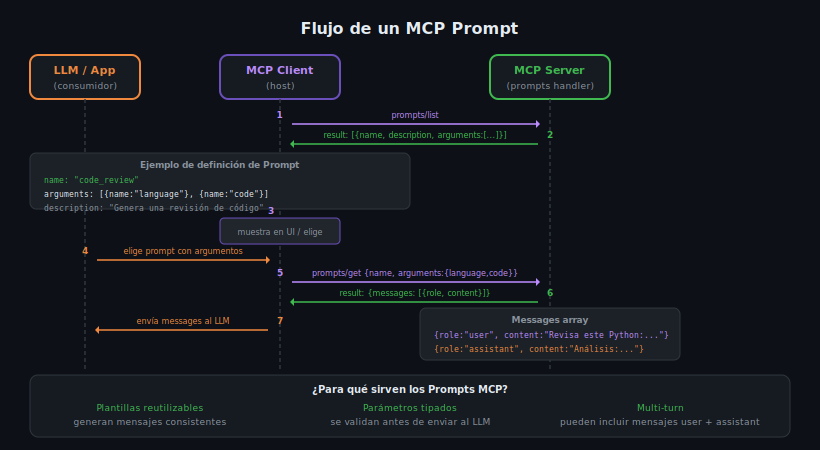

# Prompts en MCP: Argumentos, Mensajes y Role-Based Content



## 🎯 Objetivos

- Entender qué es un Prompt en MCP y por qué es diferente a un Tool o Resource
- Conocer `PromptArgument` y la diferencia entre argumentos required y optional
- Implementar el `messages` array con roles `user` y `assistant`
- Usar `TextContent`, `ImageContent` y `EmbeddedResource` dentro de mensajes
- Generar prompts dinámicos que se adaptan a los argumentos recibidos

---

## 📋 Contenido

### 1. ¿Qué es un Prompt en MCP?

Un **Prompt** es una plantilla reutilizable que genera un array de mensajes para
enviar al LLM. A diferencia de Tools y Resources, un Prompt:
- **No ejecuta código** (no tiene side-effects)
- **No lee datos** (no accede a fuentes externas directamente)
- **Genera mensajes** estructurados con roles `user` / `assistant`

```
Prompt.get("code_review", {language: "Python", code: "..."})
→ messages: [
    {role: "user",      content: "Revisa este código Python:\n..."},
    {role: "assistant", content: "Claro, analizaré el código:"}
  ]
→ estos mensajes se envían al LLM para continuar la conversación
```

### 2. Estructura de un Prompt

```python
from mcp.types import Prompt, PromptArgument

Prompt(
    name="code_review",                          # snake_case, inglés
    description="Genera una revisión de código detallada",
    arguments=[
        PromptArgument(
            name="language",
            description="Lenguaje de programación (python, typescript, go...)",
            required=True
        ),
        PromptArgument(
            name="code",
            description="El código a revisar",
            required=True
        ),
        PromptArgument(
            name="focus",
            description="Aspecto a enfatizar: security, performance, style",
            required=False   # Opcional — el cliente puede omitirlo
        )
    ]
)
```

### 3. Implementación en Python

```python
from mcp.server import Server
from mcp.types import (
    Prompt, PromptArgument, GetPromptResult,
    PromptMessage, TextContent
)

server = Server("my-prompts-server")

@server.list_prompts()
async def list_prompts() -> list[Prompt]:
    return [
        Prompt(
            name="code_review",
            description="Genera una revisión detallada de código",
            arguments=[
                PromptArgument(name="language", description="Lenguaje", required=True),
                PromptArgument(name="code", description="Código a revisar", required=True),
                PromptArgument(name="focus", description="Aspecto a enfatizar", required=False)
            ]
        ),
        Prompt(
            name="explain_error",
            description="Explica un error y sugiere soluciones",
            arguments=[
                PromptArgument(name="error_message", description="Mensaje de error completo", required=True),
                PromptArgument(name="context", description="Contexto del código", required=False)
            ]
        )
    ]

@server.get_prompt()
async def get_prompt(name: str, arguments: dict | None) -> GetPromptResult:
    args = arguments or {}

    if name == "code_review":
        language = args.get("language", "unknown")
        code = args.get("code", "")
        focus = args.get("focus", "general quality")

        return GetPromptResult(
            description=f"Code review for {language}",
            messages=[
                PromptMessage(
                    role="user",
                    content=TextContent(
                        type="text",
                        text=f"""Review the following {language} code with focus on {focus}:

```{language}
{code}
```

Please analyze:
1. Correctness and logic errors
2. Edge cases not handled
3. Performance considerations
4. Best practices and style
5. Security issues (if applicable)"""
                    )
                )
            ]
        )

    if name == "explain_error":
        error_message = args.get("error_message", "")
        context = args.get("context", "")

        messages = [
            PromptMessage(
                role="user",
                content=TextContent(
                    type="text",
                    text=f"I got this error:\n\n```\n{error_message}\n```"
                )
            )
        ]

        # Agregar contexto adicional como segundo mensaje si viene
        if context:
            messages.append(PromptMessage(
                role="user",
                content=TextContent(
                    type="text",
                    text=f"Context:\n\n{context}"
                )
            ))

        # Seed para orientar la respuesta del LLM
        messages.append(PromptMessage(
            role="assistant",
            content=TextContent(
                type="text",
                text="I'll analyze this error step by step:"
            )
        ))

        return GetPromptResult(
            description="Error explanation",
            messages=messages
        )

    raise ValueError(f"Unknown prompt: {name}")
```

### 4. Implementación en TypeScript

```typescript
import { Server } from "@modelcontextprotocol/sdk/server/index.js";
import {
    ListPromptsRequestSchema,
    GetPromptRequestSchema
} from "@modelcontextprotocol/sdk/types.js";

const server = new Server({ name: "my-prompts-server", version: "1.0.0" });

server.setRequestHandler(ListPromptsRequestSchema, async () => ({
    prompts: [
        {
            name: "code_review",
            description: "Genera una revisión detallada de código",
            arguments: [
                { name: "language", description: "Lenguaje", required: true },
                { name: "code", description: "Código a revisar", required: true },
                { name: "focus", description: "Aspecto a enfatizar", required: false }
            ]
        }
    ]
}));

server.setRequestHandler(GetPromptRequestSchema, async (request) => {
    const { name, arguments: args } = request.params;

    if (name === "code_review") {
        const language = args?.language ?? "unknown";
        const code = args?.code ?? "";
        const focus = args?.focus ?? "general quality";

        return {
            description: `Code review for ${language}`,
            messages: [
                {
                    role: "user",
                    content: {
                        type: "text",
                        text: `Review the following ${language} code with focus on ${focus}:\n\n\`\`\`${language}\n${code}\n\`\`\``
                    }
                }
            ]
        };
    }

    throw new Error(`Unknown prompt: ${name}`);
});
```

### 5. El `messages` array — Tipos de contenido

Cada mensaje en el array tiene un `role` y un `content`. El content puede ser:

#### TextContent — Texto plano o Markdown
```python
PromptMessage(
    role="user",
    content=TextContent(type="text", text="Analiza este código...")
)
```

#### ImageContent — Imagen codificada en base64
```python
import base64
PromptMessage(
    role="user",
    content=ImageContent(
        type="image",
        data=base64.b64encode(image_bytes).decode(),
        mimeType="image/png"
    )
)
```

#### EmbeddedResource — Resource del mismo servidor
```python
from mcp.types import EmbeddedResource, TextResourceContents

PromptMessage(
    role="user",
    content=EmbeddedResource(
        type="resource",
        resource=TextResourceContents(
            uri="db://schema/products",
            text='{"columns": [...]}',
            mimeType="application/json"
        )
    )
)
```

> Usar `EmbeddedResource` es una forma elegante de incluir datos de un Resource
> directamente en un Prompt, sin que el cliente tenga que hacer dos requests.

### 6. Roles en los Mensajes

| Role | Significado | Cuándo usar |
|---|---|---|
| `"user"` | Mensaje del usuario / instrucción | Preguntas, instrucciones, código a analizar |
| `"assistant"` | Respuesta parcial del LLM (seed) | Para orientar el estilo o inicio de la respuesta |

```python
# Ejemplo de multi-turn prompt con role seed
messages=[
    PromptMessage(role="user",      content=TextContent(type="text", text="¿Qué es REST?")),
    PromptMessage(role="assistant", content=TextContent(type="text", text="REST (Representational State Transfer) es...")),
    PromptMessage(role="user",      content=TextContent(type="text", text="¿Y GRPC?")),
]
```

---

## 🚨 Errores Comunes

### 1. Usar Tool para generar prompts
```python
# ❌ MAL — generar texto de prompt con un Tool no es semánticamente correcto
Tool(name="generate_code_review_prompt", ...)

# ✅ BIEN — usar Prompt para plantillas de mensajes
Prompt(name="code_review", ...)
```

### 2. Acceder a argumentos opcionales sin `.get()`
```python
# ❌ MAL — KeyError si 'focus' no viene
focus = args["focus"]

# ✅ BIEN
focus = args.get("focus", "general quality")
```

### 3. Ignorar el caso `arguments=None`
```python
# ❌ MAL
async def get_prompt(name: str, arguments: dict):
    query = arguments["query"]  # TypeError si arguments=None

# ✅ BIEN
async def get_prompt(name: str, arguments: dict | None):
    args = arguments or {}
    query = args.get("query", "")
```

### 4. Prompt sin argumentos cuando los necesita
```python
# ❌ MAL — sin argumentos, el prompt es siempre igual (debería ser Resource)
Prompt(name="static_intro", arguments=[])

# ✅ BIEN — si el prompt siempre es el mismo, es mejor un Resource
Resource(uri="prompts://static_intro", ...)
```

---

## 📝 Ejercicios de Comprensión

1. ¿Cuál es la diferencia entre un `Prompt` con `role="assistant"` seed y un Tool?
2. ¿Cuándo usarías `EmbeddedResource` dentro de un mensaje de Prompt?
3. Diseña los argumentos para un Prompt `translate(text, source_lang, target_lang, formality?)`.
4. ¿Por qué `arguments=None` es un caso válido en `get_prompt`?

---

## 📚 Recursos Adicionales

- [MCP Specification — Prompts](https://spec.modelcontextprotocol.io/specification/server/prompts/)
- [MCP Python SDK — Prompts example](https://github.com/modelcontextprotocol/python-sdk/tree/main/examples)

---

## ✅ Checklist de Verificación

- [ ] Cada Prompt tiene `name`, `description` y `arguments`
- [ ] Los argumentos required están marcados con `required=True`
- [ ] `get_prompt` maneja `arguments=None` con `args = arguments or {}`
- [ ] Los argumentos opcionales usan `.get(key, default)`
- [ ] Los mensajes tienen role `"user"` o `"assistant"` (no otros valores)
- [ ] Si el prompt es siempre igual, mejor convertirlo a Resource

---

## 🔗 Navegación

← [02 — Resources](02-resources-uri-scheme-tipos-mime-resource.md) | [README de teoría](README.md) | Siguiente: [04 — Cuándo usar cada primitivo →](04-cuando-usar-tool-vs-resource-vs-prompt.md)
