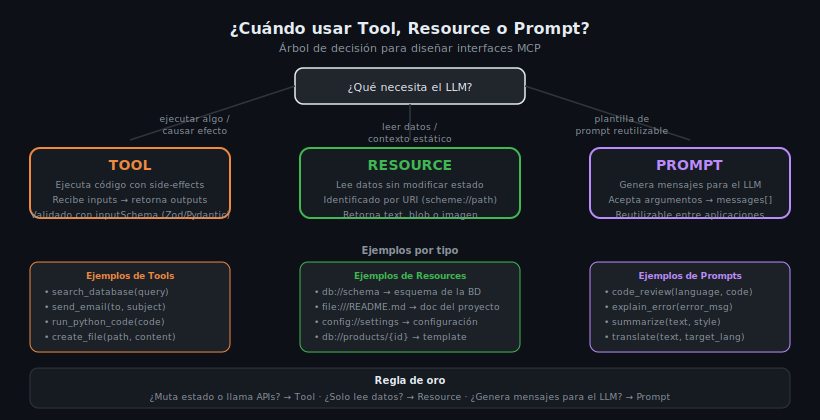

# Cuándo usar Tool vs Resource vs Prompt



## 🎯 Objetivos

- Tomar decisiones de diseño fundamentadas al elegir el primitivo correcto
- Reconocer antipatrones comunes en el uso de Tools, Resources y Prompts
- Aplicar la "regla de oro" de los side-effects
- Diseñar servidores MCP coherentes con los principios del protocolo

---

## 📋 Contenido

### 1. La Regla de Oro: Side-Effects

La decisión más importante al elegir entre los tres primitivos es:

> **¿La operación cambia el estado del sistema?**

```
¿Muta estado, llama APIs externas, envía mensajes, crea/edita/elimina datos?
    → TOOL

¿Solo lee datos sin producir ningún cambio?
    → RESOURCE

¿Genera mensajes estructurados para guiar al LLM?
    → PROMPT
```

Esta regla no es estética: tiene implicaciones en cómo el cliente MCP muestra
confirmaciones de seguridad, cachea resultados y presenta opciones al usuario.

### 2. El Árbol de Decisión Completo

```
Pregunta 1: ¿Qué necesita el LLM?
│
├── Ejecutar algo / causar un efecto
│   ├── ¿Modifica datos? → Tool (destructiveHint=True si irreversible)
│   ├── ¿Llama API externa? → Tool (openWorldHint=True)
│   ├── ¿Idéntico resultado si se llama N veces? → Tool (idempotentHint=True)
│   └── ¿Solo lectura pero costosa (cómputo)? → Tool (readOnlyHint=True)
│
├── Leer datos / obtener contexto
│   ├── ¿Es una entidad específica con ID? → Resource con URI template
│   ├── ¿Es un listado fijo (schema, config, docs)? → Resource estático
│   ├── ¿Cambia con el tiempo pero no por acciones del LLM? → Resource
│   └── ¿El LLM nunca debería modificar esto? → Resource
│
└── Generar mensajes para el LLM
    ├── ¿La instrucción varía según parámetros? → Prompt con arguments
    ├── ¿La instrucción es siempre igual? → Resource (no Prompt)
    └── ¿Necesita incluir datos del servidor? → Prompt con EmbeddedResource
```

### 3. Tabla de decisión rápida

| Criterio | Tool | Resource | Prompt |
|---|---|---|---|
| ¿Ejecuta código? | ✅ Sí | ❌ No | ❌ No |
| ¿Tiene side-effects? | ✅ Sí | ❌ No | ❌ No |
| ¿Retorna contexto al LLM? | ✅ (output) | ✅ (texto/blob) | ✅ (messages) |
| ¿Iniciado por LLM? | ✅ LLM decide | ✅ LLM/App solicita | ✅ App elige |
| ¿Cacheable? | ⚠️ Raro | ✅ Sí | ✅ Sí |
| ¿Validación de inputs? | ✅ inputSchema | ❌ solo URI | ✅ PromptArgument |

### 4. Ejemplos Reales — Tools

Un Tool es correcto cuando la operación **produce un efecto observable**:

```python
# ✅ Tool — crea archivo (side-effect irreversible)
Tool(name="create_file", annotations=ToolAnnotations(destructiveHint=True))

# ✅ Tool — envía email (side-effect externo)
Tool(name="send_email", annotations=ToolAnnotations(openWorldHint=True))

# ✅ Tool — busca en BD (lectura costosa con lógica)
Tool(name="search_products")

# ✅ Tool — ejecuta Python (puede hacer cualquier cosa)
Tool(name="run_code", annotations=ToolAnnotations(destructiveHint=True, openWorldHint=True))

# ✅ Tool — llama webhook (side-effect externo)
Tool(name="trigger_webhook", annotations=ToolAnnotations(openWorldHint=True))

# ✅ Tool — crea usuario en BD (escribe datos)
Tool(name="create_user", annotations=ToolAnnotations(destructiveHint=False))

# ✅ Tool — elimina registro (irreversible)
Tool(name="delete_record", annotations=ToolAnnotations(destructiveHint=True))
```

### 5. Ejemplos Reales — Resources

Un Resource es correcto cuando el LLM necesita **leer datos sin cambiar nada**:

```python
# ✅ Resource — esquema de BD (no cambia, es referencia)
Resource(uri="db://schema/products", mimeType="application/json")

# ✅ Resource — documentación del proyecto (lectura)
Resource(uri="file:///docs/api.md", mimeType="text/markdown")

# ✅ Resource — configuración de la aplicación (lectura)
Resource(uri="config://app/settings", mimeType="application/json")

# ✅ Resource — datos de un producto por ID (template)
ResourceTemplate(uriTemplate="db://products/{product_id}")

# ✅ Resource — lista de categorías (datos estáticos)
Resource(uri="db://categories/all", mimeType="application/json")

# ✅ Resource — logs del sistema (solo lectura)
ResourceTemplate(uriTemplate="logs://app/{date}")
```

### 6. Ejemplos Reales — Prompts

Un Prompt es correcto cuando se necesita **una plantilla de mensajes reutilizable**:

```python
# ✅ Prompt — revisión de código parametrizada
Prompt(name="code_review", arguments=[...])

# ✅ Prompt — explicación de error con contexto
Prompt(name="explain_error", arguments=[PromptArgument(name="error", required=True)])

# ✅ Prompt — traducción con idioma destino variable
Prompt(name="translate", arguments=[PromptArgument(name="target_lang", required=True)])

# ✅ Prompt — resumen con estilo configurable
Prompt(name="summarize", arguments=[PromptArgument(name="style", required=False)])

# ✅ Prompt — generación de tests dado código fuente
Prompt(name="generate_tests", arguments=[PromptArgument(name="code", required=True)])
```

### 7. Antipatrones — Cómo NO usar los primitivos

#### Antipatrón 1: Tool para operaciones de lectura pura
```python
# ❌ MAL — Tool para solo leer el esquema de la BD
Tool(name="get_db_schema")
# El LLM tratará esto como una acción con posible side-effect

# ✅ BIEN — Resource para datos de solo lectura
Resource(uri="db://schema/all", mimeType="application/json")
```

#### Antipatrón 2: Resource para operaciones que cambian estado
```python
# ❌ IMPOSIBLE / MAL por diseño — un Resource no puede tener side-effects
Resource(uri="db://users/create")  # No tiene sentido semántico

# ✅ BIEN — Tool para operaciones que crean/modifican
Tool(name="create_user")
```

#### Antipatrón 3: Prompt estático sin argumentos
```python
# ❌ MAL — Prompt que siempre retorna el mismo mensaje es un Resource
Prompt(name="welcome_message", arguments=[])

# ✅ BIEN — Resource para mensajes estáticos
Resource(uri="prompts://welcome", mimeType="text/markdown")
```

#### Antipatrón 4: Tool para generar texto de prompt
```python
# ❌ MAL — Tool para generar el texto de una instrucción para el LLM
Tool(name="generate_review_instruction")

# ✅ BIEN — Prompt para plantillas de mensajes
Prompt(name="code_review", arguments=[...])
```

#### Antipatrón 5: Mezclar Tool con Resource en el mismo nombre
```python
# ❌ MAL — nombre ambiguo
Tool(name="get_and_update_user")  # ¿Lee? ¿Escribe? ¿Ambos?

# ✅ BIEN — separar responsabilidades
Resource(uri="db://users/{id}")           # Solo lectura
Tool(name="update_user")                  # Solo escritura
```

### 8. El caso especial: Tool con `readOnlyHint=True`

Hay un caso donde un Tool tiene `readOnlyHint=True`: cuando la operación requiere
lógica compleja de cómputo pero no modifica estado. Ejemplo: una búsqueda semántica
con embeddings que no escribe en la BD.

```python
Tool(
    name="semantic_search",
    description="Búsqueda semántica con embeddings (solo lectura)",
    annotations=ToolAnnotations(readOnlyHint=True)
)
```

> Usar Tool (en lugar de Resource) aquí porque la lógica requiere argumentos complejos
> validados por `inputSchema`, no una simple URI.

---

## 🚨 Errores Comunes

### 1. Elegir por "conveniencia" en lugar de semántica
```
❌ "Uso Tool para todo porque es más fácil implementar"
✅ Elegir según la semántica de la operación
```

### 2. No declarar `destructiveHint=True` en Tools irreversibles
```python
# ❌ MAL — el cliente no puede mostrar advertencia
Tool(name="delete_all_records")

# ✅ BIEN
Tool(name="delete_all_records", annotations=ToolAnnotations(destructiveHint=True))
```

### 3. Resource templates sin documentar el parámetro
```python
# ❌ MAL — sin descripción del parámetro {id}
ResourceTemplate(uriTemplate="db://users/{id}")

# ✅ BIEN
ResourceTemplate(
    uriTemplate="db://users/{user_id}",
    description="Retorna los datos del usuario con el ID especificado"
)
```

---

## 📝 Ejercicios de Comprensión

Para cada operación, elige el primitivo correcto y justifica:

1. "Obtener los mensajes de un canal de Slack" → ¿Tool, Resource o Prompt?
2. "Enviar un mensaje a Slack" → ¿Tool, Resource o Prompt?
3. "Generar un mensaje de commit convencional dado un diff" → ¿Tool, Resource o Prompt?
4. "Obtener la versión actual de la aplicación" → ¿Tool, Resource o Prompt?
5. "Calcular el impuesto de una factura" → ¿Tool, Resource o Prompt?
6. "Obtener la plantilla de un email de bienvenida con nombre del usuario" → ¿Tool, Resource o Prompt?

---

## 📚 Recursos Adicionales

- [MCP Specification — Architecture](https://spec.modelcontextprotocol.io/specification/)
- [When to use which primitive (MCP Docs)](https://modelcontextprotocol.io/docs/concepts/tools)

---

## ✅ Checklist de Verificación

- [ ] Clasifiqué correctamente las operaciones (side-effects → Tool)
- [ ] Las operaciones de lectura pura usan Resource, no Tool
- [ ] Las plantillas de mensajes usan Prompt, no Tool ni Resource
- [ ] Declaré `destructiveHint=True` en Tools que eliminan o modifican irreversiblemente
- [ ] Los Prompts estáticos son Resources, no Prompts
- [ ] Los nombres de Tools y Resources reflejan su semántica

---

## 🔗 Navegación

← [03 — Prompts](03-prompts-argumentos-mensajes-y-role-based.md) | [README de teoría](README.md) | Siguiente: [05 — Diseño de interfaces →](05-diseno-de-interfaces-mcp-buenas-practica.md)
