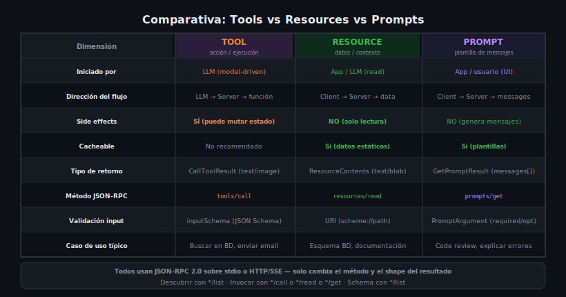

# Diseño de Interfaces MCP: Buenas Prácticas



## 🎯 Objetivos

- Aplicar convenciones de nomenclatura profesionales para Tools, Resources y Prompts
- Diseñar `inputSchema` robustos con tipos, descripciones y restricciones
- Manejar errores de forma consistente en los tres primitivos
- Declarar correctamente las capacidades del servidor en `ServerCapabilities`
- Seguir principios de idempotencia, mínimo privilegio y separación de responsabilidades

---

## 📋 Contenido

### 1. Convenciones de Nomenclatura

#### Tools
```python
# ✅ BIEN — snake_case, verbo + sustantivo, inglés
Tool(name="search_products")
Tool(name="send_email")
Tool(name="create_user")
Tool(name="delete_record")
Tool(name="fetch_weather")

# ❌ MAL — espacios, camelCase, español, nombres ambiguos
Tool(name="Search Products")    # espacios
Tool(name="searchProducts")     # camelCase
Tool(name="buscar")             # español
Tool(name="process")            # demasiado genérico
Tool(name="do_stuff")           # sin semántica
```

#### Resources
```python
# ✅ BIEN — scheme://path jerárquico, sustantivo
Resource(uri="db://schema/products")
Resource(uri="db://categories/all")
Resource(uri="file:///docs/api.md")
Resource(uri="config://app/settings")

# ❌ MAL — sin scheme, rutas inconsistentes
Resource(uri="products/schema")     # sin scheme
Resource(uri="getSchema")           # nombre de función, no URI
Resource(uri="DB_SCHEMA")           # UPPER_CASE
```

#### Prompts
```python
# ✅ BIEN — snake_case, verbo + sustantivo, inglés
Prompt(name="code_review")
Prompt(name="explain_error")
Prompt(name="summarize_text")
Prompt(name="generate_tests")
Prompt(name="translate_content")

# ❌ MAL
Prompt(name="Prompt1")          # sin semántica
Prompt(name="myPrompt")         # camelCase
Prompt(name="do-review")        # kebab-case
```

### 2. Diseño de `inputSchema` Robusto

Un buen `inputSchema` valida el input antes de llegar al código. Siempre incluir:
- `type` en cada propiedad
- `description` legible por humanos (y por el LLM)
- `required` con todos los campos obligatorios
- Restricciones adicionales: `minLength`, `maxLength`, `minimum`, `maximum`, `enum`, `pattern`

```python
Tool(
    name="create_document",
    description="Crea un documento en la base de datos",
    inputSchema={
        "type": "object",
        "properties": {
            "title": {
                "type": "string",
                "description": "Título del documento (1-200 caracteres)",
                "minLength": 1,
                "maxLength": 200
            },
            "content": {
                "type": "string",
                "description": "Contenido en Markdown",
                "minLength": 1
            },
            "category": {
                "type": "string",
                "description": "Categoría del documento",
                "enum": ["tutorial", "reference", "guide", "changelog"],
                "default": "guide"
            },
            "tags": {
                "type": "array",
                "items": { "type": "string", "maxLength": 50 },
                "maxItems": 10,
                "description": "Etiquetas opcionales para el documento"
            }
        },
        "required": ["title", "content"],
        "additionalProperties": False
    }
)
```

> `"additionalProperties": False` previene que el LLM envíe campos no declarados,
> reduciendo superficie de ataque y comportamientos inesperados.

### 3. Manejo de Errores Consistente

#### Tools — Error de negocio vs error técnico

```python
from mcp.types import CallToolResult, TextContent

@server.call_tool()
async def call_tool(name: str, arguments: dict) -> list:
    if name == "delete_user":
        user_id = arguments.get("user_id")
        if not user_id:
            # Error de validación — isError=True
            return CallToolResult(
                content=[TextContent(type="text", text="Error: user_id is required")],
                isError=True
            )

        try:
            result = await db.delete_user(user_id)
            if not result:
                # Error de negocio — usuario no existe
                return CallToolResult(
                    content=[TextContent(type="text", text=f"User {user_id} not found")],
                    isError=True
                )
            return [TextContent(type="text", text=f"User {user_id} deleted successfully")]

        except DatabaseError as e:
            # Error técnico esperado — todavía isError=True
            return CallToolResult(
                content=[TextContent(type="text", text=f"Database error: {str(e)}")],
                isError=True
            )
        # Los errores INESPERADOS pueden usar raise → JSON-RPC error
```

#### Resources — Error de URI no encontrada

```python
@server.read_resource()
async def read_resource(uri: str) -> ReadResourceResult:
    KNOWN_RESOURCES = {
        "db://schema/products": fetch_products_schema,
        "db://schema/users": fetch_users_schema,
    }

    handler = KNOWN_RESOURCES.get(uri)
    if not handler:
        raise ValueError(f"Resource not found: {uri}")

    data = await handler()
    return ReadResourceResult(
        contents=[TextResourceContents(uri=uri, text=data, mimeType="application/json")]
    )
```

#### Prompts — Argumentos faltantes

```python
@server.get_prompt()
async def get_prompt(name: str, arguments: dict | None) -> GetPromptResult:
    args = arguments or {}

    if name == "code_review":
        # Validar argumentos required explícitamente
        if "code" not in args or not args["code"].strip():
            raise ValueError("Argument 'code' is required and cannot be empty")
        if "language" not in args:
            raise ValueError("Argument 'language' is required")
        # ...
```

### 4. Declarar Capacidades del Servidor

El servidor debe declarar explícitamente qué primitivos expone en `ServerCapabilities`:

```python
from mcp.server import Server
from mcp.types import ServerCapabilities, ToolsCapability, ResourcesCapability, PromptsCapability

# Python SDK — las capabilities se declaran al crear el servidor
server = Server(
    "my-full-server",
    capabilities=ServerCapabilities(
        tools=ToolsCapability(listChanged=True),          # Soporta tools
        resources=ResourcesCapability(
            subscribe=False,       # No soporta subscripciones
            listChanged=True       # Notifica cuando cambia la lista
        ),
        prompts=PromptsCapability(listChanged=False)       # Prompts estáticos
    )
)
```

```typescript
// TypeScript SDK
const server = new Server(
    { name: "my-full-server", version: "1.0.0" },
    {
        capabilities: {
            tools: { listChanged: true },
            resources: { subscribe: false, listChanged: true },
            prompts: { listChanged: false }
        }
    }
);
```

> Si el servidor no declara una capability, el cliente no debería llamar a esos handlers.
> Es una forma de "contract" entre servidor y cliente.

### 5. Principio de Mínimo Privilegio en Tools

Cada Tool debe hacer **una sola cosa** y solo acceder a los recursos que necesita:

```python
# ❌ MAL — Tool con demasiadas responsabilidades
@server.call_tool()
async def call_tool(name: str, arguments: dict):
    if name == "manage_user":
        action = arguments.get("action")
        if action == "create":   ...
        if action == "update":   ...
        if action == "delete":   ...
        if action == "fetch":    ...

# ✅ BIEN — Tools específicos
Tool(name="create_user")
Tool(name="update_user")
Tool(name="delete_user", annotations=ToolAnnotations(destructiveHint=True))
# fetch_user → mejor como Resource: Resource(uri="db://users/{id}")
```

### 6. Idempotencia en Tools

Un Tool es **idempotente** si llamarlo N veces con los mismos argumentos tiene el
mismo efecto que llamarlo 1 vez. Declararlo con `idempotentHint=True`:

```python
Tool(
    name="set_config_value",
    description="Establece un valor de configuración. Idempotente: llamar dos veces con los mismos valores no causa efectos duplicados.",
    annotations=ToolAnnotations(idempotentHint=True)
)

# Ejemplo NO idempotente (no declarar idempotentHint):
Tool(name="append_log_entry")   # Cada llamada agrega una línea diferente
Tool(name="send_email")         # Dos llamadas = dos emails enviados
```

### 7. Descripciones — El LLM las lee

Las `description` de Tools, Resources y Prompts son leídas por el LLM para decidir
cuál usar. Una buena descripción:

```python
# ❌ MAL — ambigua, sin información accionable
Tool(name="search", description="Busca cosas")

# ✅ BIEN — clara, específica, con contexto de cuándo usar
Tool(
    name="search_products",
    description="Searches the product catalog by name, description, or category. "
                "Use this when the user asks about product availability, prices, or specifications. "
                "Returns a list of matching products with name, price, and stock."
)

# ✅ BIEN — Resource description
Resource(
    uri="db://schema/products",
    name="Products table schema",
    description="Full column definitions and types for the products table. "
                "Use this before writing SQL queries against the products table."
)
```

### 8. Seguridad en la Implementación

#### Sanitizar inputs en Tools que acceden a sistemas externos
```python
import re

@server.call_tool()
async def call_tool(name: str, arguments: dict):
    if name == "read_file":
        file_path = arguments.get("path", "")

        # Prevent path traversal attacks
        if ".." in file_path or file_path.startswith("/"):
            return CallToolResult(
                content=[TextContent(type="text", text="Error: invalid path")],
                isError=True
            )

        safe_path = Path("/app/allowed_dir") / file_path
        if not safe_path.resolve().is_relative_to(Path("/app/allowed_dir")):
            return CallToolResult(
                content=[TextContent(type="text", text="Error: access denied")],
                isError=True
            )
        ...
```

#### Nunca exponer credenciales en retornos de Tools
```python
# ❌ MAL — expone datos sensibles al LLM
return [TextContent(type="text", text=str(db_connection_string))]

# ✅ BIEN — retorna solo lo que necesita el LLM
return [TextContent(type="text", text="Conexión establecida. 47 registros disponibles.")]
```

---

## 🚨 Errores Comunes

### 1. Mismo nombre para Tool y Resource
```python
# ❌ MAL — nombres duplicados entre primitivos
Tool(name="products")
Resource(uri="db://products")  # El URI puede coincidir, pero el nombre del Tool choca

# ✅ BIEN — nombres descriptivos y únicos
Tool(name="search_products")
Resource(uri="db://schema/products")
```

### 2. No declarar `listChanged` si los Tools pueden cambiar
```python
# ❌ MAL — el cliente no sabe que puede haber nuevos tools
ServerCapabilities(tools=ToolsCapability())

# ✅ BIEN — declarar si la lista es dinámica
ServerCapabilities(tools=ToolsCapability(listChanged=True))
```

### 3. Descripciones en español en el código
```python
# ❌ MAL — el LLM en inglés puede entenderlo, pero rompe la convención
Tool(name="buscar_productos", description="Busca productos en la BD")

# ✅ BIEN — inglés en nombres y descripciones técnicas
Tool(name="search_products", description="Searches products in the database")
```

---

## 📝 Ejercicios de Comprensión

1. ¿Qué impacto tiene `additionalProperties: false` en el `inputSchema`?
2. Diseña las `ServerCapabilities` para un servidor que solo expone Tools (no Resources ni Prompts).
3. ¿Por qué `send_email` no debería ser `idempotentHint=True`?
4. Refactoriza este Tool para aplicar mínimo privilegio: `Tool(name="manage_everything")`.

---

## 📚 Recursos Adicionales

- [MCP Specification — Server Capabilities](https://spec.modelcontextprotocol.io/specification/server/)
- [JSON Schema — Validation Keywords](https://json-schema.org/understanding-json-schema/reference/generic.html)
- [OWASP — Input Validation Cheat Sheet](https://cheatsheetseries.owasp.org/cheatsheets/Input_Validation_Cheat_Sheet.html)

---

## ✅ Checklist de Verificación

- [ ] Todos los Tools tienen nombre `snake_case` en inglés con verbo + sustantivo
- [ ] Todos los Resources tienen URI con scheme descriptivo
- [ ] Todos los Prompts tienen nombre `snake_case` en inglés
- [ ] Los `inputSchema` tienen `required`, `description` en cada propiedad y `additionalProperties: false`
- [ ] Los errores de negocio usan `isError=True`, no `raise`
- [ ] Las `ServerCapabilities` declaran los primitivos que expone el servidor
- [ ] Los Tools destructivos tienen `destructiveHint=True`
- [ ] Los inputs de path o SQL están sanitizados contra inyección

---

## 🔗 Navegación

← [04 — Cuándo usar cada primitivo](04-cuando-usar-tool-vs-resource-vs-prompt.md) | [README de teoría](README.md)
