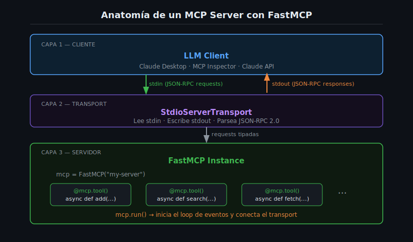

# FastMCP: El SDK de Python para MCP



## 🎯 Objetivos

- Entender qué es FastMCP y por qué es la forma recomendada de construir MCP Servers en Python.
- Crear un servidor MCP mínimo funcional con FastMCP.
- Comprender la diferencia entre la API de alto nivel (FastMCP) y la de bajo nivel (`Server`).
- Ejecutar el servidor en un contenedor Docker usando `uv`.

---

## 📋 Contenido

### 1. ¿Qué es FastMCP?

FastMCP es la API de **alto nivel** del SDK oficial de Python para MCP. Forma parte del paquete `mcp` y
está diseñada para que puedas construir un servidor completamente funcional con la mínima cantidad de
código posible.

El SDK de Python ofrece dos niveles:

| Nivel | Clase | Cuándo usarlo |
|-------|-------|---------------|
| **Alto nivel** | `FastMCP` | La mayoría de casos — toda esta semana |
| Bajo nivel | `Server` | Cuando necesitas control total del protocolo |

> **Analogía:** FastMCP es a `Server` lo que FastAPI es a las sockets de red. FastMCP abstrae el protocolo
> JSON-RPC, los schemas de tools, la negociación de capabilities y el transport loop. Tú te enfocas en
> la lógica de negocio.

---

### 2. Instalación y Requisitos

FastMCP está incluida en el paquete `mcp`. La versión que usamos en este bootcamp es `mcp==1.9.0`.

```toml
# pyproject.toml
[project]
name = "my-mcp-server"
version = "1.0.0"
requires-python = ">=3.13"
dependencies = ["mcp==1.9.0"]

[build-system]
requires = ["hatchling"]
build-backend = "hatchling.build"
```

Con `uv`:

```bash
# Instalar dependencias
uv sync

# Ejecutar el servidor
uv run python src/server.py
```

---

### 3. El Servidor MCP Mínimo

Este es el servidor MCP más pequeño que es completamente funcional:

```python
# src/server.py
from mcp.server.fastmcp import FastMCP

# 1. Crear la instancia del servidor
mcp = FastMCP("my-first-server")

# 2. Registrar un tool (se verá en detalle en el archivo 02)
@mcp.tool()
async def hello(name: str) -> str:
    """Greet someone by name."""
    return f"Hello, {name}!"

# 3. Arrancar el servidor
if __name__ == "__main__":
    mcp.run()
```

Esas tres líneas de código (`FastMCP(...)`, `@mcp.tool()`, `mcp.run()`) son todo lo que necesitas para
tener un MCP Server completamente funcional con transport stdio.

---

### 4. FastMCP vs Server (bajo nivel)

Para entender el valor de FastMCP, mira el equivalente en la API de bajo nivel:

```python
# ❌ Bajo nivel — mucho boilerplate
from mcp.server import Server
from mcp.server.stdio import stdio_server
import mcp.types as types
import asyncio

server = Server("my-server")

@server.list_tools()
async def list_tools() -> list[types.Tool]:
    return [types.Tool(
        name="hello",
        description="Greet someone by name",
        inputSchema={
            "type": "object",
            "properties": {"name": {"type": "string"}},
            "required": ["name"],
        },
    )]

@server.call_tool()
async def call_tool(name: str, arguments: dict) -> list[types.TextContent]:
    if name == "hello":
        return [types.TextContent(type="text", text=f"Hello, {arguments['name']}!")]
    raise ValueError(f"Unknown tool: {name}")

async def main():
    async with stdio_server() as (read_stream, write_stream):
        await server.run(read_stream, write_stream, server.create_initialization_options())

asyncio.run(main())
```

```python
# ✅ FastMCP — equivalente con mucho menos código
from mcp.server.fastmcp import FastMCP

mcp = FastMCP("my-server")

@mcp.tool()
async def hello(name: str) -> str:
    """Greet someone by name."""
    return f"Hello, {name}!"

if __name__ == "__main__":
    mcp.run()
```

FastMCP genera automáticamente el JSON Schema a partir de los type hints de Python, maneja el routing
de tools, y arranca el transport loop. La semana 4 se enfoca en FastMCP. La semana 3 exploró el
low-level `Server` para entender las bases del protocolo.

---

### 5. El Constructor de FastMCP

```python
mcp = FastMCP(
    name="my-server",          # Nombre del servidor (requerido)
    instructions="...",        # Instrucciones para el LLM (opcional)
    lifespan=my_lifespan,      # Función de ciclo de vida (opcional, ver archivo 03)
)
```

El `name` es el identificador que el LLM cliente verá al conectarse. Usa un nombre descriptivo que
indique qué hace el servidor, por ejemplo `"file-search-server"` o `"database-tools"`.

---

### 6. mcp.run() — El Loop de Stdio

`mcp.run()` inicia el **transport loop de stdio**. A partir de ese momento:

1. El servidor lee mensajes JSON-RPC desde `stdin`
2. Procesa cada request llamando al handler correspondiente (un tool, un resource, etc.)
3. Escribe la respuesta JSON-RPC a `stdout`
4. Repite indefinidamente hasta que `stdin` se cierra

> **Importante:** `stdout` está reservado exclusivamente para el protocolo MCP (JSON-RPC).
> Nunca uses `print()` en un MCP Server — rompería el protocolo.
> Los logs del desarrollador van siempre a `stderr`.

```python
# ❌ NUNCA en un MCP server
print("Server started!")          # Contamina stdout con texto no-JSON

# ✅ CORRECTO
import logging, sys
logging.basicConfig(level=logging.INFO, stream=sys.stderr)
logger = logging.getLogger(__name__)
logger.info("Server started!")    # Va a stderr, no interfiere con el protocolo
```

---

### 7. Ejecución con Docker

El entorno de desarrollo oficial del bootcamp usa Docker:

```dockerfile
# Dockerfile
FROM python:3.13-slim
ENV PYTHONDONTWRITEBYTECODE=1 \
    PYTHONUNBUFFERED=1 \
    UV_SYSTEM_PYTHON=1
RUN pip install --no-cache-dir uv==0.6.14
WORKDIR /app
COPY pyproject.toml ./
RUN uv sync --frozen --no-dev
COPY . .
CMD ["uv", "run", "python", "src/server.py"]
```

```yaml
# docker-compose.yml
services:
  server:
    build: .
    container_name: week04-server
    stdin_open: true   # Mantiene stdin abierto (necesario para stdio transport)
    tty: true
```

```bash
# Construir y ejecutar
docker compose up --build

# Ver logs del servidor (stderr)
docker compose logs -f server
```

---

### 8. Estructura del Proyecto

La estructura estándar de un MCP Server Python en este bootcamp:

```
my-mcp-server/
├── Dockerfile
├── docker-compose.yml
├── pyproject.toml
├── uv.lock             # Generado por uv, commitear al repo
└── src/
    └── server.py       # Punto de entrada del servidor
```

Para proyectos más complejos (ver semana 7+):

```
src/
├── server.py           # Solo crea FastMCP y llama mcp.run()
├── tools/
│   ├── __init__.py
│   └── search.py       # Implementación de tools
└── utils/
    ├── __init__.py
    └── db.py
```

---

### 9. Errores Comunes

| Error | Causa | Solución |
|-------|-------|----------|
| `ModuleNotFoundError: No module named 'mcp'` | `uv sync` no se ejecutó | Ejecutar `uv sync` o reconstruir Docker |
| El cliente no recibe respuestas | Se usó `print()` en el servidor | Remover todos los `print()`, usar `logging` con `stream=sys.stderr` |
| `RuntimeError: asyncio event loop` | Llamada a `asyncio.run()` además de `mcp.run()` | Solo usar `mcp.run()` — ya maneja el event loop |
| `Tool not found: my_tool` | Tool registrado después de `mcp.run()` | Registrar todos los tools antes de llamar `mcp.run()` |

---

### 10. Ejercicios de Comprensión

1. ¿Por qué `stdout` debe reservarse exclusivamente para el protocolo MCP?
2. ¿Qué genera automáticamente FastMCP a partir de los type hints de Python?
3. ¿Cuál es la diferencia entre `FastMCP("name")` y `Server("name")`?
4. ¿Por qué se usa `uv run python` en el CMD del Dockerfile en lugar de `python` directamente?
5. Si tienes dos tools registrados, ¿cuántas veces necesitas llamar a `mcp.run()`?

---

## 📚 Recursos Adicionales

- [FastMCP — documentación oficial](https://github.com/modelcontextprotocol/python-sdk/blob/main/README.md)
- [MCP Python SDK — repositorio](https://github.com/modelcontextprotocol/python-sdk)
- [uv — gestión de entornos Python](https://docs.astral.sh/uv/)

---

## ✅ Checklist de Verificación

- [ ] Puedo crear un `FastMCP` con nombre y ejecutarlo
- [ ] Sé por qué `stdout` no puede tener `print()`
- [ ] Entiendo la diferencia entre FastMCP y `Server`
- [ ] Mi `pyproject.toml` tiene `mcp==1.9.0` con versión exacta (sin `^`)
- [ ] El Dockerfile usa `uv run python src/server.py` como CMD
- [ ] Sé cómo ver los logs del servidor con `docker compose logs`

---

## 🔗 Navegación

← [Semana 03 — Fundamentos del Protocolo MCP](../../week-03-fundamentos_protocolo/README.md) |
[Tabla de contenidos de la semana](README.md) |
[Siguiente → 02 — Decorador @mcp.tool()](02-decorador-@mcp.tool-schema-automatico-co.md)
