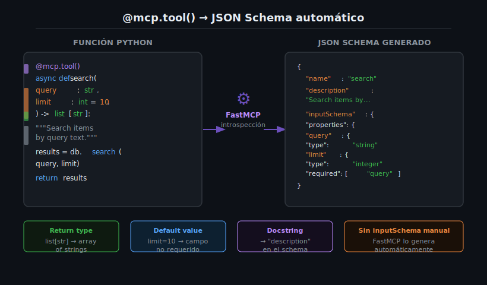

# El Decorador @mcp.tool() y el Schema Automático



## 🎯 Objetivos

- Comprender cómo `@mcp.tool()` convierte una función Python en un tool MCP.
- Conocer la tabla completa de correspondencias entre type hints y JSON Schema.
- Usar docstrings para generar descripciones de tools y parámetros.
- Manejar parámetros opcionales, valores por defecto y tipos complejos.
- Usar Pydantic `BaseModel` para estructurar inputs complejos.

---

## 📋 Contenido

### 1. ¿Qué Hace @mcp.tool()?

El decorador `@mcp.tool()` realiza tres cosas automáticamente:

1. **Registra la función** como un tool en el servidor MCP.
2. **Genera el JSON Schema** del input a partir de los type hints de Python.
3. **Extrae la descripción** del tool desde el docstring de la función.

Cuando un LLM llama a `tools/list`, FastMCP retorna toda esta información para que el LLM sepa
qué tools existen, qué parámetros aceptan y cómo usarlos.

```python
from mcp.server.fastmcp import FastMCP

mcp = FastMCP("schema-demo")

@mcp.tool()
async def add(a: int, b: int) -> int:
    """Add two integers and return their sum.

    Args:
        a: First integer.
        b: Second integer.
    """
    return a + b
```

FastMCP convierte esa función en el siguiente descriptor de tool:

```json
{
  "name": "add",
  "description": "Add two integers and return their sum.",
  "inputSchema": {
    "type": "object",
    "properties": {
      "a": {"type": "integer", "description": "First integer."},
      "b": {"type": "integer", "description": "Second integer."}
    },
    "required": ["a", "b"]
  }
}
```

---

### 2. Tabla de Correspondencias: Type Hint → JSON Schema

FastMCP mapea los type hints de Python a tipos JSON Schema de forma automática:

| Type Hint Python | JSON Schema | Ejemplo de valor |
|------------------|-------------|-----------------|
| `int` | `{"type": "integer"}` | `42` |
| `float` | `{"type": "number"}` | `3.14` |
| `str` | `{"type": "string"}` | `"hello"` |
| `bool` | `{"type": "boolean"}` | `true` |
| `list[str]` | `{"type": "array", "items": {"type": "string"}}` | `["a", "b"]` |
| `list[int]` | `{"type": "array", "items": {"type": "integer"}}` | `[1, 2, 3]` |
| `dict[str, Any]` | `{"type": "object"}` | `{"key": "value"}` |
| `Optional[str]` | `{"type": "string"}` (no requerido) | `"value"` o ausente |
| `str \| None` | `{"type": "string"}` (no requerido) | `"value"` o ausente |
| Pydantic `BaseModel` | Schema del modelo | `{"field": "value"}` |

---

### 3. Parámetros Requeridos y Opcionales

Un parámetro sin valor por defecto es **requerido**. Un parámetro con valor por defecto es **opcional**.

```python
@mcp.tool()
async def search_files(
    pattern: str,             # Requerido — sin default
    directory: str = ".",     # Opcional — con default
    max_results: int = 10,    # Opcional — con default
    recursive: bool = True,   # Opcional — con default
) -> list[str]:
    """Search for files matching a pattern.

    Args:
        pattern: Glob pattern to search for (e.g. "*.py").
        directory: Directory to search in. Defaults to current directory.
        max_results: Maximum number of results to return.
        recursive: Whether to search recursively.
    """
    from pathlib import Path
    root = Path(directory)
    glob_func = root.rglob if recursive else root.glob
    return [str(p) for p in list(glob_func(pattern))[:max_results]]
```

El schema resultante incluirá solo `pattern` en `required`:

```json
{
  "required": ["pattern"],
  "properties": {
    "pattern": {"type": "string"},
    "directory": {"type": "string", "default": "."},
    "max_results": {"type": "integer", "default": 10},
    "recursive": {"type": "boolean", "default": true}
  }
}
```

---

### 4. Optional y Union Types

Python moderno tiene dos formas equivalentes de indicar un parámetro opcional (sin valor por defecto pero
que puede ser `None`):

```python
from typing import Optional

@mcp.tool()
async def get_user(
    user_id: int,
    include_email: Optional[bool] = None,  # Estilo antiguo (typing.Optional)
    filter_role: str | None = None,         # Estilo moderno (Python 3.10+)
) -> dict:
    """Fetch a user from the database.

    Args:
        user_id: The user's unique identifier.
        include_email: Whether to include email in response.
        filter_role: Only return if user has this role.
    """
    result = {"id": user_id, "name": "Alice"}
    if include_email:
        result["email"] = "alice@example.com"
    if filter_role and result.get("role") != filter_role:
        return {}
    return result
```

> **Preferencia del bootcamp:** usar `str | None` (Python 3.10+) en lugar de `Optional[str]`.

---

### 5. Tipos de Retorno

FastMCP serializa automáticamente el valor de retorno a texto para el LLM:

```python
@mcp.tool()
async def get_stats() -> dict:
    """Return server statistics."""
    return {"uptime": 3600, "requests": 42}   # Se serializa a JSON

@mcp.tool()
async def list_files() -> list[str]:
    """List files in current directory."""
    from pathlib import Path
    return [str(p) for p in Path(".").iterdir()]   # Se serializa a JSON array

@mcp.tool()
async def read_file(path: str) -> str:
    """Read a text file."""
    return Path(path).read_text()   # Texto plano
```

Para retornos complejos de tipo `dict` o `list`, FastMCP usa `json.dumps()` internamente para
convertirlos a `TextContent`.

---

### 6. Pydantic BaseModel como Input

Para tools con muchos parámetros relacionados, usa un `BaseModel` de Pydantic:

```python
from pydantic import BaseModel, Field

class SearchParams(BaseModel):
    query: str = Field(..., description="Search terms to look for")
    limit: int = Field(10, ge=1, le=100, description="Max results (1-100)")
    case_sensitive: bool = Field(False, description="Match case exactly")

@mcp.tool()
async def search_documents(params: SearchParams) -> list[str]:
    """Search documents using advanced parameters.

    Args:
        params: Search configuration parameters.
    """
    # params.query, params.limit, params.case_sensitive son accesibles directamente
    results = ["doc1.txt", "doc2.txt"]   # implementación simplificada
    return results[:params.limit]
```

Pydantic `Field()` permite agregar:
- `description`: aparece en el JSON Schema del tool
- `ge`, `le`, `gt`, `lt`: validación numérica (greater/less than)
- `min_length`, `max_length`: validación de strings
- `default`: valor por defecto

---

### 7. Context como Parámetro Especial

El objeto `Context` no forma parte del schema del tool. FastMCP lo inyecta automáticamente cuando
el parámetro se llama `ctx` y tiene tipo `Context`:

```python
from mcp.server.fastmcp import FastMCP, Context

@mcp.tool()
async def process_data(data: str, ctx: Context) -> str:
    """Process some data with progress logging.

    Args:
        data: The data to process.
    """
    # ctx NO aparece en el inputSchema — FastMCP lo inyecta automáticamente
    await ctx.info(f"Processing {len(data)} characters")
    result = data.upper()
    await ctx.info("Processing complete")
    return result
```

El JSON Schema de este tool solo tendrá `data` como propiedad. `ctx` es transparente para el LLM.

---

### 8. Nombres de Tools y Aliases

Por defecto, el nombre del tool en MCP es el nombre de la función Python. Puedes sobreescribirlo:

```python
@mcp.tool(name="get-weather")           # Nombre MCP con guion
async def get_weather(city: str) -> str:
    """Get current weather for a city."""
    return f"Sunny in {city}"

@mcp.tool(
    name="calculate",
    description="Perform mathematical calculations"  # Override del docstring
)
async def calc(expression: str) -> float:
    """Calculate an expression."""
    return eval(expression)   # ⚠️ Solo ejemplo, no usar eval en producción
```

> **Convención del bootcamp:** usar `snake_case` para los nombres de tools MCP
> (ej. `search_files`, `get_weather`, `read_document`).

---

### 9. Errores Comunes

| Error | Causa | Solución |
|-------|-------|----------|
| `TypeError: add() missing 1 required argument: 'b'` | El LLM no pasó un parámetro requerido | Verificar que el docstring describe claramente el parámetro |
| Schema sin descripción de parámetros | Docstring no tiene sección `Args:` | Agregar `Args:` con las descripciones de cada parámetro |
| `ValidationError` al llamar el tool | El LLM envió un tipo incorrecto | Agregar validación con Pydantic `Field()` |
| `ctx` aparece en el JSON Schema | Tipo no declarado como `Context` | Asegurar que el tipo sea `ctx: Context` (exactamente) |
| Tool no disponible para el LLM | Registrado después de `mcp.run()` | Registrar todos los tools antes de llamar `mcp.run()` |

---

### 10. Ejercicios de Comprensión

1. ¿Qué diferencia hay en el JSON Schema entre `age: int` y `age: int = 18`?
2. ¿Cómo se llama el proceso por el que FastMCP extrae el schema a partir de los type hints?
3. ¿Por qué `ctx: Context` no aparece en el schema del tool?
4. Escribe la signatura de un tool que reciba una lista de emails y retorne cuántos son válidos.
5. ¿Cuál es la ventaja de usar `BaseModel` en lugar de múltiples parámetros sueltos?

---

## 📚 Recursos Adicionales

- [Pydantic Field documentation](https://docs.pydantic.dev/latest/concepts/fields/)
- [Python type hints — docs.python.org](https://docs.python.org/3/library/typing.html)
- [JSON Schema specification](https://json-schema.org/understanding-json-schema/)

---

## ✅ Checklist de Verificación

- [ ] Sé la diferencia entre un parámetro requerido y uno opcional
- [ ] Puedo mapear type hints Python a sus tipos JSON Schema equivalentes
- [ ] Mis tools tienen docstrings con sección `Args:` para cada parámetro
- [ ] Uso `str | None` (Python 3.10+) en lugar de `Optional[str]`
- [ ] Sé cuándo usar `BaseModel` vs parámetros individuales
- [ ] Entiendo por qué `ctx: Context` no aparece en el schema del tool

---

## 🔗 Navegación

← [01 — FastMCP: El SDK de Python](01-fastmcp-el-sdk-de-python-para-mcp.md) |
[Tabla de contenidos](README.md) |
[Siguiente → 03 — Ciclo de Vida del Server](03-ciclo-de-vida-del-server-startup-handlin.md)
