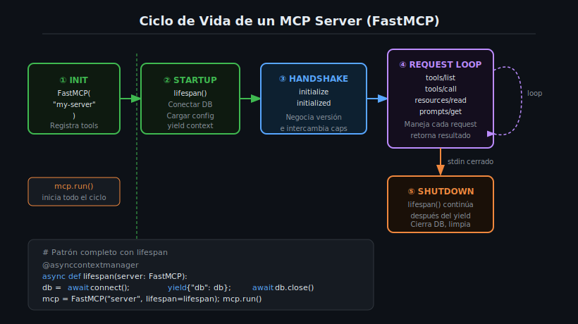

# Ciclo de Vida del Server: Startup, Handling y Shutdown



## 🎯 Objetivos

- Entender las cinco fases del ciclo de vida de un MCP Server con FastMCP.
- Implementar el patrón `lifespan` para inicializar y limpiar recursos compartidos.
- Usar el objeto `Context` para acceder al contexto del ciclo de vida desde un tool.
- Comprender la negociación de capabilities durante el handshake MCP.

---

## 📋 Contenido

### 1. Las Cinco Fases del Ciclo de Vida

Un MCP Server con FastMCP pasa por cinco fases claramente definidas:

```
① INIT → ② STARTUP → ③ HANDSHAKE → ④ REQUEST LOOP → ⑤ SHUTDOWN
```

#### Fase 1: INIT

Cuando Python ejecuta `mcp = FastMCP("name")` y los decoradores `@mcp.tool()`:

```python
from mcp.server.fastmcp import FastMCP

mcp = FastMCP("lifecycle-demo")   # Fase 1: se crea el servidor

@mcp.tool()                        # Fase 1: se registra el tool
async def greet(name: str) -> str:
    """Greet a user."""
    return f"Hello, {name}!"

# Más tools, resources, prompts se registran aquí...

if __name__ == "__main__":
    mcp.run()   # Inicia las fases 2-5
```

#### Fase 2: STARTUP (Lifespan)

Si se configura un `lifespan`, este se ejecuta antes de aceptar cualquier request:

```python
from contextlib import asynccontextmanager
from mcp.server.fastmcp import FastMCP

@asynccontextmanager
async def lifespan(server: FastMCP):
    # --- STARTUP ---
    print("Starting up...", file=sys.stderr)
    # Aquí se inicializan: DB connections, cache, config, etc.
    shared_data = {"counter": 0, "db": None}  # datos compartidos
    yield shared_data  # <-- punto de separación startup/shutdown
    # --- SHUTDOWN ---
    print("Shutting down...", file=sys.stderr)
    # Aquí se cierran: conexiones, archivos, etc.

mcp = FastMCP("lifecycle-demo", lifespan=lifespan)
```

#### Fase 3: HANDSHAKE

FastMCP negocia automáticamente con el cliente:

1. Cliente envía: `{"method": "initialize", "params": {"protocolVersion": "...", "capabilities": {...}}}`
2. Servidor responde con sus capabilities: tools, resources, prompts disponibles
3. Cliente confirma: `{"method": "initialized"}`

No necesitas implementar esto manualmente — FastMCP lo maneja por ti.

#### Fase 4: REQUEST LOOP

El servidor escucha requests indefinidamente desde `stdin`:

- `tools/list` → retorna lista de todos los tools registrados
- `tools/call` → llama a un tool específico y retorna el resultado
- `resources/list` → lista resources disponibles (semana 6)
- `prompts/list` → lista prompts disponibles (semana 6)

#### Fase 5: SHUTDOWN

Cuando `stdin` se cierra (el cliente desconecta), FastMCP:
1. Completa el request en curso (si hay alguno)
2. Reanuda la ejecución del `lifespan` después del `yield`
3. Ejecuta el código de cleanup

---

### 2. El Patrón Lifespan

El `lifespan` es un **context manager asíncrono** que usa `yield` para separar startup de shutdown:

```python
import sys
from contextlib import asynccontextmanager
from mcp.server.fastmcp import FastMCP

@asynccontextmanager
async def lifespan(server: FastMCP):
    # ======== STARTUP ========
    import sqlite3
    db = sqlite3.connect(":memory:")
    db.execute("CREATE TABLE items (id INTEGER, name TEXT)")
    db.execute("INSERT INTO items VALUES (1, 'Widget'), (2, 'Gadget')")
    db.commit()
    print("Database initialized", file=sys.stderr)

    yield {"db": db}   # El dict se convierte en el lifespan_context

    # ======== SHUTDOWN ========
    db.close()
    print("Database closed", file=sys.stderr)

mcp = FastMCP("db-server", lifespan=lifespan)
```

**Reglas del lifespan:**
- Debe ser una función `async` decorada con `@asynccontextmanager`
- Debe tener exactamente un `yield`
- El valor del `yield` es un `dict` que se puede leer desde cualquier tool
- Si el startup falla (excepción antes del `yield`), el servidor no arranca

---

### 3. Acceder al Lifespan Context desde un Tool

El dict que se pasa con `yield` queda accesible en todos los tools a través de `ctx.request_context.lifespan_context`:

```python
from mcp.server.fastmcp import FastMCP, Context

@mcp.tool()
async def search_items(query: str, ctx: Context) -> list[str]:
    """Search items in the database.

    Args:
        query: Text to search for in item names.
    """
    # Acceder al contexto del lifespan (la DB inicializada al startup)
    db = ctx.request_context.lifespan_context["db"]
    cursor = db.execute(
        "SELECT name FROM items WHERE name LIKE ?",
        (f"%{query}%",)
    )
    return [row[0] for row in cursor.fetchall()]

@mcp.tool()
async def count_items(ctx: Context) -> int:
    """Count all items in the database."""
    db = ctx.request_context.lifespan_context["db"]
    cursor = db.execute("SELECT COUNT(*) FROM items")
    return cursor.fetchone()[0]
```

---

### 4. El Objeto Context en Detalle

`Context` tiene varios atributos y métodos útiles:

```python
from mcp.server.fastmcp import FastMCP, Context

@mcp.tool()
async def complex_tool(data: str, ctx: Context) -> str:
    """A tool that uses Context extensively.

    Args:
        data: Input data to process.
    """
    # Logging visible para el cliente LLM (notifications/message)
    await ctx.debug(f"Input received: {len(data)} chars")    # nivel DEBUG
    await ctx.info("Starting processing")                     # nivel INFO
    await ctx.warning("Large input, may take a while")        # nivel WARNING

    # Acceder al lifespan context (si se configuró lifespan)
    lifespan_ctx = ctx.request_context.lifespan_context
    counter = lifespan_ctx.get("counter", 0)

    # Reportar progreso al cliente (0.0 a 1.0)
    await ctx.report_progress(0.5, 1.0)

    result = data.upper()
    await ctx.info("Processing complete")
    return result
```

**Métodos de logging de Context:**

| Método | Nivel | Cuándo usar |
|--------|-------|-------------|
| `await ctx.debug(msg)` | DEBUG | Información detallada de depuración |
| `await ctx.info(msg)` | INFO | Progreso normal y eventos importantes |
| `await ctx.warning(msg)` | WARNING | Algo inusual pero no crítico |
| `await ctx.error(msg)` | ERROR | Errores recuperables |
| `await ctx.report_progress(current, total)` | — | Progreso de operaciones largas |

Todos estos métodos envían notificaciones al cliente vía el protocolo MCP. Son distintos del
logging de Python (que va a stderr).

---

### 5. Servidor con Lifespan Completo: Ejemplo

```python
# src/server.py
import sys
import logging
from contextlib import asynccontextmanager
from mcp.server.fastmcp import FastMCP, Context

logging.basicConfig(level=logging.INFO, stream=sys.stderr)
logger = logging.getLogger(__name__)

@asynccontextmanager
async def lifespan(server: FastMCP):
    # Startup: inicializar recursos
    logger.info("Server starting up")
    config = {
        "version": "1.0.0",
        "max_results": 100,
        "request_count": 0,
    }
    yield config
    # Shutdown: cleanup
    logger.info(f"Server shutting down after {config['request_count']} requests")

mcp = FastMCP("lifecycle-example", lifespan=lifespan)

@mcp.tool()
async def get_info(ctx: Context) -> dict:
    """Get server information and request count."""
    config = ctx.request_context.lifespan_context
    config["request_count"] += 1
    await ctx.info(f"Request #{config['request_count']}")
    return {
        "version": config["version"],
        "total_requests": config["request_count"],
    }

@mcp.tool()
async def echo(message: str, ctx: Context) -> str:
    """Echo a message back.

    Args:
        message: Text to echo.
    """
    config = ctx.request_context.lifespan_context
    config["request_count"] += 1
    await ctx.info(f"Echoing: {message}")
    return message

if __name__ == "__main__":
    mcp.run()
```

---

### 6. Sin Lifespan: Servidor Stateless

Si no necesitas recursos compartidos, puedes omitir el lifespan:

```python
from mcp.server.fastmcp import FastMCP

mcp = FastMCP("stateless-server")   # Sin lifespan

@mcp.tool()
async def add(a: int, b: int) -> int:
    """Add two numbers."""
    return a + b

@mcp.tool()
async def multiply(a: int, b: int) -> int:
    """Multiply two numbers."""
    return a * b

if __name__ == "__main__":
    mcp.run()
```

---

### 7. Errores Comunes

| Error | Causa | Solución |
|-------|-------|----------|
| `AttributeError: 'NoneType' object has no attribute 'lifespan_context'` | Se usa `ctx.request_context.lifespan_context` sin lifespan | Configurar `lifespan=` en `FastMCP()` o verificar si es `None` |
| El servidor no arranca | Excepción en la parte de startup del lifespan | Revisar logs en stderr, el error ocurre antes del `yield` |
| Recursos no se cierran | Excepción después del `yield` en lifespan | Usar `try/finally` en la parte de shutdown |
| `KeyError` al acceder al context | Clave no existe en el dict del lifespan | Verificar que el dict tenga la clave, usar `.get()` con default |

---

### 8. Ejercicios de Comprensión

1. ¿En qué fase del ciclo de vida se registran los tools con `@mcp.tool()`?
2. ¿Por qué el lifespan usa `yield` en lugar de dos funciones separadas?
3. ¿Qué pasa si el lifespan lanza una excepción antes del `yield`?
4. ¿Cómo accede un tool al dict retornado por el `yield` del lifespan?
5. ¿Cuándo es necesario usar lifespan y cuándo no?

---

## 📚 Recursos Adicionales

- [asynccontextmanager — Python docs](https://docs.python.org/3/library/contextlib.html#contextlib.asynccontextmanager)
- [FastMCP lifespan — ejemplos oficiales](https://github.com/modelcontextprotocol/python-sdk/tree/main/examples)

---

## ✅ Checklist de Verificación

- [ ] Puedo describir las cinco fases del ciclo de vida MCP
- [ ] Sé implementar un lifespan con `@asynccontextmanager`
- [ ] Entiendo que `yield` separa startup de shutdown
- [ ] Puedo acceder al lifespan context desde un tool con `ctx.request_context.lifespan_context`
- [ ] Uso `await ctx.info()` para enviar progreso al LLM cliente
- [ ] Sé la diferencia entre `ctx.info()` (al LLM) y `logger.info()` (a stderr)

---

## 🔗 Navegación

← [02 — Decorador @mcp.tool()](02-decorador-@mcp.tool-schema-automatico-co.md) |
[Tabla de contenidos](README.md) |
[Siguiente → 04 — pyproject.toml y uv](04-pyproject.toml-y-gestion-de-dependencias.md)
