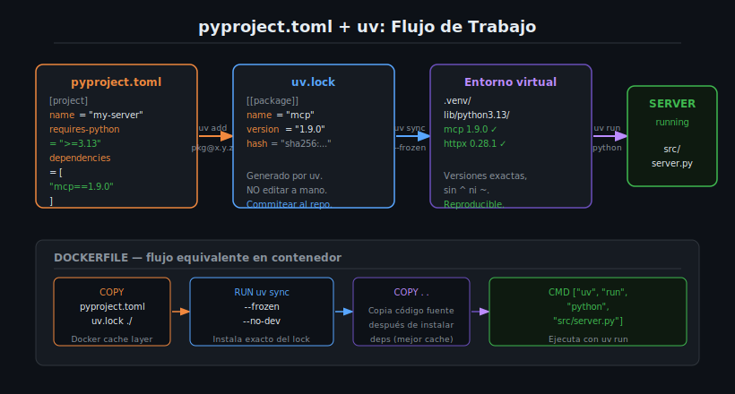

# pyproject.toml y Gestión de Dependencias con uv



## 🎯 Objetivos

- Entender la estructura completa de un archivo `pyproject.toml` moderno.
- Dominar los comandos esenciales de `uv` para gestionar dependencias.
- Comprender la diferencia entre `uv add`, `uv sync` y `uv run`.
- Integrar `uv` correctamente en un Dockerfile para builds reproducibles.
- Entender por qué se usan versiones exactas (sin `^` ni `~`).

---

## 📋 Contenido

### 1. ¿Por Qué pyproject.toml?

`pyproject.toml` es el archivo de configuración estándar para proyectos Python moderno (PEP 517, PEP 518,
PEP 621). Reemplaza `setup.py`, `setup.cfg` y `requirements.txt` en un solo archivo.

Para un MCP Server, `pyproject.toml` define:
- El nombre y versión del proyecto
- Las dependencias y sus versiones exactas
- La versión mínima de Python requerida
- El sistema de build (hatchling, en nuestro caso)

---

### 2. Estructura del pyproject.toml para MCP Servers

```toml
# pyproject.toml

[project]
name = "my-mcp-server"
version = "1.0.0"
description = "A FastMCP server for document search"
requires-python = ">=3.13"
dependencies = [
    "mcp==1.9.0",          # SDK de MCP — versión exacta, sin ^ ni ~
    "httpx==0.28.1",       # Cliente HTTP asíncrono
    "pydantic==2.11.4",    # Validación de datos (incluida en mcp, pero explícita es mejor)
]

[build-system]
requires = ["hatchling"]
build-backend = "hatchling.build"
```

**Secciones importantes:**

| Sección | Propósito |
|---------|-----------|
| `[project]` | Metadatos del proyecto |
| `[project.dependencies]` | Dependencias de producción |
| `[project.optional-dependencies]` | Dependencias opcionales (ej. `dev`) |
| `[build-system]` | Backend de build (hatchling para este bootcamp) |
| `[tool.uv]` | Configuración específica de uv |

---

### 3. Versiones Exactas: Por Qué Es Crítico

```toml
# ❌ NUNCA — versiones flotantes
dependencies = [
    "mcp>=1.0.0",     # Puede instalar cualquier versión ≥1.0.0 — impredecible
    "httpx^0.28",     # TOML no acepta ^, pero algunos tools sí — evitarlo
    "pydantic~=2.0",  # Equivale a >=2.0, <3.0 — impredecible
]

# ✅ SIEMPRE — versiones exactas
dependencies = [
    "mcp==1.9.0",
    "httpx==0.28.1",
    "pydantic==2.11.4",
]
```

**Riesgos de versiones flotantes:**

| Riesgo | Descripción |
|--------|-------------|
| **CVEs no controlados** | Una versión mayor puede incluir vulnerabilidades conocidas |
| **Builds no reproducibles** | Dos `uv sync` en fechas distintas instalan versiones distintas |
| **Supply-chain attacks** | Una actualización automática podría inyectar código malicioso |
| **Difícil de auditar** | Imposible saber exactamente qué versión corre en producción |

---

### 4. Comandos Esenciales de uv

#### uv init — Crear un nuevo proyecto

```bash
uv init my-mcp-server
cd my-mcp-server
```

Crea `pyproject.toml`, `.python-version` y `.venv/` automáticamente.

#### uv add — Agregar dependencias

```bash
# Agregar una dependencia con versión exacta
uv add mcp==1.9.0
uv add httpx==0.28.1

# Agregar dependencia de desarrollo (no va a producción)
uv add --dev pytest==8.3.5
uv add --dev ruff==0.11.2
```

`uv add` actualiza `pyproject.toml` y regenera `uv.lock` automáticamente.

#### uv sync — Instalar desde lockfile

```bash
# Instalar exactamente lo que dice uv.lock
uv sync

# Instalar solo dependencias de producción (sin dev)
uv sync --no-dev

# Instalar sin modificar uv.lock (fail si hay diferencias)
uv sync --frozen
```

`--frozen` es el flag más importante para builds reproducibles: falla si `pyproject.toml`
y `uv.lock` están desincronizados, en lugar de actualizar silenciosamente.

#### uv run — Ejecutar en el entorno virtual

```bash
# Ejecutar el servidor
uv run python src/server.py

# Ejecutar tests
uv run pytest tests/

# Ejecutar un script inline
uv run python -c "from mcp.server.fastmcp import FastMCP; print('ok')"
```

`uv run` asegura que el comando corre dentro del entorno virtual del proyecto.

#### uv lock — Regenerar el lockfile

```bash
# Regenerar uv.lock desde pyproject.toml
uv lock

# Ver qué instalaría sin instalar
uv lock --dry-run
```

---

### 5. El Archivo uv.lock

`uv.lock` es generado automáticamente por `uv`. **Nunca lo edites a mano.** Siempre comitearlo al repositorio:

```
# Estructura simplificada de uv.lock
version = 1
requires-python = ">=3.13"

[[package]]
name = "mcp"
version = "1.9.0"
source = { registry = "https://pypi.org/simple" }
dependencies = [
    { name = "anyio" },
    { name = "httpx" },
    { name = "pydantic" },
    ...
]

[[package]]
name = "anyio"
version = "4.9.0"
...
```

El lockfile registra no solo las dependencias directas, sino también todas las dependencias
transitivas (dependencias de tus dependencias), con sus hashes de integridad.

---

### 6. Dependencias Opcionales (dev/test)

```toml
[project]
name = "my-mcp-server"
version = "1.0.0"
requires-python = ">=3.13"
dependencies = [
    "mcp==1.9.0",
]

[project.optional-dependencies]
dev = [
    "pytest==8.3.5",
    "pytest-asyncio==0.25.3",
    "ruff==0.11.2",
]

[build-system]
requires = ["hatchling"]
build-backend = "hatchling.build"
```

```bash
# Instalar todo (producción + dev)
uv sync --all-extras

# Instalar solo producción (para Docker)
uv sync --no-dev
```

---

### 7. Integración con Docker

El patrón correcto para aprovechar el cache de Docker:

```dockerfile
FROM python:3.13-slim

# Variables de entorno para Python y uv
ENV PYTHONDONTWRITEBYTECODE=1 \
    PYTHONUNBUFFERED=1 \
    UV_SYSTEM_PYTHON=1

# Instalar uv con versión exacta
RUN pip install --no-cache-dir uv==0.6.14

WORKDIR /app

# Copiar SOLO los archivos de dependencias primero
# Esto crea una capa de cache que solo se invalida
# si pyproject.toml o uv.lock cambian
COPY pyproject.toml uv.lock* ./

# Instalar dependencias con --frozen (reproducible)
RUN uv sync --frozen --no-dev

# Copiar el código fuente DESPUÉS de instalar deps
# Así los cambios de código no invalidan el cache de deps
COPY . .

CMD ["uv", "run", "python", "src/server.py"]
```

**Por qué `COPY pyproject.toml uv.lock* ./` primero:**
Si cambias el código pero no las dependencias, Docker usa la capa cacheada de dependencias
y solo re-ejecuta `COPY . .` — ahorrando tiempo de build.

---

### 8. Variables de Entorno de uv

```bash
# Usar el Python del sistema (útil en Docker)
export UV_SYSTEM_PYTHON=1

# Directorio de cache (para CI/CD)
export UV_CACHE_DIR=/tmp/uv-cache

# No usar cache (máxima reproducibilidad)
export UV_NO_CACHE=1

# Directorio del entorno virtual
export VIRTUAL_ENV=/app/.venv
```

En Docker, `UV_SYSTEM_PYTHON=1` hace que `uv` instale en el Python del sistema en lugar de
crear un entorno virtual dentro del contenedor (simplifica el PATH).

---

### 9. Errores Comunes

| Error | Causa | Solución |
|-------|-------|----------|
| `error: lockfile is not up to date` | `pyproject.toml` cambió pero no se actualizó `uv.lock` | Ejecutar `uv lock` y commitear el nuevo `uv.lock` |
| `ModuleNotFoundError` en Docker | Se copió el código antes de `uv sync` | Reordenar Dockerfile: `COPY pyproject.toml → RUN uv sync → COPY . .` |
| `uv: command not found` en Docker | `uv` no está instalado | Agregar `RUN pip install --no-cache-dir uv==0.6.14` |
| Versiones distintas en CI vs local | Se usaron rangos de versión (`^`, `~`) | Cambiar a versiones exactas en `pyproject.toml` |
| `uv sync` tarda mucho en Docker | Cache no configurado | Agregar `--cache-dir` y montar como volumen en dev |

---

### 10. Ejercicios de Comprensión

1. ¿Qué diferencia hay entre `uv add httpx` y `uv add httpx==0.28.1`?
2. ¿Por qué se usa `--frozen` en el Dockerfile pero no siempre en desarrollo local?
3. ¿Qué pasa si commiteas `uv.lock` y otra persona hace `uv sync` en su máquina?
4. ¿Por qué se copia `pyproject.toml` antes que el código fuente en el Dockerfile?
5. ¿Para qué sirve `UV_SYSTEM_PYTHON=1` en el contexto de Docker?

---

## 📚 Recursos Adicionales

- [uv documentation](https://docs.astral.sh/uv/)
- [pyproject.toml specification — PEP 621](https://peps.python.org/pep-0621/)
- [hatchling build backend](https://hatch.pypa.io/latest/config/build/)

---

## ✅ Checklist de Verificación

- [ ] Mi `pyproject.toml` tiene `requires-python = ">=3.13"`
- [ ] Todas las dependencias tienen versiones exactas (sin `^`, `~`, `>=`)
- [ ] Sé la diferencia entre `uv add`, `uv sync` y `uv run`
- [ ] El Dockerfile copia `pyproject.toml` antes del código fuente
- [ ] El Dockerfile usa `uv sync --frozen --no-dev`
- [ ] `uv.lock` está commiteado al repositorio

---

## 🔗 Navegación

← [03 — Ciclo de Vida del Server](03-ciclo-de-vida-del-server-startup-handlin.md) |
[Tabla de contenidos](README.md) |
[Siguiente → 05 — Debugging con Logging](05-debugging-de-servers-python-con-logging.md)
