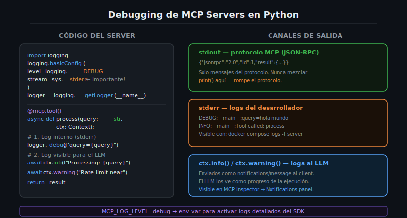

# Debugging de MCP Servers Python con Logging



## 🎯 Objetivos

- Configurar el módulo `logging` de Python correctamente en un MCP Server.
- Entender la diferencia crítica entre `stdout` y `stderr` en el protocolo MCP.
- Usar `ctx.info()`, `ctx.debug()` y `ctx.warning()` para enviar logs al cliente LLM.
- Configurar `MCP_LOG_LEVEL` para controlar el nivel de verbosidad del SDK.
- Usar MCP Inspector para probar y depurar servers interactivamente.

---

## 📋 Contenido

### 1. El Problema: stdout Está Reservado

En un MCP Server con transport stdio, `stdout` es el canal de comunicación del protocolo.
Cada byte que se escribe en `stdout` debe ser un mensaje JSON-RPC válido. Si usas `print()`,
el cliente LLM intentará parsear el texto plano como JSON y fallará silenciosamente:

```python
# ❌ NUNCA — rompe el protocolo MCP
@mcp.tool()
async def bad_tool(value: str) -> str:
    print(f"Processing: {value}")    # ← Envenena stdout con texto plano
    return value.upper()

# ✅ CORRECTO — stderr no interfiere con el protocolo
import logging
logger = logging.getLogger(__name__)

@mcp.tool()
async def good_tool(value: str) -> str:
    logger.debug(f"Processing: {value}")    # ← Va a stderr
    return value.upper()
```

---

### 2. Configuración Básica de Logging

La configuración de logging debe hacerse al inicio del archivo, antes de crear el servidor:

```python
# src/server.py
import sys
import logging
from mcp.server.fastmcp import FastMCP

# ======= Configuración de logging =======
logging.basicConfig(
    level=logging.DEBUG,          # Nivel mínimo a capturar
    stream=sys.stderr,            # CRÍTICO: siempre stderr, nunca stdout
    format="%(asctime)s %(name)s %(levelname)s %(message)s",
)
logger = logging.getLogger(__name__)
# ========================================

mcp = FastMCP("debug-demo")

@mcp.tool()
async def process(text: str) -> str:
    """Process text input.

    Args:
        text: Text to process.
    """
    logger.debug(f"Input received: '{text}' ({len(text)} chars)")
    result = text.strip().upper()
    logger.info(f"Processing complete, output: '{result}'")
    return result

if __name__ == "__main__":
    logger.info("Server starting...")
    mcp.run()
```

---

### 3. Niveles de Logging

Python tiene cinco niveles de logging estándar:

| Nivel | Método | Cuándo usar |
|-------|--------|-------------|
| `DEBUG` | `logger.debug(msg)` | Detalles internos, valores de variables, traza de ejecución |
| `INFO` | `logger.info(msg)` | Eventos normales, inicio/fin de operaciones |
| `WARNING` | `logger.warning(msg)` | Situaciones inusuales pero no críticas |
| `ERROR` | `logger.error(msg)` | Errores que el tool pudo manejar |
| `CRITICAL` | `logger.critical(msg)` | Errores fatales que requieren atención inmediata |

```python
@mcp.tool()
async def fetch_data(url: str, ctx: Context) -> str:
    """Fetch data from a URL.

    Args:
        url: URL to fetch data from.
    """
    logger.debug(f"Fetching URL: {url}")
    try:
        # ... lógica de fetch
        logger.info(f"Successfully fetched {url}")
        return "data"
    except TimeoutError:
        logger.warning(f"Timeout fetching {url}, using cached data")
        return "cached data"
    except Exception as e:
        logger.error(f"Failed to fetch {url}: {e}")
        raise
```

---

### 4. Logging con Context (ctx) — Para el LLM

El objeto `Context` tiene métodos de logging que envían notificaciones al **cliente LLM**
(no solo a stderr). Esto permite que el LLM vea el progreso en tiempo real:

```python
from mcp.server.fastmcp import FastMCP, Context

@mcp.tool()
async def analyze_document(content: str, ctx: Context) -> dict:
    """Analyze a text document.

    Args:
        content: Document content to analyze.
    """
    # ctx.info() → visible para el LLM como notificación de progreso
    await ctx.info(f"Starting analysis of {len(content)} characters")

    word_count = len(content.split())
    await ctx.info(f"Word count: {word_count}")

    if word_count > 10000:
        await ctx.warning("Large document, analysis may take longer")

    char_freq = {}
    for char in content.lower():
        if char.isalpha():
            char_freq[char] = char_freq.get(char, 0) + 1

    await ctx.info("Analysis complete")

    return {
        "word_count": word_count,
        "char_count": len(content),
        "top_chars": sorted(char_freq.items(), key=lambda x: -x[1])[:5],
    }
```

**Diferencia entre logging Python y Context:**

| | `logger.info()` | `await ctx.info()` |
|--|--|-|
| **Destino** | stderr (solo visible en logs del servidor) | Cliente LLM (visible en Claude, MCP Inspector) |
| **Protocolo** | No MCP | Notification MCP (`notifications/message`) |
| **Async** | Síncrono | Asíncrono (requiere `await`) |
| **Uso** | Debugging interno del desarrollador | Progreso visible para el LLM |

---

### 5. MCP_LOG_LEVEL — Variable de Entorno

La variable `MCP_LOG_LEVEL` controla el nivel de verbosidad del propio SDK de MCP
(mensajes internos del framework, no del código de la aplicación):

```bash
# Silencioso (solo errores del SDK)
MCP_LOG_LEVEL=error docker compose up

# Nivel normal (por defecto)
MCP_LOG_LEVEL=warning docker compose up

# Detallado (útil para debugging de problemas de protocolo)
MCP_LOG_LEVEL=debug docker compose up

# Máxima verbosidad (mensajes JSON-RPC completos)
MCP_LOG_LEVEL=debug PYTHONVERBOSE=1 docker compose up
```

En `docker-compose.yml`:

```yaml
services:
  server:
    build: .
    stdin_open: true
    tty: true
    environment:
      - MCP_LOG_LEVEL=debug      # Logs del SDK de MCP
      - PYTHONUNBUFFERED=1       # Sin buffering de stderr
```

---

### 6. Ver Logs con Docker

```bash
# Ver logs en tiempo real del servidor
docker compose logs -f server

# Ver logs con timestamps
docker compose logs -t server

# Ver últimas 50 líneas
docker compose logs --tail=50 server

# Ver logs de todos los servicios
docker compose logs -f
```

Los logs del servidor (escritos a `stderr`) aparecen en la salida de `docker compose logs`.

---

### 7. MCP Inspector — Prueba Interactiva

**MCP Inspector** es una herramienta web para conectarse a un MCP Server y probar
tools, resources y prompts de forma interactiva, sin necesidad de un LLM.

#### Instalación (sin instalar — usar npx):

```bash
npx @modelcontextprotocol/inspector
```

#### Conectar al servidor en Docker:

Para conectar MCP Inspector a un servidor stdio en Docker, el servidor debe poder ejecutarse
localmente. MCP Inspector abre un proceso local y se comunica por stdio:

```bash
# Opción 1: Ejecutar el servidor directamente (con uv instalado localmente)
cd practica-01
npx @modelcontextprotocol/inspector uv run python src/server.py

# Opción 2: Ejecutar dentro de Docker y conectar por stdin
docker compose run --rm server  # El contenedor queda esperando stdin
```

#### Interfaz de MCP Inspector:

Una vez conectado, MCP Inspector muestra:
- **Tools**: lista de tools disponibles con sus schemas
- **Execute**: formulario para llamar a cualquier tool con parámetros
- **Notifications**: mensajes de `ctx.info()`, `ctx.warning()`, etc.
- **History**: historial de requests y respuestas JSON-RPC

---

### 8. Técnicas Avanzadas de Debugging

#### Logging estructurado con extras

```python
logger.info("Tool called", extra={
    "tool_name": "search",
    "query": query,
    "user_id": user_id,
})
```

#### Decorador de logging para tools

```python
import functools
import time

def log_tool(func):
    """Decorator that logs tool execution time."""
    @functools.wraps(func)
    async def wrapper(*args, **kwargs):
        start = time.monotonic()
        logger.debug(f"Tool {func.__name__} called with {kwargs}")
        try:
            result = await func(*args, **kwargs)
            elapsed = time.monotonic() - start
            logger.info(f"Tool {func.__name__} completed in {elapsed:.3f}s")
            return result
        except Exception as e:
            logger.error(f"Tool {func.__name__} failed: {e}")
            raise
    return wrapper

@mcp.tool()
@log_tool
async def search(query: str) -> list[str]:
    """Search for documents.

    Args:
        query: Search query.
    """
    return ["doc1.txt", "doc2.txt"]
```

#### Inspeccionar mensajes JSON-RPC raw

Para ver exactamente qué se envía/recibe en el protocolo, redirige stderr a un archivo:

```bash
uv run python src/server.py 2>debug.log
# En otra terminal:
cat debug.log
tail -f debug.log
```

---

### 9. Errores Comunes

| Error | Causa | Solución |
|-------|-------|----------|
| MCP Inspector no ve los tools | El servidor lanzó excepción en startup | Revisar stderr con `docker compose logs` |
| `await ctx.info()` no funciona | Se olvidó el `await` | Siempre: `await ctx.info(...)` no `ctx.info(...)` |
| Logs no aparecen en `docker compose logs` | Se usa `stream=sys.stdout` | Cambiar a `stream=sys.stderr` |
| El cliente recibe error de parsing | Se usó `print()` en el servidor | Reemplazar todos los `print()` por `logger.xxx()` |
| Demasiados logs en producción | `level=logging.DEBUG` en producción | Usar env var: `LOG_LEVEL=WARNING` y `os.environ.get("LOG_LEVEL", "WARNING")` |

---

### 10. Patrón Completo de Debugging

```python
# src/server.py — patrón completo de logging y debugging
import os
import sys
import logging
from mcp.server.fastmcp import FastMCP, Context

# Configurar logging desde variable de entorno
log_level = os.environ.get("LOG_LEVEL", "INFO").upper()
logging.basicConfig(
    level=getattr(logging, log_level, logging.INFO),
    stream=sys.stderr,
    format="%(asctime)s [%(levelname)s] %(name)s: %(message)s",
    datefmt="%H:%M:%S",
)
logger = logging.getLogger(__name__)

mcp = FastMCP("debug-complete")

@mcp.tool()
async def process(
    text: str,
    operation: str = "upper",
    ctx: Context = None,
) -> str:
    """Process text with a specified operation.

    Args:
        text: Input text to process.
        operation: Operation to apply (upper, lower, reverse).
    """
    logger.debug(f"process() called: text='{text}', operation='{operation}'")
    if ctx:
        await ctx.info(f"Processing with operation: {operation}")

    operations = {
        "upper": str.upper,
        "lower": str.lower,
        "reverse": lambda s: s[::-1],
    }

    if operation not in operations:
        logger.warning(f"Unknown operation: {operation}, defaulting to upper")
        if ctx:
            await ctx.warning(f"Unknown operation '{operation}', using 'upper'")
        operation = "upper"

    result = operations[operation](text)
    logger.info(f"process() result: '{result}'")
    return result

if __name__ == "__main__":
    logger.info(f"Starting server (log_level={log_level})")
    mcp.run()
```

---

### 11. Ejercicios de Comprensión

1. ¿Por qué `print()` rompe el protocolo MCP en servidores stdio?
2. ¿Cuál es la diferencia entre `logger.info()` y `await ctx.info()`?
3. ¿Qué controla `MCP_LOG_LEVEL` exactamente?
4. ¿Cómo puedes cambiar el nivel de logging sin modificar el código?
5. ¿Por qué es útil MCP Inspector en comparación con Claude Desktop para debugging?

---

## 📚 Recursos Adicionales

- [Python logging — docs.python.org](https://docs.python.org/3/library/logging.html)
- [MCP Inspector — GitHub](https://github.com/modelcontextprotocol/inspector)
- [Structured logging in Python](https://docs.python.org/3/howto/logging-cookbook.html)

---

## ✅ Checklist de Verificación

- [ ] Entiendo por qué `print()` no se debe usar en un MCP Server
- [ ] Mi servidor usa `logging.basicConfig(stream=sys.stderr)`
- [ ] Sé la diferencia entre `logger.info()` y `await ctx.info()`
- [ ] Puedo controlar el nivel de log con una variable de entorno
- [ ] Sé cómo ver los logs con `docker compose logs -f server`
- [ ] He probado MCP Inspector al menos una vez con mi servidor

---

## 🔗 Navegación

← [04 — pyproject.toml y uv](04-pyproject.toml-y-gestion-de-dependencias.md) |
[Tabla de contenidos](README.md) |
[Prácticas → 2-practicas/](../2-practicas/README.md)
