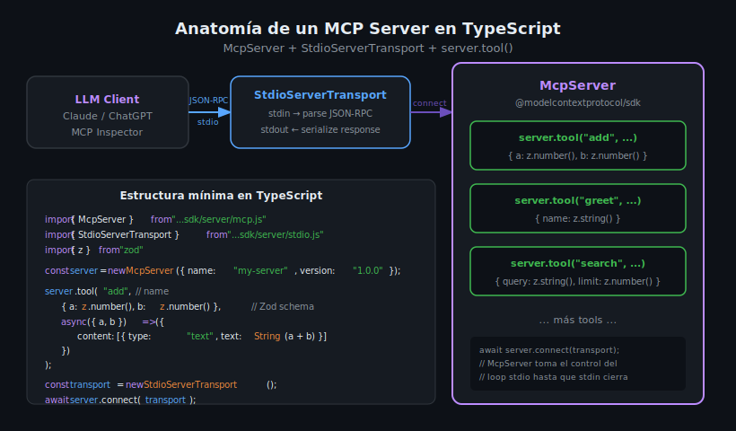

# McpServer: el SDK de TypeScript para MCP



## 🎯 Objetivos

- Entender qué es `McpServer` y cómo se diferencia del `Server` de bajo nivel
- Instanciar un `McpServer` y conectarlo al transport stdio
- Comprender el flujo: cliente → transport → McpServer → tool handler
- Ejecutar el servidor desde Docker con Node.js 22

---

## 1. ¿Qué es McpServer?

`McpServer` es la **API de alto nivel** del SDK TypeScript de MCP (`@modelcontextprotocol/sdk`).
Es el equivalente directo de `FastMCP` en Python: abstrae el protocolo JSON-RPC, la serialización
de mensajes y la gestión del transport loop. El desarrollador solo declara tools, resources y
prompts — el SDK hace el resto.

```typescript
import { McpServer } from "@modelcontextprotocol/sdk/server/mcp.js";
import { StdioServerTransport } from "@modelcontextprotocol/sdk/server/stdio.js";

// Instanciar el servidor con nombre y versión
const server = new McpServer({
  name: "my-first-server",
  version: "1.0.0",
});

// ... registrar tools aquí ...

// Conectar al transport y arrancar el loop
const transport = new StdioServerTransport();
await server.connect(transport);
```

El SDK también expone `Server` (clase de bajo nivel) para casos avanzados, pero en este
bootcamp siempre usaremos `McpServer` para mantener el código idiomático y simple.

---

## 2. La Clase McpServer

### Constructor

```typescript
new McpServer(serverInfo: { name: string; version: string })
```

| Parámetro | Tipo | Descripción |
|-----------|------|-------------|
| `name` | `string` | Nombre del servidor que el cliente ve |
| `version` | `string` | Versión semántica del servidor |

### Métodos principales

| Método | Descripción |
|--------|-------------|
| `server.tool(name, schema, handler)` | Registra un tool MCP |
| `server.tool(name, description, schema, handler)` | Registra un tool con descripción |
| `server.resource(uri, handler)` | Registra un resource MCP (semana 06) |
| `server.prompt(name, handler)` | Registra un prompt MCP (semana 06) |
| `server.connect(transport)` | Conecta al transport e inicia el loop |

---

## 3. StdioServerTransport

El transport stdio es el canal de comunicación entre el cliente (LLM, Inspector) y el servidor.
Lee requests JSON-RPC de `stdin` y escribe respuestas a `stdout`.

```typescript
import { StdioServerTransport } from "@modelcontextprotocol/sdk/server/stdio.js";

const transport = new StdioServerTransport();
await server.connect(transport);
// El proceso no termina hasta que stdin se cierra
```

**Regla crítica**: nunca escribas a `stdout` directamente (con `console.log`).
El protocolo MCP usa `stdout` como canal exclusivo para JSON-RPC. Usa `console.error`
o el módulo `logging` para depuración — ambos van a `stderr`, que no interfiere con el protocolo.

```typescript
// ✅ Correcto — va a stderr
console.error("Server started");

// ❌ Incorrecto — rompe el protocolo
console.log("Server started");
```

---

## 4. El ciclo de vida del servidor

```
Arranque
  │
  ├─ 1. new McpServer({ name, version })
  │       McpServer registra capabilities según los tools/resources/prompts declarados
  │
  ├─ 2. server.tool("name", schema, handler)
  │       El tool queda registrado en el registro interno del servidor
  │
  ├─ 3. await server.connect(transport)
  │       • Envía el mensaje initialize al cliente
  │       • Intercambia capabilities (handshake MCP)
  │       • Entra en el loop de lectura de stdin
  │
  └─ 4. Loop de requests
          • Recibe tools/list → responde con la lista de tools registrados
          • Recibe tools/call → invoca el handler del tool correspondiente
          • Continúa hasta que stdin se cierra
```

---

## 5. ESM y la extensión .js

El SDK TypeScript de MCP usa **ESM** (ECMAScript Modules). Con `"module": "Node16"` en
`tsconfig.json`, TypeScript exige que los imports de archivos locales incluyan la extensión `.js`
(aunque el archivo fuente sea `.ts`). Esto es correcto: TypeScript compila `.ts` a `.js`, y el
import ya referencia el archivo compilado.

```typescript
// ✅ Imports del SDK (paquetes npm — sin extensión)
import { McpServer } from "@modelcontextprotocol/sdk/server/mcp.js";

// ✅ Import de archivo local (con extensión .js)
import { myUtil } from "./utils.js";

// ❌ Import local sin extensión (falla en Node16)
import { myUtil } from "./utils";
```

---

## 6. Estructura mínima de un servidor TypeScript

```
my-server/
├── package.json      ← dependencias y scripts (pnpm)
├── tsconfig.json     ← configuración del compilador TypeScript
├── src/
│   └── index.ts      ← punto de entrada del servidor
└── dist/             ← código JavaScript compilado (generado por tsc)
    └── index.js
```

Generada con `pnpm install` y `pnpm build` (`tsc`), ejecutada con `node dist/index.js`.

---

## 7. package.json completo

```json
{
  "name": "my-mcp-server",
  "version": "1.0.0",
  "description": "My first MCP server in TypeScript",
  "type": "module",
  "main": "dist/index.js",
  "scripts": {
    "build": "tsc",
    "start": "node dist/index.js",
    "dev": "tsx src/index.ts"
  },
  "dependencies": {
    "@modelcontextprotocol/sdk": "1.10.2",
    "zod": "3.24.2"
  },
  "devDependencies": {
    "@types/node": "22.15.3",
    "tsx": "4.19.4",
    "typescript": "5.8.3"
  }
}
```

> **Nota:** `"type": "module"` activa ESM para todo el proyecto.
> `tsx` es un runner de TypeScript para desarrollo que no requiere compilación previa.

---

## 8. Errores comunes

### `Cannot find module` con extensión faltante

```
Error [ERR_MODULE_NOT_FOUND]: Cannot find module './utils'
```

**Causa**: import sin extensión `.js` con `"module": "Node16"`.  
**Fix**: agregar `.js` → `import { fn } from "./utils.js"`

---

### `await` fuera de módulo async

```
SyntaxError: await is only valid in async functions
```

**Causa**: `"type": "module"` no está en `package.json` — el archivo se interpreta como CJS.  
**Fix**: agregar `"type": "module"` al `package.json`.

---

### El servidor termina inmediatamente

**Causa**: `server.connect(transport)` resuelve la promesa antes de que `stdin` se cierre.  
**Fix**: asegurarse de que `await server.connect(transport)` es la última expresión del módulo.
El proceso se mantiene vivo mientras stdin esté abierto.

---

### `console.log` rompe la comunicación MCP

**Causa**: `console.log` escribe a `stdout`, que el SDK usa para JSON-RPC.  
**Fix**: usar `console.error` para logs en desarrollo o la función de logging del SDK.

---

## 9. Primer servidor completo

```typescript
// src/index.ts

import { McpServer } from "@modelcontextprotocol/sdk/server/mcp.js";
import { StdioServerTransport } from "@modelcontextprotocol/sdk/server/stdio.js";
import { z } from "zod";

const server = new McpServer({
  name: "hello-server",
  version: "1.0.0",
});

server.tool(
  "greet",
  "Greet a person by name",
  { name: z.string().describe("Name of the person to greet") },
  async ({ name }) => ({
    content: [{ type: "text", text: `Hello, ${name}!` }],
  }),
);

const transport = new StdioServerTransport();
await server.connect(transport);
```

---

## ✅ Checklist de Verificación

- [ ] `"type": "module"` en `package.json`
- [ ] `"module": "Node16"` y `"moduleResolution": "Node16"` en `tsconfig.json`
- [ ] Imports del SDK con ruta completa (ej. `.../server/mcp.js`)
- [ ] `await server.connect(transport)` es la última línea del módulo
- [ ] Logs van a `console.error`, no a `console.log`
- [ ] `docker compose up --build` construye sin errores
- [ ] MCP Inspector puede conectar al servidor

---

## 📚 Recursos Adicionales

- [MCP TypeScript SDK — GitHub](https://github.com/modelcontextprotocol/typescript-sdk)
- [MCP Docs — Quickstart Server](https://modelcontextprotocol.io/quickstart/server)
- [Node.js ESM Guide](https://nodejs.org/docs/latest/api/esm.html)

---

## 🔗 Navegación

← [README de la semana](../README.md) | [02 — server.tool() y Zod →](02-server-tool-y-zod-esquemas-de-validacion.md)
