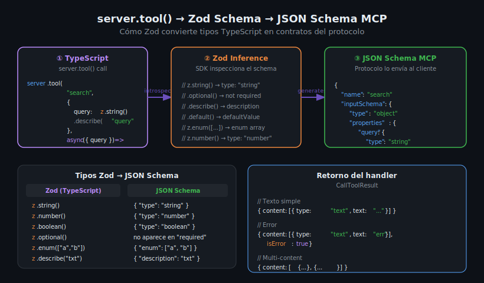

# server.tool() y Zod: Esquemas de Validación



## 🎯 Objetivos

- Dominar la firma completa de `server.tool()` con descripción y schema Zod
- Usar los tipos Zod más comunes: `z.string()`, `z.number()`, `z.enum()`, `z.optional()`
- Entender qué retorna `CallToolResult` y sus variantes (texto, error, multi-content)
- Documentar tools con `.describe()` para que los LLMs los usen correctamente

---

## 1. La firma de server.tool()

`McpServer` expone cuatro sobrecargas de `server.tool()`. La más completa y recomendada incluye
nombre, descripción, schema Zod y handler:

```typescript
server.tool(
  "tool-name",               // string — nombre del tool
  "Tool description",        // string — descripción para el LLM
  {                          // ZodRawShape — schema de inputs
    param: z.string(),
  },
  async ({ param }) => ({    // handler async
    content: [{ type: "text", text: param }],
  }),
);
```

El SDK genera automáticamente el `inputSchema` JSON Schema a partir del objeto Zod.
La descripción aparece en la lista de tools que el cliente LLM recibe.

---

## 2. Tipos Zod más usados en MCP

### Tipos primitivos

```typescript
z.string()          // string
z.number()          // number (entero o decimal)
z.boolean()         // true | false
z.null()            // null
```

### Tipos opcionales y con valor por defecto

```typescript
// Parámetro opcional (no aparece en "required" del JSON Schema)
z.string().optional()

// Con valor por defecto
z.number().default(10)

// Opcional o nulo
z.string().nullable()
```

### Enumeraciones

```typescript
// Solo acepta estos valores
z.enum(["add", "subtract", "multiply", "divide"])

// TypeScript infiere el tipo "add" | "subtract" | "multiply" | "divide"
```

### Documentación con .describe()

```typescript
// .describe() añade "description" al JSON Schema — muy importante para LLMs
z.string().describe("Name of the file to read")
z.number().describe("Number of results to return, between 1 and 100")
z.enum(["asc", "desc"]).describe("Sort order: asc (ascending) or desc (descending)")
```

### Objetos y arrays

```typescript
// Array de strings
z.array(z.string())

// Objeto con campos tipados (para inputs complejos)
z.object({
  name: z.string(),
  age: z.number(),
})
```

---

## 3. Tabla de conversión Zod → JSON Schema

| Zod | JSON Schema generado |
|-----|---------------------|
| `z.string()` | `{ "type": "string" }` |
| `z.number()` | `{ "type": "number" }` |
| `z.boolean()` | `{ "type": "boolean" }` |
| `z.string().optional()` | tipo string, no en `required` |
| `z.enum(["a","b"])` | `{ "enum": ["a", "b"] }` |
| `z.string().describe("x")` | `{ "type": "string", "description": "x" }` |
| `z.number().default(0)` | tipo number con `"default": 0` |
| `z.array(z.string())` | `{ "type": "array", "items": { "type": "string" } }` |

---

## 4. CallToolResult — retorno del handler

El handler de un tool debe retornar un objeto con la forma de `CallToolResult`:

```typescript
// Retorno de texto simple
async ({ a, b }) => ({
  content: [{ type: "text", text: String(a + b) }],
})

// Retorno de múltiples items
async ({ items }) => ({
  content: items.map((item) => ({
    type: "text" as const,
    text: `- ${item}`,
  })),
})

// Retorno de error
async ({ divisor }) => {
  if (divisor === 0) {
    return {
      content: [{ type: "text", text: "Error: division by zero" }],
      isError: true,
    };
  }
  return { content: [{ type: "text", text: String(10 / divisor) }] };
}

// Retorno de objeto JSON como texto
async ({ id }) => ({
  content: [{ type: "text", text: JSON.stringify({ id, name: "example" }, null, 2) }],
})
```

El tipo `content[].type` puede ser `"text"`, `"image"` o `"resource"`.
En este bootcamp usaremos principalmente `"text"`.

---

## 5. Ejemplo completo: tool de búsqueda

```typescript
import { McpServer } from "@modelcontextprotocol/sdk/server/mcp.js";
import { StdioServerTransport } from "@modelcontextprotocol/sdk/server/stdio.js";
import { z } from "zod";

const server = new McpServer({ name: "search-server", version: "1.0.0" });

const ITEMS = ["apple", "banana", "cherry", "date", "elderberry"];

server.tool(
  "search_items",
  "Search for items matching a query string",
  {
    query: z.string().describe("Text to search for in item names"),
    limit: z.number().default(10).describe("Maximum number of results to return"),
    case_sensitive: z.boolean().default(false).describe("Whether the search is case-sensitive"),
  },
  async ({ query, limit, case_sensitive }) => {
    const normalizedQuery = case_sensitive ? query : query.toLowerCase();
    const results = ITEMS
      .filter((item) => {
        const normalizedItem = case_sensitive ? item : item.toLowerCase();
        return normalizedItem.includes(normalizedQuery);
      })
      .slice(0, limit);

    if (results.length === 0) {
      return {
        content: [{ type: "text", text: `No items found for query: "${query}"` }],
      };
    }

    return {
      content: [
        { type: "text", text: `Found ${results.length} items:` },
        { type: "text", text: results.map((r) => `- ${r}`).join("\n") },
      ],
    };
  },
);

const transport = new StdioServerTransport();
await server.connect(transport);
```

---

## 6. Manejo de errores en tools

Hay dos patrones para manejar errores:

### Patrón 1: isError en CallToolResult (recomendado para errores de dominio)

El handler retorna normalmente pero con `isError: true`. El cliente sabe que el tool falló
pero recibe información sobre el error.

```typescript
server.tool(
  "divide",
  { a: z.number(), b: z.number() },
  async ({ a, b }) => {
    if (b === 0) {
      return {
        content: [{ type: "text", text: "Cannot divide by zero" }],
        isError: true,
      };
    }
    return { content: [{ type: "text", text: String(a / b) }] };
  },
);
```

### Patrón 2: throw Error (para errores inesperados del sistema)

El SDK captura el error y lo convierte en una respuesta de error para el cliente.

```typescript
server.tool(
  "read_file",
  { path: z.string() },
  async ({ path }) => {
    // Si readFile lanza, el SDK lo maneja
    const content = await fs.readFile(path, "utf-8");
    return { content: [{ type: "text", text: content }] };
  },
);
```

---

## 7. Errores comunes con Zod y server.tool()

### z.enum() con array variable

```typescript
// ❌ Incorrecto — z.enum() requiere un array literal, no una variable
const OPS = ["add", "subtract"];
z.enum(OPS);

// ✅ Correcto — array literal as const
z.enum(["add", "subtract"] as const);
// o simplemente inline:
z.enum(["add", "subtract"])
```

---

### Olvidar as const en content type

```typescript
// ❌ TypeScript infiere tipo string en lugar de "text"
content: [{ type: "text", text: result }]   // puede fallar con strict

// ✅ Explícito
content: [{ type: "text" as const, text: result }]
// o usando el tipo CallToolResult que ya lo infiere correctamente
```

---

### Handler síncrono en vez de async

```typescript
// ❌ Handler síncrono — puede causar problemas con I/O
server.tool("greet", { name: z.string() }, ({ name }) => ({
  content: [{ type: "text", text: `Hello, ${name}!` }],
}));

// ✅ Siempre async (incluso si no hay await)
server.tool("greet", { name: z.string() }, async ({ name }) => ({
  content: [{ type: "text", text: `Hello, ${name}!` }],
}));
```

---

## ✅ Checklist de Verificación

- [ ] Cada parámetro del tool tiene `.describe()` con descripción útil para el LLM
- [ ] Parámetros opcionales usan `.optional()` o `.default()`
- [ ] El handler es siempre `async`
- [ ] Retorno tiene forma `{ content: [{ type: "text", text: "..." }] }`
- [ ] Los errores de dominio usan `isError: true` en lugar de throw
- [ ] `z.enum()` usa array literal (no variable)
- [ ] MCP Inspector muestra el schema correcto del tool

---

## 📚 Recursos Adicionales

- [Zod Documentation](https://zod.dev/)
- [MCP Tools Specification](https://modelcontextprotocol.io/docs/concepts/tools)
- [TypeScript SDK — server.tool() source](https://github.com/modelcontextprotocol/typescript-sdk/blob/main/src/server/mcp.ts)

---

## 🔗 Navegación

← [01 — McpServer](01-mcpserver-el-sdk-de-typescript-para-mcp.md) | [03 — package.json y tsconfig →](03-package-json-tsconfig-y-compilacion.md)
