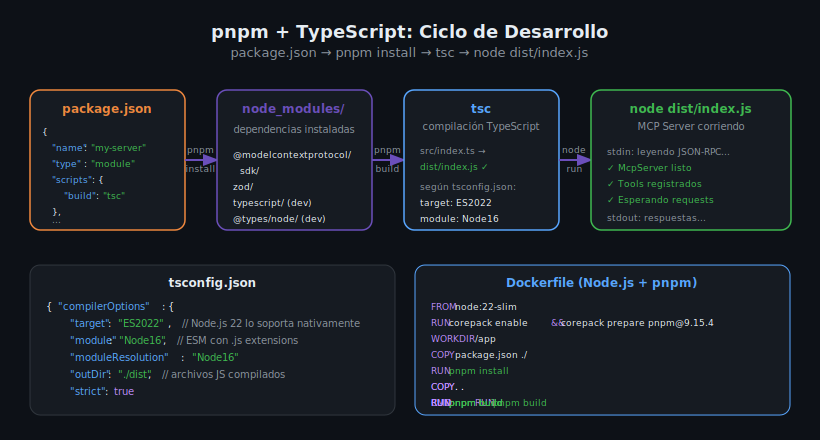

# package.json, tsconfig.json y Compilación TypeScript



## 🎯 Objetivos

- Configurar `package.json` con los campos obligatorios para ESM y MCP
- Entender cada opción clave de `tsconfig.json`
- Dominar el flujo `pnpm install` → `pnpm build` → `node dist/index.js`
- Configurar Docker para automatizar la compilación

---

## 1. package.json — estructura completa

```json
{
  "name": "my-mcp-server",
  "version": "1.0.0",
  "description": "MCP Server in TypeScript",
  "type": "module",
  "main": "dist/index.js",
  "scripts": {
    "build": "tsc",
    "start": "node dist/index.js",
    "dev": "tsx src/index.ts"
  },
  "dependencies": {
    "@modelcontextprotocol/sdk": "1.10.2",
    "zod": "3.24.2"
  },
  "devDependencies": {
    "@types/node": "22.15.3",
    "tsx": "4.19.4",
    "typescript": "5.8.3"
  }
}
```

### Campo `"type": "module"` — obligatorio para ESM

Este campo indica a Node.js que los archivos `.js` del proyecto son módulos ESM.
Sin él, Node.js los trataría como CommonJS y los `import/export` fallarían en runtime.

```json
// ✅ ESM activado — usa import/export
"type": "module"

// ❌ Sin este campo — Node.js asume CommonJS por defecto
// (los import fallan a menos que el archivo use extensión .mjs)
```

### Scripts esenciales

| Script | Comando | Cuándo usarlo |
|--------|---------|---------------|
| `build` | `tsc` | Compilar TypeScript → JavaScript |
| `start` | `node dist/index.js` | Ejecutar el servidor compilado |
| `dev` | `tsx src/index.ts` | Desarrollo rápido sin compilar |

### Versiones exactas — regla del bootcamp

```json
// ✅ CORRECTO — versiones exactas (reproducibles)
"@modelcontextprotocol/sdk": "1.10.2",
"zod": "3.24.2",
"typescript": "5.8.3"

// ❌ INCORRECTO — rangos de versión (riesgo de CVE y builds no reproducibles)
"@modelcontextprotocol/sdk": "^1.10.2",
"zod": "~3.24.0",
"typescript": "*"
```

---

## 2. tsconfig.json — configuración para Node.js 22 + ESM

```json
{
  "compilerOptions": {
    "target": "ES2022",
    "module": "Node16",
    "moduleResolution": "Node16",
    "outDir": "./dist",
    "rootDir": "./src",
    "strict": true,
    "esModuleInterop": true,
    "skipLibCheck": true,
    "declaration": true
  },
  "include": ["src/**/*"],
  "exclude": ["node_modules", "dist"]
}
```

### Opciones clave explicadas

| Opción | Valor | Por qué |
|--------|-------|---------|
| `target` | `"ES2022"` | Node.js 22 soporta ES2022 nativamente — no necesita transpilación de features modernas |
| `module` | `"Node16"` | Sistema de módulos ESM compatible con Node.js — requiere extensiones `.js` en imports |
| `moduleResolution` | `"Node16"` | Algoritmo de resolución compatible con ESM — busca `exports` en `package.json` |
| `outDir` | `"./dist"` | Los archivos `.js` compilados van a `dist/` |
| `rootDir` | `"./src"` | Los fuentes `.ts` están en `src/` |
| `strict` | `true` | Habilita todas las comprobaciones estrictas de TypeScript (`noImplicitAny`, `strictNullChecks`, etc.) |
| `esModuleInterop` | `true` | Compatibilidad con módulos CommonJS que no exportan `default` |
| `skipLibCheck` | `true` | No compila las declaraciones `.d.ts` de `node_modules` — acelera la compilación |
| `declaration` | `true` | Genera archivos `.d.ts` — útil si publicas el paquete como biblioteca |

---

## 3. Flujo de trabajo completo

```bash
# 1. Instalar dependencias
pnpm install

# 2. Compilar TypeScript → JavaScript
pnpm build      # equivale a: npx tsc

# 3. Ejecutar el servidor
pnpm start      # equivale a: node dist/index.js

# Para desarrollo rápido (sin compilar):
pnpm dev        # equivale a: tsx src/index.ts
```

Después de `pnpm build`, la estructura del proyecto es:

```
my-server/
├── src/
│   └── index.ts       ← fuente TypeScript
├── dist/
│   ├── index.js       ← JavaScript compilado ← ejecutar esto
│   └── index.d.ts     ← declaraciones de tipos
├── node_modules/
├── package.json
├── tsconfig.json
└── pnpm-lock.yaml
```

---

## 4. pnpm — gestión de paquetes

### Comandos esenciales

```bash
# Instalar dependencias del package.json
pnpm install

# Agregar una dependencia (siempre con versión exacta)
pnpm add @modelcontextprotocol/sdk@1.10.2

# Agregar dependencia de desarrollo
pnpm add -D typescript@5.8.3

# Ejecutar un script
pnpm build
pnpm start

# Limpiar node_modules y reinstalar
rm -rf node_modules
pnpm install
```

### pnpm vs npm

| Aspecto | pnpm | npm |
|---------|------|-----|
| Velocidad | Muy rápido (symlinks) | Más lento |
| Espacio en disco | Eficiente (store compartido) | Duplica por proyecto |
| Lockfile | `pnpm-lock.yaml` | `package-lock.json` |
| Reproducibilidad | Alta | Alta |

En este bootcamp siempre usamos **pnpm** — nunca `npm install` ni `yarn`.

---

## 5. Dockerfile para TypeScript + pnpm

```dockerfile
FROM node:22-slim

# Activar corepack para usar pnpm con la versión exacta
RUN corepack enable && corepack prepare pnpm@9.15.4 --activate

WORKDIR /app

# Instalar dependencias (primero — aprovecha el cache de Docker)
COPY package.json ./
RUN pnpm install

# Copiar fuentes y compilar
COPY . .
RUN pnpm build

# Ejecutar el servidor compilado
CMD ["node", "dist/index.js"]
```

### docker-compose.yml

```yaml
services:
  server:
    build: .
    container_name: my-mcp-server
    stdin_open: true
    tty: true
```

> `stdin_open: true` y `tty: true` son obligatorios para servidores stdio.
> Sin ellos, `stdin` se cierra inmediatamente y el servidor termina al arrancar.

---

## 6. Variables de entorno y configuración

```dockerfile
# En el Dockerfile o docker-compose.yml
environment:
  - NODE_ENV=development
  - DEBUG=true
```

```typescript
// En src/index.ts — leer variables de entorno
const debug = process.env.DEBUG === "true";

if (debug) {
  console.error("Debug mode enabled");
}
```

---

## 7. Errores comunes de compilación

### Error: Cannot find module '@types/node'

```
error TS2307: Cannot find module 'node:fs' or its corresponding type declarations.
```

**Fix**: instalar `@types/node` como devDependency:

```bash
pnpm add -D @types/node@22.15.3
```

---

### Error: Top-level await no permitido

```
error TS1378: Top-level 'await' expressions are only allowed
when the 'module' option is set to 'es2022', 'esnext', 'system',
'node16', 'node18next', 'nodenext', or 'preserve'
```

**Fix**: asegúrate de tener `"module": "Node16"` en `tsconfig.json`.

---

### La carpeta `dist/` no se actualiza

**Causa**: `pnpm build` no detectó cambios o hubo un error silencioso.  
**Fix**:

```bash
rm -rf dist
pnpm build
```

---

### Docker: error `COPY pnpm-lock.yaml not found`

Si el Dockerfile copia `pnpm-lock.yaml` pero no existe aún:

```dockerfile
# ✅ Solo copiar package.json si no hay lockfile
COPY package.json ./
RUN pnpm install
```

Ejecuta `pnpm install` localmente primero para generar el lockfile,
o usa la versión sin `--frozen-lockfile` en el Dockerfile de aprendizaje.

---

## ✅ Checklist de Verificación

- [ ] `"type": "module"` en `package.json`
- [ ] `"module": "Node16"` en `tsconfig.json`
- [ ] `"moduleResolution": "Node16"` en `tsconfig.json`
- [ ] `pnpm install` completa sin errores
- [ ] `pnpm build` compila sin errores y genera `dist/index.js`
- [ ] `node dist/index.js` arranca el servidor
- [ ] `docker compose up --build` funciona correctamente
- [ ] Versiones de dependencias son exactas (sin `^` ni `~`)

---

## 📚 Recursos Adicionales

- [pnpm Documentation](https://pnpm.io/motivation)
- [TypeScript — tsconfig reference](https://www.typescriptlang.org/tsconfig)
- [Node.js — ESM modules](https://nodejs.org/docs/latest/api/esm.html)
- [Docker — best practices for Node.js](https://docs.docker.com/develop/develop-images/dockerfile_best-practices/)

---

## 🔗 Navegación

← [02 — server.tool() y Zod](02-server-tool-y-zod-esquemas-de-validacion.md) | [04 — ESM Modules →](04-esm-modules-y-node22.md)
