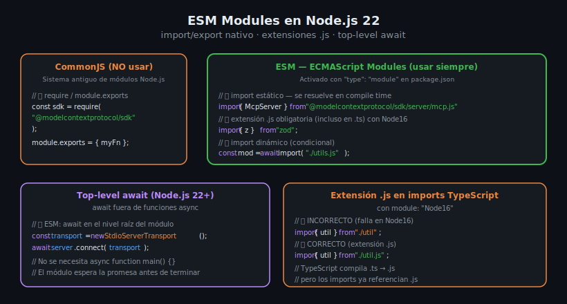

# ESM Modules y Node.js 22



## 🎯 Objetivos

- Entender la diferencia entre CommonJS (CJS) y ESM
- Configurar correctamente `package.json` y `tsconfig.json` para ESM
- Usar top-level `await` en Node.js 22
- Evitar los errores más comunes con extensiones `.js`

---

## 1. ¿Qué son los módulos ESM?

**ESM** (ECMAScript Modules) es el sistema de módulos nativo de JavaScript, estandarizado en ES2015.
A diferencia de CommonJS (el sistema antiguo de Node.js), ESM usa `import/export` estático.

| Característica | CommonJS (CJS) | ESM |
|----------------|----------------|-----|
| Sintaxis | `require()` / `module.exports` | `import` / `export` |
| Carga | Síncrona en runtime | Estática (en compile time) |
| Top-level await | No | Sí (Node.js 14+) |
| Tree shaking | No | Sí |
| `__filename`, `__dirname` | Disponibles | No — usar `import.meta.url` |

---

## 2. Activar ESM en Node.js

### Opción 1: `"type": "module"` en package.json (recomendada)

Todos los archivos `.js` del proyecto se tratan como ESM:

```json
{
  "type": "module"
}
```

### Opción 2: Extensión `.mjs`

Cada archivo individualmente usa la extensión `.mjs`:

```
src/index.mjs    ← ESM
src/legacy.cjs   ← CommonJS
```

En este bootcamp usamos siempre la Opción 1 con `"type": "module"`.

---

## 3. Sintaxis import/export

### Imports nombrados (named imports)

```typescript
// Importar símbolos específicos de un módulo
import { McpServer } from "@modelcontextprotocol/sdk/server/mcp.js";
import { StdioServerTransport } from "@modelcontextprotocol/sdk/server/stdio.js";
import { z } from "zod";
```

### Import default

```typescript
// Módulos que exportan un valor por defecto
import express from "express";
```

### Import de namespace

```typescript
// Importar todo el módulo como objeto
import * as fs from "node:fs/promises";
```

### Import de tipo (solo TypeScript)

```typescript
// No se incluye en el bundle de runtime — solo para tipos
import type { CallToolResult } from "@modelcontextprotocol/sdk/types.js";
```

### Exports

```typescript
// Export nombrado
export function add(a: number, b: number): number {
  return a + b;
}

// Export default
export default class MyServer {}

// Re-export
export { McpServer } from "@modelcontextprotocol/sdk/server/mcp.js";
```

---

## 4. La regla de la extensión .js

Con `"module": "Node16"` en TypeScript, el compilador exige que los imports de archivos locales
incluyan la extensión `.js`. Esto es porque TypeScript compila `.ts` a `.js` y el runtime
de Node.js va a leer el archivo `.js` — por tanto el import debe referenciar `.js`.

```typescript
// src/index.ts — importando un archivo local

// ❌ INCORRECTO — TypeScript en Node16 mode lo rechaza
import { myHelper } from "./helpers";

// ✅ CORRECTO — extensión .js aunque el archivo fuente sea .ts
import { myHelper } from "./helpers.js";
```

Los imports de **paquetes npm** no necesitan extensión:

```typescript
// ✅ Paquetes npm — sin extensión
import { z } from "zod";

// El SDK MCP tiene subcaminos que sí incluyen extensión .js
import { McpServer } from "@modelcontextprotocol/sdk/server/mcp.js";
```

---

## 5. Top-level await en Node.js 22

Con ESM activado, puedes usar `await` directamente en el nivel raíz del módulo,
sin necesidad de envolverlo en `async function main()`:

```typescript
// ✅ Top-level await — limpio y directo
const server = new McpServer({ name: "my-server", version: "1.0.0" });

server.tool("add", { a: z.number(), b: z.number() }, async ({ a, b }) => ({
  content: [{ type: "text", text: String(a + b) }],
}));

const transport = new StdioServerTransport();
await server.connect(transport);  // ← await directo, sin async wrapper
```

Comparado con el patrón CJS antiguo:

```typescript
// ❌ Patrón antiguo — más verboso e innecesario con ESM
async function main() {
  const transport = new StdioServerTransport();
  await server.connect(transport);
}

main().catch(console.error);
```

---

## 6. `import.meta.url` — equivalente a `__dirname`

En CJS, `__dirname` y `__filename` estaban disponibles directamente.
En ESM hay que derivarlos de `import.meta.url`:

```typescript
import { fileURLToPath } from "node:url";
import { dirname, join } from "node:path";

// Equivalente a __filename en CJS
const __filename = fileURLToPath(import.meta.url);

// Equivalente a __dirname en CJS
const __dirname = dirname(__filename);

// Construir una ruta relativa al archivo actual
const configPath = join(__dirname, "config.json");
```

---

## 7. Importar módulos de Node.js con protocolo `node:`

Node.js 22 recomienda usar el protocolo `node:` para módulos built-in:

```typescript
// ✅ Moderno — protocolo node:
import { readFile, writeFile } from "node:fs/promises";
import { join, resolve } from "node:path";
import { env } from "node:process";

// ⚠️ Funciona pero no recomendado en código nuevo
import { readFile } from "fs/promises";
```

---

## 8. Interoperabilidad CJS ↔ ESM

El SDK de MCP y Zod son módulos ESM nativos. Si necesitas importar un paquete CJS en ESM:

```typescript
// Con esModuleInterop: true en tsconfig.json
import express from "express";     // ✅ default import de módulo CJS
import { Router } from "express";  // ✅ named import también funciona
```

`esModuleInterop: true` en `tsconfig.json` agrega el glue necesario.

---

## 9. Errores comunes ESM

### SyntaxError: Cannot use import statement in non-module

```
SyntaxError: Cannot use import statement outside a module
```

**Causa**: falta `"type": "module"` en `package.json` o el archivo tiene extensión `.js`
pero Node.js lo trata como CJS.  
**Fix**: agregar `"type": "module"` o usar extensión `.mjs`.

---

### ERR_MODULE_NOT_FOUND con extensión faltante

```
Error [ERR_MODULE_NOT_FOUND]: Cannot find module './utils'
```

**Fix**: agregar extensión `.js` → `"./utils.js"`.

---

### __dirname is not defined

```
ReferenceError: __dirname is not defined in ES module scope
```

**Fix**: usar `import.meta.url` como se muestra en la sección 6.

---

### Dynamic require not supported

```
Error: require() of ES Module ... not supported
```

**Causa**: intentando usar `require()` dentro de ESM.  
**Fix**: usar `import()` dinámico en su lugar:

```typescript
// ✅ Import dinámico en ESM
const module = await import("./module.js");
```

---

## ✅ Checklist de Verificación

- [ ] `"type": "module"` en `package.json`
- [ ] `"module": "Node16"` y `"moduleResolution": "Node16"` en `tsconfig.json`
- [ ] Todos los imports de archivos locales incluyen `.js`
- [ ] Usar `import` / `export` (nunca `require` / `module.exports`)
- [ ] Top-level `await` sin wrapper `async function main()`
- [ ] Módulos built-in de Node.js importados con prefijo `node:`
- [ ] `console.error` para logs (no `console.log`)

---

## 📚 Recursos Adicionales

- [Node.js — ESM documentation](https://nodejs.org/docs/latest/api/esm.html)
- [TypeScript — module option reference](https://www.typescriptlang.org/tsconfig#module)
- [Node.js — Top-level await](https://nodejs.org/docs/latest/api/esm.html#top-level-await)

---

## 🔗 Navegación

← [03 — package.json y tsconfig](03-package-json-tsconfig-y-compilacion.md) | [05 — Comparativa FastMCP vs McpServer →](05-comparativa-fastmcp-vs-mcpserver.md)
