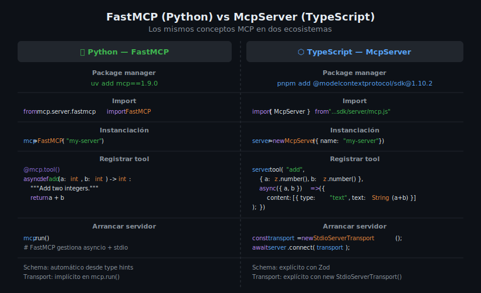

# Comparativa: FastMCP (Python) vs McpServer (TypeScript)



## 🎯 Objetivos

- Identificar las equivalencias exactas entre Python y TypeScript en MCP
- Traducir patterns de FastMCP a McpServer y viceversa
- Entender qué hace automáticamente cada SDK y qué es explícito
- Elegir el lenguaje correcto según el contexto

---

## 1. Filosofía de cada SDK

Ambos SDKs implementan el mismo protocolo MCP, pero con filosofías distintas:

| Aspecto | FastMCP (Python) | McpServer (TypeScript) |
|---------|-----------------|------------------------|
| Registro de tools | Decorador `@mcp.tool()` | Método `server.tool()` |
| Schema de inputs | Automático desde type hints | Explícito con Zod |
| Transport | Implícito en `mcp.run()` | Explícito `new StdioServerTransport()` |
| Lifespan | `@asynccontextmanager` | No nativo — usar variables de módulo |
| Logging hacia cliente | `await ctx.info()` | No disponible directamente en McpServer |
| Descripción de tools | Docstring de la función | Segundo argumento de `server.tool()` |

---

## 2. Tabla de equivalencias línea a línea

### Instalación

```bash
# Python
uv add mcp@1.9.0

# TypeScript
pnpm add @modelcontextprotocol/sdk@1.10.2 zod@3.24.2
```

---

### Import principal

```python
# Python
from mcp.server.fastmcp import FastMCP
```

```typescript
// TypeScript
import { McpServer } from "@modelcontextprotocol/sdk/server/mcp.js";
import { StdioServerTransport } from "@modelcontextprotocol/sdk/server/stdio.js";
import { z } from "zod";
```

---

### Instanciación

```python
# Python
mcp = FastMCP("my-server")
```

```typescript
// TypeScript
const server = new McpServer({
  name: "my-server",
  version: "1.0.0",
});
```

---

### Tool básico

```python
# Python — schema automático desde type hints
@mcp.tool()
async def add(a: int, b: int) -> int:
    """Add two integers and return the result."""
    return a + b
```

```typescript
// TypeScript — schema explícito con Zod
server.tool(
  "add",
  "Add two integers and return the result",
  { a: z.number(), b: z.number() },
  async ({ a, b }) => ({
    content: [{ type: "text", text: String(a + b) }],
  }),
);
```

---

### Parámetro opcional

```python
# Python
@mcp.tool()
async def greet(name: str, greeting: str = "Hello") -> str:
    """Greet a person with an optional custom greeting."""
    return f"{greeting}, {name}!"
```

```typescript
// TypeScript
server.tool(
  "greet",
  "Greet a person with an optional custom greeting",
  {
    name: z.string(),
    greeting: z.string().default("Hello"),
  },
  async ({ name, greeting }) => ({
    content: [{ type: "text", text: `${greeting}, ${name}!` }],
  }),
);
```

---

### Enum / operaciones

```python
# Python — Literal para enums
from typing import Literal

@mcp.tool()
async def calculate(op: Literal["add","sub","mul","div"], a: float, b: float) -> float:
    """Perform a basic arithmetic operation."""
    ops = {"add": a + b, "sub": a - b, "mul": a * b, "div": a / b}
    if op == "div" and b == 0:
        raise ValueError("Division by zero")
    return ops[op]
```

```typescript
// TypeScript — z.enum()
server.tool(
  "calculate",
  "Perform a basic arithmetic operation",
  {
    op: z.enum(["add", "sub", "mul", "div"]),
    a: z.number(),
    b: z.number(),
  },
  async ({ op, a, b }) => {
    if (op === "div" && b === 0) {
      return {
        content: [{ type: "text", text: "Error: division by zero" }],
        isError: true,
      };
    }
    const ops: Record<string, number> = {
      add: a + b,
      sub: a - b,
      mul: a * b,
      div: a / b,
    };
    return { content: [{ type: "text", text: String(ops[op]) }] };
  },
);
```

---

### Retorno de objetos

```python
# Python — retornar dict (FastMCP lo serializa)
@mcp.tool()
async def date_info(date_str: str) -> dict:
    """Parse a date and return information about it."""
    from datetime import datetime, date
    d = datetime.strptime(date_str, "%Y-%m-%d").date()
    today = date.today()
    return {
        "weekday": d.strftime("%A"),
        "days_until": (d - today).days,
        "is_weekend": d.weekday() >= 5,
    }
```

```typescript
// TypeScript — serializar a JSON string
import { z } from "zod";

server.tool(
  "date_info",
  "Parse a date and return information about it",
  { date_str: z.string().describe("Date in YYYY-MM-DD format") },
  async ({ date_str }) => {
    const d = new Date(date_str + "T00:00:00");
    const today = new Date();
    today.setHours(0, 0, 0, 0);
    const diffMs = d.getTime() - today.getTime();
    const days = Math.round(diffMs / (1000 * 60 * 60 * 24));
    const info = {
      weekday: d.toLocaleDateString("en-US", { weekday: "long" }),
      days_until: days,
      is_weekend: d.getDay() === 0 || d.getDay() === 6,
    };
    return {
      content: [{ type: "text", text: JSON.stringify(info, null, 2) }],
    };
  },
);
```

---

### Arrancar el servidor

```python
# Python — FastMCP gestiona asyncio y stdio
if __name__ == "__main__":
    mcp.run()
```

```typescript
// TypeScript — transport explícito + top-level await
const transport = new StdioServerTransport();
await server.connect(transport);
```

---

## 3. Qué hace cada SDK automáticamente

### FastMCP (Python)

| Lo que FastMCP hace automáticamente | Cómo |
|-------------------------------------|------|
| Genera JSON Schema | Introspección de type hints con `inspect` |
| Extrae descripción | Docstring de la función |
| Excluye `ctx: Context` del schema | Detecta el tipo `Context` |
| Gestiona asyncio event loop | Internamente en `mcp.run()` |
| Conecta al transport stdio | Internamente en `mcp.run()` |

### McpServer (TypeScript)

| Lo que McpServer hace automáticamente | Cómo |
|---------------------------------------|------|
| Genera JSON Schema | Introspección del objeto Zod |
| Registra capabilities | Al llamar `server.tool()` |
| Maneja el handshake MCP | En `server.connect(transport)` |
| Responde a `tools/list` | Automáticamente |
| Invoca handlers en `tools/call` | Automáticamente |

---

## 4. Diferencias clave a tener en cuenta

### Schema: implícito vs explícito

FastMCP **infiere** el schema desde los type hints. Si quieres añadir una descripción
a un parámetro, usas `Field(description="...")` de Pydantic. En McpServer, el schema
es **siempre explícito** con Zod — y `.describe()` es la forma estándar.

```python
# Python — descripción con Field
from pydantic import Field

@mcp.tool()
async def search(query: str = Field(description="Text to search for")) -> list[str]:
    ...
```

```typescript
// TypeScript — descripción con .describe()
server.tool(
  "search",
  { query: z.string().describe("Text to search for") },
  async ({ query }) => { ... },
);
```

### Retorno: valor nativo vs CallToolResult

FastMCP acepta que el handler retorne un valor Python nativo (`int`, `str`, `dict`) y lo serializa.
McpServer requiere siempre la forma `{ content: [...] }`.

```python
# Python — retorno nativo
@mcp.tool()
async def add(a: int, b: int) -> int:
    return a + b  # FastMCP serializa el int
```

```typescript
// TypeScript — siempre CallToolResult
server.tool("add", { a: z.number(), b: z.number() }, async ({ a, b }) => ({
  content: [{ type: "text", text: String(a + b) }],  // siempre content[]
}));
```

---

## 5. ¿Cuándo usar cada uno?

| Criterio | Python (FastMCP) | TypeScript (McpServer) |
|----------|-----------------|------------------------|
| Integración con librerías de ML/AI | ✅ Numpy, Pandas, sklearn | ⚠️ Limitado |
| Integración con frontend/web | ⚠️ Flask/FastAPI | ✅ Express, Next.js |
| Tipado explícito | Opcional (type hints) | Obligatorio (Zod) |
| Ecosistema de herramientas | pip/uv | npm/pnpm |
| Velocidad de desarrollo | Rápido con FastMCP | Rápido con McpServer |
| Producción en Node.js | No | ✅ Nativo |

En el bootcamp aprenderemos **ambos** — el protocolo MCP es el mismo, el ecosistema cambia.

---

## ✅ Checklist de Verificación

- [ ] Identificar el equivalente TypeScript de cada construcción Python
- [ ] Schema Zod correcto para cada tipo de parámetro
- [ ] Retorno siempre en formato `{ content: [{ type: "text", text: "..." }] }`
- [ ] Descripción de tools en el segundo argumento de `server.tool()`
- [ ] `await server.connect(transport)` como última expresión del módulo
- [ ] No usar `console.log` (rompe el protocolo MCP)

---

## 📚 Recursos Adicionales

- [MCP Python SDK](https://github.com/modelcontextprotocol/python-sdk)
- [MCP TypeScript SDK](https://github.com/modelcontextprotocol/typescript-sdk)
- [MCP Docs — Building Servers](https://modelcontextprotocol.io/docs/concepts/architecture)

---

## 🔗 Navegación

← [04 — ESM Modules](04-esm-modules-y-node22.md) | [Prácticas →](../2-practicas/README.md)
