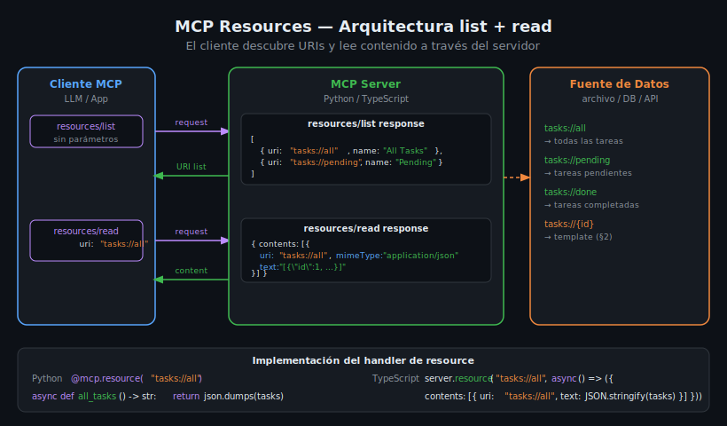

# Resources en MCP — list y read handlers

## 🎯 Objetivos

- Entender qué son los MCP Resources y cómo difieren de los Tools
- Implementar `list` y `read` handlers en Python y TypeScript
- Comprender el formato `ReadResourceResult` y sus `contents`
- Registrar resources con URIs bien definidas

## 📋 Contenido

### 1. ¿Qué es un Resource MCP?

Un **Resource** es un primitivo del protocolo MCP que expone datos de forma direccionable mediante URIs.
A diferencia de los Tools, que **ejecutan acciones**, los Resources **leen información**.

```
tools/call   → ejecuta lógica, puede mutar estado, retorna CallToolResult
resources/read → lee datos, idealmente sin efectos secundarios, retorna ReadResourceResult
```

El cliente (un LLM o aplicación) puede:

1. **Descubrir** qué recursos existen: `resources/list`
2. **Leer** el contenido de un recurso concreto: `resources/read`

Piensa en los resources como endpoints de solo lectura, similares a `GET` en REST,
pero con URIs propias del dominio (`tasks://`, `db://`, `file://`).



---

### 2. El protocolo resources/list

Cuando el cliente llama `resources/list` (sin parámetros), el servidor retorna un array de objetos `Resource`:

```json
{
  "resources": [
    {
      "uri": "tasks://all",
      "name": "All Tasks",
      "description": "Returns all tasks in the system",
      "mimeType": "application/json"
    },
    {
      "uri": "tasks://pending",
      "name": "Pending Tasks",
      "mimeType": "application/json"
    }
  ]
}
```

Campos del objeto `Resource`:

| Campo         | Tipo     | Requerido | Descripción                                 |
|---------------|----------|-----------|---------------------------------------------|
| `uri`         | `string` | ✅        | Identificador único. Formato libre de URI   |
| `name`        | `string` | ✅        | Nombre legible para humanos y el LLM        |
| `description` | `string` | ❌        | Explicación adicional para el LLM           |
| `mimeType`    | `string` | ❌        | Tipo de contenido (`application/json`, etc.)|

---

### 3. El protocolo resources/read

El cliente envía una URI y el servidor retorna su contenido:

```json
// Request
{ "uri": "tasks://all" }

// Response
{
  "contents": [
    {
      "uri": "tasks://all",
      "mimeType": "application/json",
      "text": "[{\"id\": 1, \"title\": \"Estudiar MCP\", \"done\": false}]"
    }
  ]
}
```

El contenido puede ser:
- **`text`**: string con el contenido (texto plano, JSON, Markdown, etc.)
- **`blob`**: contenido binario en base64 (imágenes, PDFs, etc.)

---

### 4. Implementación en Python — FastMCP

FastMCP permite registrar resources con el decorador `@mcp.resource()`:

```python
import json
from mcp.server.fastmcp import FastMCP

mcp = FastMCP("task-manager")

# Datos en memoria (en producción sería una DB)
TASKS: list[dict] = [
    {"id": 1, "title": "Aprender MCP Resources", "done": False, "priority": "high"},
    {"id": 2, "title": "Crear primer server completo", "done": False, "priority": "medium"},
    {"id": 3, "title": "Estudiar JSON-RPC", "done": True, "priority": "low"},
]


@mcp.resource("tasks://all")
async def all_tasks() -> str:
    """Returns all tasks as JSON."""
    return json.dumps(TASKS, ensure_ascii=False)


@mcp.resource("tasks://pending")
async def pending_tasks() -> str:
    """Returns only pending (not done) tasks."""
    pending = [t for t in TASKS if not t["done"]]
    return json.dumps(pending, ensure_ascii=False)


@mcp.resource("tasks://done")
async def completed_tasks() -> str:
    """Returns only completed tasks."""
    done = [t for t in TASKS if t["done"]]
    return json.dumps(done, ensure_ascii=False)


if __name__ == "__main__":
    mcp.run()
```

**Puntos clave:**
- El decorador toma la URI como argumento
- La función retorna `str` (FastMCP infiere `mimeType: text/plain`)
- Para JSON explícito, retornar `json.dumps(...)` y opcionalmente anotar el mime type

---

### 5. Implementación en Python — con mimeType explícito

Para indicar `mimeType: application/json`, usa `Resource` y `TextResourceContents`:

```python
from mcp.server.fastmcp import FastMCP
from mcp.types import Resource, TextResourceContents
import json

mcp = FastMCP("task-manager")

TASKS: list[dict] = []  # llenaría desde DB


# Con FastMCP, el mime type se puede especificar en la URI:
@mcp.resource("tasks://all", mime_type="application/json")
async def all_tasks() -> str:
    """Returns all tasks as JSON."""
    return json.dumps(TASKS, ensure_ascii=False)
```

---

### 6. Implementación en TypeScript

Con el SDK de TypeScript, los resources se registran con `server.resource()`:

```typescript
import { Server } from "@modelcontextprotocol/sdk/server/index.js";
import { StdioServerTransport } from "@modelcontextprotocol/sdk/server/stdio.js";
import {
  ListResourcesRequestSchema,
  ReadResourceRequestSchema,
} from "@modelcontextprotocol/sdk/types.js";

interface Task {
  id: number;
  title: string;
  done: boolean;
  priority: "high" | "medium" | "low";
}

const tasksDb: Task[] = [
  { id: 1, title: "Aprender MCP Resources", done: false, priority: "high" },
  { id: 2, title: "Crear primer server completo", done: false, priority: "medium" },
  { id: 3, title: "Estudiar JSON-RPC", done: true, priority: "low" },
];

const server = new Server({ name: "task-manager", version: "1.0.0" });

// resources/list handler — lista todos los resources disponibles
server.setRequestHandler(ListResourcesRequestSchema, async () => ({
  resources: [
    {
      uri: "tasks://all",
      name: "All Tasks",
      description: "Returns all tasks in the system",
      mimeType: "application/json",
    },
    {
      uri: "tasks://pending",
      name: "Pending Tasks",
      mimeType: "application/json",
    },
    {
      uri: "tasks://done",
      name: "Completed Tasks",
      mimeType: "application/json",
    },
  ],
}));

// resources/read handler — lee el contenido de una URI específica
server.setRequestHandler(ReadResourceRequestSchema, async (request) => {
  const { uri } = request.params;

  if (uri === "tasks://all") {
    return {
      contents: [
        {
          uri,
          mimeType: "application/json",
          text: JSON.stringify(tasksDb),
        },
      ],
    };
  }

  if (uri === "tasks://pending") {
    const pending = tasksDb.filter((t) => !t.done);
    return {
      contents: [{ uri, mimeType: "application/json", text: JSON.stringify(pending) }],
    };
  }

  if (uri === "tasks://done") {
    const done = tasksDb.filter((t) => t.done);
    return {
      contents: [{ uri, mimeType: "application/json", text: JSON.stringify(done) }],
    };
  }

  throw new Error(`Unknown resource URI: ${uri}`);
});

const transport = new StdioServerTransport();
await server.connect(transport);
```

---

### 7. Convenciones de URI para Resources

El protocolo MCP no impone un formato específico para las URIs, pero la convención recomendada es:

```
scheme://path
```

Ejemplos de esquemas usados en la industria:

| Scheme      | Uso típico                          |
|-------------|-------------------------------------|
| `tasks://`  | Sistema de tareas                   |
| `db://`     | Acceso a base de datos              |
| `file://`   | Archivos del sistema                |
| `config://` | Configuración de la aplicación      |
| `users://`  | Datos de usuarios                   |
| `docs://`   | Documentación y referencias         |

**Reglas recomendadas:**
- URIs en minúsculas: `tasks://all` (no `Tasks://All`)
- Separar segmentos con `/`: `users://john/tasks`
- Usar nombres descriptivos: `tasks://pending` (no `tasks://1`)
- Reservar `{param}` para templates (semana siguiente)

---

### 8. Errores comunes

**Error 1: Olvidar registrar la URI en `resources/list`**

Si `resources/read` maneja una URI pero `resources/list` no la incluye, el cliente no puede
descubrir el resource aunque pueda leerlo si conoce la URI. Siempre mantener ambos sincronizados.

```python
# ❌ INCORRECTO — resource no listado
@mcp.resource("tasks://secret")  # el cliente no puede descubrirlo
async def secret_tasks() -> str:
    return json.dumps(TASKS)
```

**Error 2: Retornar objetos Python en lugar de strings**

```python
# ❌ INCORRECTO — retorna dict, no str
@mcp.resource("tasks://all")
async def all_tasks() -> dict:
    return TASKS  # Error: el SDK espera str

# ✅ CORRECTO
@mcp.resource("tasks://all")
async def all_tasks() -> str:
    return json.dumps(TASKS)
```

**Error 3: URIs inconsistentes entre list y read**

```typescript
// ❌ INCORRECTO — URIs distintas en list vs read
// En list: uri = "tasks://all-tasks"
// En read: if (uri === "tasks://all") → nunca matchea

// ✅ CORRECTO — misma URI en ambos handlers
```

---

### 9. Verificar resources con MCP Inspector

Para probar tus resources sin un cliente LLM, usa MCP Inspector:

```bash
# Python
npx @modelcontextprotocol/inspector uv run python src/server.py

# TypeScript
npx @modelcontextprotocol/inspector node dist/index.js
```

En MCP Inspector:
1. Ir a la pestaña **Resources**
2. Hacer clic en **List Resources** → verás los resources registrados
3. Hacer clic en cualquier URI → verás el contenido devuelto

---

## ✅ Checklist de Verificación

- [ ] `resources/list` retorna al menos 2 resources con URI, name y mimeType
- [ ] `resources/read` maneja todas las URIs declaradas en `resources/list`
- [ ] Los handlers retornan `str` serializado (no objetos)
- [ ] Las URIs siguen el formato `scheme://path`
- [ ] Las URIs son consistentes entre list y read
- [ ] `resources/read` lanza error para URIs desconocidas

## 📚 Recursos Adicionales

- [MCP Specification — Resources](https://spec.modelcontextprotocol.io/specification/server/resources/)
- [Python SDK — FastMCP resources](https://github.com/modelcontextprotocol/python-sdk/blob/main/docs/server.md)
- [TypeScript SDK — Resources example](https://github.com/modelcontextprotocol/typescript-sdk/tree/main/examples)
