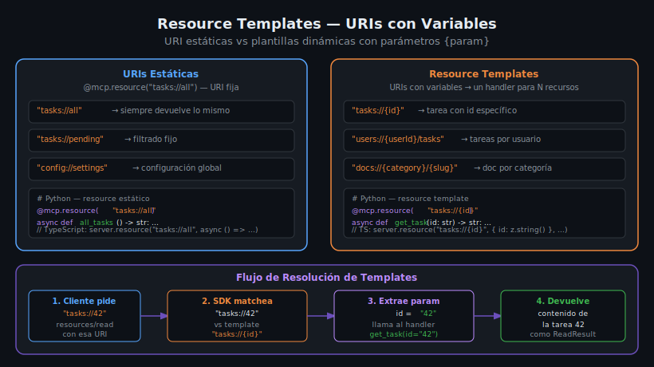

# Resource Templates — URIs con Variables

## 🎯 Objetivos

- Entender qué son los resource templates y cuándo usarlos
- Implementar templates en Python y TypeScript
- Extraer parámetros dinámicos desde la URI solicitada
- Combinar resources estáticos con templates en un mismo server

## 📋 Contenido

### 1. ¿Qué es un Resource Template?

Un **resource template** es una URI con variables que permiten que un solo handler
responda a infinitas URIs posibles. Mientras que un resource estático tiene una URI fija
como `tasks://all`, un template tiene variables entre llaves: `tasks://{id}`.

```
Resource estático:  tasks://all       → siempre el mismo contenido
Resource template:  tasks://{id}      → contenido diferente según el valor de {id}
```

Esto es equivalente a los parámetros de ruta en REST:
```
REST:    GET /tasks/:id
MCP:     tasks://{id}
```



---

### 2. El protocolo resources/templates/list

Los templates se declaran en `resources/templates/list` (separado de `resources/list`).
El cliente puede descubrirlos igual que los resources estáticos:

```json
// Response de resources/templates/list
{
  "resourceTemplates": [
    {
      "uriTemplate": "tasks://{id}",
      "name": "Task by ID",
      "description": "Returns a specific task by its numeric ID",
      "mimeType": "application/json"
    },
    {
      "uriTemplate": "users://{userId}/tasks",
      "name": "Tasks by User",
      "mimeType": "application/json"
    }
  ]
}
```

El campo es `uriTemplate` (no `uri`) y usa sintaxis RFC 6570 para las variables.

---

### 3. Implementación en Python — FastMCP

Con FastMCP, simplemente incluye `{param}` en la URI del decorador.
FastMCP detecta automáticamente el template y pasa los parámetros como argumentos:

```python
import json
from mcp.server.fastmcp import FastMCP

mcp = FastMCP("task-manager")

TASKS: list[dict] = [
    {"id": 1, "title": "Aprender MCP", "done": False, "priority": "high"},
    {"id": 2, "title": "Primer server", "done": False, "priority": "medium"},
    {"id": 3, "title": "JSON-RPC", "done": True, "priority": "low"},
]


@mcp.resource("tasks://{task_id}")
async def get_task_by_id(task_id: str) -> str:
    """Returns a specific task by its ID.

    Args:
        task_id: The numeric ID of the task as a string.
    """
    # Los parámetros de URI siempre llegan como str, convertir cuando sea necesario
    task = next((t for t in TASKS if str(t["id"]) == task_id), None)

    if task is None:
        # Retornar mensaje de error como JSON
        return json.dumps({"error": f"Task with id={task_id} not found"})

    return json.dumps(task, ensure_ascii=False)


@mcp.resource("tasks://{task_id}/subtasks")
async def get_task_subtasks(task_id: str) -> str:
    """Returns subtasks of a specific task."""
    # URI template con múltiples segmentos también funciona
    return json.dumps({"task_id": task_id, "subtasks": []})


if __name__ == "__main__":
    mcp.run()
```

---

### 4. Múltiples variables en la URI

Un template puede tener más de una variable:

```python
@mcp.resource("users://{user_id}/tasks/{task_id}")
async def get_user_task(user_id: str, task_id: str) -> str:
    """Returns a specific task belonging to a specific user."""
    # FastMCP extrae ambas variables y las pasa como argumentos nombrados
    return json.dumps({
        "user_id": user_id,
        "task_id": task_id,
        "found": False,  # implementar lógica real
    })
```

---

### 5. Implementación en TypeScript

Con el SDK de TypeScript, los templates se registran con `server.resource()` añadiendo
un schema Zod para las variables:

```typescript
import { Server } from "@modelcontextprotocol/sdk/server/index.js";
import { StdioServerTransport } from "@modelcontextprotocol/sdk/server/stdio.js";
import {
  ListResourceTemplatesRequestSchema,
  ReadResourceRequestSchema,
} from "@modelcontextprotocol/sdk/types.js";
import { z } from "zod";

interface Task {
  id: number;
  title: string;
  done: boolean;
  priority: "high" | "medium" | "low";
}

const tasksDb: Task[] = [
  { id: 1, title: "Aprender MCP", done: false, priority: "high" },
  { id: 2, title: "Primer server", done: false, priority: "medium" },
  { id: 3, title: "JSON-RPC", done: true, priority: "low" },
];

const server = new Server({ name: "task-manager", version: "1.0.0" });

// Declarar los templates disponibles
server.setRequestHandler(ListResourceTemplatesRequestSchema, async () => ({
  resourceTemplates: [
    {
      uriTemplate: "tasks://{id}",
      name: "Task by ID",
      description: "Returns a specific task by its numeric ID",
      mimeType: "application/json",
    },
  ],
}));

// Manejar la lectura — el SDK pasa la URI completa
server.setRequestHandler(ReadResourceRequestSchema, async (request) => {
  const { uri } = request.params;

  // Extraer el ID del template manualmente (o usar una librería de matching)
  const taskMatch = uri.match(/^tasks:\/\/(\d+)$/);
  if (taskMatch) {
    const id = parseInt(taskMatch[1], 10);
    const task = tasksDb.find((t) => t.id === id);

    if (!task) {
      return {
        contents: [
          {
            uri,
            mimeType: "application/json",
            text: JSON.stringify({ error: `Task ${id} not found` }),
          },
        ],
      };
    }

    return {
      contents: [
        {
          uri,
          mimeType: "application/json",
          text: JSON.stringify(task),
        },
      ],
    };
  }

  throw new Error(`Unknown resource URI: ${uri}`);
});

const transport = new StdioServerTransport();
await server.connect(transport);
```

---

### 6. Patrón helper: URI matcher

Para servers con muchos templates, un helper que haga el matching es más limpio:

```typescript
// utils/uri-matcher.ts
export function matchUriTemplate(
  template: string,
  uri: string,
): Record<string, string> | null {
  // Convierte "tasks://{id}" en regex "^tasks://([^/]+)$"
  const paramNames: string[] = [];
  const regexStr = template.replace(/\{(\w+)\}/g, (_, name) => {
    paramNames.push(name);
    return "([^/]+)";
  });

  const match = uri.match(new RegExp(`^${regexStr}$`));
  if (!match) return null;

  return Object.fromEntries(paramNames.map((name, i) => [name, match[i + 1]]));
}

// Uso en el handler:
// matchUriTemplate("tasks://{id}", "tasks://42") → { id: "42" }
// matchUriTemplate("tasks://{id}", "tasks://all") → null
```

---

### 7. Resources estáticos + Templates combinados

En un server real tendrás ambos tipos. La forma de organizarlos en TypeScript:

```typescript
server.setRequestHandler(ReadResourceRequestSchema, async (request) => {
  const { uri } = request.params;

  // 1. Primero verificar URIs estáticas exactas
  if (uri === "tasks://all") {
    return { contents: [{ uri, mimeType: "application/json", text: JSON.stringify(tasksDb) }] };
  }

  if (uri === "tasks://pending") {
    const pending = tasksDb.filter((t) => !t.done);
    return { contents: [{ uri, mimeType: "application/json", text: JSON.stringify(pending) }] };
  }

  // 2. Luego intentar templates
  const taskMatch = uri.match(/^tasks:\/\/(\d+)$/);
  if (taskMatch) {
    const task = tasksDb.find((t) => t.id === parseInt(taskMatch[1], 10));
    return {
      contents: [
        { uri, mimeType: "application/json", text: JSON.stringify(task ?? { error: "Not found" }) },
      ],
    };
  }

  // 3. URI desconocida
  throw new Error(`Unknown resource URI: ${uri}`);
});
```

---

### 8. Cuándo usar templates vs resources estáticos

| Caso de uso                                | Solución recomendada          |
|--------------------------------------------|-------------------------------|
| "Dame todas las tareas"                    | Resource estático: `tasks://all` |
| "Dame la tarea con id=42"                  | Template: `tasks://{id}`      |
| "Dame las tareas del usuario con id=7"     | Template: `users://{userId}/tasks` |
| "Dame la configuración global"             | Resource estático: `config://settings` |
| "Dame el documento por categoría y slug"   | Template: `docs://{cat}/{slug}` |

**Regla práctica:** Si necesitas pasar un identificador variable, usa template.
Si el contenido es siempre el mismo o filtrado por un criterio fijo, usa resource estático.

---

### 9. Validación de parámetros extraídos

Los parámetros de URI siempre llegan como `string`. Valida antes de usar:

```python
@mcp.resource("tasks://{task_id}")
async def get_task_by_id(task_id: str) -> str:
    """Returns a task by ID."""
    # Validar que sea un entero antes de buscar
    if not task_id.isdigit():
        return json.dumps({"error": "task_id must be a positive integer"})

    task = next((t for t in TASKS if t["id"] == int(task_id)), None)
    if task is None:
        return json.dumps({"error": f"Task {task_id} not found"})

    return json.dumps(task)
```

---

### 10. Errores comunes

**Error 1: Confundir template con resource estático**

```python
# ❌ INCORRECTO — URL con valor concreto, no template
@mcp.resource("tasks://42")  # solo responde a id=42

# ✅ CORRECTO — template dinámico
@mcp.resource("tasks://{task_id}")  # responde a cualquier id
```

**Error 2: No manejar IDs no encontrados**

```python
# ❌ INCORRECTO — lanza KeyError si no existe
@mcp.resource("tasks://{task_id}")
async def get_task(task_id: str) -> str:
    return json.dumps(TASKS[int(task_id)])  # IndexError posible

# ✅ CORRECTO
@mcp.resource("tasks://{task_id}")
async def get_task(task_id: str) -> str:
    task = next((t for t in TASKS if str(t["id"]) == task_id), None)
    if task is None:
        return json.dumps({"error": f"Not found: {task_id}"})
    return json.dumps(task)
```

**Error 3: Olvidar declarar el template en `templates/list`**

El template debe aparecer en `resources/templates/list` para que el cliente lo descubra.
Con FastMCP esto se hace automáticamente cuando usas `{param}` en la URI.
Con el SDK de bajo nivel, debes registrarlo manualmente en `ListResourceTemplatesRequestSchema`.

---

## ✅ Checklist de Verificación

- [ ] Template registrado con sintaxis `{param}` en la URI
- [ ] Handler recibe el parámetro como argumento `str`
- [ ] Validar que el parámetro tiene el formato esperado antes de usarlo
- [ ] Manejar el caso "no encontrado" retornando mensaje de error en JSON
- [ ] Template declarado en `resources/templates/list` (automático en FastMCP)
- [ ] Distinción clara entre resources estáticos y templates en el código

## 📚 Recursos Adicionales

- [MCP Spec — Resource Templates](https://spec.modelcontextprotocol.io/specification/server/resources/#resource-templates)
- [RFC 6570 — URI Template](https://www.rfc-editor.org/rfc/rfc6570)
- [FastMCP — Resource templates](https://github.com/modelcontextprotocol/python-sdk)
