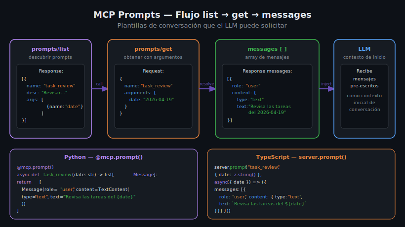

# Prompts MCP — Argumentos y Plantillas de Mensajes

## 🎯 Objetivos

- Entender qué son los MCP Prompts y en qué se diferencian de Tools y Resources
- Implementar prompts con argumentos dinámicos en Python y TypeScript
- Construir arrays de mensajes (`Message[]`) con roles correctos
- Diseñar plantillas de conversación útiles para usuarios de LLMs

## 📋 Contenido

### 1. ¿Qué es un Prompt MCP?

Un **Prompt** es el tercer primitivo del protocolo MCP. Su función es exponer
**plantillas de conversación** reutilizables que el LLM puede usar para iniciar
o enriquecer una conversación.

```
Tools     → ejecutan acciones (side effects posibles)
Resources → leen datos (solo lectura, direccionable por URI)
Prompts   → devuelven mensajes pre-escritos para el LLM (plantillas)
```

La metáfora más útil: imagina que los Prompts son como **snippets de sistema de prompting**
que el usuario o el LLM pueden invocar para obtener un contexto de conversación predefinido.

Un ejemplo concreto: un prompt `code_review` que, dado un lenguaje y el código, genera
los mensajes correctos para que el LLM haga una revisión detallada.



---

### 2. El protocolo prompts/list

El cliente llama `prompts/list` para descubrir qué prompts ofrece el servidor:

```json
// Response
{
  "prompts": [
    {
      "name": "daily_review",
      "description": "Generates a daily task review conversation starter",
      "arguments": [
        {
          "name": "date",
          "description": "Review date in YYYY-MM-DD format",
          "required": true
        }
      ]
    },
    {
      "name": "task_analysis",
      "description": "Analyzes a specific task and suggests improvements",
      "arguments": [
        {
          "name": "task_id",
          "description": "Numeric task ID",
          "required": true
        },
        {
          "name": "detail_level",
          "description": "Level of detail: brief or detailed",
          "required": false
        }
      ]
    }
  ]
}
```

---

### 3. El protocolo prompts/get

El cliente envía el nombre del prompt y sus argumentos:

```json
// Request
{
  "name": "daily_review",
  "arguments": {
    "date": "2026-04-19"
  }
}

// Response
{
  "description": "Daily review for 2026-04-19",
  "messages": [
    {
      "role": "user",
      "content": {
        "type": "text",
        "text": "Revisa mis tareas pendientes del 2026-04-19 y dame un resumen de lo que debo priorizar hoy."
      }
    }
  ]
}
```

El array `messages` sigue el formato de conversación de los LLMs:
- `role`: `"user"` o `"assistant"`
- `content.type`: `"text"`, `"image"`, o `"resource"`
- `content.text`: el texto del mensaje

---

### 4. Implementación en Python — FastMCP

Con FastMCP, el decorador `@mcp.prompt()` convierte la función en un prompt registrado:

```python
from mcp.server.fastmcp import FastMCP
from mcp.types import Message, TextContent

mcp = FastMCP("task-manager")


@mcp.prompt()
async def daily_review(date: str) -> list[Message]:
    """Generates a daily task review prompt.

    Args:
        date: The date to review in YYYY-MM-DD format.
    """
    return [
        Message(
            role="user",
            content=TextContent(
                type="text",
                text=(
                    f"Por favor revisa mis tareas pendientes del {date}. "
                    "Dame un resumen de prioridades y sugiere en qué orden abordarlas."
                ),
            ),
        )
    ]


@mcp.prompt()
async def task_analysis(task_id: str, detail_level: str = "brief") -> list[Message]:
    """Analyzes a specific task and provides suggestions.

    Args:
        task_id: The numeric ID of the task to analyze.
        detail_level: Level of detail: 'brief' or 'detailed'.
    """
    verbosity = "de forma breve" if detail_level == "brief" else "con todos los detalles posibles"

    return [
        Message(
            role="user",
            content=TextContent(
                type="text",
                text=(
                    f"Analiza la tarea con ID {task_id} {verbosity}. "
                    "Identifica posibles bloqueos y sugiere los próximos pasos."
                ),
            ),
        )
    ]


if __name__ == "__main__":
    mcp.run()
```

**Puntos clave:**
- Retornar `list[Message]` (o `list[dict]` en versiones más antiguas del SDK)
- Cada `Message` tiene `role` y `content`
- Los argumentos opcionales tienen valores por defecto
- FastMCP infiere los argumentos del prompt desde la firma de la función

---

### 5. Prompt con múltiples mensajes

Un prompt puede retornar una conversación completa con varios turnos:

```python
@mcp.prompt()
async def code_review_session(language: str, code: str) -> list[Message]:
    """Starts a code review conversation.

    Args:
        language: Programming language of the code.
        code: The code to review.
    """
    return [
        # Primer mensaje del sistema (como "user" porque MCP no tiene role "system")
        Message(
            role="user",
            content=TextContent(
                type="text",
                text=(
                    f"Eres un experto en {language}. "
                    "Voy a mostrarte código para que lo revises."
                ),
            ),
        ),
        # Respuesta "plantilla" del assistant para dar contexto
        Message(
            role="assistant",
            content=TextContent(
                type="text",
                text="Entendido. Muéstrame el código y lo revisaré en detalle.",
            ),
        ),
        # El código real a revisar
        Message(
            role="user",
            content=TextContent(
                type="text",
                text=f"```{language}\n{code}\n```",
            ),
        ),
    ]
```

---

### 6. Implementación en TypeScript

Con el SDK de TypeScript, los prompts se registran con `server.prompt()`:

```typescript
import { Server } from "@modelcontextprotocol/sdk/server/index.js";
import { StdioServerTransport } from "@modelcontextprotocol/sdk/server/stdio.js";
import {
  ListPromptsRequestSchema,
  GetPromptRequestSchema,
} from "@modelcontextprotocol/sdk/types.js";
import { z } from "zod";

const server = new Server({ name: "task-manager", version: "1.0.0" });

// prompts/list — devuelve la lista de prompts disponibles
server.setRequestHandler(ListPromptsRequestSchema, async () => ({
  prompts: [
    {
      name: "daily_review",
      description: "Generates a daily task review conversation starter",
      arguments: [
        { name: "date", description: "Review date (YYYY-MM-DD)", required: true },
      ],
    },
    {
      name: "task_analysis",
      description: "Analyzes a specific task",
      arguments: [
        { name: "task_id", description: "Task ID", required: true },
        { name: "detail_level", description: "brief or detailed", required: false },
      ],
    },
  ],
}));

// prompts/get — resuelve el prompt con los argumentos
server.setRequestHandler(GetPromptRequestSchema, async (request) => {
  const { name, arguments: args } = request.params;

  if (name === "daily_review") {
    const date = args?.date ?? "today";
    return {
      description: `Daily review for ${date}`,
      messages: [
        {
          role: "user" as const,
          content: {
            type: "text" as const,
            text: `Por favor revisa mis tareas pendientes del ${date}. Dame un resumen de prioridades.`,
          },
        },
      ],
    };
  }

  if (name === "task_analysis") {
    const taskId = args?.task_id ?? "unknown";
    const detail = args?.detail_level ?? "brief";
    const verbosity = detail === "brief" ? "de forma breve" : "con todos los detalles";

    return {
      description: `Analysis for task ${taskId}`,
      messages: [
        {
          role: "user" as const,
          content: {
            type: "text" as const,
            text: `Analiza la tarea con ID ${taskId} ${verbosity}. Sugiere los próximos pasos.`,
          },
        },
      ],
    };
  }

  throw new Error(`Unknown prompt: ${name}`);
});

const transport = new StdioServerTransport();
await server.connect(transport);
```

---

### 7. Prompt con resource embebido

Los prompts pueden incluir contenido de resources en sus mensajes:

```python
@mcp.prompt()
async def analyze_tasks(date: str) -> list[Message]:
    """Analyzes all pending tasks with full context.

    Args:
        date: The date of the analysis.
    """
    return [
        Message(
            role="user",
            content=TextContent(
                type="text",
                text=(
                    f"Tengo las siguientes tareas pendientes al {date}. "
                    "Analiza cuáles son las más críticas y propón un plan de acción:\n\n"
                    # El cliente puede resolver el resource tasks://pending
                    # e incluir su contenido en la conversación
                    "{{resource: tasks://pending}}"
                ),
            ),
        )
    ]
```

---

### 8. Diseño de prompts efectivos

Un buen prompt MCP:

1. **Tiene nombre descriptivo** en `snake_case`: `daily_review`, `code_review`, `summarize_doc`
2. **Documenta sus argumentos** para que el LLM sepa cuándo invocarlo
3. **Genera mensajes concretos** con instrucciones claras
4. **Interpola los argumentos** en el texto del mensaje
5. **Es reutilizable** para diferentes valores de argumentos

```python
# ✅ Buen prompt — nombre claro, args documentados, mensaje concreto
@mcp.prompt()
async def summarize_by_priority(priority: str) -> list[Message]:
    """Summarizes all tasks with a given priority level.

    Args:
        priority: Priority level: high, medium, or low.
    """
    return [
        Message(
            role="user",
            content=TextContent(
                type="text",
                text=f"Muéstrame un resumen de todas las tareas con prioridad '{priority}'. "
                     "Ordénalas por fecha de creación y destaca cuáles están bloqueadas.",
            ),
        )
    ]


# ❌ Mal prompt — nombre vago, sin documentación de args
@mcp.prompt()
async def do_stuff(x: str) -> list[Message]:
    return [Message(role="user", content=TextContent(type="text", text=x))]
```

---

### 9. Errores comunes

**Error 1: Retornar str en lugar de list[Message]**

```python
# ❌ INCORRECTO
@mcp.prompt()
async def daily_review(date: str) -> str:
    return f"Revisa las tareas del {date}"

# ✅ CORRECTO
@mcp.prompt()
async def daily_review(date: str) -> list[Message]:
    return [Message(role="user", content=TextContent(type="text", text=f"Revisa las tareas del {date}"))]
```

**Error 2: Role incorrecto en TypeScript (tipo de string)**

```typescript
// ❌ INCORRECTO — TypeScript pierde el tipo literal
const messages = [{ role: "user", content: { type: "text", text: "..." } }];

// ✅ CORRECTO — usar "as const" para preservar el tipo literal
const messages = [{ role: "user" as const, content: { type: "text" as const, text: "..." } }];
```

**Error 3: No declarar el prompt en `prompts/list`**

```typescript
// ❌ INCORRECTO — el prompt existe en get pero no en list
// El cliente no puede descubrirlo automáticamente
```

---

## ✅ Checklist de Verificación

- [ ] Prompts declarados en `prompts/list` con nombre, descripción y argumentos
- [ ] `prompts/get` maneja todos los nombres declarados en `prompts/list`
- [ ] Cada `Message` tiene `role` (`user` o `assistant`) y `content.type`
- [ ] Los argumentos se interpolan en el texto del mensaje
- [ ] Los argumentos opcionales tienen valores por defecto
- [ ] Los nombres de prompts son descriptivos en `snake_case`

## 📚 Recursos Adicionales

- [MCP Specification — Prompts](https://spec.modelcontextprotocol.io/specification/server/prompts/)
- [MCP Python SDK — Prompts](https://github.com/modelcontextprotocol/python-sdk)
- [MCP TypeScript SDK — Prompts example](https://github.com/modelcontextprotocol/typescript-sdk)
