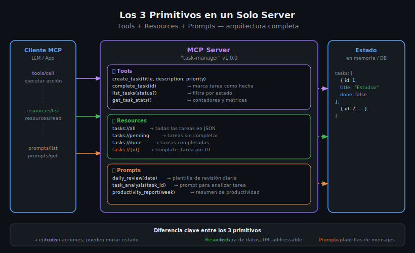

# Combinando los 3 Primitivos — Server Completo

## 🎯 Objetivos

- Integrar Tools, Resources y Prompts en un único server MCP funcional
- Entender la separación de responsabilidades entre los 3 primitivos
- Implementar el server completo en Python y TypeScript
- Verificar que los 3 primitivos coexisten y se comunican a través del mismo estado

## 📋 Contenido

### 1. El server completo como sistema

Hasta ahora hemos visto cada primitivo por separado. Un server MCP maduro combina los tres:

```
Tools     → el LLM HACE cosas: crea, actualiza, elimina, ejecuta
Resources → el LLM LEE cosas: estado actual, datos, configuración
Prompts   → el usuario PREPARA conversaciones: plantillas, contexto inicial
```

Los tres primitivos pueden compartir el mismo estado:

```
Estado compartido (en memoria o DB)
    ↑ mutar        ↑ leer          ↑ usar como contexto
   Tools         Resources         Prompts
```



---

### 2. Server completo en Python — FastMCP

Un task manager con los 3 primitivos:

```python
import json
from mcp.server.fastmcp import FastMCP
from mcp.types import Message, TextContent

mcp = FastMCP("task-manager")

# =============================================
# ESTADO COMPARTIDO
# En producción esto sería una DB
# =============================================
TASKS: list[dict] = [
    {"id": 1, "title": "Aprender MCP", "done": False, "priority": "high"},
    {"id": 2, "title": "Crear server completo", "done": False, "priority": "high"},
    {"id": 3, "title": "Estudiar JSON-RPC", "done": True, "priority": "low"},
]
_next_id = 4  # contador autoincremental


# =============================================
# TOOLS — acciones que mutan estado
# =============================================

@mcp.tool()
async def create_task(title: str, priority: str = "medium") -> dict:
    """Creates a new task in the system.

    Args:
        title: The title/description of the task.
        priority: Task priority level: high, medium, or low.
    """
    global _next_id
    if priority not in ("high", "medium", "low"):
        return {"error": f"Invalid priority '{priority}'. Use: high, medium, low"}

    task = {"id": _next_id, "title": title, "done": False, "priority": priority}
    TASKS.append(task)
    _next_id += 1
    return {"created": task}


@mcp.tool()
async def complete_task(task_id: int) -> dict:
    """Marks a task as completed.

    Args:
        task_id: The numeric ID of the task to complete.
    """
    task = next((t for t in TASKS if t["id"] == task_id), None)
    if task is None:
        return {"error": f"Task {task_id} not found"}

    task["done"] = True
    return {"completed": task}


@mcp.tool()
async def list_tasks(status: str = "all") -> list[dict]:
    """Lists tasks filtered by status.

    Args:
        status: Filter by status: 'all', 'pending', or 'done'.
    """
    if status == "pending":
        return [t for t in TASKS if not t["done"]]
    if status == "done":
        return [t for t in TASKS if t["done"]]
    return list(TASKS)


@mcp.tool()
async def get_task_stats() -> dict:
    """Returns task statistics: total, pending, done counts."""
    total = len(TASKS)
    done = sum(1 for t in TASKS if t["done"])
    return {
        "total": total,
        "done": done,
        "pending": total - done,
        "completion_rate": round(done / total * 100, 1) if total > 0 else 0,
    }


# =============================================
# RESOURCES — lectura del estado
# =============================================

@mcp.resource("tasks://all")
async def resource_all_tasks() -> str:
    """Returns all tasks as JSON."""
    return json.dumps(TASKS, ensure_ascii=False)


@mcp.resource("tasks://pending")
async def resource_pending_tasks() -> str:
    """Returns only pending tasks as JSON."""
    return json.dumps([t for t in TASKS if not t["done"]], ensure_ascii=False)


@mcp.resource("tasks://done")
async def resource_done_tasks() -> str:
    """Returns only completed tasks as JSON."""
    return json.dumps([t for t in TASKS if t["done"]], ensure_ascii=False)


@mcp.resource("tasks://{task_id}")
async def resource_task_by_id(task_id: str) -> str:
    """Returns a specific task by ID."""
    if not task_id.isdigit():
        return json.dumps({"error": "task_id must be a positive integer"})
    task = next((t for t in TASKS if t["id"] == int(task_id)), None)
    if task is None:
        return json.dumps({"error": f"Task {task_id} not found"})
    return json.dumps(task, ensure_ascii=False)


# =============================================
# PROMPTS — plantillas de conversación
# =============================================

@mcp.prompt()
async def daily_review(date: str) -> list[Message]:
    """Generates a daily task review starter.

    Args:
        date: Review date in YYYY-MM-DD format.
    """
    pending_count = sum(1 for t in TASKS if not t["done"])
    return [
        Message(
            role="user",
            content=TextContent(
                type="text",
                text=(
                    f"Hoy es {date}. Tengo {pending_count} tareas pendientes. "
                    "Por favor dame un plan de trabajo para hoy, priorizando las de alta prioridad."
                ),
            ),
        )
    ]


@mcp.prompt()
async def task_analysis(task_id: str) -> list[Message]:
    """Analyzes a specific task and suggests next steps.

    Args:
        task_id: Numeric ID of the task to analyze.
    """
    task = next((t for t in TASKS if str(t["id"]) == task_id), None)
    task_info = json.dumps(task) if task else f"Task {task_id} not found"

    return [
        Message(
            role="user",
            content=TextContent(
                type="text",
                text=(
                    f"Analiza la siguiente tarea y sugiere cómo abordarla:\n\n"
                    f"{task_info}"
                ),
            ),
        )
    ]


if __name__ == "__main__":
    mcp.run()
```

---

### 3. Server completo en TypeScript

El mismo task manager implementado con el SDK de TypeScript:

```typescript
import { Server } from "@modelcontextprotocol/sdk/server/index.js";
import { StdioServerTransport } from "@modelcontextprotocol/sdk/server/stdio.js";
import {
  ListToolsRequestSchema,
  CallToolRequestSchema,
  ListResourcesRequestSchema,
  ReadResourceRequestSchema,
  ListPromptsRequestSchema,
  GetPromptRequestSchema,
} from "@modelcontextprotocol/sdk/types.js";
import { z } from "zod";

// =============================================
// ESTADO COMPARTIDO
// =============================================
interface Task {
  id: number;
  title: string;
  done: boolean;
  priority: "high" | "medium" | "low";
}

const tasksDb: Task[] = [
  { id: 1, title: "Aprender MCP", done: false, priority: "high" },
  { id: 2, title: "Crear server completo", done: false, priority: "high" },
  { id: 3, title: "Estudiar JSON-RPC", done: true, priority: "low" },
];
let nextId = 4;

const server = new Server({ name: "task-manager", version: "1.0.0" });

// =============================================
// TOOLS
// =============================================
server.setRequestHandler(ListToolsRequestSchema, async () => ({
  tools: [
    {
      name: "create_task",
      description: "Creates a new task",
      inputSchema: {
        type: "object",
        properties: {
          title: { type: "string", description: "Task title" },
          priority: { type: "string", enum: ["high", "medium", "low"], description: "Priority" },
        },
        required: ["title"],
      },
    },
    {
      name: "complete_task",
      description: "Marks a task as completed",
      inputSchema: {
        type: "object",
        properties: { task_id: { type: "number" } },
        required: ["task_id"],
      },
    },
    {
      name: "list_tasks",
      description: "Lists tasks filtered by status",
      inputSchema: {
        type: "object",
        properties: {
          status: { type: "string", enum: ["all", "pending", "done"] },
        },
      },
    },
  ],
}));

server.setRequestHandler(CallToolRequestSchema, async (request) => {
  const { name, arguments: args } = request.params;

  if (name === "create_task") {
    const { title, priority = "medium" } = args as { title: string; priority?: string };
    const task: Task = { id: nextId++, title, done: false, priority: priority as Task["priority"] };
    tasksDb.push(task);
    return { content: [{ type: "text" as const, text: JSON.stringify({ created: task }) }] };
  }

  if (name === "complete_task") {
    const { task_id } = args as { task_id: number };
    const task = tasksDb.find((t) => t.id === task_id);
    if (!task) {
      return { content: [{ type: "text" as const, text: JSON.stringify({ error: "Not found" }) }], isError: true };
    }
    task.done = true;
    return { content: [{ type: "text" as const, text: JSON.stringify({ completed: task }) }] };
  }

  if (name === "list_tasks") {
    const { status = "all" } = (args ?? {}) as { status?: string };
    const result =
      status === "pending"
        ? tasksDb.filter((t) => !t.done)
        : status === "done"
          ? tasksDb.filter((t) => t.done)
          : tasksDb;
    return { content: [{ type: "text" as const, text: JSON.stringify(result) }] };
  }

  throw new Error(`Unknown tool: ${name}`);
});

// =============================================
// RESOURCES
// =============================================
server.setRequestHandler(ListResourcesRequestSchema, async () => ({
  resources: [
    { uri: "tasks://all", name: "All Tasks", mimeType: "application/json" },
    { uri: "tasks://pending", name: "Pending Tasks", mimeType: "application/json" },
    { uri: "tasks://done", name: "Completed Tasks", mimeType: "application/json" },
  ],
}));

server.setRequestHandler(ReadResourceRequestSchema, async (request) => {
  const { uri } = request.params;
  const getText = (data: unknown) => JSON.stringify(data);

  if (uri === "tasks://all") return { contents: [{ uri, mimeType: "application/json", text: getText(tasksDb) }] };
  if (uri === "tasks://pending") return { contents: [{ uri, mimeType: "application/json", text: getText(tasksDb.filter((t) => !t.done)) }] };
  if (uri === "tasks://done") return { contents: [{ uri, mimeType: "application/json", text: getText(tasksDb.filter((t) => t.done)) }] };

  const taskMatch = uri.match(/^tasks:\/\/(\d+)$/);
  if (taskMatch) {
    const task = tasksDb.find((t) => t.id === parseInt(taskMatch[1], 10));
    return { contents: [{ uri, mimeType: "application/json", text: getText(task ?? { error: "Not found" }) }] };
  }

  throw new Error(`Unknown resource: ${uri}`);
});

// =============================================
// PROMPTS
// =============================================
server.setRequestHandler(ListPromptsRequestSchema, async () => ({
  prompts: [
    {
      name: "daily_review",
      description: "Daily task review starter",
      arguments: [{ name: "date", description: "Review date (YYYY-MM-DD)", required: true }],
    },
  ],
}));

server.setRequestHandler(GetPromptRequestSchema, async (request) => {
  const { name, arguments: args } = request.params;
  if (name === "daily_review") {
    const date = args?.date ?? "today";
    const pending = tasksDb.filter((t) => !t.done).length;
    return {
      description: `Daily review for ${date}`,
      messages: [
        {
          role: "user" as const,
          content: {
            type: "text" as const,
            text: `Hoy es ${date}. Tengo ${pending} tareas pendientes. Dame un plan de trabajo para hoy.`,
          },
        },
      ],
    };
  }
  throw new Error(`Unknown prompt: ${name}`);
});

const transport = new StdioServerTransport();
await server.connect(transport);
```

---

### 4. Organización del código por módulos

Cuando el server crece, separar los primitivos en módulos:

```
src/
├── server.py          # punto de entrada: crea mcp y lo conecta todo
├── state.py           # estado compartido (TASKS, etc.)
├── tools/
│   ├── __init__.py
│   └── task_tools.py  # create_task, complete_task, list_tasks
├── resources/
│   ├── __init__.py
│   └── task_resources.py  # resources estáticos y templates
└── prompts/
    ├── __init__.py
    └── task_prompts.py    # daily_review, task_analysis
```

```python
# server.py — orquestador principal
from mcp.server.fastmcp import FastMCP

mcp = FastMCP("task-manager")

# Importar módulos activa los decoradores
from tools import task_tools        # noqa: F401, E402
from resources import task_resources  # noqa: F401, E402
from prompts import task_prompts    # noqa: F401, E402

if __name__ == "__main__":
    mcp.run()
```

---

### 5. Errores comunes al combinar primitivos

**Error 1: Estado separado por primitivo (inconsistencias)**

```python
# ❌ INCORRECTO — cada primitivo tiene su propia lista
# tools/task_tools.py
TASKS_TOOLS = [...]  # copia en tools

# resources/task_resources.py
TASKS_RES = [...]  # copia distinta en resources

# ✅ CORRECTO — estado centralizado
# state.py
TASKS: list[dict] = [...]  # una sola fuente de verdad

# tools/task_tools.py
from state import TASKS
```

**Error 2: Nombres de tools que colisionan**

Todos los tools del server comparten el mismo namespace. Evitar nombres genéricos:

```python
# ❌ Puede colisionar con otros servers
async def create(title: str): ...
async def list(): ...

# ✅ Nombres específicos al dominio
async def create_task(title: str): ...
async def list_tasks(status: str = "all"): ...
```

---

## ✅ Checklist de Verificación

- [ ] Tools, Resources y Prompts registrados en el mismo server
- [ ] Estado centralizado accesible por los 3 primitivos
- [ ] Tools para crear/modificar estado, Resources para leerlo
- [ ] Prompts usan el estado actual para generar mensajes contextuales
- [ ] Nombres únicos para cada primitivo (sin colisiones)
- [ ] Server arranca sin errores con `mcp.run()` o `server.connect(transport)`

## 📚 Recursos Adicionales

- [MCP — Server examples completos](https://github.com/modelcontextprotocol/servers)
- [FastMCP — Guía de referencia](https://github.com/modelcontextprotocol/python-sdk/blob/main/docs/server.md)
