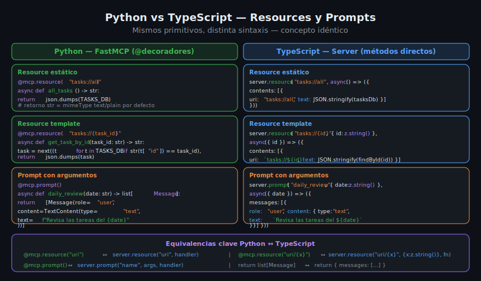

# Context y Estado en MCP — ctx y gestión de datos

## 🎯 Objetivos

- Entender el objeto `Context` (ctx) de FastMCP y para qué sirve
- Implementar logging desde handlers de tools y resources
- Gestionar estado mutable de forma segura en un server MCP
- Distinguir entre estado en memoria y estado persistente

## 📋 Contenido

### 1. ¿Qué es el objeto Context?

FastMCP inyecta automáticamente un objeto `Context` (`ctx`) en los handlers que lo soliciten.
Este objeto da acceso a funcionalidades del servidor durante la ejecución de un handler:

```python
from mcp.server.fastmcp import FastMCP, Context

mcp = FastMCP("my-server")


@mcp.tool()
async def create_task(title: str, ctx: Context) -> dict:
    """Creates a task with server context access."""
    # ctx provee: logging, progress, resource reading, sampling
    await ctx.info(f"Creating task: {title}")
    return {"title": title, "done": False}
```

El `Context` se inyecta **solo si lo declaras como parámetro**. Si no lo necesitas, no lo incluyas.



---

### 2. Logging con ctx

El logging a través de `ctx` envía mensajes de log al cliente MCP (no a stdout):

```python
from mcp.server.fastmcp import FastMCP, Context

mcp = FastMCP("task-manager")


@mcp.tool()
async def bulk_create_tasks(tasks: list[str], ctx: Context) -> dict:
    """Creates multiple tasks at once.

    Args:
        tasks: List of task titles to create.
    """
    await ctx.debug("Starting bulk task creation")
    created = []

    for i, title in enumerate(tasks):
        await ctx.info(f"Creating task {i + 1}/{len(tasks)}: {title}")
        created.append({"id": i + 1, "title": title, "done": False})

    await ctx.info(f"Created {len(created)} tasks successfully")
    return {"created_count": len(created), "tasks": created}
```

Niveles de logging disponibles en `ctx`:
| Método          | Nivel   | Uso                                  |
|-----------------|---------|--------------------------------------|
| `ctx.debug()`   | DEBUG   | Información detallada de depuración  |
| `ctx.info()`    | INFO    | Progreso normal                      |
| `ctx.warning()` | WARNING | Situaciones inesperadas pero no críticas |
| `ctx.error()`   | ERROR   | Errores que interrumpen la operación |

---

### 3. Progress reporting con ctx

Para operaciones largas, puedes reportar progreso al cliente:

```python
@mcp.tool()
async def process_large_dataset(items: list[str], ctx: Context) -> dict:
    """Processes a large dataset with progress reporting.

    Args:
        items: List of items to process.
    """
    total = len(items)
    results = []

    for i, item in enumerate(items):
        # Reportar progreso: progress, total, message
        await ctx.report_progress(i, total, f"Processing: {item}")

        # Simular procesamiento
        results.append(item.upper())

    await ctx.report_progress(total, total, "Completed")
    return {"processed": len(results), "results": results}
```

---

### 4. Leer resources desde un tool con ctx

Un tool puede leer resources del propio server usando `ctx.read_resource()`:

```python
TASKS: list[dict] = [
    {"id": 1, "title": "Aprender MCP", "done": False, "priority": "high"},
]


@mcp.resource("tasks://all")
async def all_tasks() -> str:
    """Returns all tasks as JSON."""
    import json
    return json.dumps(TASKS)


@mcp.tool()
async def summarize_tasks(ctx: Context) -> str:
    """Summarizes current tasks using the resource system.

    Demonstrates reading a resource from within a tool handler.
    """
    # Lee el resource tasks://all usando el protocolo MCP
    resource_result = await ctx.read_resource("tasks://all")

    # resource_result es una lista de ResourceContents
    if resource_result and resource_result[0].text:
        import json
        tasks = json.loads(resource_result[0].text)
        pending = sum(1 for t in tasks if not t["done"])
        await ctx.info(f"Found {len(tasks)} tasks, {pending} pending")
        return f"Total: {len(tasks)}, Pending: {pending}, Done: {len(tasks) - pending}"

    return "No tasks found"
```

---

### 5. Gestión de estado en memoria

El estado en memoria es el enfoque más simple para servidores de práctica:

```python
import json
from mcp.server.fastmcp import FastMCP, Context

mcp = FastMCP("task-manager")

# Estado global del servidor — compartido entre tools, resources y prompts
_tasks: list[dict] = []
_next_id: int = 1


def _find_task(task_id: int) -> dict | None:
    """Helper: find task by ID."""
    return next((t for t in _tasks if t["id"] == task_id), None)


@mcp.tool()
async def create_task(title: str, priority: str = "medium", ctx: Context = None) -> dict:
    """Creates a new task.

    Args:
        title: Task title.
        priority: Priority level: high, medium, or low.
    """
    global _next_id

    if priority not in ("high", "medium", "low"):
        return {"error": f"Invalid priority: {priority}"}

    task = {"id": _next_id, "title": title, "done": False, "priority": priority}
    _tasks.append(task)
    _next_id += 1

    if ctx:
        await ctx.info(f"Task created: id={task['id']}, title={title!r}")

    return {"created": task}


@mcp.tool()
async def delete_task(task_id: int, ctx: Context) -> dict:
    """Deletes a task by ID.

    Args:
        task_id: The ID of the task to delete.
    """
    global _tasks
    task = _find_task(task_id)

    if task is None:
        await ctx.warning(f"Delete requested for non-existent task id={task_id}")
        return {"error": f"Task {task_id} not found"}

    _tasks = [t for t in _tasks if t["id"] != task_id]
    await ctx.info(f"Task deleted: id={task_id}")
    return {"deleted": task}
```

---

### 6. Gestión de estado persistente con archivo JSON

Para sobrevivir reinicios del servidor, persistir en archivo:

```python
import json
import os
from pathlib import Path

DATA_FILE = Path("data/tasks.json")


def _load_tasks() -> list[dict]:
    """Load tasks from JSON file, or return empty list if file doesn't exist."""
    if not DATA_FILE.exists():
        return []
    with DATA_FILE.open("r", encoding="utf-8") as f:
        return json.load(f)


def _save_tasks(tasks: list[dict]) -> None:
    """Save tasks to JSON file."""
    DATA_FILE.parent.mkdir(parents=True, exist_ok=True)
    with DATA_FILE.open("w", encoding="utf-8") as f:
        json.dump(tasks, f, ensure_ascii=False, indent=2)


# Cargar estado al iniciar el servidor
_tasks: list[dict] = _load_tasks()
_next_id: int = max((t["id"] for t in _tasks), default=0) + 1


@mcp.tool()
async def create_task(title: str, priority: str = "medium") -> dict:
    """Creates and persists a new task."""
    global _next_id
    task = {"id": _next_id, "title": title, "done": False, "priority": priority}
    _tasks.append(task)
    _next_id += 1
    _save_tasks(_tasks)  # persistir inmediatamente
    return {"created": task}
```

---

### 7. Concurrencia y estado mutable

MCP ejecuta handlers de forma asíncrona. Si múltiples clientes llaman al mismo tool
simultáneamente, pueden ocurrir race conditions con estado mutable:

```python
# ⚠️ RIESGO — dos llamadas concurrentes a create_task pueden asignar el mismo ID
_next_id = 1

@mcp.tool()
async def create_task(title: str) -> dict:
    global _next_id
    task_id = _next_id  # lectura
    # ... otro handler puede ejecutarse aquí y leer el mismo _next_id ...
    _next_id += 1       # escritura (puede sobrescribir)
```

Para servidores de producción, usar una base de datos con transacciones.
Para prácticas, el problema es poco probable con un solo cliente.

---

### 8. Contexto en TypeScript

En TypeScript, el contexto no se inyecta automáticamente como en FastMCP.
Los handlers tienen acceso al servidor a través de closures:

```typescript
// El estado se captura en el closure del handler
const tasksDb: Task[] = [];
let nextId = 1;

server.setRequestHandler(CallToolRequestSchema, async (request) => {
  const { name, arguments: args } = request.params;

  if (name === "create_task") {
    const { title, priority = "medium" } = args as { title: string; priority?: string };

    // El "contexto" es simplemente el closure sobre tasksDb y nextId
    const task: Task = {
      id: nextId++,
      title,
      done: false,
      priority: priority as Task["priority"],
    };
    tasksDb.push(task);

    // Logging en TypeScript: hacia stderr para no interferir con stdio MCP
    process.stderr.write(`[INFO] Task created: id=${task.id}, title=${task.title}\n`);

    return { content: [{ type: "text" as const, text: JSON.stringify({ created: task }) }] };
  }

  throw new Error(`Unknown tool: ${name}`);
});
```

---

### 9. Mejores prácticas de gestión de estado

1. **Una sola fuente de verdad**: todos los primitivos acceden al mismo objeto de estado
2. **Sin estado en los handlers**: los handlers son funciones puras que leen/mutan el estado global
3. **Persistir en cada mutación**: si necesitas durabilidad, guardar tras cada write
4. **Validar antes de mutar**: verificar IDs, tipos y rangos antes de modificar el estado
5. **Logging informativo**: usar `ctx.info()` en Python / `process.stderr` en TypeScript

---

### 10. Errores comunes con estado

**Error 1: Estado no inicializado**

```python
# ❌ INCORRECTO — variable no inicializada antes de usar en handler
@mcp.tool()
async def list_tasks() -> list:
    return TASKS  # NameError si TASKS no está definido al inicio del módulo

# ✅ CORRECTO
TASKS: list[dict] = []  # inicializar al definir, no dentro del handler
```

**Error 2: Mutar state desde un resource**

```python
# ❌ INCORRECTO — resources deben ser solo lectura
@mcp.resource("tasks://all")
async def all_tasks() -> str:
    TASKS.append({"id": 99, "title": "Bug"})  # mutar desde un resource es un antipatrón
    return json.dumps(TASKS)

# ✅ CORRECTO — mutations solo en tools
```

---

## ✅ Checklist de Verificación

- [ ] `Context` importado desde `mcp.server.fastmcp` en Python
- [ ] Logging usando `ctx.info()`, `ctx.warning()`, `ctx.error()`
- [ ] Estado centralizado accesible por todos los primitivos
- [ ] Resources son solo lectura (no mutan estado)
- [ ] Tools son los únicos que mutan el estado
- [ ] Estado persistente guardado tras cada mutación (si aplica)

## 📚 Recursos Adicionales

- [FastMCP — Context object](https://github.com/modelcontextprotocol/python-sdk/blob/main/docs/server.md#context)
- [MCP Specification — Logging](https://spec.modelcontextprotocol.io/specification/server/utilities/logging/)
- [MCP Specification — Progress](https://spec.modelcontextprotocol.io/specification/server/utilities/progress/)
