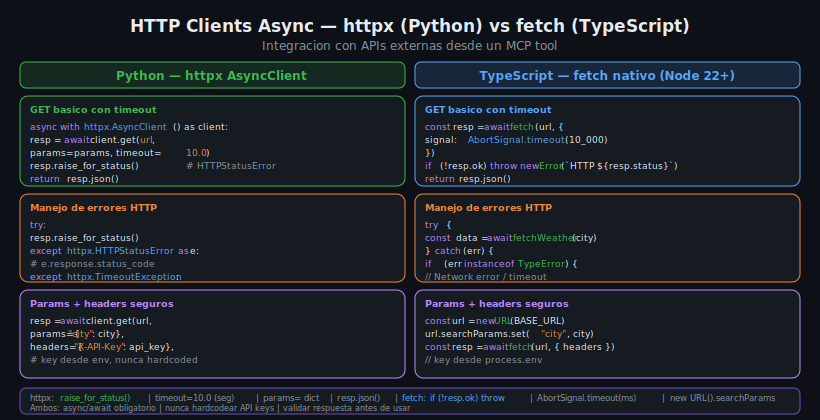

# HTTP Clients Async — httpx (Python) y fetch (TypeScript)

## 🎯 Objetivos

- Consumir APIs REST externas desde un MCP tool usando `httpx` en Python
- Hacer lo mismo en TypeScript con `fetch` nativo de Node.js 22
- Manejar timeouts, parametros de query y headers de forma segura
- Entender como integrar Open-Meteo (API de clima sin API key)

## 📋 Contenido



### 1. Por que integrar APIs externas en MCP Servers

Un MCP Server con acceso a APIs externas convierte al LLM en un agente capaz de:
- Obtener informacion en tiempo real (clima, noticias, cotizaciones)
- Buscar metadata en bases de datos publicas (libros, peliculas, lugares)
- Interactuar con servicios de terceros (calendarios, tareas, notificaciones)

El server actua como intermediario: recibe la solicitud del LLM, la traduce a una
llamada HTTP, y devuelve la respuesta en formato que el LLM puede entender.

### 2. httpx en Python

`httpx` es la libreria HTTP moderna para Python. Ofrece una API muy similar a
`requests`, pero con soporte nativo para `async/await`.

**Instalacion:**
```toml
# pyproject.toml
dependencies = [
    "mcp==1.9.0",
    "httpx==0.27.2",
]
```

**Uso basico — AsyncClient:**
```python
import httpx
import json

# Cliente reutilizable (recomendado en lifespan)
async with httpx.AsyncClient(timeout=10.0) as client:
    response = await client.get(
        "https://api.open-meteo.com/v1/forecast",
        params={
            "latitude": 40.4168,
            "longitude": -3.7038,
            "current_weather": "true",
        },
    )
    response.raise_for_status()  # lanza HTTPStatusError si status >= 400
    data = response.json()
```

**Configuracion del cliente:**
```python
# Con timeout y headers customizados
client = httpx.AsyncClient(
    timeout=httpx.Timeout(
        connect=5.0,   # tiempo para establecer conexion
        read=10.0,     # tiempo esperando respuesta
        write=5.0,     # tiempo enviando datos
        pool=5.0,      # tiempo esperando conexion del pool
    ),
    headers={
        "User-Agent": "MCP-Books-Server/1.0",
        "Accept": "application/json",
    },
    follow_redirects=True,
)
```

### 3. Integrando Open-Meteo con Python

Open-Meteo (https://open-meteo.com/) es una API de clima completamente gratuita,
sin registro ni API key. Perfecta para aprender integracion de APIs en MCP.

**Flujo de dos pasos:**
1. **Geocoding API**: convertir nombre de ciudad a latitud/longitud
2. **Forecast API**: obtener el clima actual con las coordenadas

```python
from mcp.server.fastmcp import FastMCP
import httpx
import json
import os

mcp = FastMCP("weather-server")

GEOCODING_URL = "https://geocoding-api.open-meteo.com/v1/search"
FORECAST_URL = "https://api.open-meteo.com/v1/forecast"


async def geocode_city(client: httpx.AsyncClient, city: str) -> dict:
    """Convert city name to latitude/longitude coordinates."""
    response = await client.get(
        GEOCODING_URL,
        params={"name": city, "count": 1, "language": "es"},
    )
    response.raise_for_status()
    data = response.json()

    results = data.get("results", [])
    if not results:
        raise ValueError(f"City not found: {city}")

    return results[0]  # {"latitude": ..., "longitude": ..., "name": ...}


@mcp.tool()
async def get_current_weather(city: str) -> str:
    """Get current weather for a city using Open-Meteo API.
    
    Returns temperature, wind speed and weather code.
    No API key required.
    """
    async with httpx.AsyncClient(timeout=10.0) as client:
        # Paso 1: geocoding
        location = await geocode_city(client, city)

        # Paso 2: clima actual
        response = await client.get(
            FORECAST_URL,
            params={
                "latitude": location["latitude"],
                "longitude": location["longitude"],
                "current_weather": "true",
                "timezone": "auto",
            },
        )
        response.raise_for_status()
        weather = response.json()

        current = weather["current_weather"]
        return json.dumps({
            "city": location["name"],
            "country": location.get("country", ""),
            "temperature_c": current["temperature"],
            "wind_speed_kmh": current["windspeed"],
            "weather_code": current["weathercode"],
        }, ensure_ascii=False)


@mcp.tool()
async def get_forecast(city: str, days: int = 3) -> str:
    """Get weather forecast for the next N days.
    
    Args:
        city: City name to get forecast for
        days: Number of days (1-7)
    """
    if days < 1 or days > 7:
        return json.dumps({"error": "days must be between 1 and 7"})

    async with httpx.AsyncClient(timeout=10.0) as client:
        location = await geocode_city(client, city)

        response = await client.get(
            FORECAST_URL,
            params={
                "latitude": location["latitude"],
                "longitude": location["longitude"],
                "daily": "temperature_2m_max,temperature_2m_min,precipitation_sum",
                "timezone": "auto",
                "forecast_days": days,
            },
        )
        response.raise_for_status()
        return json.dumps(response.json()["daily"], ensure_ascii=False)
```

### 4. Manejo de errores HTTP en Python

```python
@mcp.tool()
async def get_current_weather_safe(city: str) -> str:
    """Get weather with proper error handling."""
    try:
        async with httpx.AsyncClient(timeout=10.0) as client:
            location = await geocode_city(client, city)
            response = await client.get(FORECAST_URL, params={
                "latitude": location["latitude"],
                "longitude": location["longitude"],
                "current_weather": "true",
            })
            response.raise_for_status()
            return json.dumps(response.json()["current_weather"])

    except ValueError as e:
        # Ciudad no encontrada en geocoding
        return json.dumps({"error": str(e)})

    except httpx.HTTPStatusError as e:
        # La API respondio con 4xx o 5xx
        return json.dumps({
            "error": f"API error: HTTP {e.response.status_code}",
        })

    except httpx.TimeoutException:
        # La API no respondio a tiempo
        return json.dumps({"error": "Request timed out after 10 seconds"})

    except httpx.ConnectError:
        # No se pudo conectar (sin internet, DNS fallo, etc.)
        return json.dumps({"error": "Could not connect to weather API"})
```

**Tipos de excepcion de httpx:**
| Excepcion | Cuando ocurre |
|-----------|---------------|
| `httpx.HTTPStatusError` | Respuesta con status 4xx o 5xx |
| `httpx.TimeoutException` | La peticion supero el timeout |
| `httpx.ConnectError` | No se pudo establecer conexion |
| `httpx.RequestError` | Clase base para errores de red |

### 5. fetch en TypeScript (Node.js 22+)

Node.js 22 incluye `fetch` nativo, compatible con el Web Fetch API.
No necesita instalacion de librerias adicionales.

```typescript
import { Server } from "@modelcontextprotocol/sdk/server/index.js";
import { z } from "zod";

const GEOCODING_URL = "https://geocoding-api.open-meteo.com/v1/search";
const FORECAST_URL = "https://api.open-meteo.com/v1/forecast";

interface GeocodingResult {
  latitude: number;
  longitude: number;
  name: string;
  country?: string;
}

async function geocodeCity(city: string): Promise<GeocodingResult> {
  const url = new URL(GEOCODING_URL);
  url.searchParams.set("name", city);
  url.searchParams.set("count", "1");

  const resp = await fetch(url, {
    signal: AbortSignal.timeout(10_000),  // 10 segundos
  });

  if (!resp.ok) {
    throw new Error(`Geocoding API error: HTTP ${resp.status}`);
  }

  const data = await resp.json() as { results?: GeocodingResult[] };
  const results = data.results ?? [];

  if (results.length === 0) {
    throw new Error(`City not found: ${city}`);
  }

  return results[0];
}

const server = new Server({ name: "weather-server", version: "1.0.0" });

server.tool(
  "get_current_weather",
  { city: z.string().describe("City name to get weather for") },
  async ({ city }) => {
    try {
      const location = await geocodeCity(city);

      const url = new URL(FORECAST_URL);
      url.searchParams.set("latitude", location.latitude.toString());
      url.searchParams.set("longitude", location.longitude.toString());
      url.searchParams.set("current_weather", "true");
      url.searchParams.set("timezone", "auto");

      const resp = await fetch(url, {
        signal: AbortSignal.timeout(10_000),
      });

      if (!resp.ok) {
        return {
          content: [{ type: "text", text: `API error: HTTP ${resp.status}` }],
          isError: true,
        };
      }

      const weather = await resp.json() as { current_weather: object };

      return {
        content: [
          {
            type: "text",
            text: JSON.stringify({
              city: location.name,
              country: location.country ?? "",
              ...weather.current_weather,
            }),
          },
        ],
      };
    } catch (err) {
      const message = err instanceof Error ? err.message : "Unknown error";
      return {
        content: [{ type: "text", text: `Error: ${message}` }],
        isError: true,
      };
    }
  },
);
```

### 6. Buenas practicas para APIs externas

**URL construction segura:**
```python
# Python — usar params= de httpx (escapa automaticamente)
response = await client.get(url, params={"q": user_input, "limit": 10})

# TypeScript — usar URL().searchParams (escapa automaticamente)
const url = new URL(BASE_URL)
url.searchParams.set("q", userInput)
url.searchParams.set("limit", "10")
```

**Nunca construir URLs con f-strings o template literals directamente:**
```python
# PELIGROSO — puede contener caracteres especiales o inyeccion
response = await client.get(f"{BASE_URL}?q={user_input}")

# CORRECTO — parametros escapados automaticamente
response = await client.get(BASE_URL, params={"q": user_input})
```

**Variables de entorno para API keys:**
```python
# Python
import os
API_KEY = os.environ["WEATHER_API_KEY"]  # falla en startup si falta

# TypeScript
const API_KEY = process.env.WEATHER_API_KEY;
if (!API_KEY) throw new Error("Missing WEATHER_API_KEY");
```

**Rate limiting:**
Para APIs con limites de llamadas, implementar un delay entre requests:
```python
import asyncio

for city in cities:
    result = await get_weather(city)
    await asyncio.sleep(0.5)  # 500ms entre llamadas
```

### 7. Cliente HTTP reutilizable con lifespan

Para evitar crear un cliente nuevo en cada tool call, se puede compartir:

```python
from contextlib import asynccontextmanager
import httpx

@asynccontextmanager
async def lifespan(server):
    async with httpx.AsyncClient(timeout=10.0) as http:
        yield {"http": http}

mcp = FastMCP("weather-server", lifespan=lifespan)

@mcp.tool()
async def get_weather(city: str, ctx: Context) -> str:
    http: httpx.AsyncClient = ctx.request_context.lifespan_context["http"]
    response = await http.get(FORECAST_URL, params={...})
    ...
```

Esto es especialmente util cuando el server combina BD y API en el mismo lifespan:
```python
@asynccontextmanager
async def lifespan(server):
    async with aiosqlite.connect(DB_PATH) as db, \
               httpx.AsyncClient(timeout=10.0) as http:
        yield {"db": db, "http": http}
```

## 4. Errores Comunes

### Error: "City not found"
**Causa**: El nombre de la ciudad no esta en la base de datos de geocoding.
**Solucion**: Sugerir nombres alternativos o pedir coordenadas directamente.

### Error: "Request timed out"
**Causa**: La API externa tarda demasiado en responder.
**Solucion**: Aumentar el timeout o implementar retry con backoff exponencial.

### Error: SSLCertVerificationError
**Causa**: El certificado SSL del servidor no es valido.
**Solucion**: Nunca deshabilitar la verificacion SSL en produccion.
En desarrollo: `httpx.AsyncClient(verify=False)` solo si es absolutely necesario.

### Error: "Cannot set headers after they are sent"
**Causa**: Problemas de configuracion del cliente HTTP en TypeScript.
**Solucion**: Crear el objeto `URL` y usar `searchParams.set()` antes del fetch.

## 5. Ejercicios de Comprension

1. ¿Que metodo de httpx lanza excepcion si el status code es 4xx o 5xx?
2. ¿Como se configura el timeout en `fetch` de Node.js 22?
3. ¿Que ventaja tiene usar `params=` en httpx frente a construir la URL manualmente?
4. ¿Cuando es preferible usar `isError: true` en lugar de lanzar una excepcion?
5. ¿Como se pueden compartir un cliente httpx y una conexion SQLite en el mismo lifespan?

## 📚 Recursos Adicionales

- [httpx Documentation](https://www.python-httpx.org/)
- [Open-Meteo API Docs](https://open-meteo.com/en/docs)
- [Node.js fetch API](https://nodejs.org/dist/latest-v22.x/docs/api/globals.html#fetch)
- [AbortSignal.timeout()](https://developer.mozilla.org/en-US/docs/Web/API/AbortSignal/timeout_static)

## ✅ Checklist de Verificacion

- [ ] El cliente HTTP se crea con `async with httpx.AsyncClient()` o en lifespan
- [ ] Timeout configurado en todas las llamadas (nunca sin limite)
- [ ] Se llama `response.raise_for_status()` o se verifica `resp.ok`
- [ ] Los parametros de URL se pasan con `params=` o `searchParams.set()`
- [ ] Los errores de red se capturan y se retornan con `isError: true`
- [ ] Las API keys se leen desde variables de entorno, no hardcodeadas
