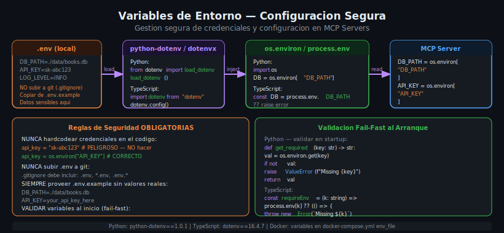

# Variables de Entorno y Configuracion Segura

## 🎯 Objetivos

- Entender por que las credenciales nunca deben estar en el codigo fuente
- Usar `python-dotenv` y `dotenv` (TypeScript) para cargar variables de entorno
- Implementar validacion fail-fast al arrancar el server
- Configurar correctamente `.env.example` y `.gitignore`

## 📋 Contenido



### 1. El problema de las credenciales en el codigo

Hardcodear credenciales en el codigo es uno de los errores de seguridad mas comunes
y mas faciles de cometer. El impacto puede ser catastrofico:

```python
# NUNCA HACER ESTO — credenciales hardcodeadas
DB_PATH = "/home/user/data/books.db"  # ruta especifica del desarrollador
API_KEY = "sk-proj-abc123xyz..."       # clave de API expuesta
DB_PASSWORD = "mi_password_secreto"   # contraseña visible en el repo
```

**Problemas de hardcodear credenciales:**
1. **Exposure en git**: si el archivo se sube a GitHub, las credenciales son publicas
2. **No portabilidad**: la app no funciona en otra maquina sin modificar el codigo
3. **Sin rotacion**: cambiar una credencial requiere modificar y re-deployar el codigo
4. **Diferentes entornos**: dev/staging/prod tienen diferentes valores

**La solucion: variables de entorno** — los valores se configuran en el sistema operativo
o en un archivo `.env` local, y el codigo solo los lee.

### 2. El archivo .env

El archivo `.env` es un archivo de texto plano que define variables de entorno
para el entorno de desarrollo local:

```bash
# .env — NUNCA subir a git
DB_PATH=./data/books.db
API_KEY=tu_api_key_real_aqui
LOG_LEVEL=DEBUG
WEATHER_BASE_URL=https://api.open-meteo.com/v1/forecast
MAX_RESULTS=50
```

**Reglas absolutas para .env:**
- Siempre listado en `.gitignore`
- Nunca compartir por email, Slack, o cualquier canal
- Cada desarrollador tiene su propio `.env` local
- En produccion: usar variables del sistema operativo o secrets manager

### 3. El archivo .env.example

El archivo `.env.example` es la plantilla publica que SI va en git.
Muestra que variables necesita la aplicacion, sin los valores reales:

```bash
# .env.example — este SI va en git
DB_PATH=./data/books.db
API_KEY=your_api_key_here
LOG_LEVEL=INFO
WEATHER_BASE_URL=https://api.open-meteo.com/v1/forecast
MAX_RESULTS=50
```

Para empezar a desarrollar: `cp .env.example .env` y rellenar los valores reales.

### 4. python-dotenv en Python

`python-dotenv` carga el archivo `.env` e inyecta las variables en `os.environ`:

**Instalacion:**
```toml
# pyproject.toml
dependencies = [
    "mcp==1.9.0",
    "python-dotenv==1.0.1",
]
```

**Uso en el server:**
```python
from dotenv import load_dotenv
import os

# Cargar variables del .env ANTES de leer os.environ
# Debe llamarse lo antes posible, antes de cualquier import que use env vars
load_dotenv()

# Ahora os.environ tiene las variables del .env
DB_PATH = os.environ.get("DB_PATH", "./data/books.db")  # con default
API_KEY = os.environ["API_KEY"]  # sin default — falla si no existe
```

**`os.environ.get` vs `os.environ[]`:**
```python
# Con default — no falla si la variable no existe
DB_PATH = os.environ.get("DB_PATH", "./data/books.db")

# Sin default — KeyError si la variable no existe (fail-fast)
API_KEY = os.environ["API_KEY"]  # mejor para credenciales obligatorias
```

### 5. Validacion fail-fast al arrancar

Es mejor que el server falle inmediatamente al arrancar si le faltan variables
obligatorias, en lugar de fallar misteriosamente en la primera llamada a un tool.

```python
from dotenv import load_dotenv
import os

load_dotenv()


def require_env(name: str, default: str | None = None) -> str:
    """Get required environment variable, raise on missing."""
    value = os.environ.get(name, default)
    if not value:
        raise ValueError(
            f"Missing required environment variable: {name}\n"
            f"  Copy .env.example to .env and set {name}="
        )
    return value


# Validar todas las variables al inicio del modulo
DB_PATH = require_env("DB_PATH", "./data/books.db")
API_KEY = require_env("API_KEY")        # obligatoria — sin default
LOG_LEVEL = require_env("LOG_LEVEL", "INFO")
MAX_RESULTS = int(require_env("MAX_RESULTS", "50"))
```

Con este patron, si falta `API_KEY`, el server imprime un mensaje claro y termina,
en lugar de fallar con un `KeyError` oscuro al primer tool call.

### 6. dotenv en TypeScript

```json
// package.json
{
  "dependencies": {
    "dotenv": "16.4.7"
  }
}
```

```typescript
// Siempre al inicio de src/index.ts, antes de otros imports que usen process.env
import dotenv from "dotenv";
dotenv.config();

// Helper para variables obligatorias
function requireEnv(name: string, defaultValue?: string): string {
  const value = process.env[name] ?? defaultValue;
  if (!value) {
    throw new Error(
      `Missing required environment variable: ${name}\n` +
      `  Copy .env.example to .env and set ${name}=`
    );
  }
  return value;
}

// Validar al arrancar
const DB_PATH = requireEnv("DB_PATH", "./data/books.db");
const API_KEY = requireEnv("API_KEY");
const LOG_LEVEL = requireEnv("LOG_LEVEL", "INFO");
const MAX_RESULTS = parseInt(requireEnv("MAX_RESULTS", "50"), 10);
```

### 7. Variables de entorno en Docker

En Docker, las variables de entorno se configuran en `docker-compose.yml`:

```yaml
# docker-compose.yml
services:
  python-server:
    build:
      context: .
      dockerfile: Dockerfile.python
    env_file:
      - .env  # carga el archivo .env directamente
    # O definir inline (sin valores sensibles):
    environment:
      - LOG_LEVEL=INFO
      - DB_PATH=/app/data/books.db

  ts-server:
    build:
      context: .
      dockerfile: Dockerfile.node
    env_file:
      - .env
```

Con `env_file: - .env`, docker-compose lee el archivo `.env` del directorio actual
y pasa todas las variables al contenedor. El archivo `.env` vive en la maquina del
desarrollador, nunca en la imagen Docker.

**Diferencia entre `env_file` y `environment`:**
- `env_file`: carga desde archivo — para valores sensibles
- `environment`: define directamente en YAML — solo para valores no sensibles

### 8. Patron completo — server con env vars

```python
# src/config.py — modulo de configuracion centralizado
from dotenv import load_dotenv
import os

load_dotenv()


def require_env(name: str, default: str | None = None) -> str:
    value = os.environ.get(name) or default
    if not value:
        raise ValueError(f"Missing environment variable: {name}")
    return value


# Configuracion global del server
DB_PATH: str = require_env("DB_PATH", "./data/books.db")
WEATHER_API_URL: str = require_env(
    "WEATHER_API_URL",
    "https://api.open-meteo.com/v1/forecast",
)
LOG_LEVEL: str = require_env("LOG_LEVEL", "INFO")
MAX_RESULTS: int = int(require_env("MAX_RESULTS", "50"))
```

```python
# src/server.py
from mcp.server.fastmcp import FastMCP
from .config import DB_PATH, WEATHER_API_URL, MAX_RESULTS

mcp = FastMCP("books-weather-server")
# ... resto del server
```

Separar la configuracion en un modulo propio facilita el testing y mantiene el
codigo del server limpio.

### 9. .gitignore correcto para proyectos MCP

```gitignore
# Variables de entorno — NUNCA en git
.env
.env.*
!.env.example   # EXCEPCION: el template si va en git

# Python
__pycache__/
*.py[cod]
.venv/
dist/

# Node.js
node_modules/
dist/
*.js.map

# Bases de datos locales
*.db
*.sqlite
data/

# Docker
.docker/

# IDE
.vscode/
.idea/
```

### 10. Jerarquia de configuracion

Para entornos mas complejos, las variables se aplican en este orden de prioridad
(de menor a mayor prioridad):

1. Valores por defecto en el codigo
2. Archivo `.env` (development)
3. Variables de entorno del sistema
4. Variables pasadas al contenedor Docker
5. Secrets manager (en produccion: AWS Secrets Manager, Vault, etc.)

Para desarrollo con MCP, los primeros 4 niveles son suficientes.

## 4. Errores Comunes

### Error: KeyError: 'API_KEY'
**Causa**: La variable no esta definida y se uso `os.environ["API_KEY"]` sin `load_dotenv()`.
**Solucion**: Llamar `load_dotenv()` antes de leer variables, o verificar que `.env` existe.

### Error: El .env se subio a git por accidente
**Solucion**: 
1. Eliminar el archivo del historial: `git rm --cached .env`
2. Agregar `.env` al `.gitignore`
3. Rotar TODAS las credenciales expuestas inmediatamente

### Error: Variables vacias al correr en Docker
**Causa**: El `env_file` apunta a un `.env` que no existe en el contenedor.
**Solucion**: El `.env` debe existir en la maquina host, docker-compose lo lee al levantar.

### Error: "Missing required environment variable: API_KEY" en CI/CD
**Causa**: El entorno de CI no tiene las variables configuradas.
**Solucion**: Agregar las variables como secrets en GitHub Actions o el CI correspondiente.

## 5. Ejercicios de Comprension

1. ¿Que diferencia hay entre `.env` y `.env.example` en cuanto a que va en git?
2. ¿Por que se debe llamar `load_dotenv()` al inicio del programa y no dentro de un tool?
3. ¿Que ventaja tiene `require_env()` sobre `os.environ.get()`?
4. ¿Como se pasan variables de entorno a un contenedor Docker sin copiarlas a la imagen?
5. ¿Que debe hacerse inmediatamente si se sube un `.env` con credenciales a git por accidente?

## 📚 Recursos Adicionales

- [python-dotenv Documentation](https://pypi.org/project/python-dotenv/)
- [dotenv (npm) Documentation](https://www.npmjs.com/package/dotenv)
- [OWASP: Sensitive Data Exposure](https://owasp.org/www-project-top-ten/2017/A3_2017-Sensitive_Data_Exposure)
- [12-Factor App: Config](https://12factor.net/config)

## ✅ Checklist de Verificacion

- [ ] `.env` esta en `.gitignore`
- [ ] `.env.example` existe con todas las variables y valores placeholder
- [ ] `load_dotenv()` / `dotenv.config()` se llama al inicio del programa
- [ ] Las credenciales obligatorias usan validacion fail-fast (sin default)
- [ ] No hay ningun valor de credencial en el codigo fuente o en tests
- [ ] `docker-compose.yml` usa `env_file` para cargar `.env`
