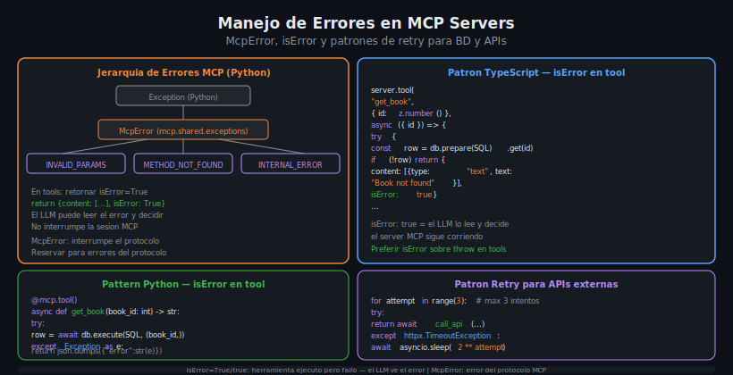

# Manejo de Errores — McpError, isError y Retry

## 🎯 Objetivos

- Distinguir entre errores del protocolo MCP y errores de dominio en tools
- Usar `isError: true` para comunicar fallos al LLM sin interrumpir la sesion
- Implementar patrones de retry con backoff exponencial para APIs externas
- Manejar errores de BD y HTTP de forma robusta en Python y TypeScript

## 📋 Contenido



### 1. Dos niveles de errores en MCP

En un MCP Server existen dos niveles completamente diferentes de errores:

**Nivel 1 — Errores del protocolo MCP (McpError)**
Son errores que interrumpen la comunicacion entre el cliente y el servidor.
Se usan cuando algo falla a nivel del protocolo JSON-RPC.

```python
from mcp.shared.exceptions import McpError
from mcp.types import ErrorCode

# Solo para errores del protocolo
raise McpError(ErrorCode.INVALID_PARAMS, "Invalid tool arguments")
raise McpError(ErrorCode.METHOD_NOT_FOUND, "Tool does not exist")
raise McpError(ErrorCode.INTERNAL_ERROR, "Server configuration error")
```

**Nivel 2 — Errores de dominio en tools (isError)**
Son errores que ocurren durante la ejecucion del tool: BD no disponible, ciudad no
encontrada, libro ya existe, etc. El LLM puede leer el mensaje de error y decidir
que hacer (reintentar, sugerir alternativas, informar al usuario).

```python
# La forma correcta de reportar errores de dominio desde un tool
return json.dumps({"error": "Book not found", "book_id": book_id})

# O en TypeScript — usando isError en el resultado del tool
return {
    content: [{ type: "text", text: "Book not found" }],
    isError: true,
}
```

**Regla general**: en tools MCP, preferir `isError` sobre `raise McpError`.
`McpError` esta reservado para problemas del protocolo, no del negocio.

### 2. Manejo de errores de BD en Python

```python
from mcp.server.fastmcp import FastMCP, Context
import aiosqlite
import json

mcp = FastMCP("books-server")


@mcp.tool()
async def get_book(book_id: int, ctx: Context) -> str:
    """Get a single book by its ID."""
    db: aiosqlite.Connection = ctx.request_context.lifespan_context["db"]
    
    try:
        async with db.execute(
            "SELECT * FROM books WHERE id = ?", (book_id,)
        ) as cursor:
            row = await cursor.fetchone()
        
        if row is None:
            # Retornar error de dominio — el LLM puede manejar esto
            return json.dumps({
                "error": "not_found",
                "message": f"Book with id={book_id} does not exist",
            })
        
        return json.dumps(dict(row), ensure_ascii=False)

    except aiosqlite.OperationalError as e:
        # Error de BD — tabla no existe, DB bloqueada, etc.
        return json.dumps({
            "error": "database_error",
            "message": f"Database error: {e}",
        })
    
    except Exception as e:
        # Error inesperado — loguear para debugging
        await ctx.warning(f"Unexpected error in get_book: {e}")
        return json.dumps({
            "error": "internal_error",
            "message": "An unexpected error occurred",
        })


@mcp.tool()
async def add_book(title: str, author: str, year: int, ctx: Context) -> str:
    """Add a new book. Returns error if duplicate title exists."""
    db: aiosqlite.Connection = ctx.request_context.lifespan_context["db"]
    
    try:
        async with db.execute(
            "INSERT INTO books (title, author, year) VALUES (?, ?, ?)",
            (title, author, year),
        ) as cursor:
            await db.commit()
            return json.dumps({
                "success": True,
                "id": cursor.lastrowid,
                "message": f"Book '{title}' added successfully",
            })
    
    except aiosqlite.IntegrityError as e:
        # Violacion de constraint (ej: ISBN duplicado)
        return json.dumps({
            "error": "duplicate_entry",
            "message": f"A book with this data already exists: {e}",
        })


@mcp.tool()
async def delete_book(book_id: int, ctx: Context) -> str:
    """Delete a book. Returns error if not found."""
    db: aiosqlite.Connection = ctx.request_context.lifespan_context["db"]
    
    async with db.execute(
        "DELETE FROM books WHERE id = ?", (book_id,)
    ) as cursor:
        await db.commit()
        
        if cursor.rowcount == 0:
            # No se elimino nada — el ID no existia
            return json.dumps({
                "error": "not_found",
                "message": f"Book {book_id} not found",
            })
        
        return json.dumps({"success": True, "deleted_id": book_id})
```

### 3. Manejo de errores de HTTP en Python

```python
import httpx


@mcp.tool()
async def get_weather(city: str, ctx: Context) -> str:
    """Get current weather for a city."""
    http: httpx.AsyncClient = ctx.request_context.lifespan_context["http"]
    
    try:
        # Paso 1: Geocoding
        geo = await http.get(
            "https://geocoding-api.open-meteo.com/v1/search",
            params={"name": city, "count": 1},
        )
        geo.raise_for_status()
        
        results = geo.json().get("results", [])
        if not results:
            return json.dumps({
                "error": "city_not_found",
                "message": f"City '{city}' not found in geocoding database",
                "suggestion": "Try a different spelling or a nearby city",
            })
        
        loc = results[0]
        
        # Paso 2: Clima
        weather = await http.get(
            "https://api.open-meteo.com/v1/forecast",
            params={
                "latitude": loc["latitude"],
                "longitude": loc["longitude"],
                "current_weather": "true",
            },
        )
        weather.raise_for_status()
        
        return json.dumps({
            "city": loc["name"],
            "country": loc.get("country", ""),
            **weather.json()["current_weather"],
        })
    
    except httpx.HTTPStatusError as e:
        status = e.response.status_code
        if status == 429:
            return json.dumps({
                "error": "rate_limited",
                "message": "Too many requests, please retry in a moment",
            })
        return json.dumps({
            "error": "api_error",
            "message": f"Weather API returned HTTP {status}",
        })
    
    except httpx.TimeoutException:
        return json.dumps({
            "error": "timeout",
            "message": "Weather API did not respond within 10 seconds",
        })
    
    except httpx.ConnectError:
        return json.dumps({
            "error": "connection_failed",
            "message": "Could not connect to weather API. Check internet connection.",
        })
```

### 4. Patron Retry con backoff exponencial

Para APIs externas que pueden fallar temporalmente, el retry con backoff es esencial:

```python
import asyncio
import httpx


async def fetch_with_retry(
    client: httpx.AsyncClient,
    url: str,
    params: dict,
    max_retries: int = 3,
) -> dict:
    """Fetch URL with exponential backoff retry.
    
    Retries: 0.5s, 1s, 2s (2^attempt * 0.5)
    """
    last_error: Exception | None = None
    
    for attempt in range(max_retries):
        try:
            response = await client.get(url, params=params)
            response.raise_for_status()
            return response.json()
        
        except httpx.HTTPStatusError as e:
            # No reintentar en errores de cliente (4xx)
            if e.response.status_code < 500:
                raise
            last_error = e
        
        except httpx.TimeoutException as e:
            last_error = e
        
        except httpx.ConnectError as e:
            last_error = e
        
        # Espera exponencial antes del proximo intento
        if attempt < max_retries - 1:
            wait = 0.5 * (2 ** attempt)  # 0.5s, 1s, 2s
            await asyncio.sleep(wait)
    
    raise RuntimeError(
        f"Failed after {max_retries} attempts: {last_error}"
    )


@mcp.tool()
async def get_weather_reliable(city: str, ctx: Context) -> str:
    """Get weather with automatic retry on transient errors."""
    http = ctx.request_context.lifespan_context["http"]
    
    try:
        data = await fetch_with_retry(
            http,
            "https://api.open-meteo.com/v1/forecast",
            params={"latitude": 40.4, "longitude": -3.7, "current_weather": "true"},
        )
        return json.dumps(data["current_weather"])
    
    except RuntimeError as e:
        return json.dumps({"error": "api_unavailable", "message": str(e)})
```

### 5. Manejo de errores en TypeScript

```typescript
import { Server } from "@modelcontextprotocol/sdk/server/index.js";
import Database from "better-sqlite3";
import { z } from "zod";

const server = new Server({ name: "books-server", version: "1.0.0" });

server.tool(
  "get_book",
  { id: z.number().int().positive() },
  async ({ id }) => {
    try {
      const row = db.prepare("SELECT * FROM books WHERE id = ?").get(id);

      if (!row) {
        return {
          content: [
            {
              type: "text",
              text: JSON.stringify({
                error: "not_found",
                message: `Book with id=${id} does not exist`,
              }),
            },
          ],
          isError: true,  // indica al LLM que hubo un error de dominio
        };
      }

      return {
        content: [{ type: "text", text: JSON.stringify(row) }],
      };
    } catch (err) {
      const message = err instanceof Error ? err.message : "Unknown error";
      return {
        content: [
          {
            type: "text",
            text: JSON.stringify({ error: "internal_error", message }),
          },
        ],
        isError: true,
      };
    }
  },
);

server.tool(
  "get_weather",
  { city: z.string().min(1) },
  async ({ city }) => {
    try {
      // Geocoding
      const geoUrl = new URL(
        "https://geocoding-api.open-meteo.com/v1/search"
      );
      geoUrl.searchParams.set("name", city);
      geoUrl.searchParams.set("count", "1");

      const geoResp = await fetch(geoUrl, {
        signal: AbortSignal.timeout(10_000),
      });

      if (!geoResp.ok) {
        return {
          content: [
            {
              type: "text",
              text: `Geocoding API error: HTTP ${geoResp.status}`,
            },
          ],
          isError: true,
        };
      }

      const geoData = await geoResp.json() as { results?: Array<{
        latitude: number;
        longitude: number;
        name: string;
      }> };

      if (!geoData.results?.length) {
        return {
          content: [{ type: "text", text: `City not found: ${city}` }],
          isError: true,
        };
      }

      const loc = geoData.results[0];

      const weatherUrl = new URL("https://api.open-meteo.com/v1/forecast");
      weatherUrl.searchParams.set("latitude", loc.latitude.toString());
      weatherUrl.searchParams.set("longitude", loc.longitude.toString());
      weatherUrl.searchParams.set("current_weather", "true");

      const weatherResp = await fetch(weatherUrl, {
        signal: AbortSignal.timeout(10_000),
      });

      if (!weatherResp.ok) {
        return {
          content: [
            { type: "text", text: `Weather API error: HTTP ${weatherResp.status}` },
          ],
          isError: true,
        };
      }

      const weather = await weatherResp.json() as {
        current_weather: object;
      };

      return {
        content: [
          {
            type: "text",
            text: JSON.stringify({ city: loc.name, ...weather.current_weather }),
          },
        ],
      };
    } catch (err) {
      if (err instanceof DOMException && err.name === "TimeoutError") {
        return {
          content: [{ type: "text", text: "Request timed out" }],
          isError: true,
        };
      }
      const message = err instanceof Error ? err.message : "Unknown error";
      return {
        content: [{ type: "text", text: `Error: ${message}` }],
        isError: true,
      };
    }
  },
);
```

### 6. isError vs McpError — cuando usar cada uno

| Situacion | Que usar | Por que |
|-----------|----------|---------|
| Libro no encontrado | `isError: true` | Error de dominio — el LLM puede buscar otro |
| Ciudad no encontrada | `isError: true` | El LLM puede sugerir ciudades similares |
| API externa no disponible | `isError: true` | El LLM puede informar al usuario |
| Argumento faltante (Zod/Pydantic lo maneja) | Automatico | El SDK valida antes de llegar al tool |
| Bug en el servidor | `isError: true` | No interrumpir la sesion |
| Violacion de seguridad critica | `McpError` | Requiere abortar la sesion |

### 7. Logging en tools con Context

El objeto `Context` de FastMCP expone metodos de logging que el cliente MCP puede mostrar:

```python
@mcp.tool()
async def search_books(query: str, ctx: Context) -> str:
    await ctx.info(f"Searching books for: {query!r}")
    
    try:
        # ... logica del tool
        results = await _do_search(query)
        await ctx.info(f"Found {len(results)} books")
        return json.dumps(results)
    
    except Exception as e:
        await ctx.error(f"Search failed: {e}")
        return json.dumps({"error": str(e)})
```

Niveles disponibles: `ctx.debug()`, `ctx.info()`, `ctx.warning()`, `ctx.error()`

## 4. Errores Comunes

### Error: El LLM no sabe que el tool fallo
**Causa**: Se retorno un string de error sin usar `isError: true` en TypeScript o
sin un campo `error` claro en el JSON.
**Solucion**: Siempre incluir un campo `error` explicito en el JSON de respuesta.
En TypeScript, usar `isError: true` en el objeto de retorno.

### Error: El server se cae cuando falla la API externa
**Causa**: No se capturan las excepciones de red.
**Solucion**: Siempre envolver las llamadas HTTP en try/except o try/catch.

### Error: McpError rompe la sesion del LLM
**Causa**: Se uso `McpError` para un error de dominio (ej: "not found").
**Solucion**: Reservar `McpError` para problemas del protocolo. Usar `isError: true` para errores de negocio.

### Error: Retry infinito / bucle
**Causa**: El retry no tiene limite de intentos.
**Solucion**: Siempre especificar `max_retries` y no reintentar errores 4xx.

## 5. Ejercicios de Comprension

1. ¿Cual es la diferencia entre `McpError` e `isError: true` en terminos de impacto en la sesion MCP?
2. ¿Por que no se deben reintentar errores HTTP 4xx en el patron retry?
3. ¿Como se implementa backoff exponencial? Calcula los tiempos de espera para 3 intentos con base 0.5s.
4. ¿Que informacion deberia incluir un mensaje de error de dominio para que el LLM pueda actuar?
5. ¿Para que sirven los niveles `ctx.info()` y `ctx.error()` en FastMCP?

## 📚 Recursos Adicionales

- [MCP Spec: Error Handling](https://spec.modelcontextprotocol.io/specification/server/tools/#error-handling)
- [httpx Exceptions Reference](https://www.python-httpx.org/exceptions/)
- [Exponential Backoff](https://aws.amazon.com/blogs/architecture/exponential-backoff-and-jitter/)
- [OWASP: Error Handling](https://cheatsheetseries.owasp.org/cheatsheets/Error_Handling_Cheat_Sheet.html)

## ✅ Checklist de Verificacion

- [ ] Los tools usan `isError: true` (TS) o campo `error` en JSON (Python) para errores de dominio
- [ ] Las llamadas HTTP estan envueltas en try/except o try/catch
- [ ] Los errores de BD (IntegrityError, OperationalError) se capturan por separado
- [ ] El patron retry tiene un maximo de intentos y no reintenta errores 4xx
- [ ] Los mensajes de error son descriptivos y orientados al LLM
- [ ] No se usa `McpError` para errores de negocio (not found, invalid input, etc.)
