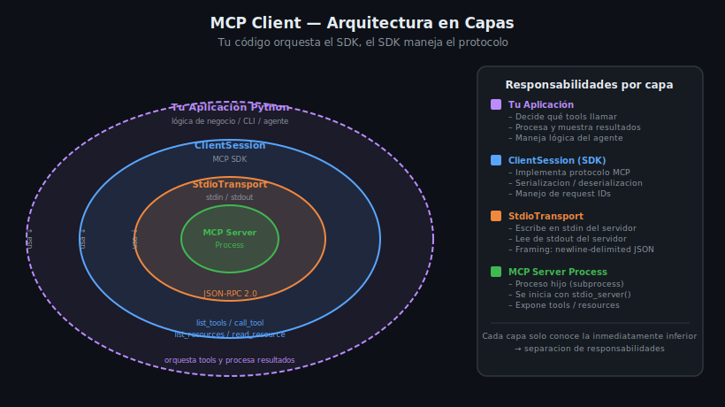

# Arquitectura del MCP Client en Python

## 🎯 Objetivos

- Comprender qué es un MCP Client y cómo se diferencia de un MCP Server
- Identificar las tres capas de la arquitectura client: App, SDK, Transport
- Reconocer cuándo usar un Client vs un Server

---

## 1. ¿Qué es un MCP Client?

Un **MCP Client** es cualquier programa que se conecta a un MCP Server para usar sus capacidades (tools, resources, prompts). Si el Server "ofrece servicios", el Client "los consume".

```
LLM (Claude, GPT)  ←→  MCP Client  ←→  MCP Server(s)
                         (tu código)      (tools, datos)
```

En la práctica, hay dos tipos de clients:

| Tipo | Ejemplo | Descripción |
|------|---------|-------------|
| **Host integrado** | Claude Desktop, Cursor, VS Code | El LLM incluye un client MCP incorporado |
| **Client programático** | Tu script Python | Tú construyes el client para orquestar tools |

Esta semana construimos el **segundo tipo**: un client Python que nosotros controlamos.

---

## 2. Por qué construir tu propio Client

Cuando escribes tu propio MCP Client ganas:

- **Orquestación precisa**: decides exactamente qué tools llamar y en qué orden
- **Integración con cualquier LLM**: OpenAI, Anthropic, Ollama, etc.
- **Automatización**: scripts que corren en CI/CD o cron jobs
- **Multi-server**: un client puede conectarse a N servers simultáneamente
- **Lógica de negocio propia**: filtros, transformaciones, caché de resultados

---

## 3. Las tres capas de la arquitectura



La arquitectura se organiza en tres capas concéntricas:

### Capa 1 — Tu Aplicación

Es la capa más externa. **Tu código**. Aquí vive:

```python
# Tu aplicación decide QUÉ hacer
async def main():
    async with create_client("python", ["src/server.py"]) as session:
        # Tu lógica: qué tools llamar, qué hacer con los resultados
        result = await session.call_tool("search_books", {"query": "Python"})
        books = json.loads(result.content[0].text)
        for book in books:
            print(f"- {book['title']} ({book['author']})")
```

Esta capa NO sabe nada del protocolo. Solo ve métodos de alto nivel.

### Capa 2 — ClientSession (SDK MCP)

La implementación del **protocolo MCP**. El SDK se encarga de:

- Serializar tus llamadas a mensajes JSON-RPC 2.0
- Gestionar IDs de requests (para correlacionar respuestas)
- Deserializar respuestas a objetos Python tipados
- Manejar el handshake inicial (`initialize`)

```python
# El SDK (no tú) hace esto internamente:
# {"jsonrpc": "2.0", "method": "tools/call", "id": 1, "params": {...}}
```

### Capa 3 — StdioTransport

El **canal de comunicación**. Convierte mensajes JSON-RPC en bytes que viajan por `stdin`/`stdout`:

```python
# StdioServerParameters define cómo lanzar el proceso server
params = StdioServerParameters(
    command="python",
    args=["src/server.py"],
    env={"DB_PATH": "./data/library.db"},  # env vars opcionales
)
```

---

## 4. Comparación Client vs Server

| Aspecto | MCP Server | MCP Client |
|---------|-----------|-----------|
| **Rol** | Ofrece capacidades | Consume capacidades |
| **Inicia conexión** | No | Sí |
| **Lanza proceso** | No (ya corre) | Sí (como subprocess) |
| **Tiene tools** | Sí (implementa) | No (llama a los del server) |
| **Tiene `@mcp.tool()`** | Sí | No |
| **Usa `ClientSession`** | No | Sí |
| **Semana del bootcamp** | Semanas 4–7 | Semanas 8–9 |

---

## 5. El patrón `async with` anidado

La forma canónica de crear un client MCP en Python es con dos context managers anidados:

```python
from mcp import ClientSession, StdioServerParameters
from mcp.client.stdio import stdio_client

async def main():
    params = StdioServerParameters(
        command="python",
        args=["src/server.py"],
    )

    # Capa 3: abre el proceso y los pipes
    async with stdio_client(params) as (read, write):

        # Capa 2: crea la sesión sobre el transport
        async with ClientSession(read, write) as session:

            # Inicializa el protocolo MCP
            await session.initialize()

            # Capa 1: tu lógica
            tools = await session.list_tools()
            print(f"Server tiene {len(tools.tools)} tools")
```

Este patrón garantiza que:
- El proceso server se cierra correctamente al salir del `with` externo
- La sesión se limpia correctamente al salir del `with` interno
- No hay resource leaks aunque ocurra una excepción

---

## 6. El ciclo de vida completo

Una sesión MCP tiene este ciclo bien definido:

```
1. Launch    → Iniciar proceso server (subprocess)
2. Connect   → Abrir pipes stdin/stdout
3. Initialize → Handshake MCP: capabilities exchange
4. Use       → list_tools, call_tool, list_resources, read_resource...
5. Close     → Cerrar pipes y terminar el proceso
```

El SDK maneja 1–3 y 5 automáticamente dentro del `async with`. Tú solo escribes el paso 4.

---

## 7. Diferencia con Claude Desktop

Cuando configuras Claude Desktop con un MCP Server en `claude_desktop_config.json`, Claude actúa como el client. En esa arquitectura:

```
[Claude Desktop]  ←→  [Tu MCP Server]
    (client)              (server)
```

Al construir tu propio client, el rol de "Claude Desktop" lo asumes tú:

```
[Tu Script Python]  ←→  [Cualquier MCP Server]
      (client)                  (server)
```

Esto te da control total — puedes conectarte a cualquier server, no solo los que acepta Claude Desktop.

---

## 8. Errores comunes al empezar

| Error | Causa | Fix |
|-------|-------|-----|
| `FileNotFoundError` | El comando del server no existe | Verificar `command` y `args` en `StdioServerParameters` |
| `McpError: not initialized` | Olvidaste `await session.initialize()` | Siempre llamar `initialize()` antes de cualquier otra llamada |
| `TimeoutError` | El server tarda en arrancar | Verificar que el server funciona por sí solo con `python src/server.py` |
| `ConnectionResetError` | El server crasheó al iniciar | Revisar logs del server; puede ser un import error |

---

## ✅ Checklist de Verificación

- [ ] Entiendo que el Client llama, el Server responde
- [ ] Sé qué hace cada capa: App, ClientSession, StdioTransport
- [ ] Entiendo por qué se usan dos `async with` anidados
- [ ] Conozco el ciclo: launch → connect → initialize → use → close
- [ ] Sé en qué se diferencia mi client de Claude Desktop como client

## 📚 Recursos Adicionales

- [MCP Python SDK — Client](https://github.com/modelcontextprotocol/python-sdk/tree/main/examples)
- [MCP Specification — Client Features](https://spec.modelcontextprotocol.io/specification/client/)
