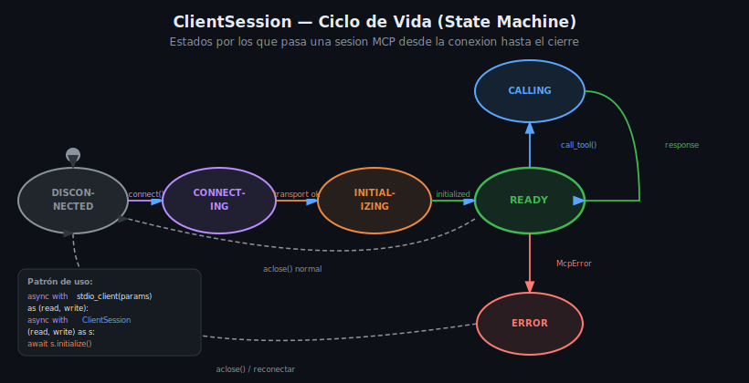

# ClientSession y StdioServerParameters

## 🎯 Objetivos

- Dominar la API de `ClientSession`: métodos disponibles y sus parámetros
- Configurar correctamente `StdioServerParameters` para distintos escenarios
- Entender el ciclo de vida de la sesión y sus estados

---

## 1. StdioServerParameters — Configurar el Server

`StdioServerParameters` describe **cómo lanzar el proceso server**. Es el equivalente a escribir en la terminal `python src/server.py`, pero desde Python.

```python
from mcp import StdioServerParameters

# Caso básico: server Python
params = StdioServerParameters(
    command="python",
    args=["src/server.py"],
)

# Con variables de entorno
params = StdioServerParameters(
    command="python",
    args=["src/server.py"],
    env={
        "DB_PATH": "./data/library.db",
        "LOG_LEVEL": "INFO",
    },
)

# Server TypeScript (compilado)
params = StdioServerParameters(
    command="node",
    args=["dist/index.js"],
)

# Server TypeScript (desarrollo con tsx)
params = StdioServerParameters(
    command="npx",
    args=["tsx", "src/index.ts"],
)

# Server con uv (Python moderno)
params = StdioServerParameters(
    command="uv",
    args=["run", "python", "src/server.py"],
    env={"PYTHONPATH": "./src"},
)
```

> ⚠️ **IMPORTANTE**: `env` en `StdioServerParameters` **reemplaza** el entorno completo del proceso hijo, no lo extiende. Para heredar el entorno actual y agregar variables:

```python
import os

params = StdioServerParameters(
    command="python",
    args=["src/server.py"],
    env={**os.environ, "DB_PATH": "./data/library.db"},  # heredar + agregar
)
```

---

## 2. stdio_client — Abrir el canal de comunicación

`stdio_client` lanza el proceso y crea los pipes `stdin`/`stdout`:

```python
from mcp.client.stdio import stdio_client

async with stdio_client(params) as (read, write):
    # read: MemoryObjectReceiveStream — lee respuestas del server
    # write: MemoryObjectSendStream — envía requests al server
    ...
```

Los streams `read` y `write` son objetos de bajo nivel que **no usarás directamente**. Los pasas a `ClientSession` y el SDK los gestiona.

---

## 3. ClientSession — La API que usas

`ClientSession` es el objeto que expone **todos los métodos del protocolo MCP**:

```python
from mcp import ClientSession

async with ClientSession(read, write) as session:
    await session.initialize()
    # Ahora puedes usar session.list_tools(), session.call_tool(), etc.
```

### 3.1 initialize()

**Siempre el primer paso**. Realiza el handshake del protocolo:

```python
result = await session.initialize()
# result.serverInfo.name → nombre del server
# result.serverInfo.version → versión
# result.capabilities → qué soporta (tools, resources, prompts)
print(f"Conectado a: {result.serverInfo.name} v{result.serverInfo.version}")
```

El server responde con sus `capabilities`. Si no se llama `initialize()` primero, cualquier otra llamada lanzará `McpError`.

### 3.2 list_tools()

Descubrir qué tools ofrece el server:

```python
tools_result = await session.list_tools()
for tool in tools_result.tools:
    print(f"Tool: {tool.name}")
    print(f"  Descripción: {tool.description}")
    print(f"  Schema: {tool.inputSchema}")
```

Cada `tool` es un objeto con:
- `tool.name: str` — nombre del tool (`"search_books"`)
- `tool.description: str` — descripción para el LLM
- `tool.inputSchema: dict` — JSON Schema de los parámetros

### 3.3 call_tool()

Invocar un tool con argumentos:

```python
result = await session.call_tool(
    "search_books",           # nombre del tool
    {"query": "Python MCP"},  # argumentos (dict)
)

# result es un CallToolResult:
# result.content → list[TextContent | ImageContent | EmbeddedResource]
# result.isError → bool

if result.isError:
    print(f"Error del server: {result.content[0].text}")
else:
    data = json.loads(result.content[0].text)
    print(data)
```

### 3.4 list_resources()

Descubrir resources disponibles:

```python
res_result = await session.list_resources()
for resource in res_result.resources:
    print(f"Resource: {resource.uri} — {resource.description}")
```

### 3.5 read_resource()

Leer el contenido de un resource por URI:

```python
content = await session.read_resource("db://books/stats")
# content.contents → list de TextResourceContents o BlobResourceContents
text = content.contents[0].text
```

### 3.6 list_prompts() y get_prompt()

```python
# Listar prompts disponibles
prompts_result = await session.list_prompts()

# Obtener un prompt con argumentos
prompt = await session.get_prompt(
    "analyze_book",
    {"book_id": "42", "style": "academic"},
)
# prompt.messages → list[PromptMessage]
# Cada mensaje tiene .role y .content
```

---

## 4. Tabla resumen de métodos

| Método | Retorna | Para qué sirve |
|--------|---------|----------------|
| `initialize()` | `InitializeResult` | Handshake inicial (obligatorio) |
| `list_tools()` | `ListToolsResult` | Descubrir tools disponibles |
| `call_tool(name, args)` | `CallToolResult` | Invocar un tool |
| `list_resources()` | `ListResourcesResult` | Descubrir resources |
| `read_resource(uri)` | `ReadResourceResult` | Leer un resource |
| `list_prompts()` | `ListPromptsResult` | Descubrir prompts |
| `get_prompt(name, args)` | `GetPromptResult` | Obtener un prompt renderizado |

---

## 5. Ciclo de vida de la sesión



```
DISCONNECTED
    │  stdio_client(params) abre proceso
    ▼
CONNECTING
    │  pipes stdin/stdout establecidos
    ▼
INITIALIZING
    │  await session.initialize() — handshake MCP
    ▼
READY ◄──────────────────────────────────┐
    │  call_tool() / list_tools() / etc.  │ respuesta recibida
    ▼                                     │
CALLING ──────────────────────────────────┘
    │  aclose() o salir del async with
    ▼
DISCONNECTED
```

---

## 6. Patrón completo recomendado

```python
import asyncio
import json
from mcp import ClientSession, StdioServerParameters
from mcp.client.stdio import stdio_client

async def run_client():
    params = StdioServerParameters(
        command="python",
        args=["src/server.py"],
        env={**__import__("os").environ, "DB_PATH": "./data/library.db"},
    )

    async with stdio_client(params) as (read, write):
        async with ClientSession(read, write) as session:
            # 1. Handshake
            info = await session.initialize()
            print(f"✓ Conectado a '{info.serverInfo.name}'")

            # 2. Descubrir
            tools = await session.list_tools()
            print(f"✓ {len(tools.tools)} tools disponibles")

            # 3. Usar
            result = await session.call_tool(
                "search_books", {"query": "async"}
            )

            # 4. Procesar
            if result.isError:
                print(f"✗ Error: {result.content[0].text}")
            else:
                books = json.loads(result.content[0].text)
                print(f"✓ {len(books)} libros encontrados")

asyncio.run(run_client())
```

---

## 7. Errores comunes

| Situación | Qué ocurre | Fix |
|-----------|-----------|-----|
| No llamar `initialize()` | `McpError: not initialized` | Agregar `await session.initialize()` |
| `env` sin heredar OS | Variables como `PATH` no existen en el server | Usar `{**os.environ, "MI_VAR": "valor"}` |
| `command` incorrecto | `FileNotFoundError` o `OSError` | Verificar que el comando existe en el PATH |
| Tool con args incorrectos | `McpError: invalid params` | Revisar el `inputSchema` del tool con `list_tools()` |

---

## ✅ Checklist de Verificación

- [ ] Sé configurar `StdioServerParameters` con command, args y env
- [ ] Entiendo por qué heredar `os.environ` al pasar env vars
- [ ] Conozco todos los métodos de `ClientSession` y qué retornan
- [ ] Siempre llamo `await session.initialize()` antes de usar la sesión
- [ ] Sé consultar el `inputSchema` para conocer los parámetros de un tool

## 📚 Recursos Adicionales

- [mcp.ClientSession source](https://github.com/modelcontextprotocol/python-sdk/blob/main/src/mcp/client/session.py)
- [StdioServerParameters](https://github.com/modelcontextprotocol/python-sdk/blob/main/src/mcp/client/stdio.py)
