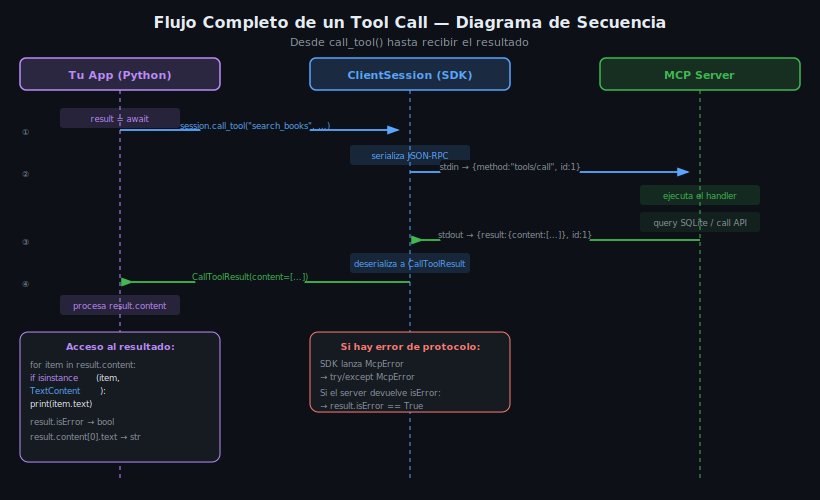

# Flujo Completo: connect → initialize → discover → call → close

## 🎯 Objetivos

- Ejecutar el flujo completo de una sesión MCP client paso a paso
- Usar `list_tools`, `list_resources` y `list_prompts` para descubrimiento
- Invocar tools y resources correctamente
- Implementar un helper reutilizable para crear clientes

---

## 1. El flujo en cinco pasos



Todo client MCP sigue exactamente este orden:

```
1. CONNECT      → abrir proceso y pipes
2. INITIALIZE   → handshake de protocolo
3. DISCOVER     → listar capacidades disponibles
4. CALL         → invocar tools/resources/prompts
5. CLOSE        → cerrar sesión y proceso
```

Los pasos 1, 2 y 5 son automáticos con `async with`. Los pasos 3 y 4 son tu código.

---

## 2. Paso 1 & 2 — Connect + Initialize

```python
import asyncio
import json
import os
from mcp import ClientSession, StdioServerParameters
from mcp.client.stdio import stdio_client

async def main():
    params = StdioServerParameters(
        command="python",
        args=["src/server.py"],
        env={**os.environ, "DB_PATH": "./data/library.db"},
    )

    async with stdio_client(params) as (read, write):      # CONNECT
        async with ClientSession(read, write) as session:
            info = await session.initialize()              # INITIALIZE

            print(f"Server: {info.serverInfo.name}")
            print(f"Version: {info.serverInfo.version}")

            # Capabilities (qué soporta el server)
            caps = info.capabilities
            has_tools     = caps.tools     is not None
            has_resources = caps.resources is not None
            has_prompts   = caps.prompts   is not None
            print(f"Soporta tools: {has_tools}")
            print(f"Soporta resources: {has_resources}")
            print(f"Soporta prompts: {has_prompts}")

asyncio.run(main())
```

---

## 3. Paso 3 — Discover (descubrimiento)

El descubrimiento permite que tu client sepa qué ofrece el server **sin hardcodear** los nombres.

### 3.1 Listar Tools

```python
tools_result = await session.list_tools()

print(f"\n=== {len(tools_result.tools)} Tools disponibles ===")
for tool in tools_result.tools:
    print(f"\n• {tool.name}")
    print(f"  {tool.description}")

    # Ver los parámetros esperados
    props = tool.inputSchema.get("properties", {})
    required = tool.inputSchema.get("required", [])
    for param, schema in props.items():
        marker = "(*)" if param in required else "   "
        tipo = schema.get("type", "any")
        desc = schema.get("description", "")
        print(f"  {marker} {param}: {tipo} — {desc}")
```

Salida de ejemplo:
```
=== 7 Tools disponibles ===

• search_books
  Search local library by title or author
  (*) query: string — Search text

• add_book
  Add a new book to the local library
  (*) title: string
  (*) author: string
  (*) year: number
     isbn: string — ISBN-13 or ISBN-10
     notes: string
```

### 3.2 Listar Resources

```python
resources_result = await session.list_resources()

print(f"\n=== {len(resources_result.resources)} Resources disponibles ===")
for r in resources_result.resources:
    print(f"• {r.uri}")
    print(f"  {r.description}")
    print(f"  mimeType: {r.mimeType}")
```

### 3.3 Listar Prompts

```python
prompts_result = await session.list_prompts()

print(f"\n=== {len(prompts_result.prompts)} Prompts disponibles ===")
for p in prompts_result.prompts:
    print(f"• {p.name}: {p.description}")
    if p.arguments:
        for arg in p.arguments:
            req = "(requerido)" if arg.required else "(opcional)"
            print(f"  - {arg.name} {req}: {arg.description}")
```

---

## 4. Paso 4 — Call (invocar)

### 4.1 Invocar un Tool

```python
# Llamada básica
result = await session.call_tool(
    "search_books",
    {"query": "async python"},
)

# Siempre verificar isError primero
if result.isError:
    print(f"Error: {result.content[0].text}")
else:
    # El contenido es JSON string — deserializar
    books = json.loads(result.content[0].text)
    print(f"Encontrados: {len(books)} libros")
    for book in books:
        print(f"  - {book['title']} ({book['author']}, {book['year']})")
```

### 4.2 Leer un Resource

```python
# Leer resource por URI exacta
content = await session.read_resource("db://books/stats")

# content.contents es una lista
for item in content.contents:
    print(item.text)
```

### 4.3 Obtener un Prompt renderizado

```python
prompt_result = await session.get_prompt(
    "analyze_book",
    {"book_id": "42"},
)

# Los mensajes están listos para enviar a un LLM
for msg in prompt_result.messages:
    print(f"[{msg.role}]: {msg.content.text}")
```

---

## 5. Paso 5 — Close (automático)

Al salir de los bloques `async with`, el SDK:
1. Envía `notifications/cancelled` si hay operaciones en curso
2. Cierra los streams `read`/`write`
3. Termina el proceso server (SIGTERM → SIGKILL si no responde)

No necesitas código adicional si usas el patrón `async with`.

Si necesitas cleanup manual (raro):
```python
await session.aclose()   # cierra la sesión MCP
# (el stdio_client cierra el proceso automáticamente)
```

---

## 6. Helper reutilizable

Para evitar repetir el boilerplate en cada script, crea un helper:

```python
# client/helpers.py
from contextlib import asynccontextmanager
from mcp import ClientSession, StdioServerParameters
from mcp.client.stdio import stdio_client
import os

@asynccontextmanager
async def create_client(command: str, args: list[str], env: dict | None = None):
    """Context manager reutilizable para conectar a un MCP server.

    Usage:
        async with create_client("python", ["src/server.py"]) as session:
            await session.call_tool("my_tool", {})
    """
    merged_env = {**os.environ, **(env or {})}
    params = StdioServerParameters(command=command, args=args, env=merged_env)

    async with stdio_client(params) as (read, write):
        async with ClientSession(read, write) as session:
            await session.initialize()
            yield session
```

Uso del helper:
```python
from client.helpers import create_client

async def main():
    async with create_client(
        "python",
        ["src/server.py"],
        env={"DB_PATH": "./data/library.db"},
    ) as session:
        result = await session.call_tool("search_books", {"query": "MCP"})
        print(result.content[0].text)
```

---

## 7. Invocar múltiples tools en secuencia

Un client puede hacer múltiples llamadas en la misma sesión:

```python
async with create_client("python", ["src/server.py"]) as session:
    # 1. Buscar en Open Library
    search_result = await session.call_tool(
        "search_openlibrary", {"title": "Fluent Python"}
    )
    books = json.loads(search_result.content[0].text)

    if books:
        # 2. Agregar el primer resultado a la biblioteca local
        book = books[0]
        add_result = await session.call_tool(
            "add_book",
            {
                "title": book["title"],
                "author": book.get("author_name", ["Unknown"])[0],
                "year": book.get("first_publish_year", 0),
            },
        )
        added = json.loads(add_result.content[0].text)
        print(f"Libro agregado con ID: {added['id']}")

        # 3. Enriquecer con metadata
        enrich_result = await session.call_tool(
            "enrich_book", {"book_id": added["id"]}
        )
        print(enrich_result.content[0].text)
```

---

## 8. Errores comunes en el flujo

| Error | Cuándo ocurre | Fix |
|-------|--------------|-----|
| `tool not found` | Nombre del tool incorrecto | Usar `list_tools()` para verificar nombres exactos |
| `invalid params` | Argumento faltante o tipo incorrecto | Revisar `tool.inputSchema.required` |
| `TimeoutError` | Server tarda en responder | Verificar que el server no está bloqueado (operación síncrona costosa) |
| `result.isError = True` | El tool retornó error de dominio | Leer `result.content[0].text` para el mensaje |

---

## ✅ Checklist de Verificación

- [ ] Ejecuto `initialize()` antes de cualquier otra operación
- [ ] Uso `list_tools()` para descubrir los tools (no hardcodeo nombres)
- [ ] Verifico `result.isError` antes de deserializar `content[0].text`
- [ ] Sé leer resources con `read_resource(uri)`
- [ ] Tengo un helper reutilizable para no repetir boilerplate
- [ ] Entiendo que múltiples calls se pueden hacer en la misma sesión

## 📚 Recursos Adicionales

- [MCP Specification — Lifecycle](https://spec.modelcontextprotocol.io/specification/architecture/#lifecycle)
- [Python SDK examples](https://github.com/modelcontextprotocol/python-sdk/tree/main/examples)
