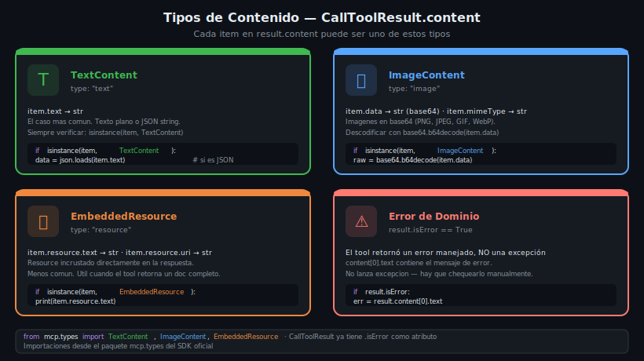

# Procesamiento de Resultados: TextContent, ImageContent y EmbeddedResource

## 🎯 Objetivos

- Identificar los tres tipos de contenido que puede retornar un MCP tool
- Implementar el patrón `isinstance` para despachar por tipo
- Extraer datos de `TextContent`, `ImageContent` y `EmbeddedResource`
- Manejar la diferencia entre `isError` y excepciones del protocolo

---

## 1. La estructura de CallToolResult

Cuando llamas a `session.call_tool()`, recibes un `CallToolResult`:

```python
from mcp.types import CallToolResult, TextContent, ImageContent, EmbeddedResource

result: CallToolResult = await session.call_tool("my_tool", {"arg": "value"})

# Campos del resultado:
result.content   # list[TextContent | ImageContent | EmbeddedResource]
result.isError   # bool — True si el tool reportó un error de dominio
```

> **Nunca** asumas que `result.isError` es False. Siempre verifica.

---

## 2. Los cuatro escenarios de resultado



### Escenario A — TextContent (el más común)

El tool retorna texto plano o JSON serializado como string:

```python
from mcp.types import TextContent

result = await session.call_tool("search_books", {"query": "Python"})

if not result.isError and isinstance(result.content[0], TextContent):
    raw = result.content[0].text   # str

    # Si el server retorna JSON:
    import json
    data = json.loads(raw)
    # data puede ser list, dict, int, str, etc.
    for book in data:
        print(f"{book['title']} — {book['author']}")
```

Los fields de `TextContent`:
- `item.type` → siempre `"text"`
- `item.text` → `str` con el contenido

### Escenario B — ImageContent

El tool retorna una imagen codificada en base64:

```python
from mcp.types import ImageContent
import base64

result = await session.call_tool("get_book_cover", {"isbn": "9780134494166"})

if not result.isError:
    item = result.content[0]
    if isinstance(item, ImageContent):
        # item.data es la imagen en base64
        image_bytes = base64.b64decode(item.data)
        mime = item.mimeType  # ej: "image/jpeg", "image/png"

        # Guardar en disco
        with open(f"cover.{mime.split('/')[1]}", "wb") as f:
            f.write(image_bytes)
        print(f"Imagen guardada ({mime})")
```

Los fields de `ImageContent`:
- `item.type` → siempre `"image"`
- `item.data` → `str` en base64
- `item.mimeType` → `str` (ej. `"image/png"`)

### Escenario C — EmbeddedResource

El tool incrusta un resource (archivo, fragmento de DB, etc.) directamente en el resultado:

```python
from mcp.types import EmbeddedResource

result = await session.call_tool("get_book_details", {"book_id": 42})

if not result.isError:
    item = result.content[0]
    if isinstance(item, EmbeddedResource):
        resource = item.resource

        # TextResourceContents — el más común
        if hasattr(resource, "text"):
            print(resource.text)
            print(f"URI del resource: {resource.uri}")

        # BlobResourceContents — binario
        elif hasattr(resource, "blob"):
            import base64
            data = base64.b64decode(resource.blob)
            print(f"Blob de {len(data)} bytes")
```

Los fields de `EmbeddedResource`:
- `item.type` → siempre `"resource"`
- `item.resource` → `TextResourceContents` o `BlobResourceContents`
- `item.resource.uri` → URI del resource (`"db://books/42"`)
- `item.resource.text` → contenido de texto (si es `TextResourceContents`)
- `item.resource.mimeType` → tipo MIME

### Escenario D — isError: True

Cuando el tool detecta un error de **dominio** (no encontró el libro, la DB está caída, etc.) retorna `isError=True`:

```python
result = await session.call_tool("get_book", {"book_id": 9999})

if result.isError:
    # El mensaje de error está en content[0].text
    error_msg = result.content[0].text
    print(f"Error del server: {error_msg}")
    # No procesar result.content[1:] — puede estar vacío
```

> `isError=True` **no** lanza excepción. Es una respuesta válida del protocolo. La excepción `McpError` ocurre por problemas del protocolo (método no existe, params inválidos), no por errores de dominio.

---

## 3. Patrón completo — isinstance dispatch

Para tools que pueden retornar distintos tipos en distintas situaciones:

```python
import json
import base64
from mcp.types import TextContent, ImageContent, EmbeddedResource

async def process_result(result):
    """Procesa un CallToolResult de forma segura."""

    # Primero: verificar error de dominio
    if result.isError:
        return {"error": result.content[0].text if result.content else "Unknown error"}

    output = []
    for item in result.content:
        if isinstance(item, TextContent):
            # Intentar deserializar como JSON; si falla, tratar como texto plano
            try:
                output.append({"type": "json", "data": json.loads(item.text)})
            except (json.JSONDecodeError, ValueError):
                output.append({"type": "text", "data": item.text})

        elif isinstance(item, ImageContent):
            output.append({
                "type": "image",
                "mime": item.mimeType,
                "bytes": base64.b64decode(item.data),
            })

        elif isinstance(item, EmbeddedResource):
            r = item.resource
            content = r.text if hasattr(r, "text") else base64.b64decode(r.blob)
            output.append({"type": "resource", "uri": r.uri, "content": content})

    return output
```

---

## 4. Resultado de múltiples items

Un tool puede retornar **más de un item** en `content`:

```python
# Un tool podría retornar texto + imagen
result = await session.call_tool("analyze_book", {"book_id": 1})

for i, item in enumerate(result.content):
    if isinstance(item, TextContent):
        print(f"Item {i} (texto): {item.text[:100]}")
    elif isinstance(item, ImageContent):
        print(f"Item {i} (imagen): {item.mimeType}")
    elif isinstance(item, EmbeddedResource):
        print(f"Item {i} (resource): {item.resource.uri}")
```

---

## 5. ReadResourceResult — Resultados de read_resource

Cuando lees un resource directamente (no vía tool), la estructura es diferente:

```python
from mcp.types import TextResourceContents, BlobResourceContents

read_result = await session.read_resource("db://books/stats")

for content_item in read_result.contents:
    if isinstance(content_item, TextResourceContents):
        print(content_item.text)
        print(f"URI: {content_item.uri}")
        print(f"MIME: {content_item.mimeType}")

    elif isinstance(content_item, BlobResourceContents):
        data = base64.b64decode(content_item.blob)
        print(f"Blob: {len(data)} bytes")
```

---

## 6. Tip — JSON estructurado desde TextContent

La mayoría de tools de este bootcamp retornan `TextContent` con JSON. El patrón más limpio:

```python
import json
from dataclasses import dataclass

@dataclass
class Book:
    id: int
    title: str
    author: str
    year: int

async def search_books(session, query: str) -> list[Book]:
    """Wrapper que parsea el resultado a objetos tipados."""
    result = await session.call_tool("search_books", {"query": query})

    if result.isError:
        raise RuntimeError(f"Server error: {result.content[0].text}")

    raw = json.loads(result.content[0].text)
    return [Book(**b) for b in raw]

# Uso limpio:
books = await search_books(session, "async")
for book in books:
    print(f"{book.title} ({book.year})")
```

---

## 7. Diferencia clave: isError vs McpError

| Situación | Tipo de error | Dónde ocurre |
|-----------|--------------|--------------|
| Tool no encontró datos | `isError=True` | En `result.isError` |
| Tool lanzó una excepción no controlada | `isError=True` (el SDK lo convierte) | En `result.isError` |
| Nombre de tool incorrecto | `McpError` (excepción Python) | Al llamar `call_tool()` |
| Parámetros inválidos | `McpError` (excepción Python) | Al llamar `call_tool()` |
| Server crasheó | `BrokenPipeError` o `ConnectionResetError` | Al llamar cualquier método |

---

## ✅ Checklist de Verificación

- [ ] Siempre verifico `result.isError` antes de acceder a `result.content`
- [ ] Uso `isinstance()` para determinar el tipo de cada item
- [ ] Sé extraer `.text` de `TextContent` y parsear como JSON cuando aplica
- [ ] Sé decodificar `.data` con `base64.b64decode()` en `ImageContent`
- [ ] Entiendo que `isError` no lanza excepción — es una respuesta válida
- [ ] Sé que `McpError` es una excepción del protocolo, no del dominio

## 📚 Recursos Adicionales

- [mcp.types source](https://github.com/modelcontextprotocol/python-sdk/blob/main/src/mcp/types.py)
- [MCP Spec — Tool Results](https://spec.modelcontextprotocol.io/specification/server/tools/)
