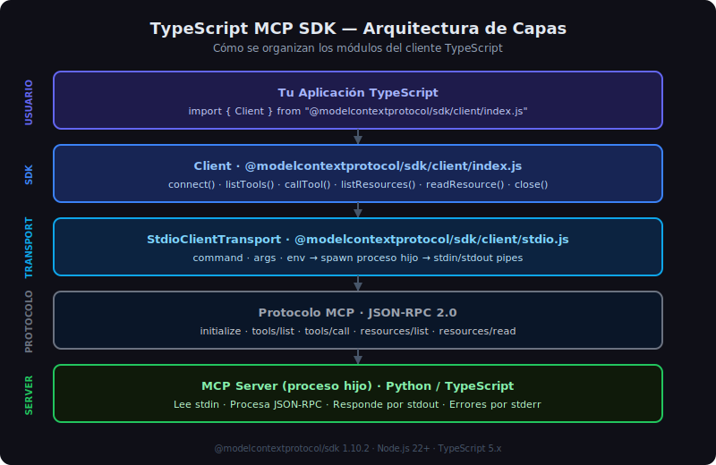

# SDK TypeScript de MCP — Arquitectura y Clase Client



## 🎯 Objetivos

- Comprender la estructura del SDK TypeScript oficial de MCP
- Conocer el papel de `Client` y `StdioClientTransport`
- Entender cómo se organiza la comunicación entre cliente y servidor

---

## 1. El SDK TypeScript de MCP

El SDK oficial de TypeScript para MCP es el paquete `@modelcontextprotocol/sdk`. Permite
construir tanto servidores (`Server`) como clientes (`Client`) que hablan el protocolo MCP
sobre distintos transportes.

En la **semana 05** usamos el lado servidor (`Server` + `StdioServerTransport`). En esta
semana usamos el lado cliente: `Client` + `StdioClientTransport`.

```bash
# Instalar con pnpm (versión exacta, sin ^)
pnpm add @modelcontextprotocol/sdk@1.10.2
```

### Módulos relevantes del SDK

| Módulo | Contenido |
|--------|-----------|
| `@modelcontextprotocol/sdk/client/index.js` | Clase `Client` |
| `@modelcontextprotocol/sdk/client/stdio.js` | `StdioClientTransport` |
| `@modelcontextprotocol/sdk/types.js` | Tipos: `Tool`, `Resource`, `CallToolResult`, `McpError`... |
| `@modelcontextprotocol/sdk/inMemory.js` | `InMemoryTransport` (para tests) |

---

## 2. La Clase `Client`

`Client` es la pieza central del SDK en el lado cliente. Gestiona:

1. La conexión al servidor (via un transport)
2. El handshake `initialize` / `initialized`
3. El envío de peticiones y la recepción de respuestas
4. El manejo de errores de protocolo (`McpError`)

### Instanciar un Client

```typescript
import { Client } from "@modelcontextprotocol/sdk/client/index.js";

const client = new Client({
  name: "my-client",    // nombre de tu aplicación cliente
  version: "1.0.0",     // versión semántica
});
```

El constructor recibe metadatos del cliente que se envían al servidor durante el handshake.
El servidor registra estos datos en `InitializeResult.serverInfo` (del lado servidor) y
el cliente recibe en respuesta las capacidades del servidor.

### API completa de `Client`

```typescript
// Conectar y hacer handshake initialize
await client.connect(transport);

// Discovery: qué ofrece el servidor
const tools     = await client.listTools();
const resources = await client.listResources();
const prompts   = await client.listPrompts();

// Invocar
const result   = await client.callTool({ name: "search_books", arguments: { query: "python" } });
const resource = await client.readResource({ uri: "db://books/stats" });
const prompt   = await client.getPrompt({ name: "analyze_book", arguments: { title: "Clean Code" } });

// Cerrar
await client.close();
```

---

## 3. Flujo de Conexión Completo

```typescript
import { Client } from "@modelcontextprotocol/sdk/client/index.js";
import { StdioClientTransport } from "@modelcontextprotocol/sdk/client/stdio.js";

async function main(): Promise<void> {
  // 1. Crear transport (aún no lanza el proceso)
  const transport = new StdioClientTransport({
    command: "python",
    args: ["path/to/server.py"],
    env: { ...process.env, DB_PATH: "./data/library.db" },
  });

  // 2. Crear client
  const client = new Client({
    name: "example-client",
    version: "1.0.0",
  });

  try {
    // 3. Conectar: lanza el proceso + handshake MCP
    await client.connect(transport);

    // 4. Usar el client...
    const tools = await client.listTools();
    console.log(`Server expone ${tools.tools.length} tools`);

  } finally {
    // 5. Siempre cerrar, incluso ante errores
    await client.close();
  }
}

main().catch(console.error);
```

> **Importante**: `client.connect()` realiza automáticamente el handshake `initialize` /
> `initialized`. No necesitas llamarlo manualmente (a diferencia del SDK Python donde
> `session.initialize()` es explícito).

---

## 4. Comparativa con el SDK Python

| Aspecto | Python | TypeScript |
|---------|--------|-----------|
| Contexto de conexión | `async with stdio_client(...) as (r,w)` | `new StdioClientTransport({...})` |
| Clase principal | `ClientSession(read, write)` | `Client({ name, version })` |
| Initialize | `await session.initialize()` explícito | Automático en `client.connect()` |
| Cierre | Automático (context manager) | `await client.close()` en `finally` |
| Naming API | `snake_case` (list_tools) | `camelCase` (listTools) |

---

## 5. El Ecosistema de Tipos TypeScript

TypeScript añade seguridad de tipos que Python no tiene en tiempo de compilación. El SDK
exporta tipos para todos los objetos del protocolo:

```typescript
import type {
  Tool,
  Resource,
  Prompt,
  CallToolResult,
  ListToolsResult,
  ListResourcesResult,
  ReadResourceResult,
  McpError,
  TextContent,
  ImageContent,
  EmbeddedResource,
} from "@modelcontextprotocol/sdk/types.js";
```

Gracias a estos tipos, el compilador TypeScript detectará errores de acceso a propiedades
inexistentes antes de que lleguen a producción:

```typescript
// ✅ TypeScript sabe que tools.tools es Tool[]
const result: ListToolsResult = await client.listTools();
for (const tool of result.tools) {
  console.log(tool.name);         // ✅ string
  console.log(tool.description);  // ✅ string | undefined
  console.log(tool.wrongProp);    // ❌ Error de compilación
}
```

---

## 6. Errores Comunes

| Error | Causa | Solución |
|-------|-------|---------|
| `ENOENT: no such file` | El `command` del transport no existe | Verificar la ruta al servidor |
| `McpError: Method not found` | El server no tiene ese tool/resource | Revisar el nombre exacto |
| `Cannot read properties of undefined` | `result.content[0]` vacío | Verificar `result.content.length > 0` |
| `Type error: Property 'text' does not exist` | Acceder `.text` sin type guard | Usar `(item as TextContent).text` o discriminar `item.type` |

---

## ✅ Checklist de Verificación

- [ ] El `Client` se instancia con `name` y `version`
- [ ] Se crea un `StdioClientTransport` con `command`, `args`, `env`
- [ ] `client.connect(transport)` se llama antes de cualquier método
- [ ] `client.close()` está en un bloque `finally`
- [ ] Los tipos de retorno están anotados correctamente en TypeScript
- [ ] Se usa `pnpm add @modelcontextprotocol/sdk@1.10.2` (versión exacta)
