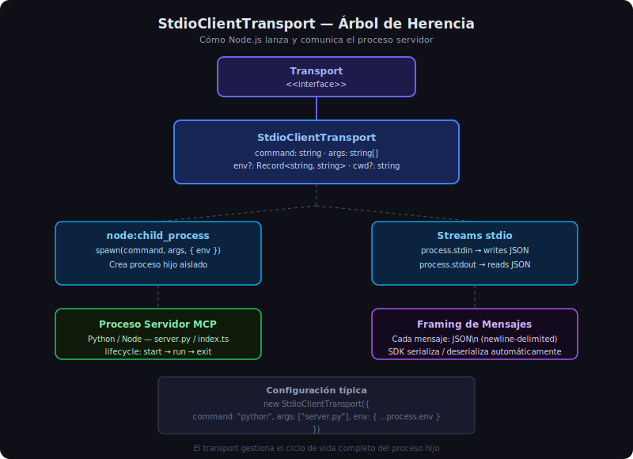

# StdioClientTransport y Conexión al Servidor



## 🎯 Objetivos

- Entender cómo `StdioClientTransport` lanza un proceso servidor
- Configurar correctamente `command`, `args` y `env`
- Conocer la relación entre Node.js `child_process` y el transport MCP

---

## 1. ¿Qué es StdioClientTransport?

`StdioClientTransport` es el transport estándar para conectar un cliente MCP a un servidor
que se ejecuta como proceso hijo. Implementa la interfaz `Transport` del SDK y:

1. **Lanza el proceso** servidor con `node:child_process.spawn`
2. **Conecta los pipes** stdin/stdout del proceso con el SDK
3. **Serializa/deserializa** los mensajes JSON-RPC 2.0 automáticamente
4. **Gestiona el ciclo de vida** del proceso hijo (inicio → ejecución → cierre)

```typescript
import { StdioClientTransport } from "@modelcontextprotocol/sdk/client/stdio.js";

const transport = new StdioClientTransport({
  command: "python",                    // ejecutable
  args: ["src/server.py"],              // argumentos del proceso
  env: { ...process.env, DB_PATH: "./data/library.db" },  // variables de entorno
});
```

> **Nota**: El proceso servidor **no se lanza** al crear el transport. Se lanza cuando
> llamas a `client.connect(transport)`.

---

## 2. Opciones de Configuración

```typescript
interface StdioClientTransportOptions {
  command: string;            // Ejecutable: "python", "node", "uv", etc.
  args?: string[];            // Argumentos del proceso
  env?: Record<string, string>; // Variables de entorno del proceso hijo
  cwd?: string;               // Directorio de trabajo del proceso
}
```

### Ejemplo: conectar a servidor Python con uv

```typescript
const transport = new StdioClientTransport({
  command: "uv",
  args: ["run", "python", "src/server.py"],
  env: {
    ...process.env,   // heredar el entorno del cliente
    DB_PATH: "./data/library.db",
    PYTHONUNBUFFERED: "1",  // flush inmediato de stdout en Python
  },
  cwd: "/path/to/python-server",  // directorio donde está el servidor
});
```

### Ejemplo: conectar a servidor TypeScript ya compilado

```typescript
const transport = new StdioClientTransport({
  command: "node",
  args: ["dist/index.js"],
  env: { ...process.env },
});
```

### Ejemplo: conectar a servidor TypeScript en desarrollo (tsx)

```typescript
const transport = new StdioClientTransport({
  command: "npx",
  args: ["tsx", "src/index.ts"],
  env: { ...process.env },
});
```

---

## 3. Por Qué `...process.env` es Importante

El proceso hijo de Node.js **no hereda automáticamente** las variables de entorno del padre
cuando se especifica `env`. Si defines `env` sin `...process.env`, el proceso hijo tendrá
un entorno vacío y fallará al buscar `PATH`, `HOME`, y otras variables del sistema:

```typescript
// ❌ INCORRECTO — proceso hijo sin PATH, fallará al ejecutar python
const transport = new StdioClientTransport({
  command: "python",
  args: ["server.py"],
  env: { DB_PATH: "./data/library.db" },  // ← sin ...process.env
});

// ✅ CORRECTO — hereda todo el entorno y añade variables propias
const transport = new StdioClientTransport({
  command: "python",
  args: ["server.py"],
  env: { ...process.env, DB_PATH: "./data/library.db" },
});
```

---

## 4. Framing de Mensajes: JSON por Línea

El protocolo MCP sobre stdio usa **newline-delimited JSON** (NDJSON): cada mensaje es un
objeto JSON en una sola línea, terminado con `\n`.

```
→ {"jsonrpc":"2.0","id":1,"method":"initialize","params":{...}}\n
← {"jsonrpc":"2.0","id":1,"result":{"protocolVersion":"2024-11-05",...}}\n
→ {"jsonrpc":"2.0","id":2,"method":"tools/list","params":{}}\n
← {"jsonrpc":"2.0","id":2,"result":{"tools":[...]}}\n
```

El SDK gestiona este framing internamente. Tú solo llamas a `client.listTools()` y el SDK
escribe el JSON en stdin y lee la respuesta de stdout.

**stderr no se usa para mensajes MCP** — solo para logs del servidor. El SDK no captura
stderr por defecto, por lo que los logs del servidor aparecerán en la consola del proceso
cliente.

---

## 5. Ciclo de Vida del Transport

```typescript
const transport = new StdioClientTransport({ command: "python", args: ["server.py"] });
//                 ↑ proceso NO iniciado todavía

await client.connect(transport);
//           ↑ spawn del proceso + handshake initialize

// ... uso del client ...

await client.close();
//           ↑ envía señal SIGTERM al proceso hijo + cierra pipes
```

### Qué hace `client.connect(transport)` internamente

1. Llama a `transport.start()` → `child_process.spawn`
2. Envía `initialize` request con las capacidades del cliente
3. Recibe `InitializeResult` con las capacidades del servidor
4. Envía `initialized` notification
5. La conexión queda lista para usar

---

## 6. Manejo de Errores en la Conexión

```typescript
import { StdioClientTransport } from "@modelcontextprotocol/sdk/client/stdio.js";
import { Client } from "@modelcontextprotocol/sdk/client/index.js";

async function connectToServer(serverPath: string): Promise<Client> {
  const transport = new StdioClientTransport({
    command: "python",
    args: [serverPath],
    env: { ...process.env },
  });

  const client = new Client({ name: "my-client", version: "1.0.0" });

  try {
    await client.connect(transport);
    return client;
  } catch (e) {
    // Si el comando no existe: Error con code ENOENT
    // Si el servidor falla al iniciar: Error con mensaje de stderr
    if (e instanceof Error && "code" in e && (e as NodeJS.ErrnoException).code === "ENOENT") {
      throw new Error(`No se encontró el ejecutable. Verifica la ruta: ${serverPath}`);
    }
    throw e;
  }
}
```

---

## 7. Variables de Entorno desde `.env`

En proyectos reales, usar `dotenv` para cargar configuración:

```typescript
import "dotenv/config";  // Carga .env automáticamente

const transport = new StdioClientTransport({
  command: process.env.SERVER_COMMAND ?? "python",
  args: [process.env.SERVER_PATH ?? "server.py"],
  env: {
    ...process.env,
    DB_PATH: process.env.DB_PATH ?? "./data/library.db",
  },
});
```

Con `.env`:
```
SERVER_COMMAND=python
SERVER_PATH=../week-07-server/src/server.py
DB_PATH=./data/library.db
TOOL_TIMEOUT_MS=30000
```

---

## 8. Errores Comunes de Configuración

| Error | Causa | Solución |
|-------|-------|---------|
| `spawn python ENOENT` | `python` no está en PATH del proceso | Usar `python3` o ruta absoluta |
| `Server process exited before initialize` | El servidor falló al arrancar | Revisar stderr del servidor |
| `stdin is null` | Transport no iniciado | Verificar que `connect()` se llamó |
| Proceso zombi | `client.close()` no se llamó | Usar `try/finally` siempre |

---

## ✅ Checklist de Verificación

- [ ] `command` es el ejecutable correcto y está en PATH
- [ ] `args` contiene la ruta al script del servidor
- [ ] `env` incluye `...process.env` para heredar el entorno
- [ ] Variables específicas (DB_PATH, etc.) se añaden sobre `...process.env`
- [ ] `client.connect(transport)` se llama antes de usar el client
- [ ] `client.close()` siempre en bloque `finally`
- [ ] `dotenv/config` importado si se usa `.env`
