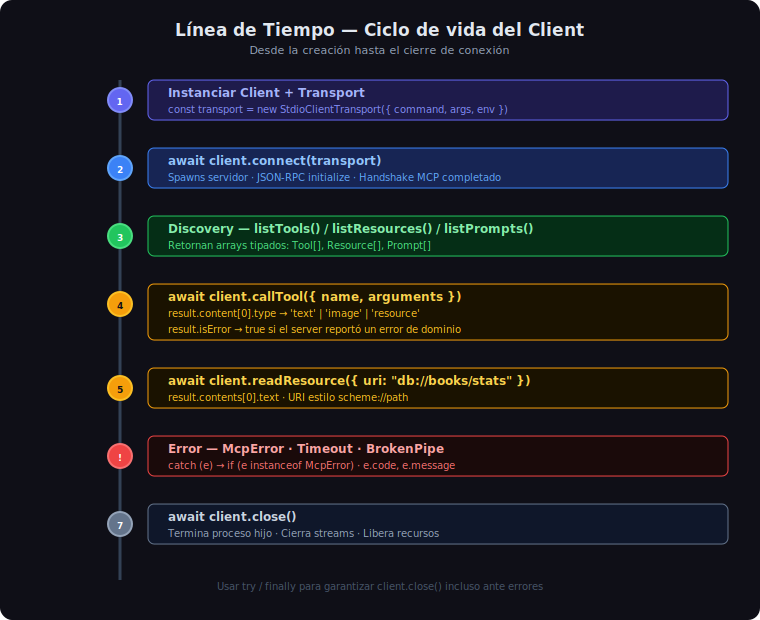

# Descubrir y Llamar Tools, Resources y Prompts



## 🎯 Objetivos

- Usar `listTools()`, `listResources()` y `listPrompts()` para descubrir capacidades
- Invocar tools con `callTool()` y leer resources con `readResource()`
- Acceder correctamente a los datos tipados que retorna cada método

---

## 1. Discovery — Qué ofrece el servidor

Tras conectarse, el primer paso es consultar qué capacidades expone el servidor. Los tres
métodos de discovery retornan listas tipadas:

```typescript
// Todos los métodos son async — usar await
const toolsResult     = await client.listTools();
const resourcesResult = await client.listResources();
const promptsResult   = await client.listPrompts();

// Acceder a los arrays
const tools:     Tool[]     = toolsResult.tools;
const resources: Resource[] = resourcesResult.resources;
const prompts:   Prompt[]   = promptsResult.prompts;
```

### Tipo `Tool`

```typescript
interface Tool {
  name: string;           // snake_case, ej: "search_books"
  description?: string;   // descripción para el LLM
  inputSchema: {
    type: "object";
    properties?: Record<string, unknown>;
    required?: string[];
  };
}
```

### Tipo `Resource`

```typescript
interface Resource {
  uri: string;            // ej: "db://books/stats"
  name: string;
  description?: string;
  mimeType?: string;      // ej: "application/json"
}
```

### Tipo `Prompt`

```typescript
interface Prompt {
  name: string;
  description?: string;
  arguments?: Array<{
    name: string;
    description?: string;
    required?: boolean;
  }>;
}
```

---

## 2. Listar Tools con Detalle

```typescript
async function listAvailableTools(client: Client): Promise<void> {
  const result = await client.listTools();

  console.log(`\n📦 Tools disponibles (${result.tools.length}):\n`);

  for (const tool of result.tools) {
    console.log(`  • ${tool.name}`);
    if (tool.description) {
      console.log(`    ${tool.description}`);
    }

    // Mostrar parámetros requeridos
    const required = tool.inputSchema.required ?? [];
    const props = tool.inputSchema.properties ?? {};
    const propNames = Object.keys(props);

    if (propNames.length > 0) {
      const params = propNames.map((p) =>
        required.includes(p) ? `${p}*` : p,
      );
      console.log(`    Params: ${params.join(", ")}  (* = requerido)`);
    }
  }
}
```

---

## 3. Invocar un Tool — `callTool()`

`callTool()` envía una petición `tools/call` al servidor y retorna un `CallToolResult`:

```typescript
import type { CallToolResult } from "@modelcontextprotocol/sdk/types.js";

const result: CallToolResult = await client.callTool({
  name: "search_books",
  arguments: { query: "Python" },
});
```

### Estructura de `CallToolResult`

```typescript
interface CallToolResult {
  content: ContentItem[];  // array de bloques de contenido
  isError?: boolean;       // true si el server reportó un error de dominio
}

// ContentItem es un discriminated union:
type ContentItem =
  | { type: "text";     text: string }
  | { type: "image";    data: string; mimeType: string }
  | { type: "resource"; resource: { uri: string; text?: string; blob?: string; mimeType?: string } };
```

### Ejemplo completo con parsing JSON

```typescript
async function searchBooks(client: Client, query: string): Promise<object[]> {
  const result = await client.callTool({
    name: "search_books",
    arguments: { query },
  });

  // Verificar error de dominio (no excepción, sino isError)
  if (result.isError) {
    const errorItem = result.content[0];
    const message = errorItem.type === "text" ? errorItem.text : "Error desconocido";
    throw new Error(`Server reportó error: ${message}`);
  }

  // El primer item es texto JSON
  const firstItem = result.content[0];
  if (!firstItem || firstItem.type !== "text") {
    return [];
  }

  return JSON.parse(firstItem.text) as object[];
}
```

---

## 4. Leer un Resource — `readResource()`

```typescript
import type { ReadResourceResult } from "@modelcontextprotocol/sdk/types.js";

const result: ReadResourceResult = await client.readResource({
  uri: "db://books/stats",
});

// result.contents es un array de ResourceContent
for (const content of result.contents) {
  if ("text" in content) {
    const stats = JSON.parse(content.text!) as Record<string, unknown>;
    console.log(`Total libros: ${stats.total_books}`);
  }
}
```

---

## 5. Obtener un Prompt — `getPrompt()`

```typescript
const result = await client.getPrompt({
  name: "analyze_book",
  arguments: { title: "Clean Code", focus: "patterns" },
});

// result.messages es un array de PromptMessage
for (const msg of result.messages) {
  console.log(`[${msg.role}] ${
    msg.content.type === "text" ? msg.content.text : "(contenido no textual)"
  }`);
}
```

---

## 6. Patrón: Helper genérico para llamar tools

```typescript
/**
 * Llama a un tool y retorna su texto de respuesta.
 * Lanza Error si el server reporta isError.
 */
async function callToolText(
  client: Client,
  name: string,
  args: Record<string, unknown> = {},
): Promise<string> {
  const result = await client.callTool({ name, arguments: args });

  if (result.isError) {
    const first = result.content[0];
    const msg = first?.type === "text" ? first.text : "Error sin mensaje";
    throw new Error(`[${name}] ${msg}`);
  }

  const first = result.content[0];
  if (!first || first.type !== "text") {
    throw new Error(`[${name}] Respuesta inesperada — no es texto`);
  }

  return first.text;
}

// Uso:
const raw = await callToolText(client, "search_books", { query: "TypeScript" });
const books = JSON.parse(raw) as Book[];
```

---

## 7. Diferencias con el SDK Python

| Acción | Python | TypeScript |
|--------|--------|-----------|
| Listar tools | `session.list_tools()` | `client.listTools()` |
| Llamar tool | `session.call_tool("name", {k:v})` | `client.callTool({ name, arguments:{k:v} })` |
| Leer resource | `session.read_resource("uri")` | `client.readResource({ uri })` |
| Obtener prompt | `session.get_prompt("name", {k:v})` | `client.getPrompt({ name, arguments:{k:v} })` |
| Acceder texto | `result.content[0].text` | `(result.content[0] as TextContent).text` |

La diferencia más importante: en TypeScript debes hacer **type cast** o **type guard**
porque el tipo `ContentItem` es un union discriminado:

```typescript
// ❌ Error de compilación: Property 'text' does not exist on type ContentItem
const text = result.content[0].text;

// ✅ Type guard con discriminante 'type'
const item = result.content[0];
if (item.type === "text") {
  const text = item.text;  // TypeScript infiere el tipo correcto
}

// ✅ Type cast (cuando estás seguro)
const text = (result.content[0] as { type: "text"; text: string }).text;
```

---

## 8. Errores Comunes

| Error | Causa | Solución |
|-------|-------|---------|
| `Method not found` | Tool/resource no existe | Verificar nombre exacto con `listTools()` |
| `Invalid params` | Argumento requerido faltante | Revisar `inputSchema.required` |
| `isError: true` | Error de dominio del server | Leer `content[0].text` para el mensaje |
| `content is undefined` | Server retornó vacío | Verificar `result.content?.length > 0` |

---

## ✅ Checklist de Verificación

- [ ] Se llama a `listTools()` antes de `callTool()` (al menos en desarrollo)
- [ ] `callTool()` recibe `{ name, arguments }` — no solo el nombre
- [ ] Se verifica `result.isError` antes de parsear el contenido
- [ ] Se discrimina `item.type` antes de acceder a `.text`, `.data`, etc.
- [ ] `readResource()` recibe `{ uri }` (objeto, no string directo)
- [ ] Los resultados JSON se parsean con `JSON.parse()` y se castean al tipo esperado
