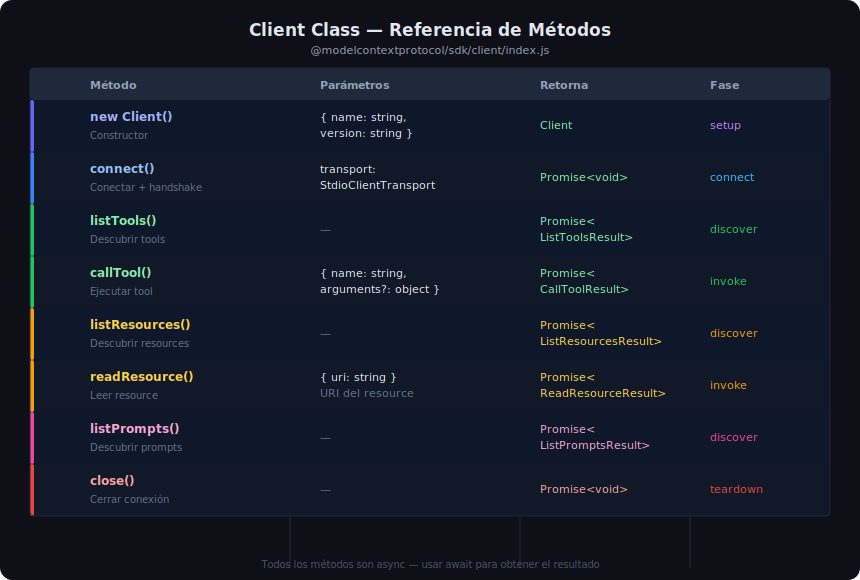

# Tipado y Procesamiento de Resultados en TypeScript



## 🎯 Objetivos

- Dominar el sistema de tipos del SDK TypeScript para resultados MCP
- Usar correctamente los discriminated unions de `ContentItem`
- Escribir código seguro con type guards e interfaces propias

---

## 1. El Sistema de Tipos del SDK

El SDK TypeScript exporta tipos para todos los objetos del protocolo MCP. Usarlos
correctamente elimina una clase entera de bugs en tiempo de compilación.

```typescript
import type {
  // Resultados de métodos
  ListToolsResult,
  ListResourcesResult,
  ListPromptsResult,
  CallToolResult,
  ReadResourceResult,
  GetPromptResult,

  // Entidades
  Tool,
  Resource,
  Prompt,

  // Tipos de contenido (discriminated union)
  TextContent,
  ImageContent,
  EmbeddedResource,

  // Errores
  McpError,
} from "@modelcontextprotocol/sdk/types.js";
```

---

## 2. `CallToolResult` — Procesamiento Completo

`CallToolResult.content` es un array de `ContentItem`. Cada item puede ser texto, imagen
o recurso embebido. El campo `type` es el discriminante del union:

```typescript
type ContentItem =
  | { type: "text";     text: string }
  | { type: "image";    data: string; mimeType: string }
  | { type: "resource"; resource: EmbeddedResourceContent };
```

### Procesar todos los tipos con type guard

```typescript
import type { CallToolResult } from "@modelcontextprotocol/sdk/types.js";

function processCallToolResult(result: CallToolResult): string {
  if (result.isError) {
    // isError = true: error de dominio (no excepción, el server lo reportó)
    const first = result.content[0];
    const message = first?.type === "text" ? first.text : "Error sin detalle";
    throw new Error(`Tool error: ${message}`);
  }

  const parts: string[] = [];

  for (const item of result.content) {
    switch (item.type) {
      case "text":
        // item es { type: "text"; text: string }
        parts.push(item.text);
        break;

      case "image":
        // item es { type: "image"; data: string; mimeType: string }
        // data es base64
        parts.push(`[Imagen ${item.mimeType}, ${item.data.length} bytes base64]`);
        break;

      case "resource":
        // item es { type: "resource"; resource: EmbeddedResourceContent }
        const res = item.resource;
        if ("text" in res && res.text) {
          parts.push(res.text);
        } else if ("blob" in res && res.blob) {
          parts.push(`[Blob: ${res.blob.length} bytes]`);
        }
        break;
    }
  }

  return parts.join("\n");
}
```

---

## 3. Parsear Respuestas JSON

Muchos tools devuelven JSON serializado como texto. El patrón estándar:

```typescript
// Define la interfaz del dato esperado
interface Book {
  id: number;
  title: string;
  author: string;
  year: number;
  isbn?: string;
}

async function searchBooks(client: Client, query: string): Promise<Book[]> {
  const result = await client.callTool({
    name: "search_books",
    arguments: { query },
  });

  if (result.isError) {
    const msg = result.content[0]?.type === "text"
      ? result.content[0].text
      : "Error desconocido";
    throw new Error(msg);
  }

  const first = result.content[0];
  if (!first || first.type !== "text") {
    return [];
  }

  // JSON.parse + type assertion
  return JSON.parse(first.text) as Book[];
}
```

> **Nota**: TypeScript no puede verificar en runtime que el JSON coincide con `Book`. Si
> necesitas validación estricta de datos externos, usa **Zod**:
> ```typescript
> import { z } from "zod";
> const BookSchema = z.object({ id: z.number(), title: z.string(), ... });
> const books = z.array(BookSchema).parse(JSON.parse(first.text));
> ```

---

## 4. `ReadResourceResult` — Leer Contenido de un Resource

```typescript
import type { ReadResourceResult } from "@modelcontextprotocol/sdk/types.js";

async function getStats(client: Client): Promise<Record<string, unknown>> {
  const result: ReadResourceResult = await client.readResource({
    uri: "db://books/stats",
  });

  // result.contents es un array de ResourceContent
  for (const content of result.contents) {
    // Texto plano o JSON
    if ("text" in content && content.text) {
      return JSON.parse(content.text) as Record<string, unknown>;
    }
    // Binario (blob en base64)
    if ("blob" in content && content.blob) {
      const buffer = Buffer.from(content.blob, "base64");
      return { size: buffer.length };
    }
  }

  return {};
}
```

---

## 5. Interfaces Propias — Tipar Datos del Dominio

Define interfaces para los datos que esperas de cada tool. Esto hace el código más legible
y detecta errores al compilar:

```typescript
// types.ts — interfaces del dominio
export interface Book {
  id: number;
  title: string;
  author: string;
  year: number;
  isbn?: string | null;
}

export interface BookStats {
  total_books: number;
  books_with_isbn: number;
  average_year: number;
}

export interface OpenLibraryResult {
  title: string;
  author: string;
  year: number;
  isbn?: string;
  cover_url?: string;
}
```

Usarlos en el cliente:

```typescript
import type { Book, BookStats } from "./types.js";

const books = await searchBooks(client, "python");  // Book[]
const stats = await getStats(client);               // BookStats
```

---

## 6. `isError` vs Excepciones: Cuándo usar cada uno

```typescript
// ESCENARIO A: Error de dominio (isError = true)
// El server procesó la petición pero reportó un error de negocio
// Ejemplo: libro no encontrado, ISBN inválido
const result = await client.callTool({ name: "get_book", arguments: { id: 999 } });
if (result.isError) {
  // No lanzar excepciones aquí — manejar como dato
  const msg = (result.content[0] as { type: "text"; text: string }).text;
  console.error(`No encontrado: ${msg}`);
  return null;
}

// ESCENARIO B: Excepción de protocolo (McpError)
// El server no pudo procesar la petición (método no existe, params inválidos)
try {
  await client.callTool({ name: "nonexistent_tool", arguments: {} });
} catch (e) {
  if (e instanceof Error && e.message.includes("Method not found")) {
    console.error("Tool no encontrado en el servidor");
  }
}
```

---

## 7. Anotaciones de Tipos para Mayor Claridad

```typescript
// Anotar variables con tipos explícitos en lugares clave
const toolsResult: ListToolsResult = await client.listTools();
const tools: Tool[] = toolsResult.tools;

// Función bien tipada
async function callAndParse<T>(
  client: Client,
  toolName: string,
  args: Record<string, unknown>,
): Promise<T> {
  const result: CallToolResult = await client.callTool({
    name: toolName,
    arguments: args,
  });

  if (result.isError) {
    throw new Error(`[${toolName}] ${result.content[0]?.type === "text"
      ? result.content[0].text
      : "Error"}`,
    );
  }

  const first = result.content[0];
  if (!first || first.type !== "text") throw new Error("Respuesta vacía");
  return JSON.parse(first.text) as T;
}

// Uso con genérico
const books = await callAndParse<Book[]>(client, "search_books", { query: "python" });
```

---

## 8. Errores Comunes de Tipado

| Error | Causa | Solución |
|-------|-------|---------|
| `Property 'text' does not exist on type ContentItem` | Acceso sin discriminar | Usar `item.type === "text"` o cast |
| `Type 'unknown' is not assignable to type 'Book[]'` | `JSON.parse` retorna `any` pero el flag `noImplicitAny` está on | Usar `as Book[]` explícitamente |
| `Object is possibly 'undefined'` | `result.content[0]` puede ser undefined | Verificar `result.content.length > 0` primero |
| `Argument of type 'string' is not assignable` | Argumento tipado incorrecto | Revisar el tipo esperado por el método |

---

## ✅ Checklist de Verificación

- [ ] Se importan los tipos necesarios de `@modelcontextprotocol/sdk/types.js`
- [ ] Se discrimina `item.type` antes de acceder a campos específicos
- [ ] `isError` se verifica antes de intentar parsear el contenido
- [ ] `JSON.parse()` se usa con cast explícito (`as MiTipo`)
- [ ] Se definen interfaces para los datos del dominio (Book, Stats, etc.)
- [ ] TypeScript compila sin errores (`pnpm build` o `npx tsc --noEmit`)
