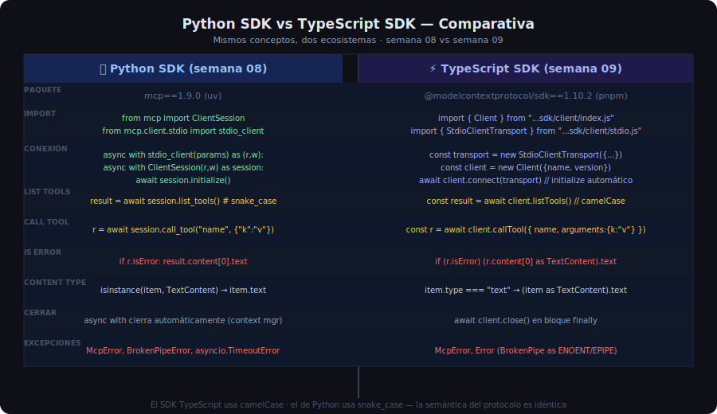

# Manejo de Errores y Comparativa Python vs TypeScript



## 🎯 Objetivos

- Identificar los tres tipos de error en un client MCP TypeScript
- Implementar manejo de errores robusto con `try/catch/finally`
- Comprender las diferencias clave entre el SDK Python y TypeScript

---

## 1. Taxonomía de Errores en el Client TypeScript

### Tipo 1: `isError = true` — Error de dominio

El servidor procesó la petición pero reportó un fallo de negocio. **No lanza excepción**:

```typescript
const result = await client.callTool({
  name: "add_book",
  arguments: { title: "Clean Code", author: "Robert C. Martin", year: 1999 },
});

if (result.isError) {
  // Error de dominio: ISBN duplicado, validación fallida, etc.
  const errorMsg = result.content[0]?.type === "text"
    ? result.content[0].text
    : "Error desconocido en el server";
  console.error(`Error del servidor: ${errorMsg}`);
  return null;
}

// Sin error: procesar resultado
const book = JSON.parse((result.content[0] as { type: "text"; text: string }).text);
```

### Tipo 2: `McpError` — Error de protocolo

El servidor no pudo procesar la petición MCP. **Lanza excepción**:

```typescript
import { McpError, ErrorCode } from "@modelcontextprotocol/sdk/types.js";

try {
  await client.callTool({ name: "tool_inexistente", arguments: {} });
} catch (e) {
  if (e instanceof McpError) {
    console.error(`Error MCP [${e.code}]: ${e.message}`);
    // e.code puede ser: -32601 (Method not found), -32602 (Invalid params), etc.
  }
}
```

### Tipo 3: Errores de sistema — `Error` nativo de Node.js

Fallo en el transporte o proceso hijo:

```typescript
try {
  await client.connect(transport);
} catch (e) {
  if (e instanceof Error) {
    const nodeError = e as NodeJS.ErrnoException;
    switch (nodeError.code) {
      case "ENOENT":
        // El ejecutable del servidor no se encontró
        throw new Error(`Servidor no encontrado. Verificar ruta: ${serverPath}`);
      case "EPIPE":
      case "ERR_STREAM_DESTROYED":
        // La conexión con el proceso hijo se rompió
        throw new Error("Conexión con el servidor interrumpida");
      default:
        throw e;
    }
  }
}
```

---

## 2. Patrón Seguro con `try/finally`

```typescript
import { Client } from "@modelcontextprotocol/sdk/client/index.js";
import { StdioClientTransport } from "@modelcontextprotocol/sdk/client/stdio.js";
import "dotenv/config";

async function runClient(): Promise<void> {
  const transport = new StdioClientTransport({
    command: process.env.SERVER_COMMAND ?? "python",
    args: [process.env.SERVER_PATH ?? "server.py"],
    env: { ...process.env },
  });

  const client = new Client({ name: "library-client", version: "1.0.0" });

  try {
    await client.connect(transport);

    // Operaciones con el servidor
    const result = await client.callTool({
      name: "search_books",
      arguments: { query: "typescript" },
    });

    if (!result.isError && result.content[0]?.type === "text") {
      console.log(result.content[0].text);
    }

  } catch (e) {
    // Errores de protocolo y sistema
    if (e instanceof Error) {
      console.error(`Error: ${e.message}`);
    }
    process.exit(1);
  } finally {
    // Siempre cerrar, aunque haya excepciones
    await client.close();
  }
}
```

---

## 3. Helper `safeCallTool` — Wrapper con manejo centralizado

```typescript
interface ToolCallSuccess<T> {
  ok: true;
  data: T;
}

interface ToolCallFailure {
  ok: false;
  error: string;
}

type ToolCallResult<T> = ToolCallSuccess<T> | ToolCallFailure;

async function safeCallTool<T>(
  client: Client,
  name: string,
  args: Record<string, unknown> = {},
): Promise<ToolCallResult<T>> {
  try {
    const result = await client.callTool({ name, arguments: args });

    if (result.isError) {
      const msg = result.content[0]?.type === "text"
        ? result.content[0].text
        : "Error de dominio sin mensaje";
      return { ok: false, error: msg };
    }

    const first = result.content[0];
    if (!first || first.type !== "text") {
      return { ok: false, error: "Respuesta vacía o no textual" };
    }

    return { ok: true, data: JSON.parse(first.text) as T };

  } catch (e) {
    const message = e instanceof Error ? e.message : String(e);
    return { ok: false, error: message };
  }
}

// Uso:
const result = await safeCallTool<Book[]>(client, "search_books", { query: "python" });
if (result.ok) {
  console.log(`Encontrados: ${result.data.length} libros`);
} else {
  console.error(`Fallo: ${result.error}`);
}
```

---

## 4. Timeout — Limitar el tiempo de espera

El SDK TypeScript no tiene timeout integrado en `callTool()`. Implementarlo con
`Promise.race`:

```typescript
function withTimeout<T>(promise: Promise<T>, ms: number, label: string): Promise<T> {
  const timeout = new Promise<never>((_, reject) =>
    setTimeout(() => reject(new Error(`Timeout (${ms}ms): ${label}`)), ms),
  );
  return Promise.race([promise, timeout]);
}

// Uso:
const TIMEOUT_MS = Number(process.env.TOOL_TIMEOUT_MS ?? "30000");

const result = await withTimeout(
  client.callTool({ name: "search_books", arguments: { query } }),
  TIMEOUT_MS,
  "search_books",
);
```

---

## 5. Comparativa Python SDK vs TypeScript SDK

### Conexión

```python
# Python — context managers anidados
async with stdio_client(params) as (read, write):
    async with ClientSession(read, write) as session:
        await session.initialize()
        # ... uso
        # cierre automático al salir del with
```

```typescript
// TypeScript — setup/teardown explícito
const transport = new StdioClientTransport({...});
const client = new Client({...});
try {
  await client.connect(transport);
  // ... uso
} finally {
  await client.close();  // siempre explícito
}
```

### Llamada a tools

```python
# Python — snake_case, args como dict directo
result = await session.call_tool("search_books", {"query": query})
```

```typescript
// TypeScript — camelCase, objeto con name + arguments
const result = await client.callTool({ name: "search_books", arguments: { query } });
```

### Procesamiento de contenido

```python
# Python — acceso directo con isinstance
from mcp.types import TextContent
for item in result.content:
    if isinstance(item, TextContent):
        print(item.text)
```

```typescript
// TypeScript — discriminated union con type guard
for (const item of result.content) {
  if (item.type === "text") {
    console.log(item.text);  // TypeScript sabe que item es TextContent
  }
}
```

### Manejo de errores de protocolo

```python
# Python
from mcp.shared.exceptions import McpError
try:
    await session.call_tool("bad_tool", {})
except McpError as e:
    print(f"Error MCP: {e}")
```

```typescript
// TypeScript
import { McpError } from "@modelcontextprotocol/sdk/types.js";
try {
  await client.callTool({ name: "bad_tool", arguments: {} });
} catch (e) {
  if (e instanceof McpError) {
    console.error(`Error MCP: ${e.message}`);
  }
}
```

---

## 6. Errores de Tipos Frecuentes en TypeScript

| Error de compilación | Causa | Fix |
|---------------------|-------|-----|
| `Object is possibly undefined` | `result.content[0]` sin verificar | `if (result.content.length > 0)` |
| `Property 'text' does not exist` | Usar `.text` sin discriminar | `item.type === "text"` antes |
| `Argument of type 'string' not assignable` | `JSON.parse` type assertion faltante | Añadir `as MiTipo` |
| `Cannot find module '...sdk/types.js'` | Import incorrecto | Verificar extensión `.js` en ESM |

---

## 7. tsconfig.json Recomendado

Para proyectos de client MCP en Node.js 22+:

```json
{
  "compilerOptions": {
    "target": "ES2022",
    "module": "NodeNext",
    "moduleResolution": "NodeNext",
    "outDir": "dist",
    "strict": true,
    "noImplicitAny": true,
    "strictNullChecks": true,
    "esModuleInterop": true,
    "skipLibCheck": true
  },
  "include": ["src/**/*.ts"],
  "exclude": ["node_modules", "dist"]
}
```

> **Clave**: `"module": "NodeNext"` y `"moduleResolution": "NodeNext"` son necesarios para
> ESM con Node.js 22. Con `"type": "module"` en `package.json`, los imports TypeScript
> deben incluir la extensión `.js` aunque el archivo sea `.ts`:
> ```typescript
> import { Client } from "@modelcontextprotocol/sdk/client/index.js";  // .js, no .ts
> ```

---

## ✅ Checklist de Verificación

- [ ] `isError` verificado antes de procesar resultado
- [ ] `McpError` capturado en `catch` para errores de protocolo
- [ ] Errores `ENOENT` y `EPIPE` manejados para errores de sistema
- [ ] `client.close()` siempre en bloque `finally`
- [ ] `withTimeout()` usado para operaciones que pueden bloquearse
- [ ] `tsconfig.json` con `"strict": true` y `"moduleResolution": "NodeNext"`
- [ ] Imports con extensión `.js` en código ESM TypeScript
