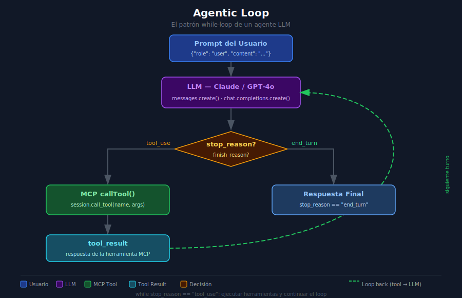

# Agentic Loop — Cómo un LLM decide qué tool ejecutar



---

## 🎯 Objetivos

- Entender el patrón `while`-loop que implementa un agente autónomo con LLM
- Distinguir `stop_reason` (Anthropic) de `finish_reason` (OpenAI) como condición de salida
- Implementar el despacho de tool calls desde Python
- Acumular el historial de mensajes correctamente en cada iteración

---

## 1. ¿Qué es el Agentic Loop?

Un **agente LLM** no es una sola llamada a la API: es un bucle donde el modelo puede
invocar herramientas varias veces antes de devolver una respuesta final al usuario.

El patrón básico en pseudocódigo:

```python
messages = [{"role": "user", "content": user_prompt}]

while True:
    response = llm.messages.create(model=..., tools=tools, messages=messages)

    # Anthropic usa stop_reason; OpenAI usa finish_reason
    if response.stop_reason == "end_turn":        # Anthropic
        return response.content[-1].text          # Respuesta final

    if response.stop_reason == "tool_use":        # Anthropic
        tool_results = dispatch_tool_calls(response)
        messages.append({"role": "assistant", "content": response.content})
        messages.append({"role": "user", "content": tool_results})
        # El loop continúa…
```

---

## 2. Anatomía de cada iteración

Cada vuelta del loop tiene tres fases:

### Fase A — Llamada al LLM

```python
response = client.messages.create(
    model="claude-opus-4-5",
    max_tokens=4096,
    tools=tools_for_claude,   # lista de tools en formato Anthropic
    messages=messages,         # historial completo acumulado
)
```

### Fase B — Detección del motivo de parada

```python
# Anthropic:
if response.stop_reason == "end_turn":
    final_text = response.content[-1].text
    break

elif response.stop_reason == "tool_use":
    tool_use_blocks = [b for b in response.content if b.type == "tool_use"]
    # ejecutar cada tool_use_block...
```

### Fase C — Acumulación de mensajes

El historial `messages` **nunca se borra**: cada turno añade dos entradas:

```python
# 1. Lo que dijo el assistant (incluyendo tool_use blocks)
messages.append({"role": "assistant", "content": response.content})

# 2. Los resultados de las tools (como si los enviara el "user")
messages.append({"role": "user", "content": tool_result_blocks})
```

---

## 3. Despachador de tool calls

El despachador recibe la respuesta del LLM y ejecuta cada tool:

```python
from mcp import ClientSession
import json

async def dispatch_tool_calls(
    response: Any,
    session: ClientSession,
) -> list[dict]:
    """
    Ejecuta todas las tool_use blocks de la respuesta.
    Devuelve una lista de tool_result blocks para Anthropic.
    """
    tool_results = []

    for block in response.content:
        if block.type != "tool_use":
            continue

        # Llamar a la herramienta via MCP
        result = await session.call_tool(block.name, block.input)

        # Construir el bloque tool_result para Anthropic
        content = result.content[0].text if result.content else ""
        tool_results.append({
            "type": "tool_result",
            "tool_use_id": block.id,    # vincula con el block.id del tool_use
            "content": content,
        })

    return tool_results
```

---

## 4. El loop completo en Python

```python
import asyncio
from anthropic import Anthropic
from mcp import ClientSession

async def agentic_loop(
    client: Anthropic,
    session: ClientSession,
    user_prompt: str,
    tools: list[dict],
    model: str = "claude-opus-4-5",
) -> str:
    """
    Loop de agente completo: envía prompts y ejecuta tools
    hasta que el LLM devuelva stop_reason == 'end_turn'.
    """
    messages = [{"role": "user", "content": user_prompt}]

    while True:
        response = client.messages.create(
            model=model,
            max_tokens=4096,
            tools=tools,
            messages=messages,
        )

        # ── Condición de salida ──
        if response.stop_reason == "end_turn":
            for block in response.content:
                if hasattr(block, "text"):
                    return block.text
            return ""

        # ── Ejecutar tools ──
        if response.stop_reason == "tool_use":
            tool_results = await dispatch_tool_calls(response, session)

            messages.append({"role": "assistant", "content": response.content})
            messages.append({"role": "user", "content": tool_results})

        else:
            # stop_reason desconocido: salida segura
            break

    return "Loop terminado sin respuesta final."
```

---

## 5. Límites de seguridad

Un loop sin control puede ejecutar herramientas indefinidamente. Añade siempre un límite:

```python
MAX_ITERATIONS = 10

iteration = 0
while iteration < MAX_ITERATIONS:
    iteration += 1
    response = client.messages.create(...)

    if response.stop_reason == "end_turn":
        break

    # ejecutar tools...

if iteration >= MAX_ITERATIONS:
    return "Error: límite de iteraciones alcanzado."
```

---

## 6. Errores comunes

| Error | Causa | Solución |
|-------|-------|----------|
| Loop infinito | No se detecta `end_turn` correctamente | Añadir `MAX_ITERATIONS` y revisar la condición |
| `tool_use_id` no coincide | `block.id` no se copia al `tool_result` | Usar `block.id` directamente, no regenerarlo |
| Historial corrupto | Messages no se acumulan correctamente | Agregar siempre `{"role": "assistant", content}` antes del `tool_result` |
| `KeyError: stop_reason` | Usar `.stop_reason` con sintaxis de dict | Con Anthropic SDK, usar atributo: `response.stop_reason` |
| Tokens agotados | `max_tokens` demasiado bajo para el historial | Aumentar `max_tokens` o resumir el historial |

---

## 7. Diferencias Anthropic vs OpenAI

| Concepto | Anthropic | OpenAI |
|----------|-----------|--------|
| Condición de parada | `response.stop_reason == "tool_use"` | `response.choices[0].finish_reason == "tool_calls"` |
| Condición de fin | `stop_reason == "end_turn"` | `finish_reason == "stop"` |
| Acceder al texto final | `response.content[-1].text` | `response.choices[0].message.content` |
| Acceder a tool calls | `response.content` (blocks de tipo `tool_use`) | `response.choices[0].message.tool_calls` |

---

## 8. Ejercicio de comprensión

1. ¿Por qué el historial de mensajes debe acumularse en cada turno?
2. ¿Qué ocurre si no se envía el `tool_result` con el `tool_use_id` correcto?
3. ¿En qué situación puede haber múltiples `tool_use` blocks en una sola respuesta?
4. ¿Cómo afecta `max_tokens` al agentic loop?

---

## ✅ Checklist de verificación

- [ ] El loop usa `while True` con condición de salida por `stop_reason`
- [ ] Se acumula el mensaje `assistant` antes de añadir el `tool_result`
- [ ] El `tool_use_id` del resultado coincide con el `id` del bloque `tool_use`
- [ ] Se implementa un límite `MAX_ITERATIONS` para evitar loops infinitos
- [ ] El loop maneja el caso donde `stop_reason` no es `tool_use` ni `end_turn`

---

## 📚 Referencias

- [Anthropic: Tool use guide](https://docs.anthropic.com/en/docs/tool-use)
- [OpenAI: Function calling](https://platform.openai.com/docs/guides/function-calling)
- [MCP: call_tool specification](https://spec.modelcontextprotocol.io/specification/server/tools/)
