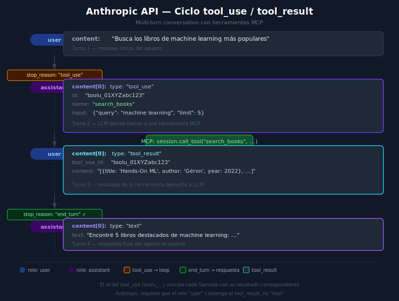

# Anthropic API — tool_use, tool_result y conversación multi-turno



---

## 🎯 Objetivos

- Instalar y configurar el SDK de Anthropic en un proyecto Python
- Definir tools en el formato que acepta la API de Anthropic
- Enviar mensajes con `tools` y procesar la respuesta `tool_use`
- Construir el bloque `tool_result` con el ID correcto para continuar la conversación
- Entender el formato multi-turno que acumula el historial de mensajes

---

## 1. Instalación y configuración

```bash
# Con uv dentro del entorno del proyecto
uv add anthropic==0.96.0 python-dotenv==1.0.1
```

Configuración de la API key:

```python
# .env
ANTHROPIC_API_KEY=sk-ant-api03-...
```

```python
# src/config.py
import os
from dotenv import load_dotenv

load_dotenv()

ANTHROPIC_API_KEY: str = os.environ["ANTHROPIC_API_KEY"]
MODEL: str = os.getenv("ANTHROPIC_MODEL", "claude-opus-4-5")
MAX_TOKENS: int = int(os.getenv("MAX_TOKENS", "4096"))
```

---

## 2. Inicializar el cliente

```python
from anthropic import Anthropic

client = Anthropic(api_key=ANTHROPIC_API_KEY)
```

El cliente es síncrono por defecto. Para operaciones `async` se usa `AsyncAnthropic`:

```python
from anthropic import AsyncAnthropic

client = AsyncAnthropic(api_key=ANTHROPIC_API_KEY)
```

---

## 3. Definir tools en formato Anthropic

Anthropic requiere una lista de diccionarios con esta estructura:

```python
tools: list[dict] = [
    {
        "name": "search_books",
        "description": "Busca libros en la base de datos por título o autor.",
        "input_schema": {              # ← Anthropic usa "input_schema"
            "type": "object",
            "properties": {
                "query": {
                    "type": "string",
                    "description": "Texto de búsqueda",
                },
                "limit": {
                    "type": "integer",
                    "description": "Número máximo de resultados",
                    "default": 5,
                },
            },
            "required": ["query"],
        },
    },
]
```

> **Nota**: El campo se llama `input_schema`, no `parameters` (eso es OpenAI).

---

## 4. Primera llamada — detectar tool_use

```python
messages = [{"role": "user", "content": "Busca libros de Python"}]

response = client.messages.create(
    model="claude-opus-4-5",
    max_tokens=4096,
    tools=tools,
    messages=messages,
)

print(response.stop_reason)   # "tool_use" o "end_turn"
print(response.content)       # lista de blocks (TextBlock, ToolUseBlock...)
```

Cuando `stop_reason == "tool_use"`, la respuesta contiene uno o más `ToolUseBlock`:

```python
for block in response.content:
    if block.type == "tool_use":
        print(block.id)      # "toolu_01XYZabc123"
        print(block.name)    # "search_books"
        print(block.input)   # {"query": "Python", "limit": 5}
```

---

## 5. Construir el bloque tool_result

Después de ejecutar la herramienta, se construye un bloque `tool_result`:

```python
from mcp import ClientSession

async def call_tool_and_build_result(
    block: Any,         # ToolUseBlock de la respuesta de Anthropic
    session: ClientSession,
) -> dict:
    """Llama a la herramienta MCP y devuelve el bloque tool_result."""
    result = await session.call_tool(block.name, block.input)

    # Extraer el texto del resultado MCP
    content = result.content[0].text if result.content else "Sin resultado"

    return {
        "type": "tool_result",
        "tool_use_id": block.id,    # ← CRÍTICO: mismo ID que el tool_use
        "content": content,
    }
```

---

## 6. Enviar el tool_result y continuar la conversación

La API de Anthropic espera que el `tool_result` viaje como contenido del rol `user`:

```python
# Paso 1: añadir lo que dijo el assistant (con el tool_use block)
messages.append({
    "role": "assistant",
    "content": response.content,   # lista de blocks tal como llegaron
})

# Paso 2: añadir el resultado de la tool como si lo enviara el usuario
tool_results = [await call_tool_and_build_result(block, session)
                for block in response.content if block.type == "tool_use"]

messages.append({
    "role": "user",
    "content": tool_results,       # lista de tool_result blocks
})

# Paso 3: llamar a la API de nuevo para que el LLM genere la respuesta final
response2 = client.messages.create(
    model="claude-opus-4-5",
    max_tokens=4096,
    tools=tools,
    messages=messages,
)

# stop_reason debería ser "end_turn" ahora
print(response2.stop_reason)      # "end_turn"
print(response2.content[-1].text) # texto final del assistant
```

---

## 7. Historial completo de una conversación con una tool

```
messages[0]  role: user      → "Busca libros de Python"
messages[1]  role: assistant → [ToolUseBlock(id="toolu_01X", name="search_books", input={...})]
messages[2]  role: user      → [{"type":"tool_result","tool_use_id":"toolu_01X","content":"..."}]
messages[3]  role: assistant → [TextBlock("Encontré 5 libros de Python: ...")]  ← respuesta final
```

El historial siempre alterna `user`/`assistant`. Anthropic pone el `tool_result` en el
bloque `user` porque el resultado proviene del entorno externo, no del modelo.

---

## 8. Manejo de múltiples tool_use en una respuesta

Claude puede pedir varias tools en una sola respuesta:

```python
tool_results = []

for block in response.content:
    if block.type != "tool_use":
        continue
    result = await session.call_tool(block.name, block.input)
    tool_results.append({
        "type": "tool_result",
        "tool_use_id": block.id,
        "content": result.content[0].text if result.content else "",
    })

# Enviar todos los resultados juntos en un solo mensaje de usuario
messages.append({"role": "user", "content": tool_results})
```

---

## 9. Errores comunes

| Error | Causa | Solución |
|-------|-------|----------|
| `tool_use_id does not match` | El ID del `tool_result` no coincide con el `tool_use` | Copiar `block.id` exactamente al `tool_use_id` |
| `invalid role sequence` | Dos mensajes consecutivos con el mismo role | Verificar alternancia user/assistant |
| `input_schema` rechazado | Usar `parameters` en lugar de `input_schema` | Anthropic requiere `input_schema`, no `parameters` |
| `AttributeError: .text` en TextBlock | Acceder con `block["text"]` en vez de `block.text` | SDK devuelve objetos, no dicts: usar `block.text` |
| `AuthenticationError` | API key inválida o no cargada | Verificar `.env` y `load_dotenv()` antes de crear el cliente |

---

## 10. TypeScript — equivalente con `@anthropic-ai/sdk`

```typescript
import Anthropic from "@anthropic-ai/sdk";

const client = new Anthropic({ apiKey: process.env.ANTHROPIC_API_KEY! });

const response = await client.messages.create({
  model: "claude-opus-4-5",
  max_tokens: 4096,
  tools: [
    {
      name: "search_books",
      description: "Busca libros en la base de datos",
      input_schema: {
        type: "object" as const,
        properties: { query: { type: "string" } },
        required: ["query"],
      },
    },
  ],
  messages: [{ role: "user", content: "Busca libros de Python" }],
});

console.log(response.stop_reason); // "tool_use" | "end_turn"
```

---

## 11. Ejercicio de comprensión

1. ¿Por qué el `tool_result` se envía con `role: "user"` y no con `role: "assistant"`?
2. ¿Qué pasa si omites el `tool_use_id` en el bloque `tool_result`?
3. ¿Cuántas veces puede Claude llamar herramientas en una sola conversación?
4. ¿Qué campo diferencia el schema de Anthropic del de OpenAI?

---

## ✅ Checklist de verificación

- [ ] La API key se carga desde `.env` con `load_dotenv()`
- [ ] Las tools usan `input_schema` (no `parameters`)
- [ ] Cada `tool_result` tiene el `tool_use_id` que corresponde al `block.id`
- [ ] El historial alterna correctamente `user` → `assistant` → `user`
- [ ] Se procesa correctamente el caso de múltiples `tool_use` en una respuesta

---

## 📚 Referencias

- [Anthropic: Tool use overview](https://docs.anthropic.com/en/docs/tool-use)
- [Anthropic SDK Python](https://github.com/anthropics/anthropic-sdk-python)
- [Anthropic: Messages API](https://docs.anthropic.com/en/api/messages)
- [MCP: call_tool](https://spec.modelcontextprotocol.io/specification/server/tools/)
