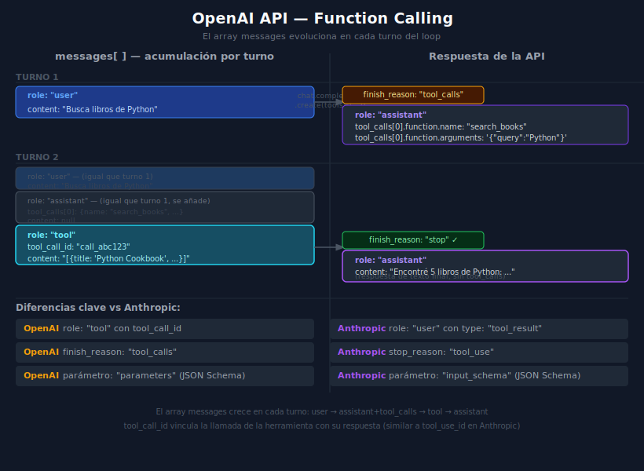

# OpenAI API — function_calling y el array messages



---

## 🎯 Objetivos

- Instalar y configurar el SDK de OpenAI en un proyecto Python
- Definir functions (tools) en el formato que acepta la API de OpenAI
- Procesar `finish_reason == "tool_calls"` y extraer los `tool_calls` del assistant
- Construir el mensaje con `role: "tool"` para devolver el resultado
- Distinguir el formato OpenAI del formato Anthropic con tabla comparativa

---

## 1. Instalación y configuración

```bash
uv add openai==2.32.0 python-dotenv==1.0.1
```

```python
# .env
OPENAI_API_KEY=sk-proj-...
OPENAI_MODEL=gpt-4o-mini    # o gpt-4o, gpt-4-turbo
```

```python
# src/config.py
import os
from dotenv import load_dotenv

load_dotenv()

OPENAI_API_KEY: str = os.environ["OPENAI_API_KEY"]
OPENAI_MODEL: str = os.getenv("OPENAI_MODEL", "gpt-4o-mini")
MAX_TOKENS: int = int(os.getenv("MAX_TOKENS", "4096"))
```

---

## 2. Inicializar el cliente OpenAI

```python
from openai import OpenAI

client = OpenAI(api_key=OPENAI_API_KEY)
```

Para uso async:

```python
from openai import AsyncOpenAI

client = AsyncOpenAI(api_key=OPENAI_API_KEY)
```

---

## 3. Definir tools en formato OpenAI

OpenAI envuelve la función en un objeto `{"type": "function", "function": {...}}`:

```python
tools: list[dict] = [
    {
        "type": "function",
        "function": {                         # ← OpenAI requiere esta clave
            "name": "search_books",
            "description": "Busca libros en la base de datos por título o autor.",
            "parameters": {                   # ← OpenAI usa "parameters"
                "type": "object",
                "properties": {
                    "query": {
                        "type": "string",
                        "description": "Texto de búsqueda",
                    },
                    "limit": {
                        "type": "integer",
                        "description": "Número máximo de resultados",
                        "default": 5,
                    },
                },
                "required": ["query"],
            },
        },
    },
]
```

> **Diferencia clave**: OpenAI usa `"parameters"`, Anthropic usa `"input_schema"`.
> OpenAI además envuelve todo dentro de `{"type": "function", "function": {...}}`.

---

## 4. Primera llamada — detectar finish_reason

```python
import json

messages = [{"role": "user", "content": "Busca libros de Python"}]

response = client.chat.completions.create(
    model=OPENAI_MODEL,
    max_tokens=MAX_TOKENS,
    tools=tools,
    messages=messages,
)

choice = response.choices[0]
print(choice.finish_reason)       # "tool_calls" o "stop"
print(choice.message.tool_calls)  # lista de ChatCompletionMessageToolCall
```

---

## 5. Extraer y ejecutar los tool_calls

```python
if choice.finish_reason == "tool_calls":
    for tool_call in choice.message.tool_calls:
        # Nombre de la función a llamar
        function_name: str = tool_call.function.name

        # Argumentos como string JSON — hay que parsear
        arguments: dict = json.loads(tool_call.function.arguments)

        # ID único que vincula la llamada con el resultado
        call_id: str = tool_call.id

        print(function_name)   # "search_books"
        print(arguments)       # {"query": "Python", "limit": 5}
        print(call_id)         # "call_abc123XYZ"
```

---

## 6. Acumular el mensaje del assistant y enviar tool results

OpenAI **no usa `role: "user"`** para los resultados: usa `role: "tool"`.

```python
from mcp import ClientSession

async def openai_tool_turn(
    client: OpenAI,
    session: ClientSession,
    messages: list[dict],
    response: Any,
) -> list[dict]:
    """
    Procesa un turno con tool_calls: ejecuta las tools via MCP
    y devuelve el historial actualizado.
    """
    choice = response.choices[0]

    # 1. Añadir el mensaje del assistant (con tool_calls) al historial
    messages.append({
        "role": "assistant",
        "content": choice.message.content,     # puede ser None
        "tool_calls": [
            {
                "id": tc.id,
                "type": "function",
                "function": {
                    "name": tc.function.name,
                    "arguments": tc.function.arguments,
                },
            }
            for tc in choice.message.tool_calls
        ],
    })

    # 2. Ejecutar cada tool y añadir su resultado
    for tool_call in choice.message.tool_calls:
        args = json.loads(tool_call.function.arguments)
        result = await session.call_tool(tool_call.function.name, args)
        content = result.content[0].text if result.content else ""

        messages.append({
            "role": "tool",              # ← OpenAI usa "tool", no "user"
            "tool_call_id": tool_call.id,  # ← vincula con el tool_call
            "content": content,
        })

    return messages
```

---

## 7. Loop completo con OpenAI

```python
async def openai_agentic_loop(
    client: OpenAI,
    session: ClientSession,
    user_prompt: str,
    tools: list[dict],
) -> str:
    """Loop de agente completo usando OpenAI."""
    messages = [{"role": "user", "content": user_prompt}]
    max_iterations = 10

    for _ in range(max_iterations):
        response = client.chat.completions.create(
            model=OPENAI_MODEL,
            max_tokens=MAX_TOKENS,
            tools=tools,
            messages=messages,
        )

        choice = response.choices[0]

        if choice.finish_reason == "stop":
            return choice.message.content or ""

        if choice.finish_reason == "tool_calls":
            messages = await openai_tool_turn(client, session, messages, response)

    return "Error: límite de iteraciones alcanzado."
```

---

## 8. El array messages en acción

Así evoluciona el array `messages` en una conversación con una sola tool:

```python
# Turno 1 — entrada del usuario
messages[0] = {"role": "user", "content": "Busca libros de Python"}

# Turno 2 — assistant pide una tool (finish_reason: "tool_calls")
messages[1] = {
    "role": "assistant",
    "content": None,          # suele ser None cuando hay tool_calls
    "tool_calls": [{
        "id": "call_abc123",
        "type": "function",
        "function": {"name": "search_books", "arguments": '{"query":"Python"}'}
    }]
}

# Turno 2b — resultado de la tool (role: "tool")
messages[2] = {
    "role": "tool",
    "tool_call_id": "call_abc123",   # mismo ID que el tool_call
    "content": '[{"title":"Python Cookbook","year":2022}]'
}

# Turno 3 — assistant responde (finish_reason: "stop")
messages[3] = {
    "role": "assistant",
    "content": "Encontré estos libros de Python: ..."
}
```

---

## 9. Tabla comparativa Anthropic vs OpenAI

| Concepto | Anthropic | OpenAI |
|----------|-----------|--------|
| Tool definition wrapper | `{name, description, input_schema}` | `{type:"function", function:{name, description, parameters}}` |
| Schema key | `input_schema` | `parameters` |
| Señal de tool call | `stop_reason == "tool_use"` | `finish_reason == "tool_calls"` |
| Señal de fin | `stop_reason == "end_turn"` | `finish_reason == "stop"` |
| Role para resultados | `"user"` (con `type:"tool_result"`) | `"tool"` |
| ID del vínculo | `tool_use_id` | `tool_call_id` |
| Acceso a tool calls | `response.content` (blocks) | `response.choices[0].message.tool_calls` |
| Argumentos | `block.input` (dict) | `json.loads(tool_call.function.arguments)` |

---

## 10. TypeScript — equivalente con SDK de OpenAI

```typescript
import OpenAI from "openai";

const client = new OpenAI({ apiKey: process.env.OPENAI_API_KEY! });

const response = await client.chat.completions.create({
  model: "gpt-4o-mini",
  max_tokens: 4096,
  tools: [
    {
      type: "function",
      function: {
        name: "search_books",
        description: "Busca libros por texto",
        parameters: {
          type: "object",
          properties: { query: { type: "string" } },
          required: ["query"],
        },
      },
    },
  ],
  messages: [{ role: "user", content: "Busca libros de Python" }],
});

const choice = response.choices[0];
console.log(choice.finish_reason);         // "tool_calls" | "stop"
console.log(choice.message.tool_calls);    // array de tool calls
```

---

## 11. Errores comunes

| Error | Causa | Solución |
|-------|-------|----------|
| `tool_call_id` no reconocido | ID no coincide entre tool_call y role:tool | Usar exactamente `tool_call.id` |
| `arguments` no es dict | `tool_call.function.arguments` es string JSON | Parsear con `json.loads(...)` |
| `finish_reason: "length"` | `max_tokens` demasiado bajo | Aumentar `max_tokens` |
| `content: None` en assistant | Normal cuando hay tool_calls | Verificar `if choice.message.content:` antes de acceder |
| Error 401 | API key inválida | Verificar la key en `.env` y que se cargue antes de crear el cliente |

---

## 12. Ejercicio de comprensión

1. ¿Por qué los `arguments` de un `tool_call` llegan como string JSON y no como dict?
2. ¿Qué sucede si envías el resultado con `role: "user"` en vez de `role: "tool"`?
3. ¿Cómo manejarías el caso en que el assistant hace dos tool_calls simultáneos?
4. ¿Qué modelo de OpenAI recomendarías para un agente con muchas herramientas?

---

## ✅ Checklist de verificación

- [ ] Las tools usan `"parameters"` (no `"input_schema"`) y están envueltas en `{type:"function"}`
- [ ] Los argumentos se parsean con `json.loads(tool_call.function.arguments)`
- [ ] El resultado se envía con `role: "tool"` y el `tool_call_id` correcto
- [ ] El assistant message incluye el array `tool_calls` completo antes del mensaje `tool`
- [ ] Se implementa un límite de iteraciones para evitar loops infinitos

---

## 📚 Referencias

- [OpenAI: Function calling guide](https://platform.openai.com/docs/guides/function-calling)
- [OpenAI Python SDK](https://github.com/openai/openai-python)
- [OpenAI: Chat completions API](https://platform.openai.com/docs/api-reference/chat)
- [MCP: Tools specification](https://spec.modelcontextprotocol.io/specification/server/tools/)
