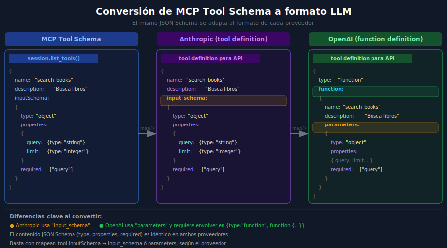

# Conversión de MCP Tool Schemas al formato de cada LLM



---

## 🎯 Objetivos

- Entender la estructura de un MCP Tool tal como lo devuelve `session.list_tools()`
- Convertir el schema MCP al formato de Anthropic (`input_schema`)
- Convertir el schema MCP al formato de OpenAI (`parameters` dentro de `function`)
- Implementar funciones reutilizables de conversión en Python
- Entender por qué el JSON Schema interno es idéntico en ambos proveedores

---

## 1. El schema MCP — qué devuelve `list_tools()`

Cuando conectas a un MCP server y llamas a `session.list_tools()`, obtienes:

```python
from mcp import ClientSession

result = await session.list_tools()
for tool in result.tools:
    print(tool.name)          # "search_books"
    print(tool.description)   # "Busca libros en la base de datos"
    print(tool.inputSchema)   # dict con JSON Schema
```

La estructura del `inputSchema`:

```python
{
    "type": "object",
    "properties": {
        "query": {
            "type": "string",
            "description": "Texto de búsqueda",
        },
        "limit": {
            "type": "integer",
            "description": "Número máximo de resultados",
            "default": 5,
        },
    },
    "required": ["query"],
}
```

Esto es **JSON Schema estándar** — idéntico al que usan Anthropic y OpenAI internamente.
Solo cambia cómo cada proveedor **empaqueta** ese schema en su API.

---

## 2. Conversión a formato Anthropic

La conversión de MCP → Anthropic es directa: solo hay que renombrar `inputSchema` a `input_schema`:

```python
from mcp.types import Tool as MCPTool

def convert_mcp_tool_to_anthropic(tool: MCPTool) -> dict:
    """
    Convierte un MCP Tool al formato de tool definition de Anthropic.

    Cambio principal: inputSchema → input_schema
    """
    return {
        "name": tool.name,
        "description": tool.description or "",
        "input_schema": tool.inputSchema,   # ← renombramos la clave
    }


def convert_mcp_tools_for_anthropic(tools: list[MCPTool]) -> list[dict]:
    """Convierte una lista de MCP Tools para la API de Anthropic."""
    return [convert_mcp_tool_to_anthropic(t) for t in tools]
```

Uso en la práctica:

```python
result = await session.list_tools()
anthropic_tools = convert_mcp_tools_for_anthropic(result.tools)

# Ya listo para pasar a la API:
response = client.messages.create(
    model="claude-opus-4-5",
    tools=anthropic_tools,     # ← lista convertida
    messages=messages,
    max_tokens=4096,
)
```

---

## 3. Conversión a formato OpenAI

OpenAI requiere dos niveles adicionales:
1. Envolver la definición en `{"type": "function", "function": {...}}`
2. Renombrar `inputSchema` a `parameters`

```python
def convert_mcp_tool_to_openai(tool: MCPTool) -> dict:
    """
    Convierte un MCP Tool al formato de function definition de OpenAI.

    Cambios:
    - inputSchema → parameters
    - Se envuelve todo en {type: "function", function: {...}}
    """
    return {
        "type": "function",
        "function": {
            "name": tool.name,
            "description": tool.description or "",
            "parameters": tool.inputSchema,  # ← mismo JSON Schema, distinto nombre
        },
    }


def convert_mcp_tools_for_openai(tools: list[MCPTool]) -> list[dict]:
    """Convierte una lista de MCP Tools para la API de OpenAI."""
    return [convert_mcp_tool_to_openai(t) for t in tools]
```

Uso:

```python
result = await session.list_tools()
openai_tools = convert_mcp_tools_for_openai(result.tools)

response = client.chat.completions.create(
    model="gpt-4o-mini",
    tools=openai_tools,        # ← lista convertida
    messages=messages,
    max_tokens=4096,
)
```

---

## 4. Función unificada — soportar ambos proveedores

Un agente que soporte Anthropic y OpenAI puede usar una función que reciba el proveedor:

```python
from enum import Enum

class LLMProvider(str, Enum):
    ANTHROPIC = "anthropic"
    OPENAI = "openai"

def convert_mcp_tools(
    tools: list[MCPTool],
    provider: LLMProvider,
) -> list[dict]:
    """
    Convierte tools MCP al formato del proveedor indicado.

    Args:
        tools: Lista de tools devuelta por session.list_tools()
        provider: "anthropic" u "openai"

    Returns:
        Lista de dicts en el formato correcto para cada API
    """
    if provider == LLMProvider.ANTHROPIC:
        return [
            {
                "name": t.name,
                "description": t.description or "",
                "input_schema": t.inputSchema,
            }
            for t in tools
        ]
    elif provider == LLMProvider.OPENAI:
        return [
            {
                "type": "function",
                "function": {
                    "name": t.name,
                    "description": t.description or "",
                    "parameters": t.inputSchema,
                },
            }
            for t in tools
        ]
    else:
        raise ValueError(f"Proveedor no soportado: {provider}")
```

---

## 5. TypeScript — misma lógica, tipos del SDK

```typescript
import { Tool as MCPTool } from "@modelcontextprotocol/sdk/types.js";

// Conversión a Anthropic
function convertToolForAnthropic(tool: MCPTool): object {
  return {
    name: tool.name,
    description: tool.description ?? "",
    input_schema: tool.inputSchema,   // misma estructura JSON Schema
  };
}

// Conversión a OpenAI
function convertToolForOpenAI(tool: MCPTool): object {
  return {
    type: "function",
    function: {
      name: tool.name,
      description: tool.description ?? "",
      parameters: tool.inputSchema,  // mismo JSON Schema, distinto nombre
    },
  };
}
```

---

## 6. Ejemplo completo de conversión

Dado este tool MCP:

```python
# Lo que devuelve session.list_tools() para un tool del Library Server
mcp_tool = Tool(
    name="search_books",
    description="Busca libros en la base de datos por título o autor.",
    inputSchema={
        "type": "object",
        "properties": {
            "query": {"type": "string", "description": "Texto de búsqueda"},
            "limit": {"type": "integer", "default": 5},
        },
        "required": ["query"],
    },
)
```

Resultado para **Anthropic**:

```python
{
    "name": "search_books",
    "description": "Busca libros en la base de datos por título o autor.",
    "input_schema": {           # ← clave cambiada
        "type": "object",
        "properties": {
            "query": {"type": "string", "description": "Texto de búsqueda"},
            "limit": {"type": "integer", "default": 5},
        },
        "required": ["query"],
    },
}
```

Resultado para **OpenAI**:

```python
{
    "type": "function",         # ← wrapper nuevo
    "function": {               # ← wrapper nuevo
        "name": "search_books",
        "description": "Busca libros en la base de datos por título o autor.",
        "parameters": {         # ← clave cambiada
            "type": "object",
            "properties": {
                "query": {"type": "string", "description": "Texto de búsqueda"},
                "limit": {"type": "integer", "default": 5},
            },
            "required": ["query"],
        },
    },
}
```

---

## 7. Errores comunes

| Error | Causa | Solución |
|-------|-------|----------|
| `Unknown parameter: parameters` | Enviar `parameters` a la API de Anthropic | Usar `input_schema` para Anthropic |
| `Unknown parameter: input_schema` | Enviar `input_schema` a la API de OpenAI | Usar `parameters` para OpenAI |
| `Tool not found` | El nombre del tool cambió en la conversión | Verificar que `name` se copia sin modificar |
| `Invalid schema type` | El `inputSchema` es `None` | Añadir valor por defecto: `tool.inputSchema or {"type": "object", "properties": {}}` |
| Tool sin descripción | `description` es `None` | Usar `tool.description or ""` para evitar `None` |

---

## 8. Ejercicio de comprensión

1. ¿Por qué el JSON Schema (`type`, `properties`, `required`) es idéntico en Anthropic y OpenAI?
2. ¿Qué pasa si un tool de MCP no tiene `description`? ¿Cómo lo manejarías?
3. Escribe la función `convert_mcp_tool_to_anthropic` sin mirar el código de esta teoría.
4. ¿Cuál es la diferencia estructural más grande entre el formato Anthropic y OpenAI?

---

## ✅ Checklist de verificación

- [ ] La conversión a Anthropic usa `input_schema` (no `parameters`)
- [ ] La conversión a OpenAI envuelve la función en `{type: "function", function: {...}}`
- [ ] La conversión a OpenAI usa `parameters` (no `input_schema`)
- [ ] Los valores `None` en `description` se tratan con `or ""`
- [ ] La función acepta una lista completa de tools (no solo una)
- [ ] El JSON Schema interno (propiedades, tipos, required) se copia tal cual

---

## 📚 Referencias

- [MCP: Tools schema specification](https://spec.modelcontextprotocol.io/specification/server/tools/)
- [Anthropic: Tool definition format](https://docs.anthropic.com/en/docs/tool-use#specifying-tools)
- [OpenAI: Function calling — tool format](https://platform.openai.com/docs/guides/function-calling)
- [JSON Schema specification](https://json-schema.org/specification)
