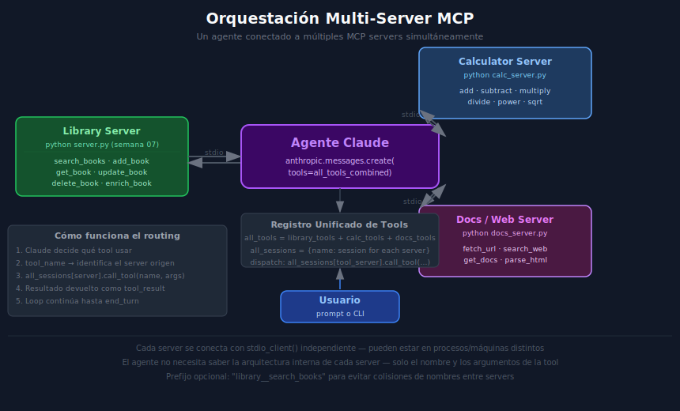

# Orquestación Multi-Server — Conectar N servidores MCP en un solo agente



---

## 🎯 Objetivos

- Conectar simultáneamente a múltiples MCP servers desde un agente Python
- Combinar los tools de todos los servers en una sola lista para el LLM
- Implementar el routing: saber a qué session enviar cada tool call
- Manejar colisiones de nombres de tools entre servers distintos
- Gestionar el ciclo de vida de múltiples conexiones de forma segura

---

## 1. ¿Por qué orquestar múltiples servers?

Un agente real necesita capacidades de distintos dominios:

- **Library Server** → gestión de libros en una base de datos local
- **Calculator Server** → operaciones matemáticas
- **Docs Server** → búsqueda y lectura de documentación web
- **Email Server** → enviar notificaciones

Cada server es especialista en su dominio. El agente actúa como **orquestador**: decide qué tool
usar y despacha la llamada al server correcto.

---

## 2. Estructura de datos para múltiples servers

Necesitamos dos estructuras que mantengan la relación tool → server:

```python
from mcp import ClientSession
from mcp.types import Tool as MCPTool

# Registro unificado de tools (para pasarle al LLM)
all_tools: list[MCPTool] = []

# Mapa tool_name → session (para saber a qué server llamar)
tool_to_session: dict[str, ClientSession] = {}
```

---

## 3. Conectar a múltiples servers

```python
import asyncio
from contextlib import AsyncExitStack
from mcp import ClientSession, StdioServerParameters
from mcp.client.stdio import stdio_client

async def connect_to_all_servers(
    server_configs: list[dict],
) -> tuple[list[MCPTool], dict[str, ClientSession], AsyncExitStack]:
    """
    Conecta a todos los servers MCP definidos en server_configs.

    Args:
        server_configs: Lista de dicts con {script, args, env}

    Returns:
        - Lista unificada de tools (todos los servers)
        - Mapa tool_name → ClientSession
        - AsyncExitStack para gestionar el ciclo de vida
    """
    stack = AsyncExitStack()
    all_tools: list[MCPTool] = []
    tool_to_session: dict[str, ClientSession] = {}

    for config in server_configs:
        # Parámetros de conexión para este server
        params = StdioServerParameters(
            command="python",
            args=[config["script"]] + config.get("args", []),
            env=config.get("env"),
        )

        # Abrir la conexión (el stack gestiona el cierre)
        stdio_transport = await stack.enter_async_context(stdio_client(params))
        stdio, write = stdio_transport
        session = await stack.enter_async_context(ClientSession(stdio, write))

        # Inicializar la sesión
        await session.initialize()

        # Obtener los tools de este server
        result = await session.list_tools()
        for tool in result.tools:
            all_tools.append(tool)
            tool_to_session[tool.name] = session   # mapear tool → session

    return all_tools, tool_to_session, stack
```

---

## 4. Despachar tool calls al server correcto

Con el mapa `tool_to_session` podemos enrutar cada llamada:

```python
async def dispatch_tool_call(
    tool_name: str,
    tool_input: dict,
    tool_to_session: dict[str, ClientSession],
) -> str:
    """
    Ejecuta una tool en el server correcto usando el mapa de routing.

    Args:
        tool_name: Nombre de la tool que pidió el LLM
        tool_input: Argumentos de la tool (dict)
        tool_to_session: Mapa tool_name → ClientSession

    Returns:
        Resultado de la tool como string
    """
    if tool_name not in tool_to_session:
        return f"Error: tool '{tool_name}' no encontrada en ningún server."

    session = tool_to_session[tool_name]
    result = await session.call_tool(tool_name, tool_input)

    return result.content[0].text if result.content else ""
```

---

## 5. Integración con el agentic loop

```python
from anthropic import Anthropic

async def multi_server_agent(
    user_prompt: str,
    server_configs: list[dict],
    anthropic_api_key: str,
    model: str = "claude-opus-4-5",
) -> str:
    """Agente con acceso a múltiples MCP servers."""
    client = Anthropic(api_key=anthropic_api_key)

    # Conectar a todos los servers
    all_tools, tool_to_session, stack = await connect_to_all_servers(server_configs)

    async with stack:
        # Convertir tools al formato Anthropic
        anthropic_tools = [
            {
                "name": t.name,
                "description": t.description or "",
                "input_schema": t.inputSchema,
            }
            for t in all_tools
        ]

        messages = [{"role": "user", "content": user_prompt}]

        for _ in range(10):    # límite de iteraciones
            response = client.messages.create(
                model=model,
                max_tokens=4096,
                tools=anthropic_tools,
                messages=messages,
            )

            if response.stop_reason == "end_turn":
                for block in response.content:
                    if hasattr(block, "text"):
                        return block.text
                return ""

            if response.stop_reason == "tool_use":
                tool_results = []

                for block in response.content:
                    if block.type != "tool_use":
                        continue
                    content = await dispatch_tool_call(
                        block.name,
                        block.input,
                        tool_to_session,
                    )
                    tool_results.append({
                        "type": "tool_result",
                        "tool_use_id": block.id,
                        "content": content,
                    })

                messages.append({"role": "assistant", "content": response.content})
                messages.append({"role": "user", "content": tool_results})

    return "Error: límite de iteraciones alcanzado."
```

---

## 6. Colisiones de nombres entre servers

Si dos servers tienen una tool con el mismo nombre (`search`), hay que usar prefijos:

```python
# Prefijo: "nombre_server__nombre_tool"
def register_tools_with_prefix(
    tools: list[MCPTool],
    session: ClientSession,
    server_name: str,
    all_tools: list[MCPTool],
    tool_to_session: dict[str, tuple[ClientSession, str]],
) -> None:
    """
    Registra los tools de un server añadiendo un prefijo al nombre
    para evitar colisiones entre servers distintos.
    """
    for tool in tools:
        prefixed_name = f"{server_name}__{tool.name}"

        # Crear una copia con el nombre prefijado
        prefixed_tool = MCPTool(
            name=prefixed_name,
            description=f"[{server_name}] {tool.description or ''}",
            inputSchema=tool.inputSchema,
        )

        all_tools.append(prefixed_tool)
        # Guardar session + nombre original para el dispatch
        tool_to_session[prefixed_name] = (session, tool.name)
```

Dispatch con prefijo:

```python
async def dispatch_with_prefix(
    tool_name: str,    # "library__search_books"
    tool_input: dict,
    tool_to_session: dict[str, tuple[ClientSession, str]],
) -> str:
    if tool_name not in tool_to_session:
        return f"Error: tool '{tool_name}' no encontrada."

    session, original_name = tool_to_session[tool_name]
    result = await session.call_tool(original_name, tool_input)
    return result.content[0].text if result.content else ""
```

---

## 7. Configuración de servers (formato recomendado)

```python
import os

SERVER_CONFIGS: list[dict] = [
    {
        "name": "library",
        "script": "../../week-07-servers_bd_apis_externas/3-proyecto/starter/python-server/src/server.py",
        "args": [],
        "env": {"DB_PATH": os.getenv("DB_PATH", "books.db")},
    },
    {
        "name": "calculator",
        "script": "servers/calculator_server.py",
        "args": [],
        "env": None,
    },
]
```

---

## 8. Gestión del ciclo de vida con AsyncExitStack

`AsyncExitStack` garantiza que todas las conexiones se cierren correctamente:

```python
from contextlib import AsyncExitStack

async def main() -> None:
    async with AsyncExitStack() as stack:
        for config in SERVER_CONFIGS:
            transport = await stack.enter_async_context(stdio_client(...))
            session = await stack.enter_async_context(ClientSession(*transport))
            await session.initialize()
        # Cuando el bloque termina (o hay excepción), todas las sesiones se cierran
```

---

## 9. Errores comunes

| Error | Causa | Solución |
|-------|-------|----------|
| `Tool not found` | El nombre del tool cambió o hay colisión | Verificar `tool_to_session` con `print(list(tool_to_session.keys()))` |
| `BrokenPipeError` | El proceso del server se cerró prematuramente | Verificar que el script del server sea válido y ejecutable |
| `Session not initialized` | Llamar `call_tool` antes de `session.initialize()` | Siempre `await session.initialize()` tras crear la sesión |
| Colisión de nombres | Dos servers con el mismo nombre de tool | Usar prefijo `server_name__tool_name` |
| `ResourceWarning` | Sesiones no cerradas al terminar | Usar `AsyncExitStack` o context managers explícitos |

---

## 10. Ejercicio de comprensión

1. ¿Por qué necesitamos el mapa `tool_to_session` y no basta con la lista `all_tools`?
2. ¿Qué problema ocurre si dos servers tienen una tool con el mismo nombre?
3. ¿Cómo garantiza `AsyncExitStack` que las conexiones se cierren correctamente?
4. ¿Qué modificación necesitarías para soportar un server HTTP en lugar de stdio?

---

## ✅ Checklist de verificación

- [ ] Cada server se inicializa con `await session.initialize()` antes de `list_tools()`
- [ ] El mapa `tool_to_session` se construye correctamente (tool_name → session)
- [ ] Se usa `AsyncExitStack` para gestionar el ciclo de vida de las sesiones
- [ ] El dispatch verifica si el tool existe antes de llamar a `call_tool()`
- [ ] Se considera la colisión de nombres si hay servers con tools del mismo nombre
- [ ] El loop tiene un límite de iteraciones (`MAX_ITERATIONS`)

---

## 📚 Referencias

- [MCP: Client session lifecycle](https://modelcontextprotocol.io/docs/concepts/clients)
- [Python: contextlib.AsyncExitStack](https://docs.python.org/3/library/contextlib.html#contextlib.AsyncExitStack)
- [MCP Python SDK: stdio_client](https://github.com/modelcontextprotocol/python-sdk)
- [Anthropic: Building agents](https://docs.anthropic.com/en/docs/agents)
