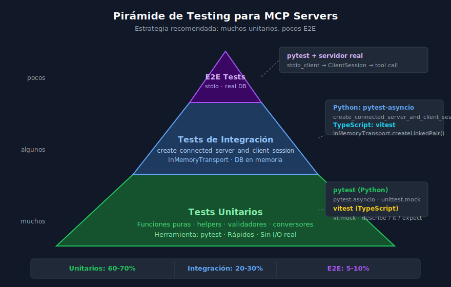

# Testing de MCP Servers con pytest

## 🎯 Objetivos

- Comprender la estrategia de testing para MCP Servers en Python
- Usar `create_connected_server_and_client_session` para tests de integración
- Escribir tests unitarios para funciones auxiliares
- Organizar una suite de tests con fixtures reutilizables

---



---

## 📋 Contenido

### 1. ¿Por qué testear un MCP Server?

Un MCP Server expone tools que un LLM puede llamar. Si una tool tiene un bug,
el agente tomará decisiones incorrectas. A diferencia de una API REST donde el
humano detecta el error inmediatamente, en un agente autónomo el error puede
propagarse varios pasos antes de ser visible.

**Razones para testear:**

- Las tools modifican estado (DB, archivos) — los errores son costosos
- El LLM no valida las respuestas, las acepta como verdad
- Los refactors sin tests rompen contratos silenciosamente
- La CI/CD necesita validación automática antes de deploy

### 2. Estrategia de testing: la pirámide

```
       /\
      /E2E\           ← pocos: stdio real, DB real, proceso real
     /------\
    /integrac.\       ← algunos: InMemory transport, DB en memoria
   /------------\
  /  unitarios   \    ← muchos: funciones puras, sin I/O
 /________________\
```

| Nivel | Herramienta Python | Velocidad | Uso |
|-------|-------------------|-----------|-----|
| Unitarios | `pytest` puro | Muy rápido | Helpers, validadores, parsers |
| Integración | `pytest-asyncio` + `create_connected_server_and_client_session` | Rápido | Tools end-to-end en memoria |
| E2E | `pytest` + `stdio_client` real | Lento | Smoke tests en CI |

### 3. Dependencias de testing

```toml
# pyproject.toml — grupo de test
[dependency-groups]
test = [
    "pytest==8.3.5",
    "pytest-asyncio==0.25.3",
    "pytest-cov==6.1.0",
    "aiosqlite==0.20.0",
]
```

Instalar con uv:

```bash
uv sync --group test
```

Configurar en `pyproject.toml`:

```toml
[tool.pytest.ini_options]
asyncio_mode = "auto"          # todos los tests async sin decorar
testpaths = ["tests"]
```

### 4. `create_connected_server_and_client_session`

Esta función del SDK de MCP crea una conexión **en memoria** entre un server
y un client, sin necesitar sockets ni procesos externos.

```python
from mcp.shared.memory import create_connected_server_and_client_session

async with create_connected_server_and_client_session(
    server._mcp_server   # el servidor FastMCP expone ._mcp_server
) as (server_session, client_session):
    # Aquí puedes llamar tools como un client real
    result = await client_session.call_tool("add_book", {
        "title": "Clean Code",
        "author": "Robert C. Martin",
        "year": 2008,
    })
    print(result.content[0].text)
```

**¿Qué incluye la sesión en memoria?**
- Protocolo MCP completo (initialize, list_tools, call_tool)
- Serialización/deserialización JSON-RPC real
- Gestión de lifespan del server (contexto compartido, DB, HTTP client)

### 5. Fixture de base de datos en memoria

Para tests de integración que involucran SQLite, lo ideal es usar `:memory:`:

```python
# tests/conftest.py
import pytest
import aiosqlite
from mcp.shared.memory import create_connected_server_and_client_session

from src.server import mcp, _init_schema


@pytest.fixture
async def db():
    """Base de datos SQLite en memoria para tests."""
    async with aiosqlite.connect(":memory:") as conn:
        conn.row_factory = aiosqlite.Row
        await _init_schema(conn)
        yield conn


@pytest.fixture
async def mcp_client(monkeypatch):
    """
    Client MCP conectado al server en memoria.
    Parchea la variable de entorno DB_PATH para usar :memory:.
    """
    monkeypatch.setenv("DB_PATH", ":memory:")
    async with create_connected_server_and_client_session(
        mcp._mcp_server
    ) as (_, client):
        yield client
```

### 6. Tests de integración: estructura

```python
# tests/test_tools_integration.py
import json
import pytest


class TestAddBook:
    """Tests para la tool add_book."""

    async def test_add_book_success(self, mcp_client):
        result = await mcp_client.call_tool("add_book", {
            "title": "El Quijote",
            "author": "Cervantes",
            "year": 1605,
        })
        data = json.loads(result.content[0].text)
        assert data["success"] is True
        assert isinstance(data["id"], int)
        assert data["id"] > 0

    async def test_add_book_creates_retrievable_book(self, mcp_client):
        # Agregar
        add_result = await mcp_client.call_tool("add_book", {
            "title": "Fundación",
            "author": "Asimov",
            "year": 1951,
        })
        book_id = json.loads(add_result.content[0].text)["id"]

        # Recuperar
        get_result = await mcp_client.call_tool("get_book", {"book_id": book_id})
        book = json.loads(get_result.content[0].text)
        assert book["title"] == "Fundación"
        assert book["author"] == "Asimov"


class TestSearchBooks:
    """Tests para la tool search_books."""

    async def test_search_returns_matching_books(self, mcp_client):
        # Arrange
        await mcp_client.call_tool("add_book", {
            "title": "Python Moderno",
            "author": "Guido van Rossum",
            "year": 2024,
        })
        # Act
        result = await mcp_client.call_tool("search_books", {"query": "Python"})
        books = json.loads(result.content[0].text)
        # Assert
        assert isinstance(books, list)
        assert len(books) >= 1
        assert any("Python" in b["title"] for b in books)

    async def test_search_empty_returns_message(self, mcp_client):
        result = await mcp_client.call_tool("search_books", {"query": "xyzzy99"})
        data = json.loads(result.content[0].text)
        assert "message" in data or isinstance(data, list) and len(data) == 0
```

### 7. Tests unitarios: funciones auxiliares

No todas las pruebas necesitan el MCP server. Las funciones de conversión,
validación y helpers se testean directamente:

```python
# tests/test_unit.py
import json
import pytest
from src.tools import convert_mcp_tools_for_claude, call_mcp_tool


def test_convert_tool_has_required_fields():
    """Los tools convertidos deben tener name, description, input_schema."""
    # Simular un objeto tool de MCP
    class FakeTool:
        name = "add_book"
        description = "Add a book"
        inputSchema = {
            "type": "object",
            "properties": {"title": {"type": "string"}},
            "required": ["title"],
        }

    result = convert_mcp_tools_for_claude([FakeTool()])
    assert len(result) == 1
    assert result[0]["name"] == "add_book"
    assert "input_schema" in result[0]


def test_convert_tool_preserves_schema():
    """El schema debe mantenerse intacto tras la conversión."""
    class FakeTool:
        name = "test"
        description = "desc"
        inputSchema = {"type": "object", "properties": {}}

    result = convert_mcp_tools_for_claude([FakeTool()])
    assert result[0]["input_schema"]["type"] == "object"
```

### 8. Cobertura de tests

Para medir qué porcentaje del código ejecutan tus tests:

```bash
# Ejecutar tests con cobertura
uv run pytest --cov=src --cov-report=term-missing

# Generar reporte HTML
uv run pytest --cov=src --cov-report=html
# Abre htmlcov/index.html en el navegador
```

Objetivo: **80% de cobertura** como mínimo en un proyecto de producción.

```
Name               Stmts   Miss  Cover
--------------------------------------
src/server.py         87     14    84%
src/config.py         12      2    83%
src/tools.py          28      4    86%
--------------------------------------
TOTAL                127     20    84%
```

### 9. Errores comunes en testing MCP

| Error | Causa probable | Solución |
|-------|---------------|----------|
| `RuntimeError: no running event loop` | Test sync en vez de async | Añadir `asyncio_mode = "auto"` en pytest |
| `AttributeError: _mcp_server` | FastMCP no expone el server | Usar `mcp._mcp_server` o el server nativo |
| DB persiste entre tests | Fixture con scope incorrecto | Usar scope `function` (default) o `:memory:` |
| `ModuleNotFoundError` | Imports relativos en tests | Ejecutar desde la raíz con `uv run pytest` |
| Test lento en E2E | stdio real, proceso externo | Marcar con `@pytest.mark.e2e` y excluir de CI |

### 10. Buenas prácticas

- **Un assert por test** cuando sea posible — tests focalizados
- **AAA pattern**: Arrange → Act → Assert
- **Nombres descriptivos**: `test_add_book_returns_id_on_success()`
- **Fixtures en conftest.py** para reutilizar entre módulos
- **Mocks para APIs externas**: `unittest.mock.AsyncMock` para httpx
- **No testear el framework**: no testear que FastMCP funciona, testear tu lógica

---

## ✅ Checklist de Verificación

- [ ] `pyproject.toml` tiene grupo `[dependency-groups] test`
- [ ] `conftest.py` con fixture `mcp_client` usando `:memory:`
- [ ] Al menos 3 tests para cada tool crítica (success, not_found, edge case)
- [ ] Tests unitarios para funciones auxiliares
- [ ] `pytest --cov` muestra ≥ 80% de cobertura
- [ ] Todos los tests pasan en < 10 segundos

## 📚 Recursos Adicionales

- [pytest-asyncio docs](https://pytest-asyncio.readthedocs.io/)
- [MCP Python SDK — testing](https://github.com/modelcontextprotocol/python-sdk)
- [pytest fixtures guide](https://docs.pytest.org/en/stable/reference/fixtures.html)
