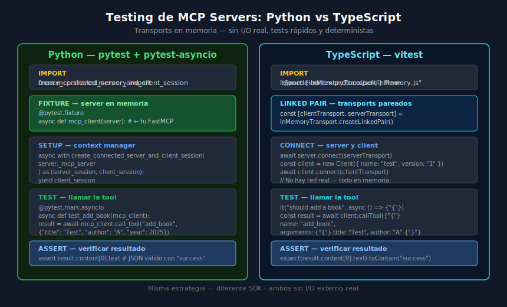

# Testing de MCP Servers con vitest e InMemoryTransport

## 🎯 Objetivos

- Configurar vitest para testing de MCP Servers en TypeScript
- Usar `InMemoryTransport` para tests de integración sin I/O real
- Escribir tests tipados con `describe`, `it` y `expect`
- Mockear dependencias externas con `vi.mock`

---



---

## 📋 Contenido

### 1. Herramientas del ecosistema TypeScript

| Herramienta | Versión | Rol |
|-------------|---------|-----|
| `vitest` | `3.1.3` | Test runner (reemplaza Jest, más rápido) |
| `@vitest/coverage-v8` | `3.1.3` | Cobertura de tests |
| `@modelcontextprotocol/sdk` | `1.10.2` | InMemoryTransport |

vitest es compatible con la API de Jest (`describe`, `it`, `expect`, `vi.mock`)
pero está diseñado específicamente para proyectos con ESM y TypeScript 5.x.

### 2. Configuración inicial

```json
// package.json
{
  "scripts": {
    "test": "vitest run",
    "test:watch": "vitest",
    "test:coverage": "vitest run --coverage"
  },
  "devDependencies": {
    "vitest": "3.1.3",
    "@vitest/coverage-v8": "3.1.3"
  }
}
```

```typescript
// vitest.config.ts
import { defineConfig } from "vitest/config";

export default defineConfig({
  test: {
    globals: true,         // describe, it, expect sin import
    environment: "node",
    coverage: {
      provider: "v8",
      reporter: ["text", "html"],
      thresholds: {
        lines: 80,
        functions: 80,
      },
    },
  },
});
```

### 3. InMemoryTransport: la clave del testing rápido

El SDK de MCP expone `InMemoryTransport` que crea un par de transports
vinculados en memoria. No hay sockets, no hay procesos, no hay latencia:

```typescript
import { InMemoryTransport } from "@modelcontextprotocol/sdk/inMemory.js";
import { Client } from "@modelcontextprotocol/sdk/client/index.js";

const [clientTransport, serverTransport] =
  InMemoryTransport.createLinkedPair();

// Conectar el server al transport de server
await server.connect(serverTransport);

// Conectar el client al transport de client
const client = new Client({ name: "test-client", version: "1.0.0" });
await client.connect(clientTransport);

// A partir de aquí, client y server se comunican como si hubiera red real
```

**Flujo de mensajes en memoria:**

```
client.callTool("add_book", {...})
  → clientTransport.send(mensaje)
    → serverTransport.receive(mensaje)   ← en memoria, sin red
      → server ejecuta la tool
        → serverTransport.send(respuesta)
          → clientTransport.receive(respuesta)
            → client devuelve el resultado
```

### 4. Helper de test: `setupTestServer`

Crear un helper reutilizable que configure el server y client para cada test:

```typescript
// tests/helpers/test-setup.ts
import { Client } from "@modelcontextprotocol/sdk/client/index.js";
import { InMemoryTransport } from "@modelcontextprotocol/sdk/inMemory.js";
import { Server } from "@modelcontextprotocol/sdk/server/index.js";

export async function setupTestServer(server: Server): Promise<{
  client: Client;
  cleanup: () => Promise<void>;
}> {
  const [clientTransport, serverTransport] =
    InMemoryTransport.createLinkedPair();

  await server.connect(serverTransport);

  const client = new Client({ name: "test-client", version: "1.0.0" });
  await client.connect(clientTransport);

  return {
    client,
    cleanup: async () => {
      await client.close();
    },
  };
}
```

### 5. Tests de integración completos

```typescript
// tests/tools.test.ts
import { describe, it, expect, beforeEach, afterEach } from "vitest";
import { setupTestServer } from "./helpers/test-setup.js";
import { createServer } from "../src/server.js";

describe("Library Manager MCP Server", () => {
  let client: Awaited<ReturnType<typeof setupTestServer>>["client"];
  let cleanup: () => Promise<void>;

  beforeEach(async () => {
    // Crear server con DB en memoria para cada test
    const server = await createServer({ dbPath: ":memory:" });
    ({ client, cleanup } = await setupTestServer(server));
  });

  afterEach(async () => {
    await cleanup();
  });

  describe("list_tools", () => {
    it("should return all expected tools", async () => {
      const tools = await client.listTools();
      const toolNames = tools.tools.map((t) => t.name);
      expect(toolNames).toContain("add_book");
      expect(toolNames).toContain("search_books");
      expect(toolNames).toContain("get_book");
    });
  });

  describe("add_book", () => {
    it("should add a book and return its id", async () => {
      const result = await client.callTool({
        name: "add_book",
        arguments: {
          title: "Clean Code",
          author: "Robert C. Martin",
          year: 2008,
        },
      });

      const content = result.content[0] as { text: string };
      const data = JSON.parse(content.text);

      expect(data.success).toBe(true);
      expect(typeof data.id).toBe("number");
      expect(data.id).toBeGreaterThan(0);
    });

    it("should make the book retrievable after adding", async () => {
      // Arrange — añadir
      const addResult = await client.callTool({
        name: "add_book",
        arguments: { title: "Dune", author: "Frank Herbert", year: 1965 },
      });
      const { id } = JSON.parse(
        (addResult.content[0] as { text: string }).text
      );

      // Act — recuperar
      const getResult = await client.callTool({
        name: "get_book",
        arguments: { book_id: id },
      });
      const book = JSON.parse(
        (getResult.content[0] as { text: string }).text
      );

      // Assert
      expect(book.title).toBe("Dune");
      expect(book.author).toBe("Frank Herbert");
    });
  });

  describe("get_book", () => {
    it("should return error for non-existent book", async () => {
      const result = await client.callTool({
        name: "get_book",
        arguments: { book_id: 99999 },
      });
      const data = JSON.parse(
        (result.content[0] as { text: string }).text
      );
      expect(data.error).toBeDefined();
    });
  });

  describe("delete_book", () => {
    it("should delete an existing book", async () => {
      // Arrange
      const addResult = await client.callTool({
        name: "add_book",
        arguments: { title: "Test", author: "Author", year: 2024 },
      });
      const { id } = JSON.parse(
        (addResult.content[0] as { text: string }).text
      );

      // Act
      const deleteResult = await client.callTool({
        name: "delete_book",
        arguments: { book_id: id },
      });
      const data = JSON.parse(
        (deleteResult.content[0] as { text: string }).text
      );

      expect(data.success).toBe(true);
    });
  });
});
```

### 6. Mockear APIs externas con vi.mock

Para tools que llaman APIs externas (como Open Library), se mockea el módulo:

```typescript
// tests/openlibrary.test.ts
import { describe, it, expect, vi, beforeEach } from "vitest";

// Mockear el módulo httpx antes de importar el server
vi.mock("../src/http-client.js", () => ({
  fetchFromOpenLibrary: vi.fn(),
}));

import { fetchFromOpenLibrary } from "../src/http-client.js";
import { setupTestServer } from "./helpers/test-setup.js";
import { createServer } from "../src/server.js";

describe("search_openlibrary", () => {
  beforeEach(() => {
    vi.clearAllMocks();
  });

  it("should return mapped results from API", async () => {
    // Arrange — simular respuesta de Open Library
    (fetchFromOpenLibrary as ReturnType<typeof vi.fn>).mockResolvedValue({
      docs: [
        {
          title: "Python",
          author_name: ["Guido"],
          first_publish_year: 1991,
          isbn: ["1234567890"],
        },
      ],
    });

    const server = await createServer({ dbPath: ":memory:" });
    const { client, cleanup } = await setupTestServer(server);

    // Act
    const result = await client.callTool({
      name: "search_openlibrary",
      arguments: { title: "Python" },
    });

    await cleanup();
    const books = JSON.parse((result.content[0] as { text: string }).text);
    expect(books).toHaveLength(1);
    expect(books[0].title).toBe("Python");
  });
});
```

### 7. Tests de listado de tools y resources

```typescript
describe("protocol", () => {
  it("should list all tools with schemas", async () => {
    const server = await createServer({ dbPath: ":memory:" });
    const { client, cleanup } = await setupTestServer(server);

    const { tools } = await client.listTools();

    for (const tool of tools) {
      expect(tool.name).toBeTruthy();
      expect(tool.description).toBeTruthy();
      expect(tool.inputSchema).toBeDefined();
      expect(tool.inputSchema.type).toBe("object");
    }

    await cleanup();
  });
});
```

### 8. Ejecutar los tests

```bash
# Todos los tests
pnpm test

# Modo watch (re-ejecuta al guardar)
pnpm test:watch

# Con cobertura
pnpm test:coverage

# Un solo archivo
pnpm test tests/tools.test.ts

# Con verbose
pnpm test --reporter=verbose
```

### 9. Errores comunes en vitest + MCP

| Error | Causa | Solución |
|-------|-------|----------|
| `Cannot use import statement` | ESM no configurado | `"type": "module"` en `package.json` |
| `server.connect is not a function` | Usas FastMCP en vez de Server nativo | Acceder a `server.server` o usar SDK nativo |
| Tests se cuelgan | server no cerrado en `afterEach` | Llamar `await cleanup()` siempre |
| `vi.mock` no funciona | Import antes del mock | Mover mock arriba del import |
| Tipos `any` en content | `result.content[0]` sin cast | Castear a `{ text: string }` explícitamente |

### 10. Estructura de tests recomendada

```
tests/
├── helpers/
│   └── test-setup.ts       # setupTestServer helper
├── unit/
│   └── schema.test.ts      # tests de funciones puras
├── integration/
│   ├── tools.test.ts       # add_book, get_book, etc.
│   └── openlibrary.test.ts # tools con API externa mockeada
└── e2e/
    └── smoke.test.ts       # test mínimo con stdio real
```

---

## ✅ Checklist de Verificación

- [ ] `vitest.config.ts` configurado con `globals: true`
- [ ] `setupTestServer` helper reutilizable
- [ ] `beforeEach/afterEach` limpian el servidor correctamente
- [ ] Tests de éxito y error para cada tool
- [ ] APIs externas mockeadas con `vi.mock`
- [ ] `pnpm test:coverage` muestra ≥ 80%

## 📚 Recursos Adicionales

- [vitest docs](https://vitest.dev/guide/)
- [InMemoryTransport en MCP SDK](https://github.com/modelcontextprotocol/typescript-sdk)
- [vi.mock guide](https://vitest.dev/guide/mocking.html)
