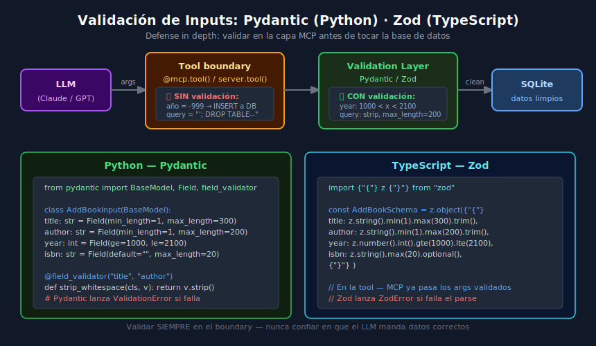

# Validación de Inputs: Pydantic (Python) y Zod (TypeScript)

## 🎯 Objetivos

- Entender por qué validar inputs en la capa MCP es obligatorio
- Implementar modelos Pydantic para tools Python
- Implementar schemas Zod para tools TypeScript
- Manejar errores de validación de forma segura

---



---

## 📋 Contenido

### 1. El problema: el LLM no es de confianza

Aunque Claude o GPT generan los argumentos de un tool call, **nunca debes
asumir que los datos son correctos o seguros**. El LLM puede:

- Enviar un año como string `"2025"` en vez de entero `2025`
- Pasar `year=-1` porque "no sabe" la fecha
- Inyectar caracteres especiales en un campo de texto
- Enviar un campo obligatorio como `null`

La validación en el boundary de la tool **protege tu DB y tu sistema** antes
de que el dato incorrecto llegue a tocarlos.

### 2. Pydantic en Python: conceptos clave

```python
from pydantic import BaseModel, Field, field_validator, model_validator
from typing import Optional
```

| Concepto | Descripción |
|---------|-------------|
| `BaseModel` | Clase base para modelos de datos |
| `Field(...)` | Metadatos de validación: `min_length`, `max_length`, `ge`, `le` |
| `field_validator` | Lógica de validación personalizada por campo |
| `model_validator` | Validación que depende de múltiples campos |
| `ValidationError` | Excepción lanzada si algo falla |

### 3. Modelos Pydantic para el Library Server

```python
# src/validators.py
from pydantic import BaseModel, Field, field_validator
from typing import Optional
import re


class AddBookInput(BaseModel):
    """Valida los inputs de la tool add_book."""

    title: str = Field(
        min_length=1,
        max_length=300,
        description="Book title",
    )
    author: str = Field(
        min_length=1,
        max_length=200,
        description="Author full name",
    )
    year: int = Field(
        ge=1000,
        le=2100,
        description="Publication year",
    )
    isbn: str = Field(
        default="",
        max_length=20,
        pattern=r"^[0-9X-]*$",  # Solo dígitos, X y guiones
        description="ISBN-10 or ISBN-13",
    )
    notes: str = Field(
        default="",
        max_length=1000,
        description="Personal notes",
    )

    @field_validator("title", "author", mode="before")
    @classmethod
    def strip_and_normalize(cls, v: str) -> str:
        """Eliminar espacios y normalizar."""
        if not isinstance(v, str):
            raise ValueError("Must be a string")
        return v.strip()

    @field_validator("isbn", mode="before")
    @classmethod
    def normalize_isbn(cls, v: str) -> str:
        """Limpiar guiones del ISBN."""
        return v.replace("-", "").replace(" ", "").strip()


class SearchBooksInput(BaseModel):
    """Valida los inputs de search_books."""

    query: str = Field(
        min_length=1,
        max_length=200,
        description="Search query",
    )
    limit: int = Field(
        default=10,
        ge=1,
        le=100,
        description="Max results",
    )

    @field_validator("query", mode="before")
    @classmethod
    def strip_query(cls, v: str) -> str:
        return v.strip()


class UpdateBookInput(BaseModel):
    """Valida los inputs de update_book."""

    book_id: int = Field(ge=1, description="Book ID")
    title: Optional[str] = Field(default=None, min_length=1, max_length=300)
    author: Optional[str] = Field(default=None, min_length=1, max_length=200)
    year: Optional[int] = Field(default=None, ge=1000, le=2100)
    notes: Optional[str] = Field(default=None, max_length=1000)
```

### 4. Integrar Pydantic en las tools

```python
# src/server.py
from pydantic import ValidationError
from .validators import AddBookInput, SearchBooksInput
import json


@mcp.tool()
async def add_book(
    title: str,
    author: str,
    year: int,
    isbn: str = "",
    notes: str = "",
    ctx: Context = None,
) -> str:
    # Validate inputs first — before touching the database
    try:
        validated = AddBookInput(
            title=title,
            author=author,
            year=year,
            isbn=isbn,
            notes=notes,
        )
    except ValidationError as e:
        # Return structured error — never expose internal details
        errors = [
            {"field": err["loc"][0], "message": err["msg"]}
            for err in e.errors()
        ]
        return json.dumps({"error": "validation_error", "details": errors})

    # Only use validated data from here on
    db = ctx.request_context.lifespan_context["db"]
    cursor = await db.execute(
        "INSERT INTO books (title, author, year, isbn, notes) VALUES (?, ?, ?, ?, ?)",
        (validated.title, validated.author, validated.year, validated.isbn, validated.notes),
    )
    await db.commit()
    return json.dumps({"success": True, "id": cursor.lastrowid})
```

### 5. Zod en TypeScript: conceptos equivalentes

| Pydantic (Python) | Zod (TypeScript) | Propósito |
|-------------------|-----------------|-----------|
| `Field(min_length=1)` | `z.string().min(1)` | Longitud mínima |
| `Field(max_length=300)` | `z.string().max(300)` | Longitud máxima |
| `Field(ge=1000)` | `z.number().gte(1000)` | Mayor o igual |
| `Field(le=2100)` | `z.number().lte(2100)` | Menor o igual |
| `.strip()` | `.trim()` | Quitar espacios |
| `field_validator` | `.transform()` | Transformación custom |
| `ValidationError` | `ZodError` | Excepción de validación |

### 6. Schemas Zod para el Library Server TypeScript

```typescript
// src/validators.ts
import { z } from "zod";

export const AddBookSchema = z.object({
  title: z.string().min(1).max(300).trim(),
  author: z.string().min(1).max(200).trim(),
  year: z.number().int().gte(1000).lte(2100),
  isbn: z
    .string()
    .max(20)
    .regex(/^[0-9X-]*$/, "ISBN must contain only digits, X, and hyphens")
    .optional()
    .default(""),
  notes: z.string().max(1000).optional().default(""),
});

export const SearchBooksSchema = z.object({
  query: z.string().min(1).max(200).trim(),
  limit: z.number().int().gte(1).lte(100).optional().default(10),
});

export const UpdateBookSchema = z
  .object({
    book_id: z.number().int().gte(1),
    title: z.string().min(1).max(300).trim().optional(),
    author: z.string().min(1).max(200).trim().optional(),
    year: z.number().int().gte(1000).lte(2100).optional(),
    notes: z.string().max(1000).optional(),
  })
  .refine(
    (data) =>
      data.title !== undefined ||
      data.author !== undefined ||
      data.year !== undefined ||
      data.notes !== undefined,
    { message: "At least one field to update is required" }
  );

// Tipos inferidos automáticamente desde los schemas
export type AddBookInput = z.infer<typeof AddBookSchema>;
export type SearchBooksInput = z.infer<typeof SearchBooksSchema>;
export type UpdateBookInput = z.infer<typeof UpdateBookSchema>;
```

### 7. Integrar Zod en las tools TypeScript

```typescript
// src/tools/books.ts
import { ZodError } from "zod";
import { AddBookSchema } from "../validators.js";

server.tool(
  "add_book",
  {
    title: z.string(),
    author: z.string(),
    year: z.number(),
    isbn: z.string().optional(),
    notes: z.string().optional(),
  },
  async ({ title, author, year, isbn = "", notes = "" }) => {
    // Validar con schema completo (MCP ya pasó validación básica de tipos)
    let validated: AddBookInput;
    try {
      validated = AddBookSchema.parse({ title, author, year, isbn, notes });
    } catch (err) {
      if (err instanceof ZodError) {
        const details = err.errors.map((e) => ({
          field: e.path[0],
          message: e.message,
        }));
        return {
          content: [
            {
              type: "text",
              text: JSON.stringify({ error: "validation_error", details }),
            },
          ],
        };
      }
      throw err;
    }

    // Usar solo datos validados
    const result = await db.run(
      "INSERT INTO books (title, author, year, isbn, notes) VALUES (?, ?, ?, ?, ?)",
      [validated.title, validated.author, validated.year, validated.isbn, validated.notes]
    );

    return {
      content: [
        {
          type: "text",
          text: JSON.stringify({ success: true, id: result.lastID }),
        },
      ],
    };
  }
);
```

### 8. Errores de validación: respuesta segura

**Regla de oro**: nunca exponer detalles internos del sistema en mensajes de error.

```python
# ❌ MAL — expone información interna
return json.dumps({"error": str(e), "traceback": traceback.format_exc()})

# ✅ BIEN — mensaje seguro y estructurado
return json.dumps({
    "error": "validation_error",
    "message": "Invalid input data",
    "fields": [{"field": "year", "issue": "must be between 1000 and 2100"}],
})
```

### 9. Testear la validación

```python
# tests/test_validation.py
import pytest
from pydantic import ValidationError
from src.validators import AddBookInput


def test_valid_book_input():
    book = AddBookInput(title="Clean Code", author="Robert C. Martin", year=2008)
    assert book.title == "Clean Code"
    assert book.year == 2008


def test_year_too_old_raises_error():
    with pytest.raises(ValidationError) as exc_info:
        AddBookInput(title="Ancient", author="Unknown", year=500)
    errors = exc_info.value.errors()
    assert any(e["loc"] == ("year",) for e in errors)


def test_title_whitespace_stripped():
    book = AddBookInput(title="  Spaces  ", author="Author", year=2024)
    assert book.title == "Spaces"


def test_empty_title_raises_error():
    with pytest.raises(ValidationError):
        AddBookInput(title="", author="Author", year=2024)
```

---

## ✅ Checklist de Verificación

- [ ] Cada tool tiene su modelo Pydantic / schema Zod correspondiente
- [ ] Todos los campos de texto tienen `max_length`
- [ ] Campos numéricos tienen `ge` y `le` apropiados
- [ ] Los errores de validación retornan JSON estructurado, sin detalles internos
- [ ] Hay tests para casos de validación: válido, inválido, edge cases
- [ ] Los datos validados se usan en queries, no los raw inputs

## 📚 Recursos Adicionales

- [Pydantic Field docs](https://docs.pydantic.dev/latest/concepts/fields/)
- [Pydantic validators](https://docs.pydantic.dev/latest/concepts/validators/)
- [Zod docs](https://zod.dev/)
- [Zod error handling](https://zod.dev/ERROR_HANDLING)
