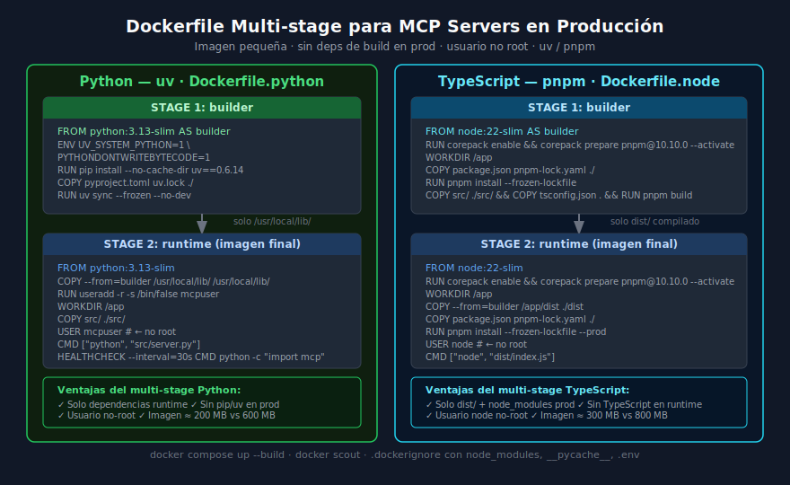

# Docker y Docker Compose para MCP Servers en Producción

## 🎯 Objetivos

- Crear Dockerfiles multi-stage para Python (uv) y TypeScript (pnpm)
- Orquestar servicios con docker compose
- Aplicar buenas prácticas de seguridad en contenedores
- Usar `.dockerignore` para imágenes optimizadas

---



---

## 📋 Contenido

### 1. ¿Por qué multi-stage?

Un Dockerfile sin multi-stage instala todas las dependencias de desarrollo
en la imagen final: compiladores, herramientas de build, tests, etc.
Esto infla la imagen y aumenta la superficie de ataque.

| Enfoque | Tamaño imagen Python | Tamaño imagen Node |
|---------|---------------------|-------------------|
| Sin multi-stage | ~700 MB | ~900 MB |
| Con multi-stage | ~200 MB | ~300 MB |
| Con multi-stage + slim | ~120 MB | ~200 MB |

**Multi-stage = stage de build + stage de runtime**

El stage de build instala todo lo necesario para compilar/instalar.
El stage de runtime copia solo lo que necesita para ejecutar.

### 2. Dockerfile para Python + uv

```dockerfile
# Dockerfile.python

# ─────────────────────────────────────────────
# STAGE 1: builder — instalar dependencias
# ─────────────────────────────────────────────
FROM python:3.13-slim AS builder

# Evitar .pyc y buffering en logs
ENV PYTHONDONTWRITEBYTECODE=1 \
    PYTHONUNBUFFERED=1 \
    UV_SYSTEM_PYTHON=1

# Instalar uv (gestor de paquetes)
RUN pip install --no-cache-dir uv==0.6.14

WORKDIR /app

# Copiar solo los archivos de dependencias primero (cache layer)
COPY pyproject.toml uv.lock* ./

# Instalar solo dependencias de producción (no dev)
RUN uv sync --frozen --no-dev

# ─────────────────────────────────────────────
# STAGE 2: runtime — imagen final minimalista
# ─────────────────────────────────────────────
FROM python:3.13-slim

# Variables de entorno de seguridad
ENV PYTHONDONTWRITEBYTECODE=1 \
    PYTHONUNBUFFERED=1

# Copiar dependencias instaladas desde el builder
COPY --from=builder /usr/local/lib/python3.13/site-packages/ \
     /usr/local/lib/python3.13/site-packages/
COPY --from=builder /usr/local/bin/ /usr/local/bin/

# Crear usuario no-root para mayor seguridad
RUN useradd --system --no-create-home --shell /bin/false mcpuser

WORKDIR /app

# Copiar solo el código fuente de la aplicación
COPY src/ ./src/

# Cambiar al usuario no-root
USER mcpuser

# Health check básico
HEALTHCHECK --interval=30s --timeout=5s --start-period=10s --retries=3 \
    CMD python -c "import mcp; print('ok')" || exit 1

# Comando de inicio
CMD ["python", "src/server.py"]
```

### 3. Dockerfile para TypeScript + pnpm

```dockerfile
# Dockerfile.node

# ─────────────────────────────────────────────
# STAGE 1: builder — compilar TypeScript
# ─────────────────────────────────────────────
FROM node:22-slim AS builder

# Habilitar corepack para pnpm (versión exacta siempre)
RUN corepack enable && corepack prepare pnpm@10.10.0 --activate

WORKDIR /app

# Copiar archivos de dependencias (cache layer)
COPY package.json pnpm-lock.yaml ./

# Instalar TODAS las dependencias (incluyendo dev para compilar)
RUN pnpm install --frozen-lockfile

# Copiar código fuente y configuración TypeScript
COPY src/ ./src/
COPY tsconfig.json ./

# Compilar TypeScript a JavaScript
RUN pnpm build

# ─────────────────────────────────────────────
# STAGE 2: runtime — imagen final
# ─────────────────────────────────────────────
FROM node:22-slim

RUN corepack enable && corepack prepare pnpm@10.10.0 --activate

WORKDIR /app

# Copiar archivos de dependencias para instalar solo prod
COPY package.json pnpm-lock.yaml ./

# Instalar solo dependencias de producción
RUN pnpm install --frozen-lockfile --prod

# Copiar el JavaScript compilado desde el builder
COPY --from=builder /app/dist ./dist

# node ya existe como usuario no-root en la imagen oficial
USER node

HEALTHCHECK --interval=30s --timeout=5s \
    CMD node -e "require('./dist/index.js')" || exit 1

CMD ["node", "dist/index.js"]
```

### 4. .dockerignore — esencial para imágenes limpias

```
# .dockerignore
.git
.github
.gitignore
README.md
*.md

# Python
__pycache__/
*.py[cod]
.pytest_cache/
.coverage
htmlcov/
.venv/
dist/

# Node
node_modules/
dist/
.next/
coverage/

# Secretos — NUNCA en la imagen
.env
.env.*
*.key
*.pem
secrets/

# Tests
tests/
test/
*.test.ts
*.spec.ts
*_test.py
```

### 5. docker-compose.yml para el proyecto completo

```yaml
# docker-compose.yml
services:
  python-server:
    build:
      context: ./python-server
      dockerfile: Dockerfile.python
    environment:
      - DB_PATH=/data/library.db
      - OPENLIBRARY_URL=https://openlibrary.org/search.json
      - MAX_SEARCH_RESULTS=10
    volumes:
      # Persistir la base de datos fuera del contenedor
      - library-data:/data
    restart: unless-stopped
    # MCP con stdio no expone puertos — el client se conecta al proceso

  ts-server:
    build:
      context: ./ts-server
      dockerfile: Dockerfile.node
    environment:
      - DB_PATH=/data/library.db
      - PORT=3000
    volumes:
      - library-data:/data
    ports:
      - "3000:3000"   # Solo si usa HTTP/SSE transport
    restart: unless-stopped
    depends_on:
      - python-server

volumes:
  library-data:
    driver: local
```

Para proyectos con stdio transport, el compose se usa principalmente para:
- Orquestar la DB compartida
- Gestionar variables de entorno
- Persistir datos entre reinicios

### 6. Comandos esenciales de Docker

```bash
# Construir imagen Python
docker build -f Dockerfile.python -t library-server-python:latest .

# Construir imagen Node
docker build -f Dockerfile.node -t library-server-node:latest .

# Levantar todos los servicios
docker compose up --build

# Levantar en background
docker compose up -d

# Ver logs de un servicio
docker compose logs -f python-server

# Acceder al shell del contenedor (debugging)
docker compose exec python-server bash

# Detener y limpiar
docker compose down

# Detener y borrar volúmenes (cuidado: borra la DB)
docker compose down -v

# Ver tamaño de imágenes
docker images | grep library-server

# Inspeccionar capas de la imagen
docker history library-server-python:latest
```

### 7. Variables de entorno y secretos en Docker

```bash
# Opción 1: archivo .env (solo para desarrollo local)
# docker compose carga .env automáticamente
DB_PATH=/data/library.db
ANTHROPIC_API_KEY=sk-ant-xxx

# Opción 2: env_file en compose
services:
  server:
    env_file:
      - .env.production  # separar prod de dev

# Opción 3: Docker Secrets (producción real)
services:
  server:
    secrets:
      - anthropic_key
secrets:
  anthropic_key:
    external: true  # gestionado por Docker Swarm / Kubernetes
```

**Nunca** poner secretos directamente en el `docker-compose.yml` ni en el `Dockerfile`.

### 8. Optimizar el tiempo de build: cache de layers

Docker usa cache por layer. El orden importa:

```dockerfile
# ✅ CORRECTO — dependencias antes que código (cache estable)
COPY pyproject.toml uv.lock ./   # cambia raramente → cache hit
RUN uv sync --frozen --no-dev    # solo se re-ejecuta si pyproject cambió
COPY src/ ./                     # cambia frecuentemente → último

# ❌ INCORRECTO — código primero rompe el cache
COPY . ./                        # copia todo → siempre cache miss
RUN uv sync --frozen --no-dev    # se reinstala siempre aunque deps no cambien
```

### 9. Multi-arch y CI/CD

```bash
# Construir para múltiples arquitecturas (linux/amd64 + linux/arm64)
docker buildx build --platform linux/amd64,linux/arm64 \
  -f Dockerfile.python \
  -t ghcr.io/tu-org/library-server:latest \
  --push .
```

En GitHub Actions:

```yaml
# .github/workflows/docker.yml
name: Build and Push Docker Images

on:
  push:
    branches: [main]

jobs:
  build:
    runs-on: ubuntu-latest
    steps:
      - uses: actions/checkout@v4
      - uses: docker/login-action@v3
        with:
          registry: ghcr.io
          username: ${{ github.actor }}
          password: ${{ secrets.GITHUB_TOKEN }}
      - uses: docker/build-push-action@v6
        with:
          file: Dockerfile.python
          push: true
          tags: ghcr.io/${{ github.repository }}:${{ github.sha }}
```

### 10. Errores comunes en Dockerfiles MCP

| Error | Síntoma | Solución |
|-------|---------|----------|
| `ModuleNotFoundError` en runtime | Deps no copiadas del builder | Verificar `COPY --from=builder` |
| Proceso termina inmediatamente | stdio server sin input | Usar `-i` o conectar stdin |
| Permiso denegado en `/data` | Volumen con owner root | `chown mcpuser:mcpuser /data` en Dockerfile |
| Imagen muy grande | Sin multi-stage o sin `.dockerignore` | Añadir ambos |
| `.env` incluido en imagen | Sin `.dockerignore` | Agregar `.env*` a `.dockerignore` |

---

## ✅ Checklist de Verificación

- [ ] `Dockerfile.python` tiene 2 stages: builder + runtime
- [ ] `Dockerfile.node` tiene 2 stages: builder + runtime
- [ ] `.dockerignore` excluye `node_modules`, `__pycache__`, `.env`
- [ ] El proceso en el contenedor corre con usuario no-root
- [ ] `docker compose up --build` levanta los servicios sin errores
- [ ] Los secretos se leen de variables de entorno, no hardcoded
- [ ] Tamaño final de imagen verificado con `docker images`

## 📚 Recursos Adicionales

- [Docker multi-stage builds](https://docs.docker.com/build/building/multi-stage/)
- [uv Docker guide](https://docs.astral.sh/uv/guides/integration/docker/)
- [pnpm Docker guide](https://pnpm.io/docker)
- [docker compose reference](https://docs.docker.com/compose/compose-file/)
