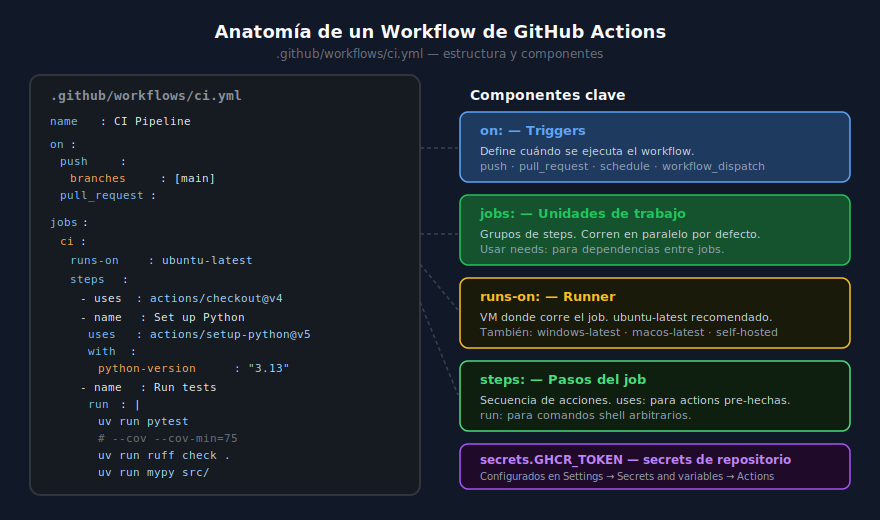

# GitHub Actions: Workflows, Jobs, Steps y Actions

## 🎯 Objetivos

- Comprender la estructura de un workflow de GitHub Actions
- Conocer los componentes: triggers, jobs, steps, runners y actions
- Escribir tu primer workflow de CI para un MCP Server
- Gestionar secretos y variables de entorno en GitHub Actions

---



---

## 1. ¿Qué es GitHub Actions?

GitHub Actions es la plataforma de CI/CD nativa de GitHub. Permite automatizar flujos de trabajo directamente desde tu repositorio, sin necesidad de configurar un servidor de integración externo.

Cuando un desarrollador hace `git push` a la rama principal, GitHub Actions puede ejecutar automáticamente:

- Linting y análisis estático del código
- Tests unitarios e integración
- Build de la imagen Docker
- Push al registro de contenedores (GHCR)
- Deploy a producción

Todo esto se configura en archivos YAML dentro de `.github/workflows/`.

---

## 2. Estructura de un Workflow

Un **workflow** es un proceso automatizado. Se define en un archivo `.yml` dentro de `.github/workflows/`. Cada archivo es un workflow independiente.

```
.github/
└── workflows/
    ├── ci.yml          # lint + test
    ├── docker.yml      # build + push
    └── release.yml     # deploy on tag
```

### Estructura básica

```yaml
# .github/workflows/ci.yml

name: CI                         # Nombre del workflow (aparece en la UI)

on:                              # Triggers — cuándo se ejecuta
  push:
    branches: [main]
  pull_request:                  # También en PRs (solo lint+test, sin push)

env:                             # Variables de entorno globales
  PYTHON_VERSION: "3.13"

jobs:                            # Unidades de trabajo
  ci:                            # Nombre del job
    runs-on: ubuntu-latest       # Runner
    steps:                       # Pasos del job
      - uses: actions/checkout@v4
      - name: Set up Python
        uses: actions/setup-python@v5
        with:
          python-version: ${{ env.PYTHON_VERSION }}
      - name: Install uv
        run: pip install --no-cache-dir uv==0.6.6
      - name: Install dependencies
        run: uv sync --frozen
      - name: Lint
        run: uv run ruff check .
      - name: Type check
        run: uv run mypy src/
      - name: Test
        run: uv run pytest --cov=src --cov-report=term-missing
```

---

## 3. Triggers (on:)

Los triggers definen cuándo se ejecuta el workflow. Los más usados:

```yaml
on:
  push:
    branches: [main, develop]    # En push a estas ramas
    tags: ["v*.*.*"]             # En tags semver (para releases)
  pull_request:                  # En PRs hacia cualquier rama
  workflow_dispatch:             # Ejecución manual desde la UI de GitHub
  schedule:
    - cron: "0 6 * * 1"         # Cada lunes a las 6am UTC
```

### Estrategia recomendada para MCP

| Evento | Jobs que corren |
|--------|-----------------|
| `push` a main | lint + test + build + push imagen |
| `pull_request` | lint + test (sin push a registro) |
| `tag v*.*.*` | build + push con tag semver |
| `workflow_dispatch` | ejecución manual para debugging |

---

## 4. Jobs

Un **job** es un grupo de steps que corren secuencialmente en un mismo runner. Por defecto, los jobs dentro de un workflow corren **en paralelo**.

```yaml
jobs:
  lint:
    runs-on: ubuntu-latest
    steps:
      - uses: actions/checkout@v4
      - run: uv run ruff check .

  test:
    runs-on: ubuntu-latest
    needs: lint            # test espera a que lint termine OK
    steps:
      - uses: actions/checkout@v4
      - run: uv run pytest

  build:
    runs-on: ubuntu-latest
    needs: test            # build solo si test pasa
    steps:
      - uses: actions/checkout@v4
      - run: docker build -t mcp-server .
```

### La clave `needs:`

Establece dependencias entre jobs. Si `lint` falla, `test` y `build` no se ejecutan. Esto es el "fail fast" del pipeline.

---

## 5. Steps

Los **steps** son los pasos individuales dentro de un job. Hay dos tipos:

### `uses:` — Reutilizar una action pre-hecha

```yaml
steps:
  - uses: actions/checkout@v4               # Clona el repositorio
  - uses: actions/setup-python@v5           # Configura Python
    with:
      python-version: "3.13"
      cache: "pip"                          # Caché de pip para velocidad
  - uses: docker/login-action@v3            # Login a GHCR
    with:
      registry: ghcr.io
      username: ${{ github.actor }}
      password: ${{ secrets.GITHUB_TOKEN }} # Token automático de GitHub
```

### `run:` — Comandos shell

```yaml
steps:
  - name: Install and run tests
    run: |
      pip install --no-cache-dir uv==0.6.6
      uv sync --frozen
      uv run pytest --cov=src
    env:
      DB_PATH: ":memory:"                   # Variables solo para este step
```

---

## 6. Runners

El **runner** es la máquina virtual donde corre el job. GitHub ofrece runners hosted gratuitos:

| Runner | OS | CPU | RAM |
|--------|----|-----|-----|
| `ubuntu-latest` | Ubuntu 24.04 | 2 vCPU | 7 GB |
| `windows-latest` | Windows Server 2022 | 2 vCPU | 7 GB |
| `macos-latest` | macOS 14 | 3 vCPU | 14 GB |

Para proyectos MCP, **usar siempre `ubuntu-latest`** — es el más rápido, barato y compatible con Docker.

---

## 7. Actions del Marketplace

Las **actions** son componentes reutilizables publicados en el [GitHub Marketplace](https://github.com/marketplace?type=actions). Se consumen con `uses: owner/repo@version`.

### Actions esenciales para MCP CI

```yaml
# Siempre usar versión exacta (SHA o tag) para reproducibilidad
- uses: actions/checkout@v4
- uses: actions/setup-python@v5
- uses: docker/login-action@v3
- uses: docker/build-push-action@v6
- uses: docker/metadata-action@v5
- uses: actions/cache@v4
```

> ⚠️ **Seguridad**: Nunca uses `@main` o `@latest` en actions externas — podría ejecutarse código malicioso si el repo es comprometido. Usar siempre un tag de versión fijo (`@v4`, `@v5`).

---

## 8. Secretos y Variables

Los secretos se configuran en **Settings → Secrets and variables → Actions** del repositorio.

```yaml
# En el workflow, acceder con ${{ secrets.NOMBRE }}
- name: Push Docker image
  env:
    ANTHROPIC_API_KEY: ${{ secrets.ANTHROPIC_API_KEY }}
  run: docker push ghcr.io/user/mcp-server:latest

# GITHUB_TOKEN es automático — no necesita configurarse
- uses: docker/login-action@v3
  with:
    registry: ghcr.io
    username: ${{ github.actor }}
    password: ${{ secrets.GITHUB_TOKEN }}
```

### Variables de entorno útiles en Actions

| Variable | Valor ejemplo |
|----------|---------------|
| `github.sha` | `abc1234...` (commit hash) |
| `github.ref_name` | `main` o `v1.2.3` (rama o tag) |
| `github.repository` | `user/mcp-server` |
| `github.actor` | `ergrato-dev` (usuario que hizo push) |
| `github.event_name` | `push`, `pull_request`, `tag` |

---

## 9. Caché para Velocidad

El caché evita reinstalar dependencias en cada ejecución, reduciendo el tiempo de CI de ~3 minutos a ~40 segundos.

```yaml
- name: Cache uv packages
  uses: actions/cache@v4
  with:
    path: ~/.cache/uv
    key: uv-${{ runner.os }}-${{ hashFiles('uv.lock') }}
    restore-keys: |
      uv-${{ runner.os }}-

- name: Install dependencies (from cache if possible)
  run: uv sync --frozen
```

---

## 10. Errores Comunes

| Error | Causa | Solución |
|-------|-------|----------|
| `Resource not accessible by integration` | Falta permiso `packages: write` | Agregar `permissions: packages: write` al job |
| `Context access might be invalid: secrets.X` | Secreto no configurado en repo | Settings → Secrets → Actions → New secret |
| Tests pasan en local pero no en CI | Variables de entorno diferentes | Usar `.env.example` + `env:` en step |
| `docker: not found` | Runner sin Docker | Usar `ubuntu-latest` (incluye Docker por defecto) |
| Action falla con `Rate limit exceeded` | Muchos pulls a Docker Hub | Autenticarse o usar GHCR en vez de Docker Hub |

---

## ✅ Checklist de Verificación

- [ ] Archivo `.github/workflows/ci.yml` creado
- [ ] Trigger `on: push` y `on: pull_request` configurados
- [ ] Jobs `lint`, `test`, `build` separados con `needs:`
- [ ] Secretos configurados en Settings → Secrets del repo
- [ ] Actions con versiones fijas (no `@main` ni `@latest`)
- [ ] Caché de dependencias configurado
- [ ] Badge de CI añadido al README
- [ ] Workflow pasa en verde en la rama main

---

## 📚 Recursos Adicionales

- [GitHub Actions Docs](https://docs.github.com/en/actions)
- [GitHub Actions Marketplace](https://github.com/marketplace?type=actions)
- [actions/checkout](https://github.com/actions/checkout)
- [docker/build-push-action](https://github.com/docker/build-push-action)
- [GitHub Actions Security Hardening](https://docs.github.com/en/actions/security-guides/security-hardening-for-github-actions)

---

[← Volver a Prácticas](../2-practicas/README.md) | [Siguiente: CI para MCP →](02-ci-pipeline-mcp.md)
